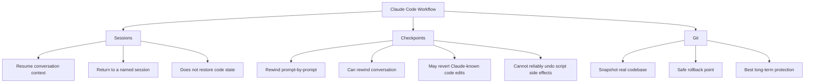
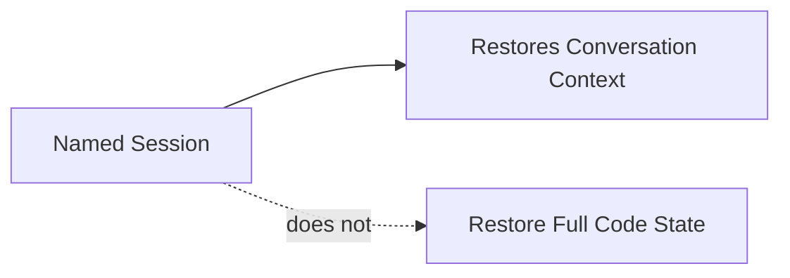
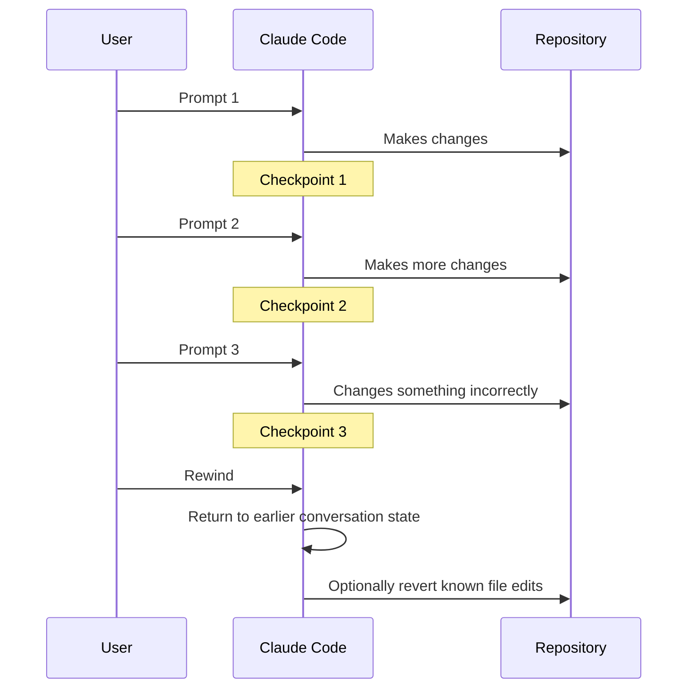
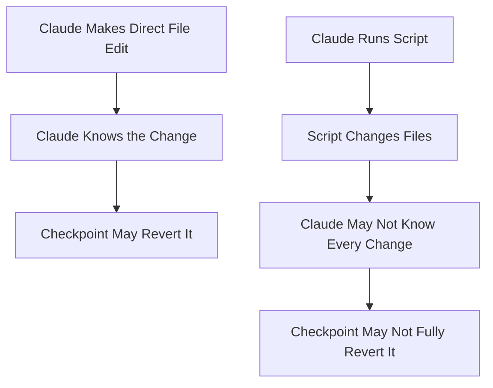
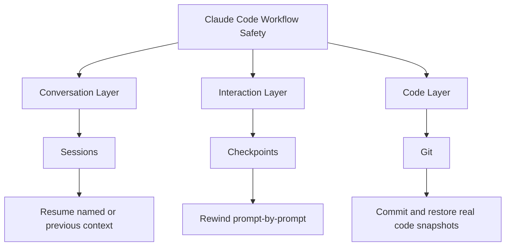
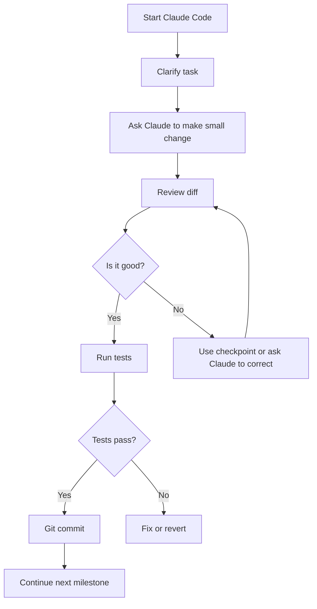
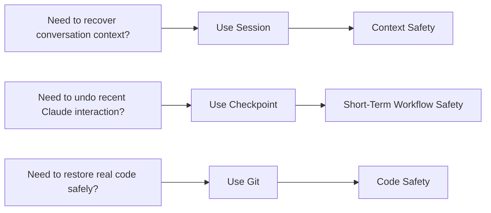

# 042 - Day 2 - Sessions, Checkpoints & Git: Managing Your Claude Code Workflow

## Lesson Information

| Item     | Details                                                           |
| -------- | ----------------------------------------------------------------- |
| Lesson   | 042                                                               |
| Duration | 10 minutes                                                        |
| Week     | Week 2 - Claude Code & Vibe Engineering                           |
| Module   | Week 2 Day 2 - Claude Code Workflow                               |
| Topic    | Sessions, Checkpoints, and Git for managing Claude Code workflows |

---

## Main Idea

This lesson explains how to manage your Claude Code workflow using three different layers:

1. **Sessions** — preserve and resume conversation context.
2. **Checkpoints** — rewind within the current conversation step by step.
3. **Git** — safely snapshot and restore your actual codebase.

The key message is simple:

> Sessions manage conversation context.
> Checkpoints manage short-term workflow history.
> Git manages your real code safety.

---

## Why This Lesson Matters

When working with Claude Code, you are not only writing code. You are also managing an ongoing collaboration with an AI coding agent.

Without a workflow strategy, it is easy to lose track of:

* what Claude changed,
* why it changed something,
* which version of the code was working,
* which conversation had the right context,
* and how to safely go back when something breaks.

This lesson helps you understand the difference between Claude Code’s built-in workflow tools and Git, so you can use each one for the right purpose.

---

## Workflow Management Overview



---

# 1. Sessions

## What Is a Session?

A **session** represents the state of your conversation with Claude Code.

It includes the conversational context, instructions, and framing of the current interaction.

For example, if you tell Claude:

> “For today’s conversation, I want you to be witty and snarky.”

Then rename that session as:

```bash
/rename snarky Claude
```

You can later resume that session and return to that same conversational state.

---

## What Sessions Are Good For

Sessions are useful when you want to:

* return to an earlier conversation,
* preserve a specific working context,
* resume from where you last left off,
* keep different project conversations separate,
* return to a named interaction style or project state.

---

## Important Limitation

A session does **not** restore your codebase.

It restores the **conversation context**, not the full state of your files.



So if you resume an old session, Claude may remember the discussion, but your repository files may still be in their current state.

---

## Example: Resuming a Session

You can start Claude Code normally:

```bash
claude
```

You can also resume from a previous session:

```bash
claude --resume
```

Claude Code then shows a list of previous sessions. You can choose one and continue from that context.

---

# 2. Checkpoints

## What Is a Checkpoint?

A **checkpoint** is a smaller, more granular point in time inside your current Claude Code session.

Each prompt you send to Claude Code is treated as a step in the conversation.

Checkpointing lets you move backward through those steps.

---

## Session vs Checkpoint

| Tool       | Level        | Purpose                                |
| ---------- | ------------ | -------------------------------------- |
| Session    | High-level   | Resume an earlier conversation context |
| Checkpoint | Fine-grained | Rewind within the current conversation |
| Git        | Code-level   | Restore actual code snapshots          |

---

## How Checkpointing Works



---

## What Checkpoints Can Rewind

Checkpoints may allow you to:

* go back to an earlier prompt,
* rewind the conversation,
* undo Claude’s recent known file edits,
* recover from a bad immediate change.

---

## The Catch

Checkpointing is not the same as a full disk snapshot.

Claude can only revert changes it knows about.

If Claude runs a script and that script modifies files, Claude may not know exactly what changed.

For example:

```bash
python scripts/update_files.py
```

If that script edits multiple files, creates new files, deletes files, or modifies generated outputs, Claude may not be able to reliably undo everything through checkpoint rewind.

---

## Checkpoint Limitation Diagram



---

# 3. Git

## What Is Git’s Role?

Git is the proper long-term safety layer for your code.

While sessions and checkpoints are useful inside Claude Code, Git is the tool that gives you reliable control over your actual repository state.

A Git commit is a real snapshot of your codebase.

---

## Why Git Is Essential

Git protects you from:

* accidental AI-generated changes,
* broken refactors,
* failed experiments,
* script-generated file damage,
* confusing checkpoint states,
* losing track of what changed.

---

## Recommended Git Practice

Commit frequently, especially after small working milestones.

Good examples:

```bash
git status
git add .
git commit -m "Add user authentication middleware"
```

```bash
git commit -m "Refactor streaming response handler"
```

```bash
git commit -m "Fix checkpoint restore bug"
```

Avoid waiting too long before committing. Large commits are harder to review and harder to revert safely.

---

# 4. The Three-Layer Mental Model

The easiest way to understand this lesson is to separate the three tools by what they manage.



---

## Comparison Table

| Feature                                | Sessions | Checkpoints | Git       |
| -------------------------------------- | -------- | ----------- | --------- |
| Restores conversation context          | Yes      | Yes         | No        |
| Restores actual code safely            | No       | Partially   | Yes       |
| Works across long-term project history | Yes      | Limited     | Yes       |
| Best for quick undo                    | No       | Yes         | Sometimes |
| Best for serious rollback              | No       | No          | Yes       |
| Tracks exact file changes              | No       | Partially   | Yes       |
| Recommended as main safety layer       | No       | No          | Yes       |

---

# 5. Practical Workflow Recommendation

A strong Claude Code workflow looks like this:



---

## Suggested Working Style

Use **Git frequently** as your main protection.

Use **checkpoints occasionally** when Claude makes an immediate mistake and you want to rewind quickly.

Use **sessions** when you want to return to a previous conversation context, but do not rely on sessions as your code safety mechanism.

---

# 6. Example Workflow

## Step 1: Start Claude Code

```bash
claude
```

## Step 2: Give Claude a clear task

```text
Please refactor the API gateway error handling into a reusable helper.
Keep the behavior unchanged and show me the diff before making large changes.
```

## Step 3: Review changes

```bash
git diff
```

## Step 4: Run tests

```bash
npm test
```

or:

```bash
pytest
```

## Step 5: Commit a safe milestone

```bash
git add .
git commit -m "Refactor API gateway error handling"
```

## Step 6: Continue with the next small task

```text
Now add tests for the new error helper.
```

---

# 7. Instructor’s Preferred Workflow

The instructor recommends a workflow based mainly on Git and Markdown project notes.

The preferred approach is:

* use Git commits often,
* use Markdown files to track plans and progress,
* use files like `CLAUDE.md`, `PLAN.md`, or project notes to preserve context,
* use checkpoints only when something immediately goes wrong,
* use sessions only when helpful, but do not depend on them too heavily.

---

## Why Markdown Notes Help

Markdown files create a visible, stable project memory.

Unlike hidden conversation context, Markdown notes are easy to inspect, edit, commit, and share.

Examples:

```text
CLAUDE.md
PLAN.md
TASKS.md
ARCHITECTURE.md
DECISIONS.md
```

These files help Claude understand the project while also helping you understand what Claude is using as context.

---

# 8. Best Practices

## Use Sessions For

* returning to a named conversation,
* separating different project contexts,
* preserving a specific style or instruction set,
* resuming previous Claude Code work.

## Use Checkpoints For

* quickly undoing a bad immediate change,
* rewinding a few prompts,
* recovering from a mistaken direction inside the current session.

## Use Git For

* real project safety,
* code history,
* milestone commits,
* reviewing diffs,
* rolling back safely,
* collaborating with others.

---

# 9. Common Mistakes

## Mistake 1: Thinking Sessions Restore Code

Sessions restore conversation context, not your full repository state.

Always use Git for code history.

---

## Mistake 2: Trusting Checkpoints Too Much

Checkpoints can be helpful, but they are not a complete backup system.

If scripts or external tools changed files, checkpoint rewind may not fully restore everything.

---

## Mistake 3: Making Huge AI Changes Without Commits

Large AI-generated changes are risky.

A better approach is:

```text
small task → review diff → test → commit → next task
```

---

## Mistake 4: Not Reviewing Diffs

Before committing, always inspect what changed.

```bash
git diff
```

or:

```bash
git status
```

---

# 10. Key Takeaways

* **Sessions** help you return to a previous Claude conversation context.
* **Checkpoints** let you rewind inside the current conversation.
* **Git** is the reliable way to manage real code snapshots.
* Sessions do not restore the codebase.
* Checkpoints may not undo script-generated side effects.
* Git should be your main safety layer.
* Commit often, especially after small working milestones.
* Markdown project notes are useful for keeping both you and Claude aligned.

---

## Final Mental Model



---

## One-Sentence Summary

Claude Code sessions and checkpoints help manage the AI conversation, but Git remains the essential safety system for managing your actual code.

---

# Bài luyện tập

## Mục tiêu


## Đề bài


## Yêu cầu hoàn thành

- [ ] 
- [ ] 
- [ ] 

## Kết quả / lời giải


## Ghi chú
