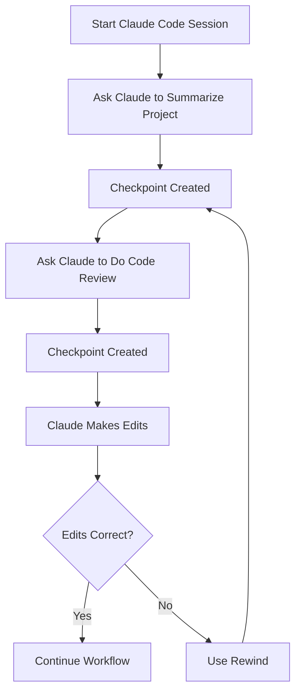
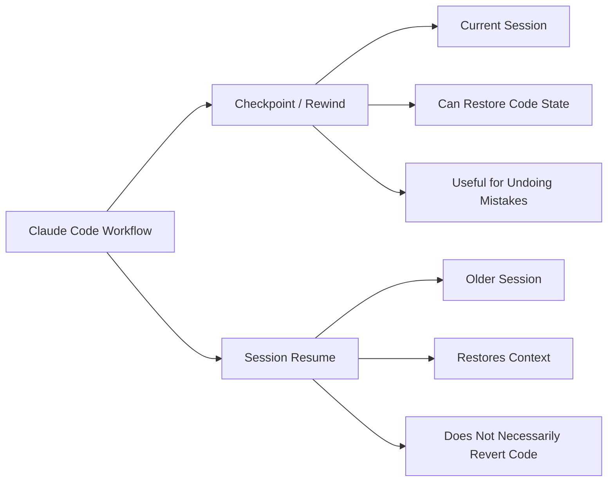
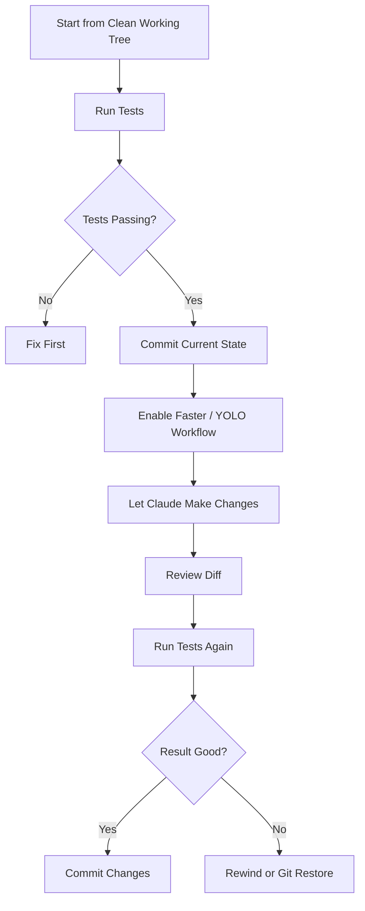
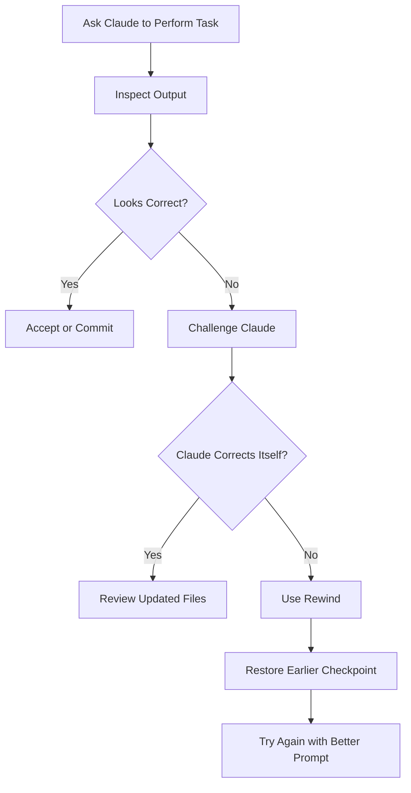

# 043 - Day 2 - Claude Code Checkpoints, Rewind, and YOLO Mode Explained

## Lesson Information

| Item     | Details                                 |
| -------- | --------------------------------------- |
| Lesson   | 043                                     |
| Duration | 7 minutes                               |
| Week     | Week 2 - Claude Code & Vibe Engineering |
| Module   | Week 2 Day 2 - Claude Code Workflow     |
| Topic    | Checkpoints, Rewind, and YOLO Mode      |

---

## Main Idea

This lesson explains how **Claude Code checkpoints**, **rewind**, and **YOLO mode** work inside a coding-agent workflow.

A checkpoint saves the current state of your conversation and code. Rewind lets you go back when the agent makes a wrong decision or edits the project in an unwanted direction. YOLO mode speeds up development by automatically allowing more actions, but it also increases risk. To use it safely, you should combine it with **Git commits**, **tests**, and small workflow boundaries.

---

## Learning Objectives

By the end of this lesson, learners should be able to:

* Understand what checkpoints are in Claude Code.
* Use rewind to return to an earlier point in the current session.
* Explain the difference between rewinding a checkpoint and resuming a previous session.
* Understand why YOLO mode is powerful but risky.
* Use Git commits and tests as safety layers before enabling faster agent workflows.

---

## Why This Lesson Matters

When working with AI coding agents, mistakes are normal. The agent may misunderstand the codebase, make an incorrect assumption, or edit files in a direction you do not want.

This lesson teaches a practical recovery workflow:

1. Let the agent work.
2. Inspect its reasoning and output.
3. Challenge incorrect assumptions.
4. Rewind when needed.
5. Commit safe states before using riskier modes.

This makes Claude Code much safer and more useful in real projects.

---

# 1. Checkpoints

## What Is a Checkpoint?

A **checkpoint** is a saved state inside your current Claude Code session.

It can track:

* The conversation context.
* The code state.
* The point before or after a command was executed.
* The state before the agent made a set of edits.

In practice, checkpoints help you recover when the agent goes in the wrong direction.

---

## Simple Explanation

Think of a checkpoint as a **save point in a game**.

If the agent makes a bad move, you can go back to a previous save point instead of manually undoing every change.



---

# 2. Rewind

## What Is Rewind?

`/rewind` lets you return to a previous checkpoint in the current session.

In the lesson demo, the instructor asked Claude Code to perform a code review and write the result to:

```bash
docs/review.md
```

Claude incorrectly identified an exposed API key. After being challenged, it corrected itself. Then the instructor used `/rewind` to go back to the earlier point before the correction.

---

## How Rewind Works

When you run:

```bash
/rewind
```

Claude Code shows previous points in the session, such as:

* Before asking for a project summary.
* Before asking for a code review.
* Before challenging Claude’s incorrect API-key finding.
* The current state.

You can then choose what to restore.

---

## Rewind Restore Options

| Option                        | Meaning                                                               |
| ----------------------------- | --------------------------------------------------------------------- |
| Restore conversation and code | Goes back to both the chat context and file state at that checkpoint. |
| Restore conversation only     | Rewinds the conversation context, but keeps the current code.         |
| Restore code only             | Reverts files, but keeps the current conversation context.            |
| Never mind                    | Cancels the rewind operation.                                         |

---

## Rewind Example

In the demo:

1. Claude created a code review.
2. Claude incorrectly flagged an API key as exposed.
3. The instructor challenged it.
4. Claude corrected the review.
5. The instructor used `/rewind`.
6. Claude Code restored the earlier version where the incorrect issue still existed.

This demonstrated that rewind can affect both:

* The chat context.
* The actual file state.

---

# 3. Checkpoint vs Session Resume

Checkpoints and session resume are related, but they are not the same.

| Feature                 | Checkpoint / Rewind                 | Session Resume                             |
| ----------------------- | ----------------------------------- | ------------------------------------------ |
| Scope                   | Current session                     | Previous session                           |
| Can restore code state? | Yes, depending on option selected   | Usually no                                 |
| Main use                | Undo recent agent actions           | Continue an older Claude Code conversation |
| Best for                | Fixing mistakes inside a workflow   | Returning to earlier context               |
| Risk level              | Medium, because it may change files | Lower, mostly context-based                |

---

## Key Difference

**Rewind** is for going back inside the current session.

**Session resume** is for continuing from a previous conversation context.



---

# 4. Useful Claude Code Shortcuts Shown

During the demo, several shortcuts were used to inspect Claude Code’s work.

| Shortcut      | Purpose                                                               |
| ------------- | --------------------------------------------------------------------- |
| `Ctrl + O`    | Show detailed thinking / trace view.                                  |
| `Ctrl + E`    | Expand or collapse details.                                           |
| `Ctrl + B`    | Let a task run in the background while continuing with more commands. |
| `Shift + Tab` | Toggle automatic edit approval behavior, depending on mode/context.   |

---

## Why Inspect the Trace?

The trace helps you understand:

* Which files Claude explored.
* What assumptions it made.
* How it reasoned about the codebase.
* Why it proposed certain edits.
* Whether it is confidently wrong.

This is especially useful when Claude produces a result that looks plausible but may be incorrect.

---

# 5. YOLO Mode

## What Is YOLO Mode?

YOLO mode is a more aggressive way of using Claude Code where the agent is allowed to move faster with fewer approval stops.

It can be useful when you want the agent to perform many edits quickly.

However, it is also riskier because the agent may:

* Edit many files at once.
* Make incorrect assumptions.
* Break tests.
* Remove important code.
* Create large diffs that are hard to review.
* Continue in the wrong direction before you notice.

---

## Important Distinction

Automatically accepting edits is not always the same as full YOLO mode.

In the transcript, the instructor explains that automatically approving diffs is only one part of the workflow. True YOLO mode is a bigger step because it allows the agent to operate with much more freedom.

---

# 6. Safe YOLO Workflow

Before using YOLO mode, create a clean Git checkpoint.

```bash
git add .
git commit -m "before YOLO"
```

This gives you a safe recovery point.

---

## Recommended Safety Flow



---

# 7. Git as the Final Safety Layer

Claude Code checkpoints are useful, but Git is still essential.

Before risky actions, commit your current working state:

```bash
git add .
git commit -m "before YOLO"
```

After the agent finishes, inspect the diff:

```bash
git diff
```

Run tests:

```bash
npm test
```

or:

```bash
pytest
```

Then commit only if the result is good:

```bash
git add .
git commit -m "apply Claude Code changes"
```

---

# 8. Common Mistake: Trusting the Agent Too Quickly

In the demo, Claude incorrectly reported that an API key was exposed.

The instructor did not immediately accept the finding. Instead, they asked:

```text
Are you sure that the API key is exposed?
```

Claude then rechecked and corrected itself.

This is an important lesson: coding agents can sound confident even when they are wrong.

---

## Good Challenge Prompts

Use prompts like:

```text
Are you sure? Please verify against the actual files.
```

```text
Check whether this issue is real or a false positive.
```

```text
Before editing, explain the evidence for this claim.
```

```text
Look again and confirm whether this file is ignored by Git.
```

---

# 9. Practical Workflow Pattern

A strong Claude Code workflow looks like this:



---

# 10. Demo Summary

In this lesson, the instructor demonstrated the following workflow:

1. Started a normal Claude Code session.
2. Asked Claude to summarize the project.
3. Asked Claude to perform a code review.
4. Used `Ctrl + O` to inspect the detailed trace.
5. Allowed Claude to write the review file.
6. Noticed that Claude made the same incorrect API-key claim again.
7. Challenged Claude’s assumption.
8. Claude corrected itself.
9. Used `/rewind` to return to a previous checkpoint.
10. Restored both conversation and code state.
11. Explained the difference between checkpoints and session resume.
12. Prepared for YOLO mode by committing the current state with Git.

---

# 11. Best Practices

## Before Rewinding

Check:

* Which checkpoint you are returning to.
* Whether you want to restore conversation, code, or both.
* Whether there are any changes you need to save manually first.

## Before YOLO Mode

Always:

* Commit your current code.
* Run tests.
* Make sure the working tree is clean.
* Use a narrow task prompt.
* Review the diff afterward.

## While Claude Is Working

Watch for:

* Overconfident claims.
* Large unexpected edits.
* Security findings without evidence.
* Deleted files.
* Changes outside the requested scope.

---

# 12. Mini Practice

Try this in a small project:

1. Ask Claude Code:

```text
Please summarize this project.
```

2. Ask it:

```text
Please do a code review and write the results to docs/review.md.
```

3. Inspect the trace with:

```text
Ctrl + O
```

4. Challenge one claim:

```text
Are you sure this issue is real? Please verify it.
```

5. Use:

```text
/rewind
```

6. Restore the conversation and code to the previous checkpoint.

7. Commit a clean state:

```bash
git add .
git commit -m "before YOLO"
```

---

# 13. Key Takeaways

* A checkpoint is a save point inside the current Claude Code session.
* Rewind lets you return to an earlier checkpoint.
* Rewind can restore conversation, code, or both.
* Session resume is different from rewind.
* YOLO mode speeds up work but increases risk.
* Git is the strongest safety net before risky agent workflows.
* Always inspect, challenge, test, and commit carefully.

---

## Final Summary

Claude Code checkpoints and rewind give you practical control over agent mistakes. They let you recover when Claude edits the wrong files, makes a false assumption, or moves the project in the wrong direction.

YOLO mode can make the workflow much faster, but it should never be used casually. Before enabling it, create a Git commit, make sure tests pass, and keep the task scope clear.

The safest workflow is:

```text
Checkpoint → Inspect → Challenge → Rewind if needed → Commit → YOLO carefully
```

---

# Bài luyện tập

## Mục tiêu


## Đề bài


## Yêu cầu hoàn thành

- [ ] 
- [ ] 
- [ ] 

## Kết quả / lời giải


## Ghi chú
