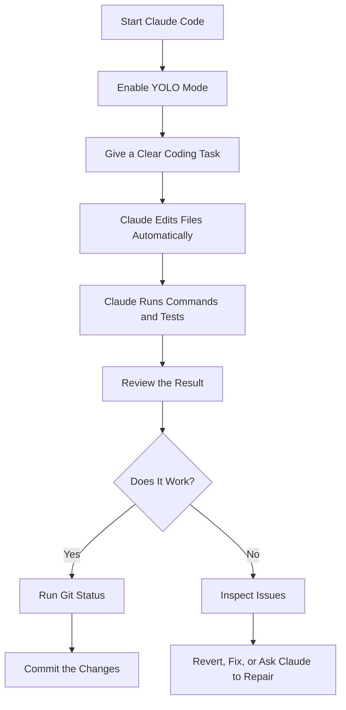
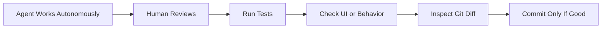

# 044 - Day 2 - Claude Code YOLO Mode: Bypass Permissions for Autonomous Coding

## Lesson Information

| Item     | Details                                    |
| -------- | ------------------------------------------ |
| Lesson   | 044                                        |
| Duration | 7 minutes                                  |
| Week     | Week 2 - Claude Code & Vibe Engineering    |
| Module   | Week 2 Day 2 - Claude Code Workflow        |
| Topic    | Claude Code YOLO Mode / Bypass Permissions |

---

## Main Idea

This lesson explains how to use **Claude Code YOLO Mode**, also known as **bypass permissions mode**, for autonomous coding.

In normal Claude Code usage, the agent asks for permission before running certain commands or making potentially risky changes. In YOLO mode, Claude Code is allowed to act without repeatedly asking for approval.

This can make development much faster, especially when asking the agent to modify, test, and improve a project end-to-end. However, it also increases risk, because the agent may run commands, edit files, or make changes without human confirmation.

---

## Learning Objectives

By the end of this lesson, learners should be able to:

* Understand what YOLO mode does in Claude Code.
* Know how to launch Claude Code in bypass permissions mode.
* Recognize the risks of allowing an AI coding agent to act autonomously.
* Use YOLO mode only in safe, controlled environments.
* Combine YOLO mode with Git, testing, and sandboxing to reduce risk.
* Evaluate the output of an autonomous coding session before committing changes.

---

## Key Command

To launch Claude Code in YOLO / bypass permissions mode:

```bash
claude --dangerously-skip-permissions
```

The name of the flag is intentionally strong: **dangerously**.
This is a warning that the mode removes important safety checks.

---

## What YOLO Mode Means

YOLO mode means:

> “Do not ask me for permission. Make the changes, run the commands, test the project, and complete the task autonomously.”

In this mode, Claude Code can:

* Edit files without asking first.
* Run project commands without approval.
* Execute test scripts automatically.
* Make broader changes across the codebase.
* Continue working without constant interruption.

---

## Workflow Diagram



---

## Why This Mode Exists

Claude Code normally asks for confirmation because coding agents can perform risky actions.

For example, an agent may:

* Delete files.
* Modify configuration.
* Install dependencies.
* Run shell commands.
* Change project behavior.
* Break working code.
* Touch files outside the intended scope.

YOLO mode removes these interruptions so the agent can work faster.

This is powerful, but it should not be treated casually.

---

## Safety Warning

When running:

```bash
claude --dangerously-skip-permissions
```

Claude Code will warn that it is running in bypass permissions mode.

This means it will not ask for approval before executing potentially dangerous commands.

Use this mode only when you understand the risk.

---

## Recommended Safe Usage

YOLO mode is best used in:

* A local practice project.
* A temporary branch.
* A sandboxed environment.
* A container with limited access.
* A project with clean Git history.
* A repo that can be restored easily.
* A non-production codebase.

Avoid YOLO mode in:

* Production projects without backup.
* Repositories with sensitive credentials.
* Systems with direct production access.
* Machines where destructive commands could cause serious damage.
* Projects that are not under version control.

---

## Safe YOLO Setup

Before using YOLO mode, prepare the project:

```bash
git status
```

Make sure the working tree is clean.

Then create a safe branch:

```bash
git checkout -b yolo-ui-revamp
```

Optionally commit the current state:

```bash
git add .
git commit -m "checkpoint before yolo mode"
```

Then run:

```bash
claude --dangerously-skip-permissions
```

---

## Demo Task From the Lesson

The instructor gives Claude Code a UI improvement task:

```text
Please improve the UI of this project, particularly making sure the horizontal layout looks better with icons instead of delete buttons, and using the horizontal space properly. Make your changes, test everything, and let me know when done.
```

This is a good YOLO-mode prompt because it is:

* Clear.
* Specific.
* Project-contained.
* Focused on UI changes.
* Includes testing.
* Does not ask Claude to modify unrelated systems.

---

## What Happened in the Demo

Claude Code worked autonomously for around 7–8 minutes.

It improved the UI by:

* Reworking the horizontal layout.
* Replacing delete buttons with cleaner icons.
* Making better use of available space.
* Improving responsiveness.
* Making the interface look sharper.
* Keeping the app functional.
* Preserving the AI assistant behavior.

After the changes, the instructor manually checked the project by:

1. Starting the server.
2. Opening the app in the browser.
3. Signing in.
4. Testing the board UI.
5. Testing card movement.
6. Testing responsiveness.
7. Testing the AI assistant.
8. Confirming the app still worked.

---

## Human Review Still Matters

Even in YOLO mode, the human developer should still review the final result.

YOLO mode does not mean:

> “Never check anything.”

It means:

> “Let the agent work without interruptions, then review carefully afterward.”

The correct workflow is:



---

## Git Is the Safety Net

After Claude completes the work, always inspect the changes.

```bash
git status
```

Then review the diff:

```bash
git diff
```

If the changes are good:

```bash
git add .
git commit -m "UI revamp"
```

In the lesson, the instructor commits the completed UI work:

```bash
git add .
git commit -m "after ui revamp"
```

The key lesson:

> Never fully trust autonomous changes until they are reviewed, tested, and committed safely.

---

## YOLO Mode Risk Model

| Risk              | Explanation                             | Mitigation                                     |
| ----------------- | --------------------------------------- | ---------------------------------------------- |
| File deletion     | The agent may remove files unexpectedly | Use Git and backups                            |
| Bad commands      | The agent may run unsafe shell commands | Use sandboxing                                 |
| Broken app        | The agent may introduce bugs            | Run tests                                      |
| Large diffs       | The agent may change too much           | Review `git diff`                              |
| Secret exposure   | The agent may touch sensitive files     | Avoid secrets in repo                          |
| Production damage | The agent may affect live systems       | Never use YOLO on production without isolation |

---

## Best Practices

### 1. Use YOLO Mode for Contained Tasks

Good examples:

```text
Improve the styling of the dashboard.
```

```text
Refactor this component and run the test suite.
```

```text
Fix the layout bug in the settings page.
```

Riskier examples:

```text
Rewrite the whole backend architecture.
```

```text
Clean up my whole computer.
```

```text
Deploy this to production automatically.
```

---

### 2. Give Clear Boundaries

A good YOLO prompt should include:

* What to change.
* What not to touch.
* How to test.
* When to stop.
* What output you expect.

Example:

```text
Improve the task board UI only. Do not change authentication, database logic, or API routes. Replace text delete buttons with icons, improve spacing, and make the layout responsive. Run existing tests and tell me what changed.
```

---

### 3. Use Git Before and After

Before YOLO mode:

```bash
git status
git checkout -b yolo-task
git commit -m "checkpoint before yolo task"
```

After YOLO mode:

```bash
git status
git diff
npm test
git add .
git commit -m "complete yolo task"
```

---

### 4. Prefer Sandboxes for Bigger Tasks

A sandbox is a controlled environment where mistakes are less dangerous.

For serious autonomous coding, use:

* A Docker container.
* A temporary development VM.
* A cloned repository.
* A branch with no production credentials.
* Restricted internet access.
* No access to personal files.

---

## When YOLO Mode Is Useful

YOLO mode is useful when:

* The project is already backed up.
* The task is repetitive.
* The agent needs to run many commands.
* You want fewer interruptions.
* You trust the scope of the task.
* You are working in a safe repo.
* You can review and revert changes easily.

---

## When Not to Use YOLO Mode

Do not use YOLO mode when:

* You are working directly on production.
* You have no Git history.
* You have no backup.
* The repo contains secrets.
* The task involves deployment.
* The task involves deleting or migrating data.
* You cannot easily inspect or revert the result.

---

## Practical Prompt Template

Use this template for safer YOLO-mode tasks:

```text
You are working in YOLO mode.

Task:
[Describe the task clearly.]

Scope:
Only modify [specific files / directories / features].

Do not modify:
- Authentication
- Database schema
- Environment files
- Deployment config
- Secrets

Validation:
- Run the existing test suite.
- Start the app if needed.
- Check for errors.
- Summarize the files changed and the reason for each change.

Stop when:
The requested task is complete and tests pass.
```

---

## Example Safe YOLO Prompt

```text
Please improve the UI of the kanban board.

Focus on:
- Better horizontal layout
- Cleaner spacing
- Icon buttons instead of text delete buttons
- Responsive behavior on small screens

Do not change:
- Authentication
- Database logic
- API routes
- Environment files

After making changes:
- Run the tests
- Start the app
- Check that cards can still move between columns
- Summarize what changed
```

---

## Key Concepts

### Concept 1: Bypass Permissions

Bypass permissions means Claude Code does not stop to ask before taking actions.

This speeds up the workflow, but it also removes a layer of safety.

---

### Concept 2: Autonomous Coding

Autonomous coding means the agent can plan, edit, test, and iterate on its own.

Instead of giving one small instruction at a time, you can give a larger task and let the agent complete it.

---

### Concept 3: Controlled Risk

YOLO mode is not about being careless.

It is about accepting more automation only when the environment is controlled.

The formula is:

```text
YOLO Mode + Git + Tests + Sandbox = Safer Autonomous Coding
```

Without those protections:

```text
YOLO Mode + Production + No Backup = Dangerous Workflow
```

---

## Lesson Summary

Claude Code YOLO mode allows the agent to bypass normal permission prompts and act autonomously.

It is launched with:

```bash
claude --dangerously-skip-permissions
```

This mode can dramatically speed up coding tasks because Claude can edit files, run commands, test the app, and iterate without constant human approval.

In the lesson demo, Claude Code successfully improved a project UI, replaced delete buttons with icons, improved layout responsiveness, and preserved app functionality. The instructor then reviewed the app, tested the behavior, checked Git status, and committed the changes.

The main takeaway is:

> YOLO mode is powerful, but it should only be used when you have Git, tests, backups, and preferably a sandbox.

Used correctly, it can turn Claude Code into a highly effective autonomous coding partner. Used carelessly, it can damage a project.

---

## Final Takeaways

* YOLO mode removes permission prompts.
* The command is `claude --dangerously-skip-permissions`.
* It is useful for autonomous coding.
* It should be used only in controlled environments.
* Git is mandatory before serious YOLO work.
* Sandboxing is strongly recommended.
* Always review and test before committing.
* Never use it casually on production projects.

---

## Practice Exercise

Try this in a small test project:

1. Create a new Git branch.
2. Start Claude Code in YOLO mode.
3. Ask it to improve a small UI component.
4. Let it run autonomously.
5. Review the diff.
6. Run the app.
7. Run tests.
8. Commit only if the result is correct.

Example task:

```text
Improve the visual layout of this todo app. Make the buttons cleaner, improve spacing, and ensure it works on mobile. Do not change the backend or authentication logic. Run tests and summarize your changes.
```

---

# Bài luyện tập

## Mục tiêu


## Đề bài


## Yêu cầu hoàn thành

- [ ] 
- [ ] 
- [ ] 

## Kết quả / lời giải


## Ghi chú
