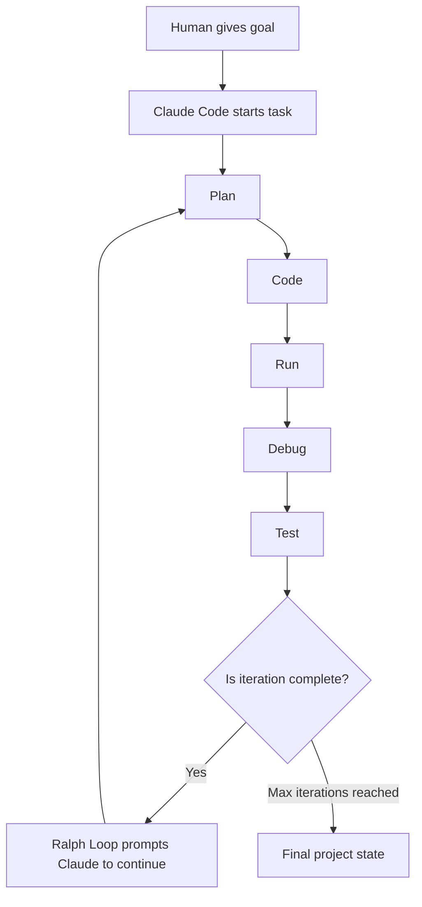
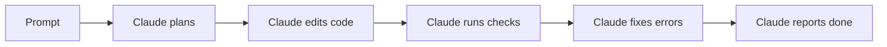
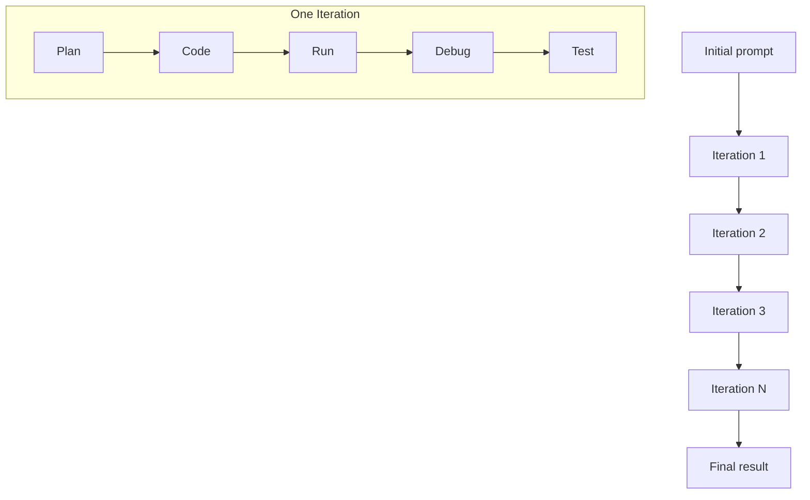
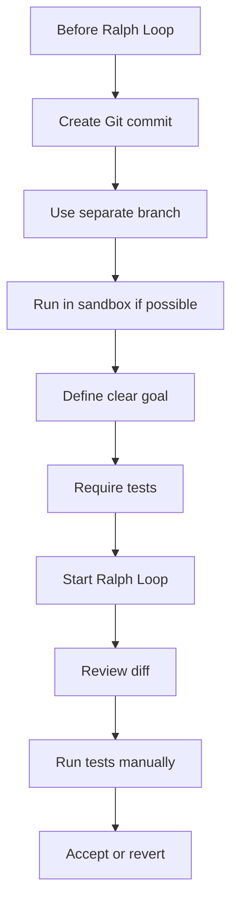
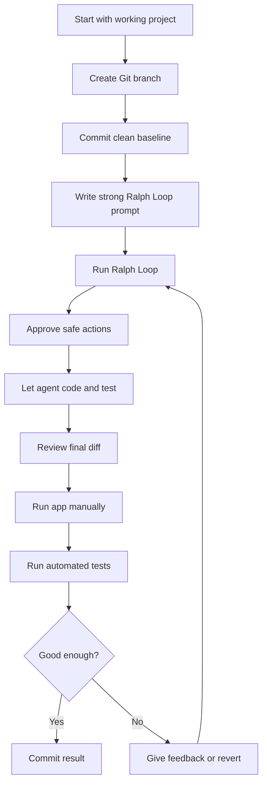

# 045 - Day 2 - Ralph Loops in Claude Code: Autonomous Agent Coding on Autopilot

## Lesson Information

| Item       | Details                                                                                            |
| ---------- | -------------------------------------------------------------------------------------------------- |
| Lesson     | 045                                                                                                |
| Duration   | 12 minutes                                                                                         |
| Week       | Week 2 - Claude Code & Vibe Engineering                                                            |
| Module     | Week 2 Day 2 - Claude Code Workflow                                                                |
| Main Topic | Using Ralph Loops to let Claude Code repeatedly improve a project through autonomous coding cycles |

---

## 1. Lesson Overview

In this lesson, we explore **Ralph Loops** in Claude Code.

A Ralph Loop is a workflow where Claude Code repeatedly performs an agentic development cycle:

```text
Plan → Code → Run → Debug → Test → Improve → Repeat
```

Instead of asking Claude Code to complete a task once, Ralph Loops allow the agent to keep going across multiple iterations. Each loop builds on the previous result, allowing the project to become more complete over time.

This is especially useful for:

* Building prototypes
* Expanding MVPs
* Adding multiple related features
* Improving test coverage
* Letting the agent continue beyond a single coding session
* Exploring what autonomous coding agents can produce with minimal intervention

However, Ralph Loops also increase risk. Because the agent keeps making changes, you need clear goals, strong tests, version control, and preferably a sandboxed environment.

---

## 2. What Is a Ralph Loop?

A **Ralph Loop** is an outer loop around Claude Code’s normal agent loop.

Claude Code already works in an internal loop:

```text
Understand task → Plan → Edit files → Run commands → Fix errors → Report result
```

A Ralph Loop wraps that entire process inside another loop.



The key idea is simple:

> When Claude thinks it is finished, Ralph Loop tells it to continue improving the project.

This can turn a short autonomous coding session into a much longer development run.

---

## 3. Why It Is Called “Ralph Loop”

The name is inspired by **Ralph Wiggum** from *The Simpsons*.

The idea was popularized by engineer **Geoffrey Huntley** as a playful way to describe an agent that keeps optimistically going forward.

In practice, a Ralph Loop tells the coding agent:

> “Good. Now do it again. Improve it further.”

---

## 4. Installing the Ralph Loop Plugin

The lesson uses a Claude Code plugin.

The plugin installation command is:

```bash
/plugin install ralph-loop@claude-plugins-official
```

After installation, Claude Code exposes a Ralph Loop command.

Example command pattern:

```bash
/ralph-loop:ralph-loop "<your prompt>" --max-iterations 10
```

The exact command shown in the lesson uses:

```bash
/ralph-loop:ralph-loop "Please significantly improve this project. Add users and user management, multiple Kanban boards in a user and other features to build out a comprehensive project management application. Testing thoroughly as you go and maintaining strong test code coverage and good integration tests." --max-iterations 10
```

---

## 5. Core Concept: Agent Loop Inside an Outer Loop

The normal Claude Code workflow looks like this:



With Ralph Loop, the workflow becomes:



Each iteration may include planning, coding, testing, fixing, and summarizing.

---

## 6. What Ralph Loops Are Good For

Ralph Loops are best suited for tasks where progress can be verified.

Good use cases include:

| Use Case                | Why It Works                                            |
| ----------------------- | ------------------------------------------------------- |
| Prototype building      | The agent can quickly add many features                 |
| MVP expansion           | The agent can build layer after layer                   |
| Test-driven improvement | Tests help keep the loop grounded                       |
| UI feature development  | Visual functionality can be added iteratively           |
| Refactoring with tests  | The agent can improve structure while checking behavior |
| Adding CRUD features    | These tasks have clear success criteria                 |
| Building internal tools | Speed matters more than perfection                      |

---

## 7. What Ralph Loops Are Not Good For

Ralph Loops are risky when the task is vague, destructive, or hard to verify.

Avoid using them for:

| Risky Task                         | Reason                                     |
| ---------------------------------- | ------------------------------------------ |
| Production systems without backups | Too much uncontrolled change               |
| Security-sensitive code            | Agent may introduce vulnerabilities        |
| Payment or billing logic           | Mistakes can be costly                     |
| Database migrations without review | Data loss risk                             |
| Large refactors without tests      | Breakage may go unnoticed                  |
| Unclear product requirements       | Agent may build the wrong thing repeatedly |
| Tasks with no validation method    | The loop may create fake progress          |

---

## 8. Ralph Loop + YOLO Mode

Ralph Loops can be combined with YOLO mode:

```bash
claude --dangerously-skip-permissions
```

But this is extremely powerful and risky.

YOLO mode allows Claude Code to act without asking for permission each time. Ralph Loop makes Claude Code repeat the task many times.

Together, they create a highly autonomous coding mode:

```text
YOLO Mode + Ralph Loop = Long-running autonomous coding
```

This can be useful in a sandbox, but dangerous in an uncontrolled repo.

---

## 9. Safety Recommendation

Do not run Ralph Loops with YOLO mode in an important project unless you have strong safety controls.

Recommended safety setup:



Minimum safety checklist:

* Use Git.
* Commit before starting.
* Work on a separate branch.
* Avoid production environments.
* Make sure tests exist.
* Read the generated diff.
* Do not blindly accept destructive commands.
* Use a sandbox for aggressive automation.
* Keep the prompt specific.
* Define what “done” means.

---

## 10. Example Prompt Used in the Lesson

The lesson uses a Kanban project as the test case.

The prompt asks Claude Code to:

* Improve the project significantly
* Add users
* Add user management
* Add multiple Kanban boards per user
* Add more features for a project management app
* Test thoroughly
* Maintain strong test coverage
* Add good integration tests

Example:

```text
Please significantly improve this project.

Add users and user management, multiple Kanban boards in a user,
and other features to build out a comprehensive project management application.

Test thoroughly as you go and maintain strong test code coverage
and good integration tests.
```

This is a strong Ralph Loop prompt because it includes:

* A broad product direction
* Specific feature requests
* Quality expectations
* Testing requirements
* A clear application domain

---

## 11. What Happened in the Demo

After running the Ralph Loop, Claude Code made a large set of changes.

The project gained:

* User registration
* Login
* Logout
* User-specific sessions
* Multiple Kanban boards
* Board switching
* Card creation
* Card movement between columns
* Persistent project state
* A more complete project management app structure

The instructor tested the app manually by:

1. Starting the server.
2. Opening the app in an incognito browser.
3. Creating a new account.
4. Logging in.
5. Creating a board.
6. Adding cards.
7. Creating a second board.
8. Switching between boards.
9. Moving cards across columns.
10. Logging out.
11. Logging back in.
12. Confirming the data persisted.

---

## 12. Demo Result

The result was a more complete Kanban-style project management application.

The app included:

```text
Authentication
User account creation
Multiple boards
Board switching
Kanban cards
Card movement
Persistent state
Basic project management workflow
```

The key point is not that the app was perfect.

The key point is that Ralph Loop allowed Claude Code to keep improving the project autonomously over a longer period of time.

---

## 13. Human Role in Ralph Loops

Ralph Loops do not remove the human from the process.

Instead, they change the human role.

The human becomes responsible for:

| Human Responsibility | Description                                  |
| -------------------- | -------------------------------------------- |
| Goal setting         | Define what the agent should build           |
| Guardrails           | Decide what the agent must not do            |
| Acceptance criteria  | Define what success looks like               |
| Review               | Inspect generated code and behavior          |
| Safety               | Use Git, tests, branches, and sandboxing     |
| Product judgment     | Decide whether the result is actually useful |

The agent handles:

| Agent Responsibility | Description                  |
| -------------------- | ---------------------------- |
| Implementation       | Write the code               |
| Iteration            | Keep improving across loops  |
| Debugging            | Fix errors as they appear    |
| Testing              | Run and update tests         |
| Exploration          | Find additional improvements |

---

## 14. Ralph Loop Workflow

A practical Ralph Loop workflow looks like this:



---

## 15. Good Ralph Loop Prompt Structure

A strong Ralph Loop prompt should include five parts:

```text
1. Project goal
2. Specific features to add
3. Quality standards
4. Testing requirements
5. Constraints or safety rules
```

Template:

```text
Improve this project into a more complete [type of application].

Add the following features:
- [Feature 1]
- [Feature 2]
- [Feature 3]

As you work:
- Keep the existing app working
- Add or update tests
- Maintain good code organization
- Avoid unnecessary rewrites
- Run tests frequently
- Fix errors before continuing

Stop when the project is stable and the requested features are working.
```

Example:

```text
Improve this Kanban app into a more complete project management tool.

Add user accounts, login/logout, multiple boards per user,
board switching, card creation, card movement, and persistent storage.

As you work, add integration tests, keep existing behavior working,
run tests frequently, and maintain clean code structure.

Avoid destructive changes and do not remove existing features unless necessary.
```

---

## 16. Ralph Loop vs Normal Claude Code Session

| Normal Claude Code Session          | Ralph Loop                              |
| ----------------------------------- | --------------------------------------- |
| One task cycle                      | Multiple task cycles                    |
| Stops when Claude thinks it is done | Re-prompts Claude to continue           |
| Better for controlled changes       | Better for broad autonomous improvement |
| Easier to review                    | More powerful but riskier               |
| Good for precise fixes              | Good for prototypes and MVPs            |
| Lower risk                          | Higher risk                             |
| Human remains closely involved      | Human supervises at a higher level      |

---

## 17. Ralph Loop vs YOLO Mode

| Feature          | Ralph Loop                          | YOLO Mode                       |
| ---------------- | ----------------------------------- | ------------------------------- |
| Purpose          | Repeat agent work across iterations | Skip permission prompts         |
| Main benefit     | Longer autonomous development       | Faster execution                |
| Main risk        | Too many changes                    | Unsafe actions without approval |
| Best used with   | Tests, Git, sandbox                 | Sandboxed environments          |
| Can be combined? | Yes                                 | Yes, but risky                  |

Combined:

```text
Ralph Loop controls repetition.
YOLO Mode controls permission friction.
```

Together, they can make Claude Code operate almost like an autonomous development worker.

---

## 18. When to Use Ralph Loops

Use Ralph Loops when:

* You want rapid prototyping.
* You have a clear product direction.
* The task can be tested.
* You are okay with reviewing a large diff.
* You have Git safety.
* You want the agent to continue improving without constant prompting.
* You are exploring what is possible.

Avoid Ralph Loops when:

* You need predictable, carefully controlled implementation.
* The codebase is production-critical.
* There are no tests.
* The agent might touch sensitive systems.
* You cannot review the final changes.
* You need strict architectural control.

---

## 19. Key Mental Model

The best way to understand Ralph Loops:

```text
Claude Code is the worker.
The Ralph Loop is the manager that keeps saying:
"Good. Now improve it again."
The human is the product owner and safety reviewer.
```

Ralph Loops are not magic.

They are a way to increase the amount of autonomous effort applied to a task.

---

## 20. Practical Rules for Using Ralph Loops

### Rule 1: Start from a clean Git state

Before running a Ralph Loop:

```bash
git status
git add .
git commit -m "baseline before ralph loop"
git checkout -b ralph-loop-experiment
```

### Rule 2: Use specific prompts

Bad prompt:

```text
Make this better.
```

Better prompt:

```text
Improve this Kanban app by adding authentication, user-owned boards,
card persistence, integration tests, and a clean navigation flow.
```

### Rule 3: Require tests

Always include:

```text
Run tests frequently and maintain strong test coverage.
```

### Rule 4: Review the diff

After the loop:

```bash
git diff
```

### Rule 5: Run the app manually

Automated tests are not enough. Open the app and verify the core user flow.

### Rule 6: Commit only if the result is good

If the result works:

```bash
git add .
git commit -m "add user management and multi-board support via ralph loop"
```

If not:

```bash
git reset --hard
```

---

## 21. Example Verification Checklist

After a Ralph Loop finishes, verify:

* Does the app start?
* Do tests pass?
* Can a user register?
* Can a user log in?
* Can a user log out?
* Is data persisted?
* Are old features still working?
* Are new features connected properly?
* Are there obvious security issues?
* Did Claude remove anything important?
* Is the code readable?
* Is the diff reasonable?
* Are there new tests?
* Do the tests actually test meaningful behavior?

---

## 22. Main Takeaways

* Ralph Loops let Claude Code keep working across repeated iterations.
* They are an outer loop around the normal agent coding loop.
* They are powerful for prototypes, MVPs, and exploratory builds.
* They work best when the task can be verified with tests.
* Combining Ralph Loops with YOLO mode is powerful but risky.
* Use Git, branches, checkpoints, and tests before running them.
* The human still controls goals, standards, and final acceptance.
* Ralph Loops are not ideal for highly controlled production work.
* They are excellent for seeing how far an AI coding agent can push a project autonomously.

---

## 23. Practice Exercise

Choose a small project and run a controlled Ralph Loop experiment.

Suggested project:

```text
A simple todo app, Kanban app, notes app, or habit tracker.
```

Prompt example:

```text
Improve this app into a more complete productivity tool.

Add user accounts, persistent data, multiple workspaces,
basic settings, and integration tests.

Keep the existing features working, avoid unnecessary rewrites,
run tests frequently, and maintain clean code organization.

Stop when the app is stable and the main user flows are working.
```

After running it, answer:

1. What did the agent add?
2. What broke?
3. What tests were added?
4. What would you keep?
5. What would you revert?
6. Would this be safe to run again?
7. How would you improve the prompt next time?

---

## 24. Final Summary

Ralph Loops are a powerful way to put Claude Code on autopilot.

They allow the agent to repeatedly improve a project through multiple coding cycles, making them especially useful for prototypes, MVPs, and exploratory development.

However, more autonomy means more responsibility. The developer must provide clear goals, strong tests, Git safety, and careful review.

Used well, Ralph Loops can turn Claude Code from a single-task assistant into a long-running autonomous coding partner.

Used carelessly, they can create large, risky, difficult-to-review changes.

The best approach is:

```text
Clear goal
+ Git safety
+ Tests
+ Human review
+ Controlled autonomy
= Productive Ralph Loop workflow
```

---

# Bài luyện tập

## Mục tiêu


## Đề bài


## Yêu cầu hoàn thành

- [ ] 
- [ ] 
- [ ] 

## Kết quả / lời giải


## Ghi chú
