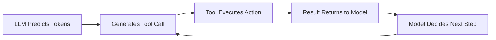
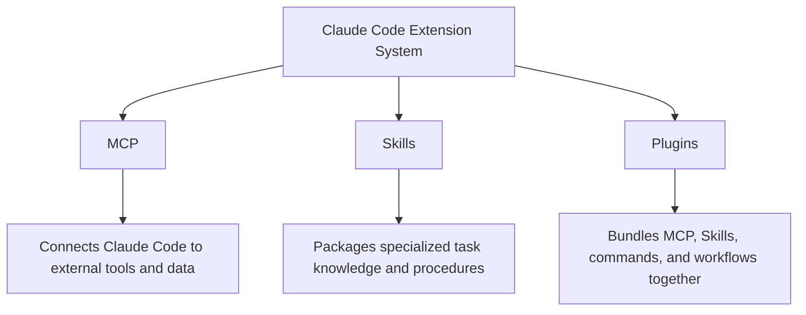
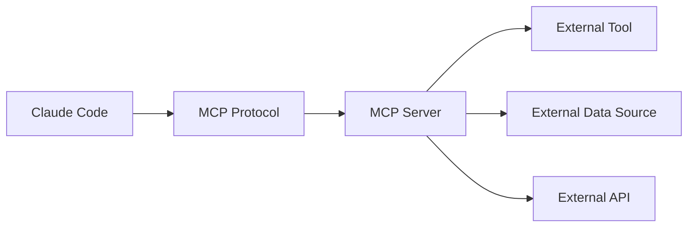
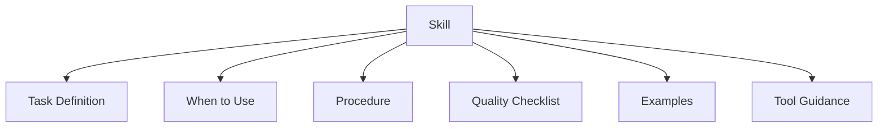
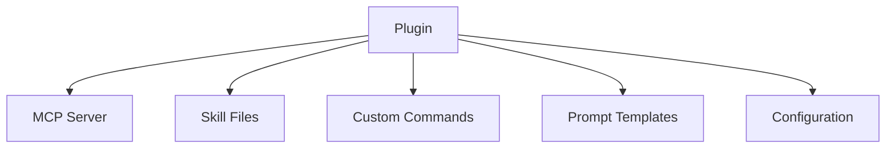
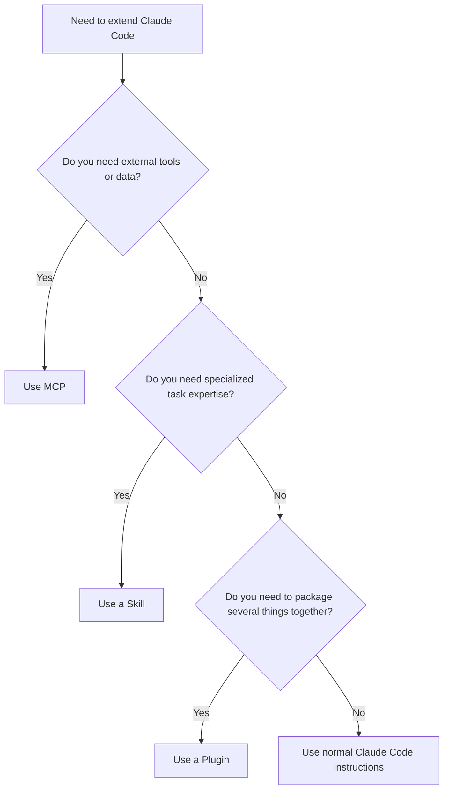
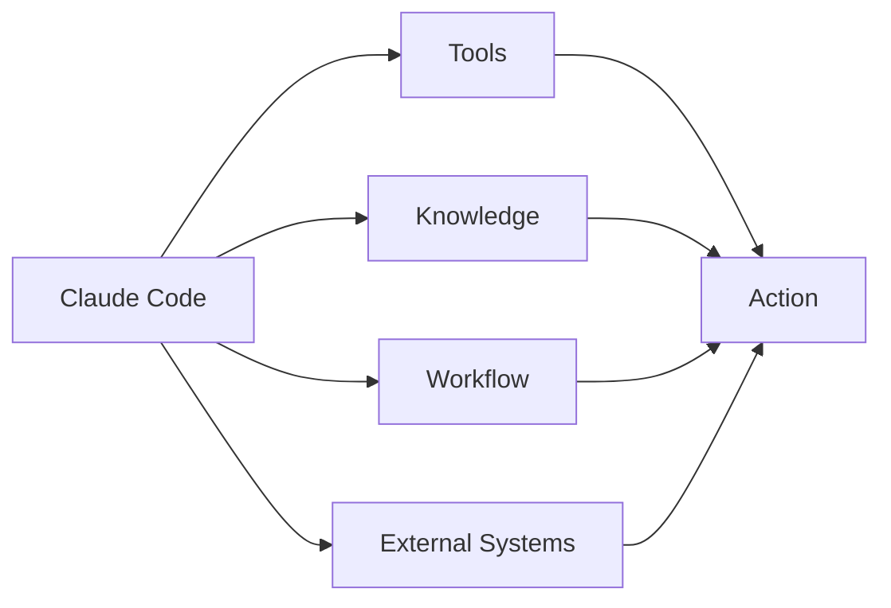

# 046 - Day 3 - MCP, Skills & Plugins: The Big Three Building Blocks of Claude Code

## Lesson Information

| Item       | Details                                                                                     |
| ---------- | ------------------------------------------------------------------------------------------- |
| Lesson     | 046                                                                                         |
| Duration   | 10 min                                                                                      |
| Week       | Week 2 - Claude Code & Vibe Engineering                                                     |
| Module     | Week 2 Day 3 - MCP, Skills, Plugins                                                         |
| Main Topic | Understanding the three major extension mechanisms in Claude Code: MCP, Skills, and Plugins |

---

## 1. Lesson Overview

This lesson introduces the **three major building blocks** used to extend Claude Code:

1. **MCP** - Model Context Protocol
2. **Skills** - packaged task-specific expertise
3. **Plugins** - higher-level bundles that package MCP servers, Skills, and other workflow extensions together

These three concepts can feel confusing because they overlap in purpose. All of them can be installed, enabled, disabled, and used to extend Claude Code. However, each one solves a different problem.

The goal of this lesson is to build clear mental models for:

* What MCP does
* What Skills do
* What Plugins do
* When to use each one
* Why all three are built around the deeper idea of **tools**

---

## 2. The Big Idea: Tools Turn an LLM into an Agent

A normal language model mainly generates text. It predicts the next tokens and produces content.

Claude Code feels different because it can **take action**.

The bridge between “just generating text” and “acting like an agent” is the concept of **tools**.

A tool allows the model to generate a structured instruction that represents an action, such as:

* Reading a file
* Editing a file
* Searching the web
* Running a command
* Updating a to-do list
* Calling an external API
* Fetching data from another system

In other words:

> Tools are what allow an LLM to move from content generation to action-taking.

---

## 3. From LLM to Agentic Coding

Claude Code becomes powerful because it has tools built into it.

For example, Claude Code can:

* Manage a to-do list
* Mark tasks as complete
* Read and edit project files
* Search through code
* Run commands
* Use external tools when connected properly

This is why Claude Code can plan, code, debug, test, and iterate like an autonomous coding assistant.

This loop is the foundation of agentic coding.

---

## 4. The Big Three Extension Blocks

Claude Code can be extended through three major mechanisms:

---

# Part 1: MCP

## 5. What Is MCP?

**MCP** stands for **Model Context Protocol**.

It is a protocol for connecting AI applications, such as Claude Code, to external tools, data sources, and systems.

The instructor describes MCP using the common analogy:

> MCP is like a USB-C port for AI applications.

This means MCP is not the tool itself. It is the standard interface that allows tools to connect to Claude Code.

---

## 6. What MCP Actually Does

MCP allows Claude Code to use tools written by someone else.

For example, an MCP server might provide tools for:

* Reading data from a database
* Searching company documents
* Accessing GitHub issues
* Querying market prices
* Browsing internal APIs
* Connecting to a file system
* Retrieving information from external services

Claude Code does not need to know the internal implementation of every tool. It only needs to understand the MCP protocol.

---

## 7. MCP Is About Connectivity

The most important point:

> MCP is not the tool. MCP is the connection standard.

The real value comes from the tools and systems that MCP makes available.

MCP is useful because it creates a shared way for people to write tools that many AI applications can use.

Without a shared protocol, every tool would need custom integration.

With MCP, a tool can be written once and connected to different AI apps that support MCP.

---

## 8. Why MCP Became Important

MCP became important because of adoption.

There are other ways to connect tools to LLMs, such as custom tool libraries or frameworks like LangChain. But MCP became powerful because it created a growing ecosystem.

The more people write MCP servers, the more useful MCP becomes.

Its value comes from:

* A shared standard
* Tool reuse
* Community adoption
* Easy integration
* Compatibility across AI applications

---

## 9. What MCP Is Good For

Use MCP when Claude Code needs to connect to an external system.

Good use cases include:

| Use Case                     | Why MCP Fits                                      |
| ---------------------------- | ------------------------------------------------- |
| Connect to a database        | MCP can expose database query tools               |
| Use internal company APIs    | MCP can wrap API access                           |
| Search private documentation | MCP can expose document retrieval                 |
| Access third-party services  | MCP can connect Claude Code to external platforms |
| Share tools across apps      | MCP creates a reusable tool interface             |

---

## 10. What MCP Is Not

MCP is often overhyped, so it is important to stay clear.

MCP is not:

* The actual tool implementation
* A magic reasoning upgrade
* A replacement for good tool design
* Always the most efficient option
* Something you should install endlessly without thinking

MCP is a protocol. It connects tools. The quality still depends on the tools themselves.

---

## 11. MCP Limitation: Context Efficiency

One major problem with MCP is that it can become context-heavy.

If you install too many MCP servers, Claude Code may need to keep track of too many available tools, schemas, descriptions, and instructions.

This can lead to:

* Context window pressure
* Earlier compaction
* Slower performance
* More confusion for the model
* Tool overload

Recent improvements have made Claude Code smarter about loading MCP context, but MCP can still become inefficient when overused.

---

# Part 2: Skills

## 12. What Are Skills?

**Skills** are packaged forms of specialized expertise.

A Skill tells Claude Code how to perform a specific kind of task well.

Where MCP focuses on connecting to external tools, Skills focus more on:

* Task-specific procedures
* Domain knowledge
* Best practices
* Workflows
* Decision rules
* Instructions for using tools correctly

A Skill is like a reusable expert playbook.

---

## 13. Skills vs MCP

MCP and Skills overlap because both extend Claude Code.

However, they solve different problems.

| Dimension    | MCP                                         | Skills                                              |
| ------------ | ------------------------------------------- | --------------------------------------------------- |
| Main purpose | Connect external tools and data             | Package task-specific expertise                     |
| Focus        | Tool access                                 | Knowledge and procedure                             |
| Best for     | APIs, databases, services, external systems | Repeated workflows, specialized tasks, domain logic |
| Analogy      | USB-C port for tools                        | Expert instruction manual                           |
| Risk         | Too many tools can fill context             | Poorly written skills can guide the model badly     |
| Strength     | Integration                                 | Expertise                                           |

---

## 14. Why Skills Matter

Skills matter because many tasks do not only require tools. They require knowing **how** to use tools correctly.

For example, in a coding workflow, Claude Code might already have access to file editing and terminal tools. But it still needs good instructions for:

* How to debug safely
* How to inspect a repository
* How to handle image restoration
* How to evaluate a model output
* How to write tests before editing
* How to avoid destructive actions
* How to follow a project-specific workflow

That is where Skills are useful.

---

## 15. Skills as Packaged Expertise

A Skill can contain:

* A clear task definition
* When to use the skill
* Step-by-step workflow
* Input and output expectations
* Quality checks
* Safety rules
* Tool usage guidance
* Examples
* Failure handling instructions

---

## 16. What Skills Are Good For

Use Skills when you want Claude Code to become better at a repeated task.

Good examples:

| Use Case                     | Why Skills Fit                                         |
| ---------------------------- | ------------------------------------------------------ |
| Code review workflow         | Skill can define review steps and quality checks       |
| Image understanding task     | Skill can define visual reasoning rules                |
| PDF analysis                 | Skill can define extraction and verification procedure |
| Test-driven bug fixing       | Skill can enforce plan-test-fix cycles                 |
| Astrology reading generation | Skill can package interpretation rules                 |
| Underwater image correction  | Skill can define detection and restoration logic       |
| Course note formatting       | Skill can standardize lesson output                    |

---

# Part 3: Plugins

## 17. What Are Plugins?

**Plugins** are higher-level packages.

A plugin can bundle multiple extension pieces together, such as:

* MCP servers
* Skills
* Commands
* Prompts
* Workflow templates
* Configuration
* Project-specific setup

Plugins are about convenient installation and distribution.

If MCP is a connector and Skills are expert playbooks, Plugins are packaged toolkits.

---

## 18. Plugin Mental Model

A plugin can make a complex setup easier to install and reuse.

Instead of manually installing several MCP servers, skills, and commands one by one, a plugin can package them into one convenient unit.

---

## 19. MCP vs Skills vs Plugins

| Concept | Simple Definition                                 | Main Question It Answers                              |
| ------- | ------------------------------------------------- | ----------------------------------------------------- |
| MCP     | A protocol for connecting external tools and data | “How does Claude Code access this external system?”   |
| Skill   | A packaged task-specific capability               | “How should Claude Code perform this task well?”      |
| Plugin  | A bundle of extensions                            | “How can I install this whole workflow conveniently?” |

---

## 20. Decision Guide: When Should You Use Which?

---

## 21. Practical Decision Table

| Situation                                         | Best Choice                          |
| ------------------------------------------------- | ------------------------------------ |
| Claude Code needs to query a database             | MCP                                  |
| Claude Code needs to use a third-party API        | MCP                                  |
| Claude Code needs a repeatable debugging workflow | Skill                                |
| Claude Code needs domain-specific reasoning rules | Skill                                |
| You want to distribute a complete setup           | Plugin                               |
| You want to combine MCP + Skills + commands       | Plugin                               |
| You only need one simple instruction              | Normal prompt or project instruction |

---

## 22. Key Insight

The real innovation is not MCP, Skills, or Plugins individually.

The real innovation is this:

> Claude Code becomes powerful when it can combine reasoning, tools, context, and reusable workflows.

MCP, Skills, and Plugins are different ways of giving Claude Code more capability.

They are all built around the same core idea:

---

## 23. Common Mistakes

### Mistake 1: Thinking MCP is the tool itself

MCP is not the tool. It is the protocol that connects the tool.

### Mistake 2: Installing too many MCP servers

Too many tools can overload the context and reduce performance.

### Mistake 3: Using MCP when a Skill is enough

If the task does not need external access, a Skill may be simpler and more efficient.

### Mistake 4: Using a Skill when the real need is integration

If Claude Code needs to access a database, API, or external service, MCP is usually the right choice.

### Mistake 5: Confusing Plugins with MCP or Skills

Plugins are bundles. They can include MCP and Skills, but they are not the same thing.

---

## 24. Learning Objectives

After this lesson, students should be able to:

* Explain what MCP is and why it matters
* Understand that MCP is a protocol, not the tool itself
* Explain how Skills package specialized expertise
* Understand how Plugins bundle extensions together
* Compare MCP, Skills, and Plugins clearly
* Decide when to use MCP, Skills, or Plugins in Claude Code workflows
* Understand why tools are central to agentic AI coding

---

## 25. Summary

This lesson introduces the three major extension building blocks of Claude Code: **MCP, Skills, and Plugins**.

MCP connects Claude Code to external tools, APIs, and data sources through a shared protocol. Skills package task-specific knowledge and workflows so Claude Code can perform specialized tasks more reliably. Plugins bundle MCP servers, Skills, commands, prompts, and configuration into convenient installable packages.

The deeper idea behind all three is the same: tools and structured workflows are what move an LLM from simple text generation toward agentic action.

Understanding these three building blocks gives you a stronger foundation for building more powerful, reliable, and reusable Claude Code workflows.

---

## 26. Quick Review Questions

1. What is the main purpose of MCP?
2. Why is MCP often compared to a USB-C port?
3. Why is MCP not the same as the tool itself?
4. What problem do Skills solve?
5. How are Skills different from MCP?
6. What does a Plugin usually package together?
7. Why can using too many MCP servers hurt performance?
8. When should you use MCP instead of a Skill?
9. When should you use a Skill instead of MCP?
10. What is the deeper innovation behind Claude Code’s agentic behavior?

---

## 27. Practice Task

Choose one workflow from your own coding project and decide which extension mechanism fits best.

| Workflow Need                               | MCP, Skill, or Plugin? | Reason                            |
| ------------------------------------------- | ---------------------- | --------------------------------- |
| Access project database                     | MCP                    | Needs external system connection  |
| Standardize bug-fixing workflow             | Skill                  | Needs repeatable task procedure   |
| Package repo tools and workflows for a team | Plugin                 | Needs bundled installation        |
| Analyze screenshots consistently            | Skill                  | Needs specialized reasoning rules |
| Connect Claude Code to GitHub issues        | MCP                    | Needs external platform access    |

---

# Bài luyện tập

## Mục tiêu

## Đề bài

## Yêu cầu hoàn thành

- [ ] 
- [ ] 
- [ ] 

## Kết quả / lời giải

## Ghi chú
