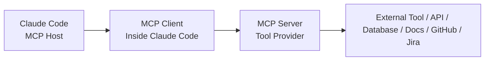
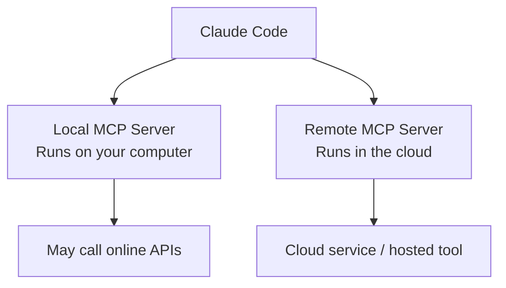
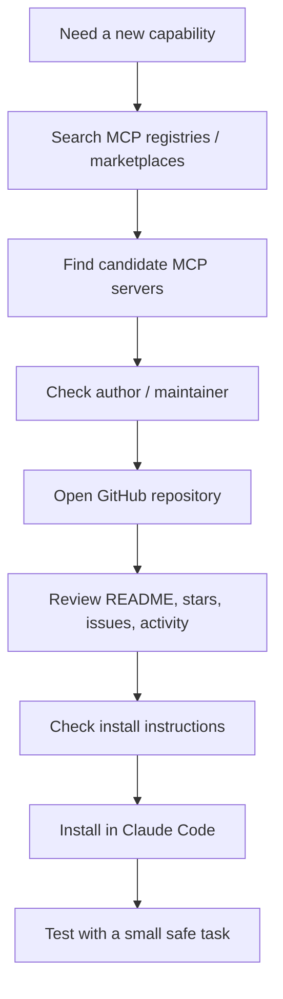
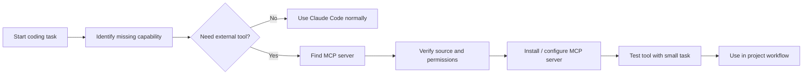
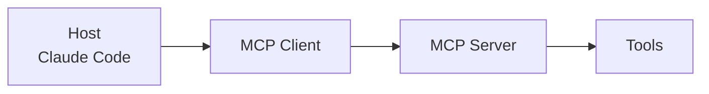

# 047 - Day 3 - MCP Servers Explained: Hosts, Clients, and Discovery for Claude Code

## Lesson Information

| Item     | Details                                                |
| -------- | ------------------------------------------------------ |
| Lesson   | 047                                                    |
| Duration | 13 min                                                 |
| Week     | Week 2 - Claude Code & Vibe Engineering                |
| Module   | Week 2 Day 3 - MCP, Skills, Plugins                    |
| Topic    | MCP Servers: Hosts, Clients, Transports, and Discovery |

---

## Main Idea

This lesson explains the technical structure behind **MCP servers** and how they connect Claude Code to external tools, data, APIs, documentation, Jira, GitHub, databases, and other services.

The key point is simple:

> MCP gives Claude Code a standard way to discover and use external tools.

You do not need to build MCP servers to benefit from MCP. Most of the time, you simply install or configure an existing MCP server, and Claude Code gains access to a new set of tools.

---

## Learning Objectives

After this lesson, students should be able to:

* Explain the difference between an **MCP host**, **MCP client**, and **MCP server**.
* Understand how MCP servers give Claude Code access to external tools.
* Distinguish between **local** and **remote** MCP servers.
* Understand the difference between **SSE** and **streamable HTTP** transports.
* Know where to discover MCP servers.
* Evaluate whether an MCP server looks trustworthy before installing it.
* Apply MCP safely in an AI coding workflow.

---

## 1. Why MCP Matters

Claude Code is powerful on its own, but it becomes much more useful when it can access external systems.

For example, Claude Code may need to:

* Read the latest documentation for a library.
* Query a database.
* Search GitHub repositories.
* Interact with Jira tickets.
* Fetch market data.
* Browse the web.
* Access internal company tools.
* Use project-specific APIs.

MCP makes this possible through a shared protocol.

Instead of every tool needing a custom integration, MCP provides a common connection layer.

---

## 2. The Three Core MCP Components

MCP has three important terms:

1. **MCP Host**
2. **MCP Client**
3. **MCP Server**

These terms sound technical, but the idea is straightforward.

---

## 3. MCP Host

The **MCP host** is the main AI application that wants to use tools.

Examples of MCP hosts include:

* Claude Code
* ChatGPT
* Cursor-style coding agents
* Custom AI agents built with frameworks such as the OpenAI Agents SDK
* Internal agentic applications

The host is the overall application that runs the AI model and decides when tools are needed.

### Simple Definition

> The MCP host is the AI application that wants to call external tools.

In this course, the most important MCP host is:

> **Claude Code**

---

## 4. MCP Client

The **MCP client** is the piece of code inside the MCP host that communicates with an MCP server.

Usually, you do not interact with the MCP client directly.

Claude Code handles it for you.

For each MCP server you connect, Claude Code creates or manages an MCP client internally.

### Simple Definition

> The MCP client is the connector inside the host that talks to one MCP server.

You normally do not need to configure this manually.

---

## 5. MCP Server

The **MCP server** is the part most users actually care about.

An MCP server exposes a set of tools to the host.

Examples:

* A web browsing MCP server
* A GitHub MCP server
* A Jira MCP server
* A database MCP server
* A stock market data MCP server
* A documentation lookup MCP server such as Context7

When people say:

> “I’m using this MCP”

They usually mean:

> “I’m using this MCP server.”

### Simple Definition

> The MCP server is the tool provider. It exposes capabilities that Claude Code can use.

---

## 6. MCP Architecture Diagram



### Explanation

* **Claude Code** is the MCP host.
* Claude Code uses an internal **MCP client**.
* The client connects to an **MCP server**.
* The MCP server exposes tools.
* Those tools may call APIs, databases, websites, or local files.

---

## 7. Local vs Remote MCP Servers

MCP servers can run in two main ways:

| Type              | Where It Runs    | Example                                                             |
| ----------------- | ---------------- | ------------------------------------------------------------------- |
| Local MCP Server  | On your computer | A Node.js or Python MCP server installed with `npx`, `pip`, or `uv` |
| Remote MCP Server | In the cloud     | A GitHub, Jira, or hosted API MCP server                            |

---

## 8. Local MCP Servers

A **local MCP server** runs on your own machine.

This does not mean it is offline.

A local MCP server may still call online APIs.

For example:

* A stock market MCP server may run locally.
* But it still fetches live market prices from the internet.
* The server code runs on your computer.
* The data may come from a remote API.

### Important Clarification

> “Local” describes where the MCP server runs, not whether it uses the internet.

A local MCP server can still access remote services.

---

## 9. Remote MCP Servers

A **remote MCP server** runs in the cloud.

For example:

* A GitHub MCP server may be hosted by GitHub or Microsoft.
* A Jira MCP server may be hosted by Atlassian.
* A documentation server may be hosted by its provider.

Claude Code connects to it remotely.

### Simple Definition

> A remote MCP server is hosted outside your computer and accessed over the network.

---

## 10. Local vs Remote Diagram



---

## 11. MCP Transports

MCP servers communicate through different transport mechanisms.

The lesson mentions two important remote transport styles:

| Transport       | Status                              | Meaning                          |
| --------------- | ----------------------------------- | -------------------------------- |
| SSE             | Legacy / deprecated but still works | Older streaming connection style |
| Streamable HTTP | Newer standard                      | Modern HTTP-based transport      |

### Key Point

> SSE may still work, but streamable HTTP is the newer direction.

When using an MCP server, you may see different setup instructions depending on whether the server supports local, SSE, or streamable HTTP configuration.

---

## 12. Common Source of Confusion

Many people confuse these two ideas:

1. Where the MCP server runs.
2. What services the MCP server accesses.

These are not the same.

### Example

A market data MCP server may run locally:

```text
Your computer runs the MCP server.
```

But it may still call a remote market API:

```text
The stock prices come from the internet.
```

So the server is local, but the data source is remote.

---

## 13. Local MCP Is Still “Real MCP”

Another common misunderstanding is thinking local MCP servers are not “real MCP.”

That is incorrect.

A local MCP server still gives you the benefits of MCP:

* Standard tool interface
* Reusable server implementation
* Shared open-source code
* Easy Claude Code integration
* One-command installation
* Consistent tool discovery for the host

Most MCP servers are local, but they are still real MCP servers.

They are often installed from a remote package or repository and then run on your machine.

Examples:

* Python MCP server installed with `pip`
* Python MCP server installed with `uv`
* Node.js MCP server installed with `npx`

---

## 14. Why MCP Feels Powerful

The big idea behind MCP is not that the technology is magical.

The big idea is standardization.

With one command, Claude Code can gain a new set of tools.

For example, after installing an MCP server, Claude Code may suddenly be able to:

* Read updated documentation.
* Search GitHub.
* Query an API.
* Inspect a database.
* Retrieve external knowledge.
* Interact with developer tools.

### The “Eureka” Moment

> One command can equip Claude Code with an entirely new capability.

That is why MCP is so useful for AI coding agents.

---

## 15. MCP Server Discovery

One challenge with MCP is discovery.

There is not one single perfect place where everyone discovers MCP servers.

Instead, discovery is still a bit fragmented.

You may find MCP servers through:

* Official MCP registry
* Anthropic reference server repositories
* GitHub repositories
* Community marketplaces
* Developer blogs
* Tool provider documentation
* Marketplace websites such as MCP directories

---

## 16. MCP Discovery Flow



---

## 17. Example: Context7

One useful MCP server mentioned in the lesson is **Context7**.

Context7 helps Claude Code access up-to-date documentation for libraries and APIs.

This solves a common problem:

> Claude Code may know an older version of an API from its training data.

Context7 lets Claude ask for current documentation and use fresher information while coding.

### Why This Matters

Without current documentation, an AI coding agent may:

* Use outdated function names.
* Assume old API behavior.
* Generate deprecated code.
* Miss new configuration patterns.
* Hallucinate unsupported features.

With a documentation MCP server, Claude Code can check current library information before writing code.

---

## 18. The Marketplace Problem

MCP marketplaces can be noisy.

When searching for a popular server like Context7, you may find:

* Official versions
* Unofficial clones
* Forks
* Similar names
* Duplicate listings
* Outdated versions
* Dubious packages

Therefore, you should not blindly install the first result.

---

## 19. How to Verify an MCP Server

Before installing an MCP server, check:

| Check                 | Why It Matters                                              |
| --------------------- | ----------------------------------------------------------- |
| Author / organization | Confirms whether it is from the real maintainer             |
| GitHub repository     | Lets you inspect source, issues, and activity               |
| Stars / downloads     | Shows community traction, but should not be the only signal |
| Recent commits        | Indicates whether the project is maintained                 |
| README quality        | Shows whether setup and usage are documented clearly        |
| Issues / discussions  | Reveals bugs, security concerns, or active maintenance      |
| License               | Tells you whether the server is safe to use in your context |
| Required permissions  | Helps avoid giving excessive access                         |
| Install command       | Lets you understand what will run on your machine           |

---

## 20. Security Considerations

MCP servers can be powerful because they give Claude Code access to external systems.

That also means they can be risky.

You should always understand what an MCP server can access.

### Key Security Questions

Before installing an MCP server, ask:

* Who made this MCP server?
* Is it actively maintained?
* What permissions does it need?
* Does it access local files?
* Does it access private repositories?
* Does it require API keys?
* Does it send data to a third-party service?
* Can it modify data or only read data?
* Can it run shell commands?
* Can it access production systems?

---

## 21. Safe MCP Usage Checklist

Use this checklist before adding an MCP server to Claude Code:

```text
[ ] I know who maintains this MCP server.
[ ] I checked the official GitHub repository or documentation.
[ ] I reviewed the installation command.
[ ] I understand whether it runs locally or remotely.
[ ] I know what data it can access.
[ ] I know whether it has read-only or write permissions.
[ ] I am not exposing production secrets unnecessarily.
[ ] I tested it on a low-risk project first.
[ ] I understand how to remove or disable it.
```

---

## 22. MCP in a Claude Code Workflow

A practical Claude Code workflow with MCP may look like this:



---

## 23. Practical Examples of MCP Servers

| MCP Server Type   | What It Helps Claude Code Do                |
| ----------------- | ------------------------------------------- |
| Documentation MCP | Look up current API and library docs        |
| GitHub MCP        | Read issues, PRs, repositories, and code    |
| Jira MCP          | Read or update tickets                      |
| Database MCP      | Query project databases                     |
| Browser MCP       | Browse or retrieve web information          |
| Market Data MCP   | Fetch stock or financial data               |
| Filesystem MCP    | Read or write local files                   |
| Search MCP        | Search internal or external knowledge bases |

---

## 24. MCP vs Skills vs Plugins

This lesson belongs to the MCP, Skills, and Plugins module.

Here is the high-level distinction:

| Extension Type | Main Purpose                                            |
| -------------- | ------------------------------------------------------- |
| MCP            | Connect Claude Code to external tools and data          |
| Skills         | Package specialized behavior or task expertise          |
| Plugins        | Extend workflow and improve discoverability/integration |

### Simple Mental Model

```text
MCP = Tool connection
Skills = Specialized capability
Plugins = Workflow/product extension
```

---

## 25. Key Concept 1: MCP Host, Client, and Server

The first core concept is the MCP architecture.

Claude Code is the **host**.

Inside Claude Code, an MCP **client** connects to an MCP **server**.

The MCP server exposes tools.



Students should understand that the MCP server is the component they usually install, configure, and evaluate.

---

## 26. Key Concept 2: Local and Remote Transports

The second key concept is where the MCP server runs.

An MCP server can run:

* Locally on your machine
* Remotely in the cloud

Remote MCP servers may use transports such as:

* SSE
* Streamable HTTP

The important point is that local MCP servers can still call online services.

---

## 27. Key Concept 3: Discovery and Trust

The third key concept is discovery.

MCP gives a strong standard for connection, but discovery is still fragmented.

Students should learn to:

* Search registries and marketplaces.
* Identify the official version.
* Check the GitHub repository.
* Review maintainer activity.
* Understand permissions before installation.
* Test in a safe environment.

---

## 28. Why This Lesson Is Important

This lesson is important because MCP is one of the main ways Claude Code becomes more than a coding chatbot.

With MCP, Claude Code can interact with real tools, real documentation, real repositories, and real systems.

However, this power comes with responsibility.

A developer must understand:

* What is being installed.
* Where it runs.
* What data it can access.
* Whether it can modify anything.
* Whether the source is trustworthy.

This knowledge is essential before using MCP servers in serious development workflows.

---

## 29. Mini Demo Idea

A good demo for this lesson:

1. Open an MCP marketplace or registry.
2. Search for a useful MCP server such as Context7.
3. Compare official and unofficial listings.
4. Open the GitHub repository.
5. Check stars, issues, recent commits, and README.
6. Copy the Claude Code installation command.
7. Add the MCP server to Claude Code.
8. Ask Claude Code to use the new tool.
9. Verify that the tool actually improves the answer.

---

## 30. Example Prompt After Installing a Documentation MCP Server

```text
Use the documentation MCP server to check the latest API for this package before writing code.
Then update my implementation using the current recommended syntax.
```

Another example:

```text
Before changing the code, look up the current documentation for this framework and confirm whether this method is still supported.
```

---

## 31. Common Mistakes

| Mistake                                   | Better Approach                             |
| ----------------------------------------- | ------------------------------------------- |
| Installing the first search result        | Verify the official source first            |
| Assuming local means offline              | Remember local servers may call remote APIs |
| Assuming local MCP is not real MCP        | Local MCP still uses the MCP standard       |
| Ignoring permissions                      | Check what the server can access            |
| Trusting marketplace ratings only         | Inspect the GitHub repo and maintainer      |
| Using MCP on production systems too early | Test in a safe project first                |
| Forgetting API key exposure               | Use least-privilege credentials             |

---

## 32. Summary

In this lesson, students learned the technical structure behind MCP servers.

The main terms are:

* **MCP Host**: the AI application, such as Claude Code.
* **MCP Client**: the internal connector inside the host.
* **MCP Server**: the external tool provider that exposes capabilities.

Students also learned that MCP servers can run locally or remotely.

Local MCP servers run on your machine, but they may still call internet services. Remote MCP servers run in the cloud and connect through transports such as SSE or streamable HTTP.

Finally, students learned that MCP discovery is still fragmented. Marketplaces can be useful, but they contain noise. The safest approach is to verify the official source, inspect the GitHub repository, review permissions, and test carefully.

The big idea is:

> MCP lets Claude Code gain new tools through a standard interface, often with a single command.

That is why MCP is such a powerful building block for modern AI coding agents.

---

## Review Questions

1. What is the difference between an MCP host and an MCP server?
2. Why does Claude Code need an MCP client?
3. What does it mean for an MCP server to run locally?
4. Can a local MCP server still access online services?
5. What is the difference between SSE and streamable HTTP?
6. Why is MCP server discovery sometimes confusing?
7. How can you check whether an MCP server is trustworthy?
8. Why is Context7 useful for Claude Code?
9. What permissions should you review before installing an MCP server?
10. Why is MCP important for AI coding agents?

---

## Key Takeaways

* Claude Code is an example of an **MCP host**.
* The **MCP client** runs inside the host and connects to MCP servers.
* The **MCP server** is the tool provider.
* Most users mainly install and configure MCP servers.
* MCP servers can run locally or remotely.
* Local MCP servers may still call online APIs.
* Remote MCP servers may use SSE or streamable HTTP.
* Discovery is still fragmented across registries, marketplaces, and GitHub.
* Always verify the source before installing an MCP server.
* MCP is powerful because one command can give Claude Code a new set of tools.

---

# Bài luyện tập

## Mục tiêu


## Đề bài


## Yêu cầu hoàn thành

- [ ] 
- [ ] 
- [ ] 

## Kết quả / lời giải


## Ghi chú
