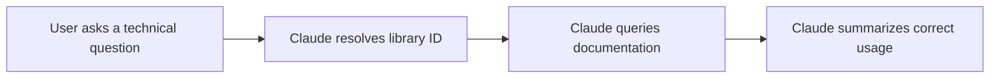
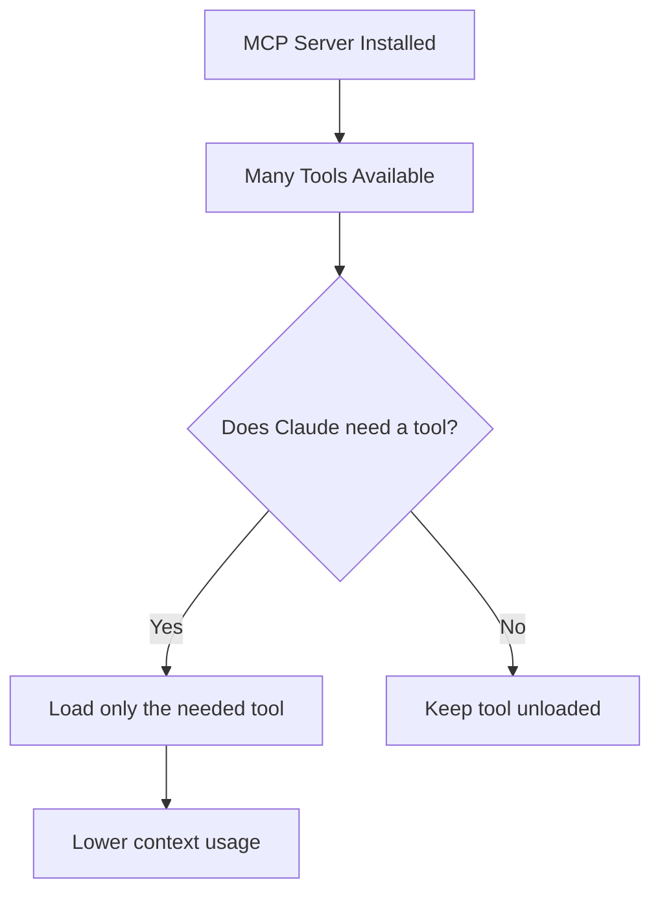
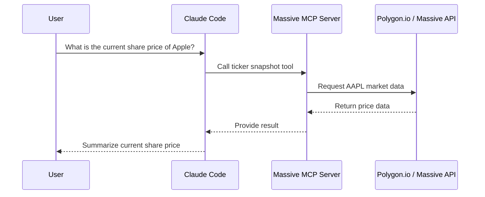
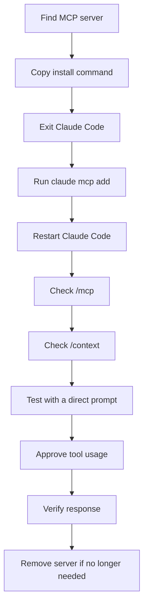

# 048 - Day 3 - Adding MCP Servers to Claude Code: Context7 & Polygon.io

## Lesson Information

| Item     | Details                                 |
| -------- | --------------------------------------- |
| Lesson   | 048                                     |
| Duration | 12 minutes                              |
| Week     | Week 2 - Claude Code & Vibe Engineering |
| Module   | Week 2 Day 3 - MCP, Skills, Plugins     |

## Main Topic

This lesson demonstrates how to add MCP servers to Claude Code, using **Context7** for up-to-date technical documentation and **Polygon.io / Massive** for market data.

Students learn how to configure MCP servers, verify that Claude Code can see the tools, and test whether Claude can call those tools correctly during a real coding or research workflow.

---

## Learning Objectives

By the end of this lesson, students should be able to:

* Understand how MCP servers extend Claude Code with external tools and data sources.
* Add an MCP server from the command line.
* Use Context7 to retrieve technical documentation.
* Add a market-data MCP server such as Polygon.io / Massive.
* Check MCP server status using Claude Code commands.
* Remove MCP servers when they are no longer needed.
* Prompt Claude Code more directly so it knows when to use a specific MCP tool.

---

## Why This Lesson Matters

MCP turns Claude Code from a coding assistant into a tool-connected agent.

Instead of relying only on its built-in knowledge, Claude Code can connect to external systems such as:

* Documentation databases
* APIs
* Market data providers
* Internal tools
* Developer services
* Research sources

This lesson is important because it shows the practical workflow for giving Claude Code new capabilities through MCP servers.

---

## Core Concepts

## 1. MCP Servers Add External Capabilities

An MCP server exposes tools that Claude Code can call.

For example:

| MCP Server           | Purpose                                            |
| -------------------- | -------------------------------------------------- |
| Context7             | Looks up current technical documentation           |
| Polygon.io / Massive | Retrieves market data such as stock prices         |
| GitHub MCP           | Works with repositories, issues, and pull requests |
| Database MCP         | Queries or manages databases                       |
| Jira MCP             | Reads or updates project tickets                   |

The key idea is that Claude Code does not need all capabilities built in.
You can attach new tools through MCP.

---

## 2. Context7 for Technical Documentation

Context7 is useful when Claude Code needs up-to-date documentation for a specific library, SDK, or framework.

In the lesson, Context7 provides two main tools:

| Tool               | Purpose                                          |
| ------------------ | ------------------------------------------------ |
| Resolve Library ID | Finds the correct documentation ID for a library |
| Query Docs         | Searches the documentation for that library      |

The workflow usually looks like this:



Example prompt:

```text
Use Context7 and summarize the right way to use the OpenAI Agents SDK with a model other than OpenAI's models.
```

The phrase **“Use Context7”** is important because it strongly hints to Claude Code that it should call the Context7 MCP tools.

---

## 3. Prompting Claude Code to Use MCP Tools

Claude Code may automatically choose the right MCP tool, but it can be inconsistent.

To make tool usage more reliable, be explicit.

Recommended pattern:

```text
Use <MCP server name> to <task>.
```

Examples:

```text
Use Context7 to explain how to configure telemetry in CrewAI.
```

```text
Use Context7 to check the latest documentation for the OpenAI Agents SDK.
```

```text
Use Massive to get the current share price of Apple.
```

You do not always need to say “use,” but it improves reliability.

---

## 4. Adding Context7 to Claude Code

MCP servers are added from the normal terminal, not from inside an active Claude Code session.

First, exit Claude Code.

Then run a command like:

```bash
claude mcp add context7 -- npx -y @upstash/context7-mcp
```

What this command does:

| Part                           | Meaning                                                       |
| ------------------------------ | ------------------------------------------------------------- |
| `claude`                       | Calls the Claude Code CLI                                     |
| `mcp add`                      | Adds a new MCP server                                         |
| `context7`                     | Names the server                                              |
| `--`                           | Separates Claude CLI arguments from the server launch command |
| `npx -y @upstash/context7-mcp` | Launches the Context7 MCP server                              |

After adding it, restart Claude Code:

```bash
claude
```

Then check the context:

```text
/context
```

You should see Context7 MCP tools available.

---

## 5. Checking MCP Status

Claude Code provides MCP-related commands.

To inspect configured MCP servers:

```text
/mcp
```

This shows whether the MCP servers are connected.

To inspect loaded context and tools:

```text
/context
```

This helps you see:

* Which MCP tools are available
* Which tools are currently loaded
* How many tokens they are using
* Whether Claude Code has recognized the server

---

## 6. Loaded Tools vs Available Tools

A key detail from the lesson is that Claude Code may show many available MCP tools, but only load the tools it actually needs.

This is important because MCP servers used to consume a lot of context.

Newer Claude Code behavior is more efficient:



This means large MCP servers are less likely to waste context than before.

---

## 7. Adding Polygon.io / Massive MCP Server

The lesson also demonstrates adding a market-data MCP server.

Polygon.io, referred to as Massive in the lesson, can provide access to market data such as:

* Stock prices
* Ticker snapshots
* Market summaries
* Financial data
* Historical and current market information

This MCP server requires an API key.

A general command structure looks like this:

```bash
claude mcp add massive --env MASSIVE_API_KEY=YOUR_API_KEY -- <server-launch-command>
```

Replace:

```text
YOUR_API_KEY
```

with your actual API key.

The exact server launch command should be copied from the official Polygon.io / Massive MCP setup instructions.

---

## 8. Testing the Market Data MCP Server

After adding the server, restart Claude Code:

```bash
claude
```

Then check MCP status:

```text
/mcp
```

You should see both servers connected:

```text
context7
massive
```

Example test prompt:

```text
What is the current share price of Apple?
```

Claude Code should choose a market-data tool such as a ticker snapshot tool.

The flow looks like this:



---

## 9. Permission and Tool Calls

When Claude Code wants to call an MCP tool, it may ask for confirmation.

This is expected.

Example behavior:

```text
Claude wants to use the Context7 Resolve Library ID tool.
Do you want to allow this?
```

You can approve the tool call when you trust the server and understand what it is doing.

This permission model matters because MCP tools can connect to external systems.

---

## 10. Removing MCP Servers

After the demo, the lesson removes the MCP servers.

To remove Context7:

```bash
claude mcp remove context7
```

To remove Massive:

```bash
claude mcp remove massive
```

Then restart Claude Code:

```bash
claude
```

Check MCP status again:

```text
/mcp
```

You should see that no MCP servers are configured.

---

## Practical Workflow



---

## Example Commands

### Add Context7

```bash
claude mcp add context7 -- npx -y @upstash/context7-mcp
```

### Start Claude Code

```bash
claude
```

### Check context

```text
/context
```

### Check MCP servers

```text
/mcp
```

### Remove Context7

```bash
claude mcp remove context7
```

### Remove Massive

```bash
claude mcp remove massive
```

---

## Example Prompts

### Context7 Documentation Prompt

```text
Use Context7 to summarize the right way to use the OpenAI Agents SDK with a model other than OpenAI's models.
```

### CrewAI Documentation Prompt

```text
How do I turn off telemetry with CrewAI?
```

### Market Data Prompt

```text
What is the current share price of Apple?
```

### More Explicit Market Data Prompt

```text
Use Massive to get the current ticker snapshot for Apple.
```

---

## Key Takeaways

* MCP servers let Claude Code connect to external tools and data sources.
* Context7 is useful for current technical documentation.
* Polygon.io / Massive is useful for market data.
* MCP servers are added from the terminal using `claude mcp add`.
* You can inspect MCP servers with `/mcp`.
* You can inspect loaded tools and token usage with `/context`.
* Claude Code may not always use an MCP server automatically.
* Use direct prompts like `Use Context7...` to make tool usage more reliable.
* Newer Claude Code versions load MCP tools more efficiently.
* Remove unused MCP servers to keep your environment clean.

---

## Common Mistakes

| Mistake                                          | Better Approach                                  |
| ------------------------------------------------ | ------------------------------------------------ |
| Adding MCP while still inside Claude Code        | Exit Claude Code first, then run the CLI command |
| Expecting Claude to always use MCP automatically | Prompt directly with “Use Context7...”           |
| Forgetting to restart Claude Code                | Restart after adding or removing MCP servers     |
| Not checking `/mcp`                              | Use `/mcp` to confirm server connection          |
| Leaving unused servers installed                 | Remove them with `claude mcp remove`             |
| Sharing API keys in demos or screenshots         | Keep API keys private                            |

---

## Security Notes

MCP servers can give Claude Code access to external systems.

Before adding an MCP server, check:

* What data it can access
* What actions it can perform
* Whether it requires an API key
* Whether the API key has limited permissions
* Whether the server comes from a trusted source
* Whether the tool is appropriate for the current project

For sensitive projects, avoid adding unnecessary MCP servers.

---

## Summary

In this lesson, students learn how to add MCP servers to Claude Code using Context7 and Polygon.io / Massive as examples.

Context7 demonstrates how Claude Code can retrieve current technical documentation, while Polygon.io / Massive demonstrates how Claude Code can connect to external market data.

The lesson shows the full MCP workflow: adding a server, restarting Claude Code, checking `/context` and `/mcp`, testing tool usage, approving tool calls, and removing servers afterward.

This prepares students for the next topic: **Skills**, where Claude Code can be extended not only through external tools, but also through reusable task-specific instructions and workflows.

---

# Bài luyện tập

## Mục tiêu


## Đề bài


## Yêu cầu hoàn thành

- [ ] 
- [ ] 
- [ ] 

## Kết quả / lời giải


## Ghi chú
