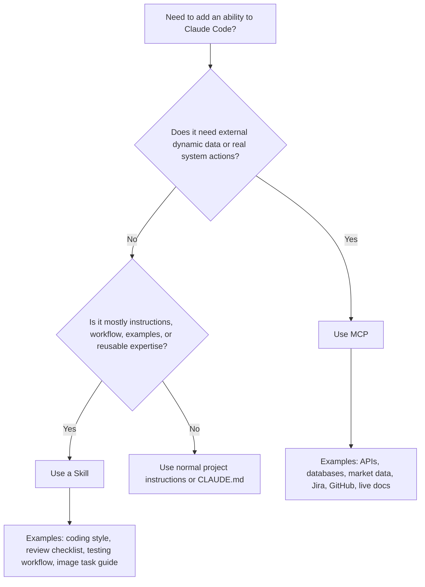
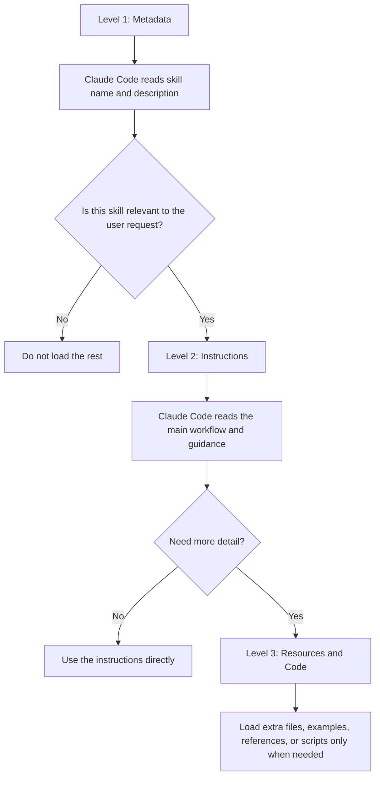
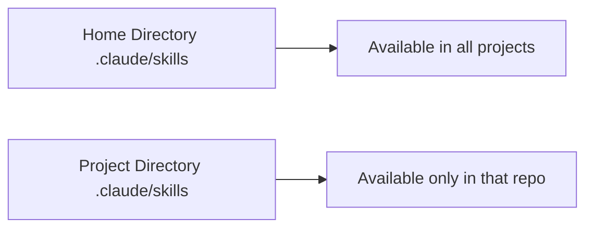
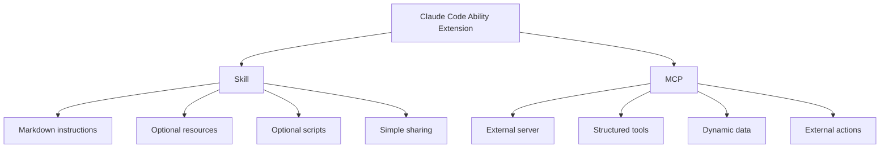

# 049 - Day 3 - Skills vs MCP: Claude Code's Simpler Way to Add Abilities

## Lesson Information

| Item     | Details                                 |
| -------- | --------------------------------------- |
| Lesson   | 049                                     |
| Duration | 13 min                                  |
| Week     | Week 2 - Claude Code & Vibe Engineering |
| Module   | Week 2 Day 3 - MCP, Skills, Plugins     |

---

## Main Idea

This lesson compares **Skills** and **MCP** in Claude Code.

**Skills** are a simpler way to add abilities, expertise, workflows, and reusable instructions to Claude Code. They are best when you want to package guidance, task procedures, examples, scripts, or project-specific knowledge without building a full external tool server.

**MCP** is more powerful when Claude Code needs to connect to external systems, dynamic data sources, APIs, databases, or services that perform real actions.

---

## Learning Objectives

By the end of this lesson, learners should be able to:

* Understand what Claude Code Skills are.
* Explain how Skills differ from MCP servers.
* Understand the concept of **progressive disclosure**.
* Know when to use Skills and when to use MCP.
* Understand the basic folder structure of a Claude Code Skill.
* Apply Skills to everyday coding-agent workflows.

---

## 1. What Are Skills?

Skills are reusable instruction packages for Claude Code.

They are usually made of:

* Markdown instruction files
* Optional extra reference files
* Optional scripts Claude Code can run
* A required `skill.md` file
* A specific folder structure

A Skill is similar to having multiple specialized `CLAUDE.md` files, but with better organization and more efficient context loading.

Instead of loading every instruction into the conversation, Claude Code first reads only the Skill metadata. It then decides whether more detailed instructions or resources are needed.

---

## 2. Why Skills Were Introduced

MCP is powerful, but it can feel too heavy for simple use cases.

MCP often requires:

* A separate server process
* Tool definitions
* Runtime plumbing
* API handling
* More technical setup
* More difficult sharing and installation

Skills provide a simpler alternative.

A Skill can be shared as a folder. If that folder is placed in the right location, Claude Code can use it.

This makes Skills easier to create, copy, version-control, and share with teammates.

---

## 3. Skills vs MCP

| Feature             | Skills                                                            | MCP                                                            |
| ------------------- | ----------------------------------------------------------------- | -------------------------------------------------------------- |
| Main purpose        | Add instructions, workflows, expertise, and reusable task logic   | Connect Claude Code to external tools, APIs, data, and actions |
| Complexity          | Simple                                                            | More complex                                                   |
| Setup               | Folder + Markdown files + optional scripts                        | Server process + tool protocol                                 |
| Best for            | Guidance, coding conventions, repeatable tasks, project knowledge | Dynamic data, API calls, databases, external services          |
| Sharing             | Easy: copy the skill folder                                       | Harder: install and configure server                           |
| Context efficiency  | High, due to progressive disclosure                               | Depends on implementation                                      |
| Tool-like behavior  | Possible through scripts                                          | Native tool calls                                              |
| Flexibility         | Lower                                                             | Higher                                                         |
| Precision of inputs | More informal                                                     | Stronger JSON/function schemas                                 |
| Discovery           | Still evolving                                                    | More established, but still messy                              |

---

## 4. Simple Decision Rule



---

## 5. When to Use Skills

Use **Skills** when you want Claude Code to follow a repeatable process.

Good examples include:

* Code review checklist
* Testing workflow
* Refactoring rules
* Project architecture guide
* Debugging procedure
* Documentation writing guide
* Prompting workflow
* Image analysis procedure
* Domain-specific reasoning guide
* Reusable scripts for local checks

Skills are ideal when the ability can be described mostly through instructions and examples.

---

## 6. When to Use MCP

Use **MCP** when Claude Code needs to interact with something outside the local instruction package.

Good examples include:

* Querying a database
* Calling a live API
* Reading real-time market data
* Accessing Jira, GitHub, Notion, or other tools
* Performing authenticated actions
* Fetching dynamic documentation
* Running external service workflows

MCP is better when the task needs structured tool calls, runtime behavior, or live data.

---

## 7. Progressive Disclosure

One of the most important ideas behind Skills is **progressive disclosure**.

This means Claude Code does not load the entire Skill into context immediately.

Instead, it loads information in levels.



The three levels are:

| Level   | Name               | What It Contains                                       |
| ------- | ------------------ | ------------------------------------------------------ |
| Level 1 | Metadata           | Skill name and description                             |
| Level 2 | Instructions       | Main guidance, workflows, rules, examples              |
| Level 3 | Resources and Code | Extra files, references, scripts, supporting materials |

This keeps the context window clean and efficient.

---

## 8. Skill Folder Structure

Claude Code Skills use a file-system-based structure.

A Skill is just a folder with a specific layout.

```text
.claude/
└── skills/
    └── my-great-skill/
        ├── skill.md
        ├── references/
        │   └── extra-guide.md
        ├── examples/
        │   └── example-output.md
        └── scripts/
            └── helper.py
```

The important parts are:

| Path                             | Purpose                                            |
| -------------------------------- | -------------------------------------------------- |
| `.claude/`                       | Claude Code configuration folder                   |
| `.claude/skills/`                | Folder containing all Skills                       |
| `.claude/skills/my-great-skill/` | One specific Skill                                 |
| `skill.md`                       | Required file containing metadata and instructions |
| Other files                      | Optional resources, examples, or scripts           |

---

## 9. Global Skills vs Project Skills

Skills can be installed in two places.



| Location                            | Scope                              |
| ----------------------------------- | ---------------------------------- |
| Home directory `.claude/skills/`    | Global Skills for all projects     |
| Project directory `.claude/skills/` | Skills only for that specific repo |

Project-level Skills are useful for team workflows because they can be committed into the repository.

When teammates pull the repo, they get the same Skills.

---

## 10. The `skill.md` File

The `skill.md` file is the heart of a Skill.

It contains:

1. Metadata
2. Main instructions
3. References to optional resources or scripts

A simplified structure looks like this:

```markdown
---
name: my-great-skill
description: Use this skill when you need to follow our project-specific testing workflow.
---

# My Great Skill

## When to Use

Use this skill when modifying backend code, adding features, or fixing bugs.

## Workflow

1. Read the relevant files.
2. Identify the expected behavior.
3. Make the smallest safe change.
4. Run tests.
5. Explain what changed.

## Optional Resources

- See `references/testing-guide.md` for more details.
- Run `scripts/check_tests.py` if test discovery is needed.
```

The metadata at the top helps Claude Code decide whether the Skill is relevant.

The instructions explain how the Skill should be used.

The optional resources are only loaded when needed.

---

## 11. Scripts Inside Skills

Skills can also include scripts.

Claude Code can run these scripts when the Skill says they are useful.

This creates tool-like behavior without building a full MCP server.

For example:

```text
.claude/
└── skills/
    └── test-runner/
        ├── skill.md
        └── scripts/
            └── find_tests.py
```

A script can perform local processing, and only the result comes back into the conversation.

This is efficient because the intermediate processing does not fill the context window.

---

## 12. Strengths of Skills

Skills are attractive because they are:

* Easy to create
* Easy to share
* Easy to version-control
* Efficient with context
* Good for repeatable workflows
* Good for project-specific knowledge
* Lightweight compared to MCP
* Friendly for non-experts
* Useful across many Claude Code workflows

For many everyday coding-agent tasks, Skills feel cleaner and more natural than MCP.

---

## 13. Weaknesses of Skills

Skills also have limitations.

They are less powerful than MCP in some ways.

Main limitations:

* Less precise than structured tool calls
* No full JSON function signature system
* Discovery is still evolving
* Skill activation can feel somewhat informal
* Claude Code must recognize when the Skill is relevant
* You may need to mention the Skill clearly or use a direct command to force it

Skills are simple, but that simplicity means they give up some flexibility and control.

---

## 14. Skill Discovery Problem

Skill discovery means: how does Claude Code know which Skill to use?

Claude Code usually decides based on the Skill metadata, especially the name and description.

This means your request needs to match the Skill’s purpose closely enough.

For example, if a Skill is named `backend-testing`, you may need to ask something like:

```text
Use the backend testing skill to check this change.
```

Or:

```text
Review this backend feature using our testing workflow.
```

If the wording does not match well, Claude Code may not load the Skill.

This makes good Skill naming and descriptions very important.

---

## 15. Practical Comparison



Skills are better for packaged knowledge.

MCP is better for external capability.

---

## 16. Practical Examples

| Use Case                               | Better Choice     | Reason                                       |
| -------------------------------------- | ----------------- | -------------------------------------------- |
| Project coding style guide             | Skill             | Mostly instructions                          |
| Code review checklist                  | Skill             | Repeatable reasoning workflow                |
| Refactoring procedure                  | Skill             | Structured guidance                          |
| Local script to inspect files          | Skill             | Can run a simple script                      |
| Live stock market data                 | MCP               | Needs dynamic external data                  |
| Database query                         | MCP               | Needs external system access                 |
| GitHub issue automation                | MCP               | Needs authenticated external actions         |
| Documentation lookup with live updates | MCP or both       | Depends on the provider                      |
| Context7-style documentation access    | Often MCP + Skill | May need both instructions and server access |
| Polygon.io market data                 | MCP               | Granular API data access                     |

---

## 17. Key Takeaways

* Skills are a simpler way to add abilities to Claude Code.
* A Skill is mostly a folder containing Markdown instructions and optional scripts.
* Skills use progressive disclosure to avoid wasting context.
* MCP is more powerful when external tools, APIs, or live data are required.
* Skills are easier to build and share than MCP servers.
* MCP is still important for dynamic, structured, or authenticated tool access.
* For many Claude Code workflows, Skills may be the better default.
* The best choice depends on whether the task needs instructions or external runtime capability.

---

## 18. Summary

Claude Code Skills provide a lightweight and elegant way to package reusable expertise, workflows, and instructions.

Compared with MCP, Skills are easier to create, easier to share, and more efficient with context. They are especially useful when the task does not require live APIs, external systems, or complex tool calls.

MCP remains the stronger choice when Claude Code needs dynamic data, structured function calls, or authenticated actions from external services.

A good rule of thumb is:

```text
Use Skills for reusable knowledge and workflows.
Use MCP for live tools, APIs, data, and actions.
```

Skills may become the preferred approach for many Claude Code use cases, while MCP will remain essential for more powerful external integrations.
