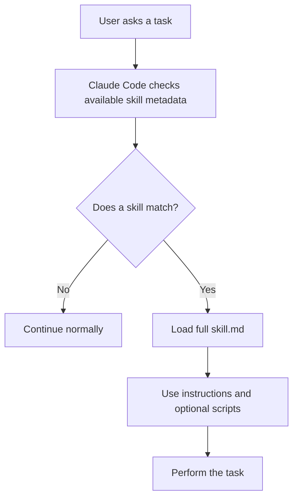
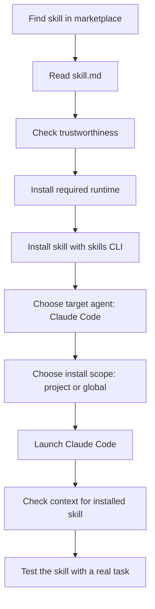
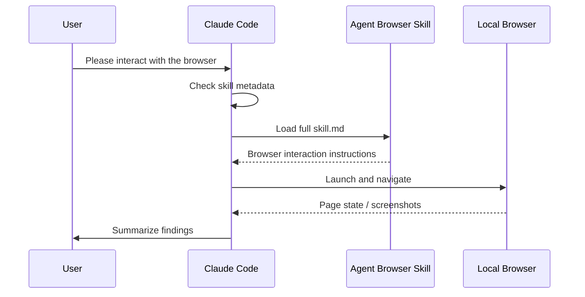

# 050 - Day 3 - Skills Marketplaces: Installing Agent Browser in Claude Code

## Lesson Information

| Item     | Details                                                                          |
| -------- | -------------------------------------------------------------------------------- |
| Lesson   | 050                                                                              |
| Duration | 13 minutes                                                                       |
| Week     | Week 2 - Claude Code & Vibe Engineering                                          |
| Module   | Week 2 Day 3 - MCP, Skills, Plugins                                              |
| Topic    | Skills marketplaces, installing Agent Browser, and validating third-party skills |

---

## Main Idea

Claude Code skills can be installed from marketplaces or GitHub repositories. Unlike MCP servers, skills are simpler because they are usually just folders, Markdown instructions, metadata, and optional scripts.

In this lesson, we install the **Agent Browser** skill, which gives Claude Code the ability to control a browser locally through tools such as Playwright or a headless browser runtime.

---

## Learning Objectives

By the end of this lesson, students should be able to:

* Understand what a Claude Code skill marketplace is.
* Browse official and community skill repositories.
* Install a skill into Claude Code.
* Explain the structure of a skill folder.
* Understand the difference between project-level and global skill installation.
* Test whether a skill is active inside Claude Code.
* Evaluate third-party skills before using them in real projects.

---

## Key Concepts

### 1. Skills Marketplace

A **skills marketplace** is a place where developers can discover and install reusable Claude Code skills.

Examples mentioned in the lesson:

* Anthropic’s official skills GitHub repository
* `skills.sh`, a skill marketplace created by Vercel

Skills are usually distributed as GitHub folders containing:

```text
skill.md
scripts/
examples/
supporting files
```

The most important file is always:

```text
skill.md
```

This file contains the skill metadata and the main instructions Claude Code will read when the skill is triggered.

---

### 2. Skill Structure

A skill is not a server. It is mostly a structured folder of instructions and optional executable assets.

Typical structure:

```text
.claude/
└── skills/
    └── agent-browser/
        └── skill.md
```

A more advanced skill may look like this:

```text
.claude/
└── skills/
    └── pptx/
        ├── skill.md
        ├── scripts/
        │   ├── rearrange.py
        │   └── html_to_pptx.js
        └── examples/
```

The `skill.md` file usually contains YAML metadata at the top:

```yaml
---
name: agent-browser
description: Use a browser to inspect, interact with, and navigate websites.
---
```

After the metadata, the rest of the file contains the actual instructions Claude Code should follow.

---

### 3. Lazy Loading of Skill Instructions

Claude Code does not load every full skill into context immediately.

Instead, it first reads a small amount of metadata, such as:

```yaml
name
description
allowed_tools
```

If the user’s request matches the skill description, Claude Code loads the full skill instructions.

This keeps the context window efficient.



---

## MCP vs Skills

| Feature      | MCP Server                                           | Skill                                                            |
| ------------ | ---------------------------------------------------- | ---------------------------------------------------------------- |
| Main purpose | Connect to external tools, APIs, databases, services | Package reusable instructions and workflows                      |
| Runtime      | Usually needs a running server                       | Usually just files and scripts                                   |
| Complexity   | Higher                                               | Lower                                                            |
| Best for     | Dynamic data, external actions, API calls            | Repeatable workflows, formatting rules, domain-specific guidance |
| Example      | GitHub MCP, database MCP, Polygon.io MCP             | PPTX skill, PDF skill, Agent Browser skill                       |
| Sharing      | Requires config and runtime setup                    | Can often be committed into the repo                             |

---

## Agent Browser Skill

The **Agent Browser** skill allows Claude Code to control a browser from your local machine.

It can:

* Open websites
* Navigate pages
* Search on websites
* Take screenshots
* Read page content visually
* Interact with web apps
* Automate browser-based tasks

This is useful when Claude Code needs to inspect or interact with a website rather than only using cloud-based web search.

---

## Installation Flow

The lesson demonstrates this general workflow:



---

## Example Installation Steps

### Step 1: Install Agent Browser Runtime

The lesson first installs the browser automation runtime.

The exact commands may vary depending on the skill documentation, but the general idea is:

```bash
npm install -g agent-browser
```

Then install Chromium if required:

```bash
npx playwright install chromium
```

Agent Browser often depends on **Playwright**, which allows code to control a browser such as Chromium.

---

### Step 2: Install the Skill

From the marketplace, copy the install command.

A typical command looks like:

```bash
npx skills add <github-skill-url>
```

The installer may ask:

```text
Which agents do you want to install it to?
```

Choose:

```text
Claude Code
```

Then it may ask:

```text
Install for this project or globally?
```

Recommended for most team projects:

```text
Project
```

This creates the skill inside the project:

```text
.claude/skills/
```

---

## Project Install vs Global Install

| Option          | Meaning                                                        | Best Used When                                     |
| --------------- | -------------------------------------------------------------- | -------------------------------------------------- |
| Project install | Skill is saved inside the current repo under `.claude/skills/` | You want the whole team to share the same skill    |
| Global install  | Skill is saved in your home directory                          | You personally want the skill available everywhere |

For real projects, **project-level installation** is often better because the skill can be committed to Git.

Example:

```bash
git add .claude/skills/agent-browser
git commit -m "Add Agent Browser Claude Code skill"
git push
```

Then teammates can pull the repo and receive the same skill.

However, they may still need to install the external runtime, such as Agent Browser or Chromium.

---

## Copy vs Symlink

During installation, the CLI may ask about the installation method.

| Method  | Meaning                                                | Recommendation                                            |
| ------- | ------------------------------------------------------ | --------------------------------------------------------- |
| Copy    | Copies the skill files directly into the target folder | Safer and simpler                                         |
| Symlink | Creates a reference to another location                | Useful for advanced users maintaining shared local skills |

If unsure, choose:

```text
Copy
```

---

## How Claude Code Detects the Skill

After installation, launch Claude Code again.

You can inspect the context and see something like:

```text
Skills:
- agent-browser
```

At first, Claude Code may only show a tiny token count for the skill because only the metadata is loaded.

The full instructions are loaded only when the task requires the skill.

---

## Testing Agent Browser

A good test prompt should explicitly ask Claude Code to use the browser.

Example:

```text
Please interact with the browser to look for restaurant experiences in NYC next week, perhaps on Resy or OpenTable.
```

The important phrase is:

```text
interact with the browser
```

This makes it more likely Claude Code will trigger the Agent Browser skill instead of using normal web search.

---

## What Happens During the Test

Claude Code may:

1. Launch a browser.
2. Navigate to a website.
3. Search for the requested information.
4. Take screenshots.
5. Ask permission to read or inspect screenshots.
6. Summarize the results.

In the lesson, Claude Code searched restaurant platforms like Resy and OpenTable, interacted with the browser, and summarized available experiences.

---

## Why This Is Powerful

Agent Browser gives Claude Code a new ability:

```text
Claude Code can now operate a real browser on your machine.
```

This means it can work with websites that require visual inspection or interaction, not just simple text search.

Examples:

* Testing a web app UI
* Checking if a login page renders correctly
* Inspecting frontend bugs
* Navigating documentation sites
* Searching marketplaces
* Interacting with dashboards
* Taking screenshots for debugging

---

## Trust and Safety Checklist

Before installing any third-party skill, check the following:

| Check            | Question                                                    |
| ---------------- | ----------------------------------------------------------- |
| Source           | Is the skill from a trusted author or organization?         |
| `skill.md`       | Does the instruction file look safe and understandable?     |
| Scripts          | Does the skill include scripts? If yes, inspect them.       |
| Permissions      | Does it request dangerous tools or broad filesystem access? |
| Network behavior | Does it call unknown external services?                     |
| Secrets          | Could it access API keys, tokens, or private files?         |
| Scope            | Can you install it only at project level first?             |
| Git review       | Can your team review it before committing?                  |

Do not blindly install skills into production projects.

---

## Practical Mental Model

Think of a skill as:

```text
A reusable instruction package that teaches Claude Code how to do a specific type of task.
```

Think of Agent Browser as:

```text
A browser-control ability that Claude Code can use when normal text search is not enough.
```

---

## Skill Loading Diagram



---

## Common Mistakes

### Mistake 1: Expecting Skills to Work Like MCP Servers

Skills are simpler. They are usually just files, instructions, and optional scripts.

They do not always provide live APIs or dynamic external data by themselves.

---

### Mistake 2: Installing Without Reading `skill.md`

The `skill.md` file tells Claude Code what the skill can do.

Always inspect it before trusting the skill.

---

### Mistake 3: Forgetting External Dependencies

Some skills are only instructions. Others require external tools.

Agent Browser may require:

```text
Node.js
Playwright
Chromium
Agent Browser runtime
```

Installing the skill folder alone may not be enough.

---

### Mistake 4: Installing Globally Too Early

For a new or untrusted skill, prefer project-level installation first.

That keeps the skill isolated to one repo.

---

## Practical Exercise

Install and test a skill safely:

1. Open a skill marketplace.
2. Choose a useful skill.
3. Read its `skill.md`.
4. Inspect any scripts it includes.
5. Install it at project level.
6. Restart Claude Code.
7. Check that the skill appears in context.
8. Ask a prompt that clearly triggers the skill.
9. Observe whether Claude Code uses the skill correctly.
10. Commit the skill only if it is useful and safe.

---

## Example Trigger Prompts

For Agent Browser:

```text
Use the browser to inspect my local web app and check whether the homepage layout is broken.
```

```text
Interact with the browser and test the signup flow on my local development site.
```

```text
Use Agent Browser to open the documentation page and summarize the installation steps.
```

For a PPTX skill:

```text
Create a PowerPoint presentation from this outline.
```

For a PDF skill:

```text
Generate a PDF report from this Markdown content.
```

---

## Key Takeaways

* Skills are simpler than MCP servers.
* A skill is usually a folder containing `skill.md` and optional scripts.
* Marketplaces such as `skills.sh` make it easier to discover reusable skills.
* Agent Browser gives Claude Code the ability to control a browser locally.
* Project-level skill installation is useful for team workflows.
* Always review third-party skills before using them in real projects.
* A skill can be shared through Git by committing the `.claude/skills/` folder.
* Some skills require extra runtime dependencies beyond the skill files.

---

## Final Summary

In this lesson, we explored how Claude Code skills can be discovered, installed, and used through skill marketplaces. Unlike MCP servers, skills are lightweight packages made from files, folders, Markdown instructions, and optional scripts.

The lesson focused on installing the **Agent Browser** skill, which allows Claude Code to control a local browser, navigate websites, take screenshots, and interact with web pages. This demonstrates how a simple skill folder inside `.claude/skills/` can significantly expand Claude Code’s practical abilities.

The most important lesson is that skills are powerful because they are simple. They can be installed, inspected, version-controlled, shared with a team, and activated only when needed.
