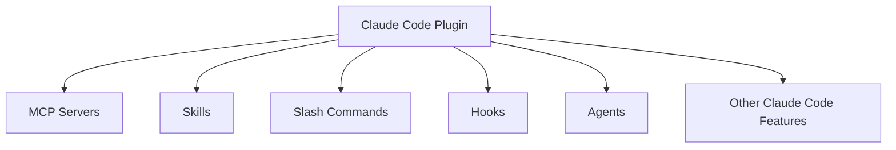
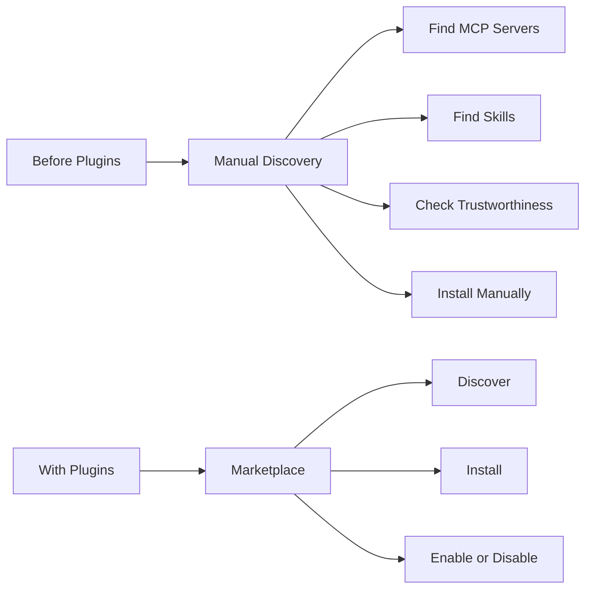
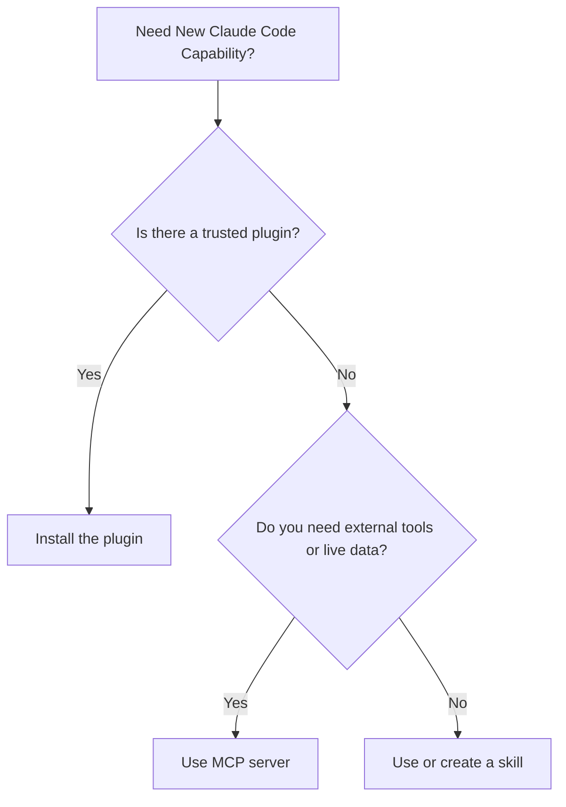
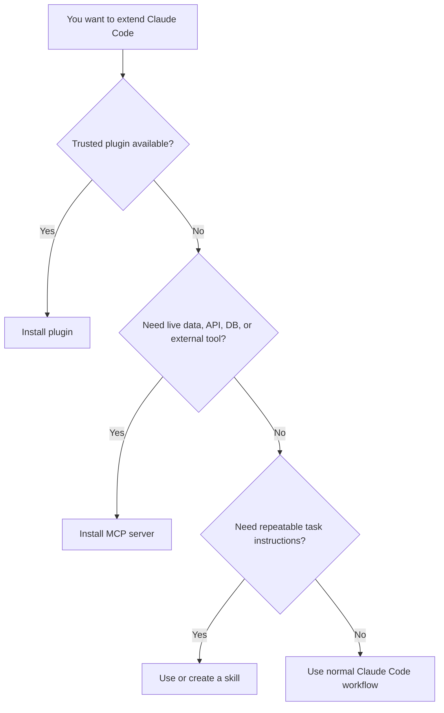
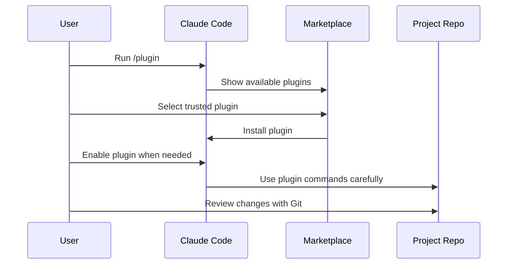

# 051 - Day 3 - Claude Code Plugins: Marketplace, Installation & Best Practices

## Lesson Information

| Item     | Details                                                         |
| -------- | --------------------------------------------------------------- |
| Lesson   | 051                                                             |
| Duration | 9 minutes                                                       |
| Week     | Week 2 - Claude Code & Vibe Engineering                         |
| Module   | Week 2 Day 3 - MCP, Skills, Plugins                             |
| Topic    | Claude Code Plugins: Marketplace, Installation & Best Practices |

---

## Main Idea

This lesson introduces **Claude Code plugins** as the highest-level extension mechanism in Claude Code.

A plugin is a packaged bundle of capabilities. It may include:

* MCP servers
* Skills
* Slash commands
* Hooks
* Agents
* Other Claude Code-specific features

Instead of asking the user to manually decide whether they need an MCP server, a skill, or a custom command, plugins package those choices into one installable unit.

The main message of the lesson is simple:

> **Start with plugins first unless you have a specific reason to install MCP servers or skills manually.**

---

## Learning Objectives

By the end of this lesson, students should be able to:

* Understand what Claude Code plugins are
* Explain how plugins differ from MCP servers and skills
* Use the Claude Code plugin marketplace
* Install and manage plugins safely
* Recognize when to use a plugin instead of manually configuring MCP or skills
* Apply plugin best practices in real coding projects

---

## 1. What Are Claude Code Plugins?

Plugins are the broadest and most packaged extension type in Claude Code.

They are not just one thing. A plugin can combine multiple kinds of functionality into a single installable package.



A plugin allows the plugin author to decide how the extension should be structured internally.

For the user, this means less configuration and less decision-making.

Instead of thinking:

> Should I install this as an MCP server?
> Should this be a skill?
> Do I need a command?
> Do I need hooks?

The user can simply install the plugin and use the capability.

---

## 2. Why Plugins Were Introduced

Plugins were introduced to make discovery and installation easier.

Before plugins, users often had to figure out:

* Where to find MCP servers
* Where to find skills
* Which source was trustworthy
* How to install each extension type
* Whether something should be installed manually or through configuration

Plugins help solve this by providing a more organized marketplace model.



Plugins make Claude Code extensibility feel more like installing an application extension from a trusted marketplace.

---

## 3. Plugins vs MCP vs Skills

Plugins sit above MCP servers and skills.

They can include both, but they are not the same thing.

| Extension Type | Main Purpose                                                        | Best For                                     |
| -------------- | ------------------------------------------------------------------- | -------------------------------------------- |
| MCP Server     | Connect Claude Code to external tools, APIs, databases, or services | Dynamic data and external actions            |
| Skill          | Package specialized instructions or task workflows                  | Repeatable reasoning or task behavior        |
| Plugin         | Bundle MCP servers, skills, commands, hooks, and more               | Simple installation of complete capabilities |

---

## 4. Why Plugins Are Often the Best Starting Point

For most everyday Claude Code users, plugins are the easiest choice.

The lesson recommends:

> **Use plugins first unless you know you need something more specific.**

Plugins reduce complexity because they hide many internal decisions from the user.

Instead of manually configuring several different pieces, the plugin provides a complete package.



---

## 5. Example: Ralph Loop as a Plugin

The lesson reminds students that they have already seen a plugin in action: **Ralph Loop**.

Ralph Loop was not just a random command. It was a plugin that included a command and other supporting behavior.

When the instructor ran the Ralph Loop command, Claude Code used the plugin to perform an autonomous coding workflow.

This demonstrates that plugins can package complex workflows behind simple commands.

---

## 6. Claude Code Plugin Marketplace

Claude Code provides a plugin interface through the command:

```bash
/plugin
```

Inside the plugin interface, there are three main sections:

| Section      | Purpose                                      |
| ------------ | -------------------------------------------- |
| Discover     | Find new plugins from available marketplaces |
| Installed    | View and manage installed plugins            |
| Marketplaces | View or add plugin marketplaces              |

The default marketplace is the official Claude plugins marketplace.

This marketplace includes plugins written by Anthropic as well as external plugins from trusted sources.

---

## 7. Plugin Marketplace Structure

The official plugin marketplace includes different categories of plugins.

Examples mentioned in the lesson include:

* Front-end design plugin
* Context7 plugin
* Code review plugin
* GitHub plugin
* GitLab plugin
* Playwright plugin
* Slack plugin
* Stripe plugin
* Supabase plugin
* Code simplifier plugin
* Ralph Loop plugin

Some plugins are written by Anthropic, while others come from external maintainers.

---

## 8. Installing Plugins

Inside the Claude Code plugin interface, users can browse available plugins and select the ones they want to install.

The lesson demonstrates selecting plugins such as:

* **Front-end Design**
  Creates distinctive, production-grade front-end interfaces.

* **Context7**
  Installs the Context7 MCP server in a simpler way.

* **Code Review**
  Provides an official Anthropic-style workflow for reviewing pull requests.

* **Code Simplifier**
  Helps simplify overly complex code, especially code generated by LLMs.

The key advantage is that the user does not need to manually configure every underlying component.

---

## 9. Installing Additional Marketplaces

Claude Code also allows users to add more plugin marketplaces.

This can be useful for:

* Internal company plugins
* Team-specific plugins
* Private GitHub-based plugin repositories
* Trusted third-party marketplaces

However, the lesson strongly warns that adding marketplaces should be done carefully.

A marketplace gives access to installable plugin packages, so the source must be trusted.

---

## 10. Best Practices for Plugin Safety

Plugins can be powerful because they may include commands, MCP servers, hooks, or agents.

That power also creates risk.

Use these best practices:

### 1. Prefer Official or Trusted Marketplaces

Use the official marketplace first.

Only add external marketplaces when you trust the source.

### 2. Do Not Install Unknown Plugins into Important Repositories

Avoid installing plugins from unclear sources into:

* Production repositories
* Client projects
* Company codebases
* Repositories with secrets
* Repositories with sensitive data

### 3. Review What the Plugin Does

Before installing a plugin, check:

* Who maintains it
* What capabilities it adds
* Whether it connects to external services
* Whether it adds commands or hooks
* Whether it requires authentication
* Whether it modifies files automatically

### 4. Enable Only What You Need

Plugins can often be enabled or disabled.

Keep your active plugin set small and intentional.

### 5. Use Git and Checkpoints

Before testing a powerful plugin, make sure your project is protected with:

* Git commits
* Clean working tree
* Backups when needed
* Claude Code checkpoints

---

## 11. Plugin Pros and Cons

### Pros

| Benefit                | Explanation                                                             |
| ---------------------- | ----------------------------------------------------------------------- |
| Simple installation    | Install one plugin instead of configuring multiple parts                |
| Better discovery       | Marketplaces make plugins easier to find                                |
| Clearer usage          | Commands can be explicitly triggered                                    |
| Good packaging         | Plugin authors decide how MCP, skills, commands, and hooks fit together |
| Easier team sharing    | Teams can create internal marketplaces                                  |
| Enable/disable control | Plugins can be managed depending on the project                         |

### Cons

| Limitation             | Explanation                                                |
| ---------------------- | ---------------------------------------------------------- |
| Claude Code-specific   | Plugins are designed for Claude Code, not general AI tools |
| Less configurable      | Users may have less control over individual components     |
| Broad installation     | A plugin may bring in more capabilities than needed        |
| Trust risk             | Unknown plugins may be unsafe                              |
| Marketplace dependency | Discovery depends on available marketplaces                |

---

## 12. Recommended Decision Framework

Use this simple rule:



The practical recommendation:

> **Start with plugins. Move to MCP servers or skills only when you need more control.**

---

## 13. Practical Workflow

A safe plugin workflow looks like this:



---

## 14. Key Takeaways

* Plugins are the highest-level extension mechanism in Claude Code.
* A plugin can bundle MCP servers, skills, commands, hooks, agents, and other features.
* Plugins make discovery and installation easier through marketplaces.
* Claude Code includes an official plugin marketplace by default.
* You can add custom marketplaces, but only from trusted sources.
* Plugins are usually the best starting point for everyday use.
* MCP servers are better when you specifically need external APIs, databases, or live data.
* Skills are better when you want reusable task-specific instructions.
* Do not install unknown plugins into important repositories.
* Always protect real projects with Git, checkpoints, and careful review.

---

## Final Summary

Claude Code plugins simplify the extension ecosystem by packaging multiple capabilities into one installable unit. Instead of manually deciding whether to use MCP servers, skills, commands, or hooks, users can often install a trusted plugin and start working immediately.

The plugin marketplace makes discovery easier, and the `/plugin` command provides a simple way to browse, install, enable, and disable plugins.

The safest approach is to start with official or trusted plugins, avoid unknown sources, and never install untrusted plugins into important repositories. For most everyday Claude Code workflows, plugins should be the first option. Use MCP servers or skills only when you need more specific control.
