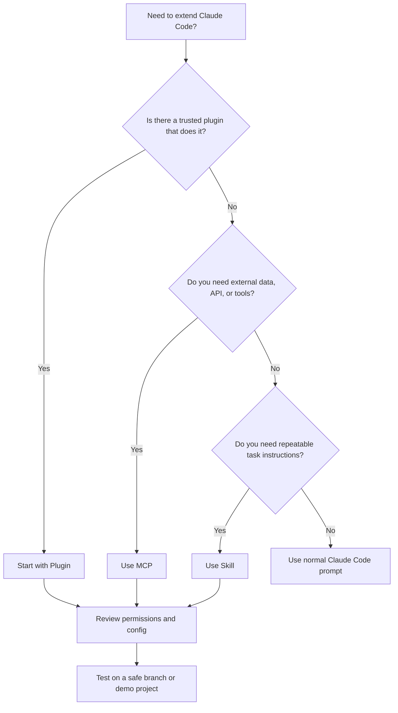
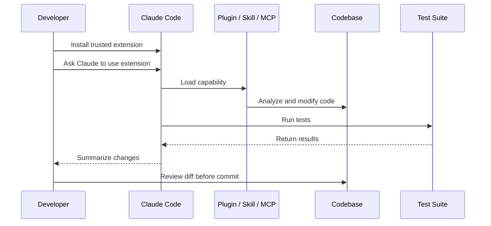

# 052 - Day 3 - MCP vs Skills vs Plugins: Choosing the Right Claude Code Setup

## Lesson Information

| Item     | Details                                 |
| -------- | --------------------------------------- |
| Lesson   | 052                                     |
| Duration | 9 minutes                               |
| Week     | Week 2 - Claude Code & Vibe Engineering |
| Module   | Week 2 Day 3 - MCP, Skills, Plugins     |
| Topic    | Choosing the right Claude Code setup    |

---

## Main Idea

This lesson explains how to choose between **MCP servers**, **Skills**, and **Plugins** when extending Claude Code.

The core rule is simple:

* Use **MCP** when you need to connect Claude Code to external tools, APIs, databases, or live data.
* Use **Skills** when you want to package specialized instructions, workflows, or scripts for a repeatable task.
* Use **Plugins** when you want a convenient bundle that can include MCP servers, Skills, agents, commands, hooks, and other workflow extensions.

The lesson also emphasizes security: always review what a setup installs, limit permissions, and avoid overloading Claude Code with unnecessary extensions.

---

## Learning Objectives

By the end of this lesson, students should be able to:

* Understand the practical differences between MCP, Skills, and Plugins.
* Choose the right Claude Code setup for different coding-agent workflows.
* Recognize when a plugin is the easiest starting point.
* Understand why Skills are useful for team-shared workflows.
* Understand why MCP is useful for specialized external integrations.
* Apply basic safety practices when installing plugins, skills, or MCP servers.

---

## Core Concepts

### 1. MCP: External Tools and Live Data

**MCP**, or Model Context Protocol, is used when Claude Code needs to connect to external tools or data sources.

Examples include:

* Documentation sources
* APIs
* Databases
* Market data providers
* GitHub
* Jira
* Internal tools
* Search or retrieval systems

MCP gives Claude Code access to external capabilities, but it can also consume a lot of context and may require more careful setup.

#### Best Use Cases

Use MCP when:

* You need live or dynamic data.
* You need Claude Code to call an external API.
* You need precise tool integration.
* You want fine-grained control over what tools are available.

#### Pros

| Advantage             | Explanation                                             |
| --------------------- | ------------------------------------------------------- |
| Very flexible         | Can connect to many types of tools and data sources     |
| Large ecosystem       | Many MCP servers exist or can be created                |
| Powerful integrations | Useful for APIs, docs, databases, and external services |

#### Cons

| Limitation               | Explanation                                              |
| ------------------------ | -------------------------------------------------------- |
| More complex setup       | Often requires configuration                             |
| Can use a lot of context | Tool descriptions and schemas may increase context usage |
| More granular            | You may need to understand the specific server and tools |

---

### 2. Skills: Packaged Expertise for Specialized Tasks

A **Skill** is a simpler way to give Claude Code specialized expertise.

A skill can include:

* Markdown instructions
* Task-specific rules
* Example workflows
* Scripts
* Supporting files

Skills are especially useful when you want Claude Code to perform a task in a consistent way.

Examples:

* Code review skill
* UI implementation skill
* Documentation writing skill
* Agent browser skill
* Test generation skill
* Project-specific coding standards skill

#### Best Use Cases

Use Skills when:

* You want repeatable task guidance.
* You want to share instructions across a team.
* You want a lightweight setup.
* You do not need live API or database access.
* You want to store the skill directly in a repository.

#### Pros

| Advantage                     | Explanation                               |
| ----------------------------- | ----------------------------------------- |
| Context-efficient             | Usually lighter than MCP servers          |
| Simple to set up              | Often just markdown plus optional scripts |
| Easy to share                 | Can be committed into a team repository   |
| Good for repeatable workflows | Helps Claude follow a consistent process  |

#### Cons

| Limitation                     | Explanation                                |
| ------------------------------ | ------------------------------------------ |
| Less flexible than MCP         | Not ideal for dynamic external tools       |
| Marketplace still evolving     | Discovery and packaging are still maturing |
| Depends on instruction quality | Weak skills can produce weak results       |

---

### 3. Plugins: Bundled Claude Code Extensions

A **Plugin** is a convenient package that can bundle multiple Claude Code capabilities together.

A plugin may include:

* MCP servers
* Skills
* Agents
* Commands
* Hooks
* Workflow tools
* Configuration files

In the lesson demo, the instructor installs multiple plugins from the Claude Code plugin marketplace. One of them includes a **Code Simplifier agent**, which is then used to simplify an entire codebase.

The plugin successfully runs, edits the project, runs tests, and the application still works afterward.

#### Best Use Cases

Use Plugins when:

* You want the easiest setup.
* A trusted plugin already exists for your use case.
* You want a bundle of useful tools, commands, and skills.
* You want marketplace discovery.
* You want to quickly add workflow extensions to Claude Code.

#### Pros

| Advantage                      | Explanation                                   |
| ------------------------------ | --------------------------------------------- |
| Easiest starting point         | Install once and get multiple capabilities    |
| Can include Skills and MCP     | Combines multiple extension types             |
| Discoverable                   | Available through marketplace-style workflows |
| Can expose commands and agents | Useful for practical coding workflows         |

#### Cons

| Limitation                   | Explanation                                          |
| ---------------------------- | ---------------------------------------------------- |
| Can become messy if overused | Too many plugins can complicate your setup           |
| Requires trust               | Plugins may modify workflow, tools, or repo behavior |
| Still maturing               | Plugin ecosystem is newer and still developing       |

---

## Demo Summary: Installing and Using a Code Simplifier Plugin

In the lesson, the instructor explores the plugin marketplace and installs several plugins.

One plugin is described as:

> An agent that simplifies and refines code for clarity, consistency, and maintainability while preserving functionality.

After installation, Claude Code is restarted so the new plugins can load.

Then the instructor checks the available context and sees:

* Context7 MCP
* Code Simplifier plugin
* Front-end Design plugin
* Code Review plugin

The instructor then asks Claude Code in natural language:

```text
Please use the code simplifier agent to simplify the entire codebase.
```

Claude Code correctly identifies the plugin agent as:

```text
code-simplifier:code-simplifier
```

It runs the simplification process across the codebase, makes many changes, runs tests, and reports what it changed.

Afterward, the instructor starts the application and confirms that it still works:

* The app builds successfully.
* The browser opens at localhost.
* The sign-in flow works.
* A Kanban board appears.
* Cards can be created.
* The AI assistant still responds.

This confirms that the plugin was successfully used to improve the codebase while preserving functionality.

---

## MCP vs Skills vs Plugins

| Category         | MCP                                        | Skills                                          | Plugins                                         |
| ---------------- | ------------------------------------------ | ----------------------------------------------- | ----------------------------------------------- |
| Main purpose     | Connect external tools and data            | Package specialized instructions and workflows  | Bundle multiple Claude Code extensions          |
| Best for         | APIs, databases, docs, market data, GitHub | Repeatable tasks, team workflows, project rules | Easy installation and combined capabilities     |
| Setup complexity | Medium to high                             | Low                                             | Low                                             |
| Context usage    | Can be high                                | Usually efficient                               | Depends on what is bundled                      |
| Flexibility      | Very high                                  | Medium                                          | High                                            |
| Team sharing     | Possible, but config-heavy                 | Very easy                                       | Easy if plugin is trusted                       |
| Example          | Polygon.io MCP, Context7 MCP               | Agent browser skill, code review skill          | Code simplifier plugin, front-end design plugin |

---

## Decision Diagram



---

## Recommended Rule of Thumb

The lesson gives a practical recommendation:

> Start with plugins when a good trusted plugin already exists.

Plugins are often the easiest option because they can bundle everything you need in one install.

However, use MCP directly when you need a specific specialized integration.

Use Skills directly when you want to package and share task-specific expertise across your team or organization.

---

## When to Use Each Setup

### Start with Plugins When

Use a plugin when:

* You want the fastest setup.
* The plugin is trusted.
* It already includes the tools, agents, or skills you need.
* You want a simple install process.
* You are working with common workflows such as code review, code simplification, or front-end design.

Example:

```text
Install a code simplifier plugin and ask Claude Code to simplify the codebase.
```

---

### Use MCP When

Use MCP when:

* You need Claude Code to access external data.
* You need API calls.
* You want precise control over tool integration.
* You need a specialized server such as market data, documentation, or GitHub.

Example:

```text
Use a Polygon.io MCP server to access market data.
```

Another example:

```text
Use Context7 MCP to access technical documentation.
```

---

### Use Skills When

Use Skills when:

* You want Claude Code to follow a specific workflow.
* You want to encode team rules.
* You want reusable instructions in markdown.
* You want to share the workflow inside a repository.
* You do not need live external API access.

Example:

```text
Create a skill that teaches Claude Code how to review pull requests according to your team's coding standards.
```

---

## Safety Checklist

Before installing or using MCP servers, Skills, or Plugins, review the following:

* Check the source of the plugin, skill, or MCP server.
* Prefer official or trusted marketplace entries.
* Avoid installing unknown plugins into important production repositories.
* Review what permissions the setup requires.
* Check what files or commands it can access.
* Use Git before running large automated changes.
* Run the plugin on a safe branch.
* Review diffs before committing.
* Run tests after the agent modifies code.
* Remove unused plugins, skills, or MCP servers to keep the environment clean.

---

## Practical Workflow

A safe Claude Code extension workflow looks like this:



---

## Key Takeaways

* **MCP** is best for connecting Claude Code to external tools, APIs, databases, and live data.
* **Skills** are best for packaging reusable expertise, instructions, and repeatable workflows.
* **Plugins** are best when you want a convenient bundle that may include MCP, Skills, agents, commands, and hooks.
* The easiest starting point is usually a trusted plugin.
* Use MCP directly when you need specialized external integrations.
* Use Skills directly when you want to share repeatable workflows across a team.
* Do not overuse plugins because too many extensions can make the environment harder to understand.
* Always review permissions, configuration, and code changes before trusting automated modifications.

---

## Practice Task

Try this workflow in a safe demo project:

1. Open Claude Code.
2. Search for a trusted plugin.
3. Install a plugin related to code review or simplification.
4. Restart Claude Code.
5. Use `/context` to confirm the plugin loaded.
6. Ask Claude Code to use the plugin on a small part of the codebase.
7. Review the changes.
8. Run tests.
9. Commit only if the changes are correct.

---

## Final Summary

This lesson completes the overview of the three major Claude Code extension approaches: **MCP**, **Skills**, and **Plugins**.

The main decision rule is:

```text
Plugin first, MCP for external tools, Skill for reusable expertise.
```

Plugins are the easiest starting point because they can bundle many capabilities together. MCP is the right choice when Claude Code needs external data or APIs. Skills are ideal when you want reusable, team-shareable workflows written as instructions and scripts.

A professional Claude Code workflow is not only about installing powerful tools. It is also about choosing the right setup, limiting risk, reviewing configuration, and testing every major automated change.

---

# Bài luyện tập

## Mục tiêu


## Đề bài


## Yêu cầu hoàn thành

- [ ] 
- [ ] 
- [ ] 

## Kết quả / lời giải


## Ghi chú
