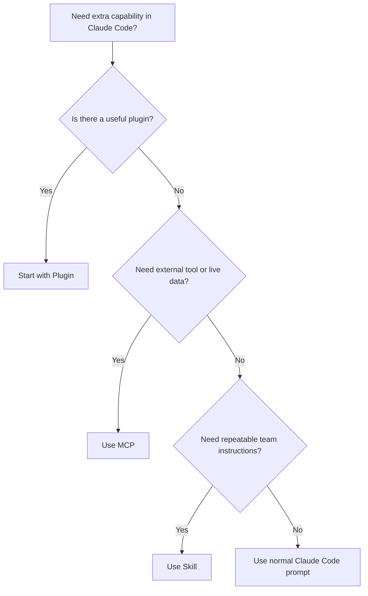
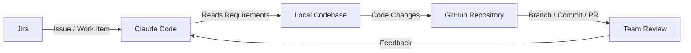
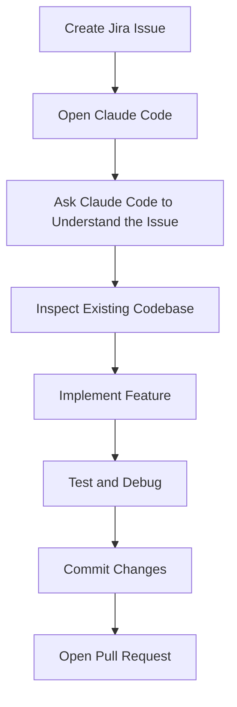
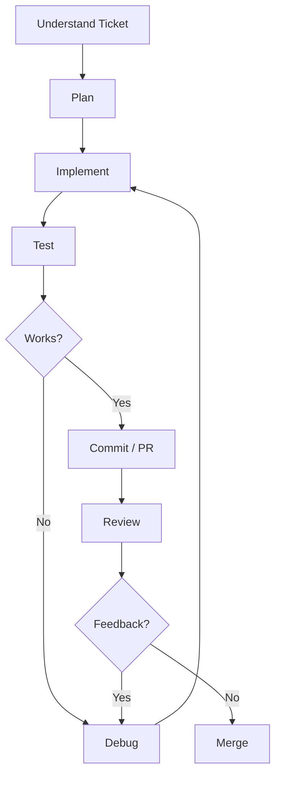

# 053 - Day 4 - Building with Claude Code, Jira, MCP & Plugins Workflow

## Lesson Information

| Item       | Details                                                                                                        |
| ---------- | -------------------------------------------------------------------------------------------------------------- |
| Lesson     | 053                                                                                                            |
| Duration   | 11 min                                                                                                         |
| Week       | Week 2 - Claude Code & Vibe Engineering                                                                        |
| Module     | Week 2 Day 4 - Jira, GitHub, Professional Workflow                                                             |
| Main Topic | Building a professional software development workflow with Claude Code, Jira, GitHub, MCP, Skills, and Plugins |

---

## Lesson Overview

In this lesson, we move from theory into practice.

After learning about **MCP**, **Skills**, and **Plugins**, the focus now shifts to building a real-world development workflow. The goal is to understand how these tools can work together in a professional software team environment.

The workflow starts from a business task or requirement, turns it into a **Jira issue**, connects it with a **GitHub repository**, and then uses **Claude Code** to help understand the task, modify the codebase, debug issues, and potentially prepare a pull request.

This lesson introduces the beginning of a two-day project where learners can either follow the instructor’s example or apply the same workflow to their own idea.

---

## Core Idea

Modern AI coding is not only about asking an assistant to write code.

A stronger workflow connects AI coding tools to the full software development lifecycle:


Claude Code becomes more powerful when it is connected to real project systems such as Jira, GitHub, documentation, internal tools, and team workflows.

---

## Recap: MCP, Skills, and Plugins

Before starting the workflow, the lesson recaps the three major ways to extend Claude Code.

### 1. MCP

**MCP** stands for **Model Context Protocol**. It is a standard created by Anthropic for connecting Claude Code to external tools, services, and data sources.

MCP is useful when Claude Code needs to interact with systems such as:

* Jira
* GitHub
* Databases
* Documentation systems
* APIs
* Internal company tools

### Pros of MCP

* Very powerful
* Large and growing ecosystem
* Good for real integrations
* Stronger support for authorization and authentication

### Cons of MCP

* Can be more complex to set up
* Can consume context
* Some MCP servers may be harder to work with
* Too many tools can confuse the model

---

### 2. Skills

**Skills** are a lightweight way to give Claude Code specialized knowledge or repeatable procedures.

A skill can include:

* Markdown instructions
* Commands
* Scripts
* Domain-specific guidance
* Team conventions

Skills are especially useful when a team wants Claude Code to follow the same workflow or coding standards.

### Pros of Skills

* Simple
* Context-friendly
* Easy to share with a team
* Can be committed into a repository
* Good for repeatable workflows

### Cons of Skills

* Less powerful than MCP
* Not as flexible for external tool integrations
* Still relatively immature compared to larger integration systems

---

### 3. Plugins

**Plugins** are packages that can combine MCP servers, Skills, commands, agents, or other Claude Code extensions.

They are convenient because they allow users to install multiple capabilities at once.

### Pros of Plugins

* Easy to install
* Can combine multiple capabilities
* Good starting point for common workflows
* Useful for quick setup

### Cons of Plugins

* Currently specific to Claude Code
* Installing too many can reduce performance
* Too many options may confuse the model
* Plugins should be chosen carefully

---

## Choosing Between MCP, Skills, and Plugins

The lesson suggests a practical approach:



### Recommended Decision Guide

| Need                                                         | Best Option               |
| ------------------------------------------------------------ | ------------------------- |
| Connect to Jira, GitHub, APIs, databases, or live systems    | MCP                       |
| Share coding conventions or repeatable workflows with a team | Skills                    |
| Install a ready-made package of tools and workflows          | Plugins                   |
| Keep things simple for a small task                          | Normal Claude Code prompt |

---

## Professional Workflow Mindset

This lesson emphasizes that AI coding should be treated as part of a disciplined software process.

Instead of randomly asking Claude Code to build features, a stronger workflow starts with structured work items.

In professional teams, those work items often begin as:

* Jira issues
* GitHub issues
* Product tickets
* Bug reports
* Feature requests
* Technical tasks

The instructor chooses **Jira** as the starting point because it is widely used in software teams.

---

## Why Start with Jira?

Jira is commonly used to manage software development work.

A Jira issue can represent:

* A feature
* A bug
* A task
* A user story
* A technical improvement
* A research spike

Using Jira gives Claude Code a clear starting point.

Instead of saying:

> Build something for my app.

A better workflow gives Claude Code a structured issue:

> Implement PL-1: Create a simple website that describes the Pre-Legal company.

This makes the work more traceable, reviewable, and team-friendly.

---

## Jira and GitHub in the Workflow

Jira manages the work.

GitHub manages the code.

Claude Code connects the two.



This creates a complete loop:

1. Jira defines what needs to be done.
2. Claude Code reads and interprets the task.
3. Claude Code modifies the codebase.
4. GitHub stores the changes.
5. A pull request allows the team to review the work.
6. Feedback can be sent back into Claude Code for iteration.

---

## The Demo Project: Pre-Legal

The instructor introduces a sample product called **Pre-Legal**.

### Product Idea

Pre-Legal is a product that helps users or companies draft legal documents based on a repository of templates.

Examples of documents it could help create:

* NDA
* Client contract
* Engagement letter
* Service agreement
* Internal legal draft
* Template-based business document

The product is not intended to replace a lawyer. Instead, it helps with the early preparation work before a lawyer, attorney, or paralegal reviews the document.

### Why This Is a Good AI Project

Pre-Legal is a suitable project for an AI coding workflow because it involves:

* Business requirements
* Document generation
* Templates
* User-facing functionality
* Potential use of generative AI
* Real-world monetization potential
* Clear feature tickets

---

## Setting Up Jira

The instructor signs up for a free Jira plan.

Jira is free for small teams, making it useful for experiments and personal projects.

### Setup Steps

1. Go to Atlassian Jira.
2. Create a free Jira account.
3. Create a new Jira space.
4. Choose a software development space.
5. Select a Kanban workflow.
6. Name the space **Pre-Legal**.
7. Set the key as **PL**.
8. Use a team-managed space.
9. Keep access open for the site.
10. Create the first work item.

---

## Jira Space vs Project

The lesson notes that Jira has changed some naming.

What used to commonly be called a **project** may now appear as a **space** in the interface.

This can be confusing because Jira may also have another area called **Projects**, but the important idea is simple:

A Jira space is where the team’s work items, board, and workflow live.

---

## Kanban Board

The instructor creates a Kanban board for the Pre-Legal project.

A Kanban board is useful because it gives a visual workflow for software tasks.

Typical columns may include:


This allows a team to track where each task is in the development process.

---

## First Jira Issue

The first Jira issue created is:

> We need a simple website that describes the Pre-Legal company.

Jira assigns it the key:

> PL-1

This becomes the first structured task for the project.

### Example Issue

| Field           | Example                                                      |
| --------------- | ------------------------------------------------------------ |
| Key             | PL-1                                                         |
| Type            | Task                                                         |
| Title           | Create a simple website that describes the Pre-Legal company |
| Project / Space | Pre-Legal                                                    |
| Workflow        | Kanban                                                       |
| Status          | To Do                                                        |

---

## Why the First Issue Matters

This first issue is intentionally simple.

The point is not to build a complex product immediately. The point is to establish a professional workflow:



By starting small, learners can focus on the workflow instead of being overwhelmed by product complexity.

---

## Choose-Your-Own-Adventure Approach

The instructor emphasizes that learners do not have to copy the exact project.

There are three possible ways to follow along:

### Option 1: Follow the Instructor Exactly

Build the same **Pre-Legal** project and follow the same workflow.

### Option 2: Use the Same Workflow With a Different Idea

Use Jira, Claude Code, GitHub, MCP, Skills, and Plugins, but build your own product.

### Option 3: Mix Both

Use the instructor’s general idea but customize it in your own direction.

This reflects the reality of AI coding tools: there is not always one fixed recipe. The workflow is more important than the exact project.

---

## Key Concepts

### Concept 1: AI Coding Needs Structure

Claude Code is powerful, but it works better when given structured input.

A Jira issue provides:

* Clear task definition
* Traceability
* Priority
* Status
* Team visibility
* Historical record

This helps Claude Code operate inside a professional development process.

---

### Concept 2: Tools Should Support the Workflow

MCP, Skills, and Plugins are not the goal by themselves.

They are useful only when they improve the development workflow.

A good workflow chooses tools based on the problem:

* Use Jira for task management.
* Use GitHub for source control.
* Use Claude Code for implementation.
* Use MCP for external integrations.
* Use Skills for repeatable team standards.
* Use Plugins for packaged capabilities.

---

### Concept 3: Professional AI Coding Is Iterative

The workflow is not:

```text
Prompt once → Get perfect code
```

A more realistic workflow is:



Claude Code is part of the loop, not a replacement for the full engineering process.

---

## Why This Lesson Is Important

This lesson is important because it shifts the course from individual tool usage to professional workflow design.

Earlier lessons introduced:

* MCP
* Skills
* Plugins
* Claude Code workflows
* Autonomous coding patterns

This lesson connects those pieces into a real software development lifecycle.

By the end of the lesson, learners understand how an AI coding agent can fit into a team workflow involving tickets, repositories, debugging, review, and delivery.

---

## Practical Takeaways

After this lesson, learners should be able to:

* Explain how Jira, GitHub, Claude Code, MCP, Skills, and Plugins fit together.
* Create a Jira space for a software project.
* Create a simple Jira issue as the starting point for AI-assisted development.
* Understand when to use Jira versus GitHub Issues.
* Use structured tickets to guide Claude Code.
* Think about AI coding as a professional engineering workflow, not just a prompt-writing exercise.
* Choose the right extension method: MCP, Skill, or Plugin.
* Prepare for a multi-day project using Claude Code and connected development tools.

---

## Suggested Practice

Create your own small project workflow.

### Step 1: Pick a Product Idea

Examples:

* AI note-taking app
* Legal document assistant
* Study planner
* Fitness tracker
* Personal finance dashboard
* AI résumé reviewer

### Step 2: Create a Jira Space or GitHub Issue

Create one simple issue such as:

```text
Create a landing page that explains what the product does.
```

### Step 3: Use Claude Code

Ask Claude Code to:

* Read the issue
* Inspect the codebase
* Propose an implementation plan
* Make the required changes
* Run tests
* Prepare a commit or pull request

### Step 4: Review the Output

Check whether the result matches the ticket.

Do not blindly accept the output. Review it like a real software engineer.

---

## Example Prompt for Claude Code

```text
Read Jira issue PL-1 and inspect the current repository.

Create a simple landing page for the Pre-Legal product.

The page should explain:
- What Pre-Legal does
- Who it is for
- Why it is not a replacement for a lawyer
- How users can generate draft legal documents from templates

Before editing code, summarize your plan.
After editing, run the relevant checks and explain what changed.
```

---

## Summary

Lesson 053 introduces a professional workflow for building software with Claude Code, Jira, GitHub, MCP, Skills, and Plugins.

The main idea is that AI coding works best when it is connected to real software engineering systems. Jira provides structured work items, GitHub manages code and pull requests, Claude Code helps implement and debug features, and MCP or Plugins connect Claude Code to external tools.

The instructor begins a sample project called **Pre-Legal**, a legal document preparation assistant. The first task is created in Jira as **PL-1**, asking for a simple website that describes the company.

This lesson prepares learners for the following project work by showing how to move from isolated AI coding experiments into a disciplined, team-ready development workflow.
