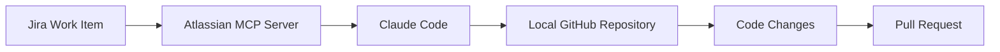
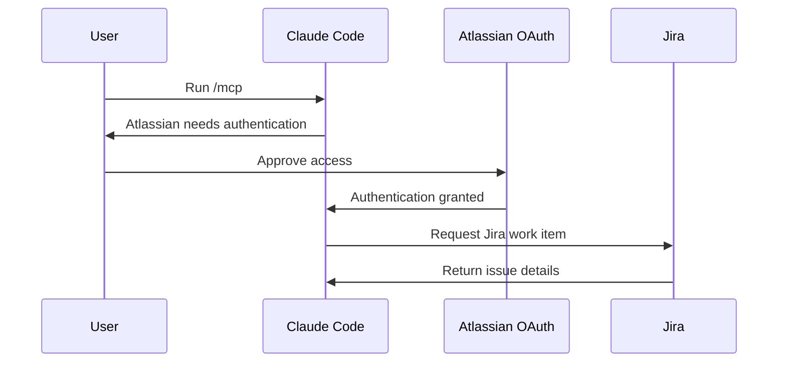
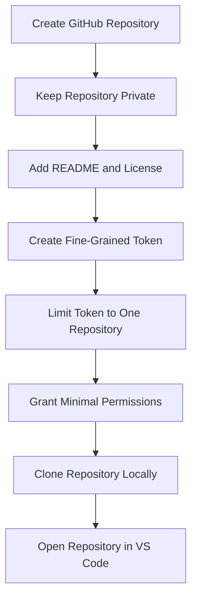
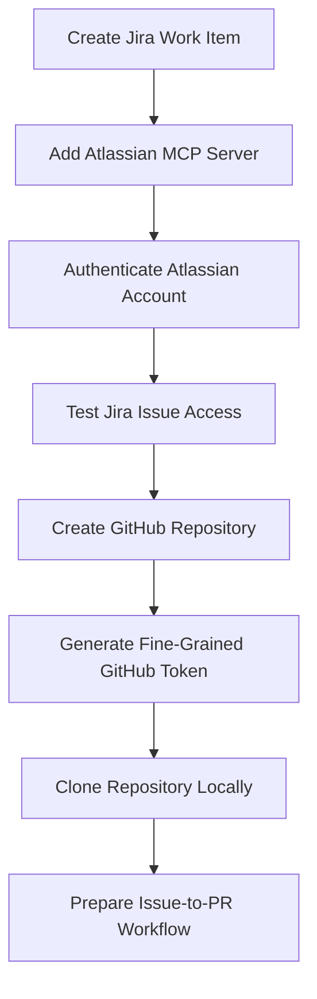

# 054 - Day 4 - Connecting Claude Code to Jira MCP Server & GitHub Repository

## Lesson Information

| Item     | Details                                            |
| -------- | -------------------------------------------------- |
| Lesson   | 054                                                |
| Duration | 10 min                                             |
| Week     | Week 2 - Claude Code & Vibe Engineering            |
| Module   | Week 2 Day 4 - Jira, GitHub, Professional Workflow |

---

## Main Topic

This lesson shows how to connect **Claude Code** to both **Jira** and a **GitHub repository**.

The main goal is to prepare a professional workflow where Claude Code can:

* Read Jira work items through the Atlassian MCP server
* Access a GitHub repository
* Understand project requirements from Jira
* Work with repository files
* Prepare for an issue-to-PR development workflow

---

## Learning Objectives

After this lesson, learners will be able to:

* Add the Atlassian Jira MCP server to Claude Code
* Authenticate Claude Code with an Atlassian account
* Verify that Claude Code can read Jira work items
* Create a GitHub repository for a project
* Generate a fine-grained GitHub personal access token
* Clone the repository locally
* Prepare a safe Jira-to-GitHub workflow for AI-assisted development

---

## Workflow Overview



Claude Code acts as the bridge between project management and code implementation.

Jira provides the task context.
GitHub provides the codebase.
Claude Code uses both to help move from issue to implementation.

---

## Key Concept 1: Jira MCP Server

The first major step is connecting Claude Code to Jira through the **Atlassian MCP server**.

MCP allows Claude Code to access external tools and data sources in a structured way. In this lesson, the external system is Jira.

The Atlassian MCP server makes it possible for Claude Code to:

* Connect to an Atlassian account
* Read Jira work items
* Access project details
* Use Jira as part of the coding workflow

Example command shown in the lesson:

```bash
claude mcp add --transport http atlassian https://mcp.atlassian.com/v1/mcp
```

After adding the server, Claude Code can be started and checked with:

```bash
/mcp
```

This command shows installed MCP servers and their authentication status.

---

## Key Concept 2: Authentication with Atlassian

After the Atlassian MCP server is added, Claude Code still needs permission to access the user’s Jira account.

The lesson demonstrates an OAuth-style authentication flow.



Once authenticated, Claude Code can use Jira tools through the MCP server.

A common troubleshooting point is that authentication may sometimes expire or appear to be lost. If Claude Code hangs while trying to use Jira tools, the user may need to run:

```bash
/mcp
```

Then select the Atlassian server and choose the re-authentication option.

---

## Key Concept 3: Verifying Jira Access

After authentication, the lesson tests whether Claude Code can read a Jira work item.

Example prompt:

```text
Please tell me about Jira issue PL-1.
```

Claude Code asks for permission to use the Atlassian MCP tools. Once approved, it retrieves the Jira work item.

In the demo, the issue contains a task similar to:

```text
We need a simple website that describes the Pre Legal company.
```

This confirms that Claude Code can successfully access Jira through the MCP server.

---

## Connecting GitHub

After connecting Jira, the next step is connecting Claude Code to GitHub.

The lesson creates a new GitHub repository named:

```text
pre-legal
```

Repository description:

```text
A platform for drafting common legal agreements.
```

The repository is created as private, with a README and an MIT license.

---

## GitHub Repository Setup Flow



---

## Fine-Grained GitHub Token

To allow Claude Code to work with GitHub safely, the lesson uses a **fine-grained personal access token**.

This is important because it gives more control than a broad classic token.

Recommended setup from the lesson:

| Setting             | Recommended Value                  |
| ------------------- | ---------------------------------- |
| Token type          | Fine-grained personal access token |
| Repository access   | Only selected repositories         |
| Selected repository | `pre-legal`                        |
| Expiration          | 30 days                            |
| Contents            | Read-only                          |
| Issues              | Read-only or read/write if needed  |
| Pull requests       | Read and write                     |

The key idea is to start with the smallest permissions possible and only expand access when necessary.

---

## Security Best Practices

When creating the GitHub token, the lesson emphasizes several important security practices:

* Do not give Claude Code access to all repositories unless necessary.
* Limit the token to one repository when possible.
* Use an expiration date, such as 30 days.
* Start with minimal permissions.
* Expand permissions only when the workflow requires it.
* Copy the token immediately after creation.
* Store the token safely.
* Do not paste the token into rich text editors that may modify characters.

A safe token setup reduces risk while still allowing Claude Code to interact with the project repository.

---

## Cloning the GitHub Repository

After creating the repository and token, the next step is cloning the repository locally.

The lesson uses the GitHub repository URL and runs:

```bash
git clone <repository-url>
cd pre-legal
ls
```

Expected files:

```text
LICENSE
README.md
```

This confirms that the local repository is ready.

---

## Full Lesson Workflow



---

## Practical Example

The project used in the lesson is called:

```text
Pre Legal
```

The Jira work item asks for a simple company website.
The GitHub repository will hold the project code.
Claude Code can now use both Jira and GitHub as part of the same workflow.

This creates the foundation for a professional AI coding process:

```text
Jira issue → Claude Code understands the task → Claude edits code → GitHub PR
```

---

## Why This Lesson Matters

This lesson is important because it moves Claude Code from a simple coding assistant into a more professional engineering workflow.

Real software teams often work with:

* Jira for task management
* GitHub for repositories and pull requests
* OAuth or token-based access control
* Permission-limited integrations
* Issue-driven development

By connecting Claude Code to Jira and GitHub, learners begin building a workflow that resembles how real engineering teams operate.

This also prepares learners for later lessons where Claude Code can read tasks, modify code, and help create pull requests.

---

## Common Problems and Fixes

| Problem                           | Possible Cause                           | Fix                                   |
| --------------------------------- | ---------------------------------------- | ------------------------------------- |
| Claude Code cannot use Jira tools | Atlassian authentication missing         | Run `/mcp` and authenticate           |
| Claude Code hangs when using Jira | Authentication may have expired          | Re-authenticate through `/mcp`        |
| GitHub access does not work       | Token permissions are too limited        | Review fine-grained token permissions |
| Repository cannot be cloned       | Wrong GitHub URL or authentication issue | Copy the HTTPS clone URL again        |
| Claude has too much access        | Token scope is too broad                 | Restrict token to one repository      |

---

## Summary

In this lesson, learners connect Claude Code to two important professional development tools: Jira and GitHub.

First, they add the Atlassian MCP server and authenticate their Atlassian account so Claude Code can read Jira work items. Then they create a GitHub repository, generate a fine-grained personal access token, and clone the repository locally.

By the end of the lesson, the foundation is ready for an issue-to-PR workflow, where Claude Code can understand a Jira task, work inside a GitHub repository, and help implement changes in a controlled and secure development environment.

---

# Bài luyện tập

## Mục tiêu


## Đề bài


## Yêu cầu hoàn thành

- [ ] 
- [ ] 
- [ ] 

## Kết quả / lời giải


## Ghi chú
