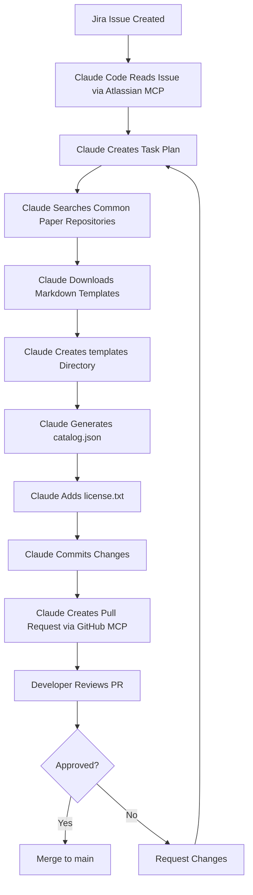
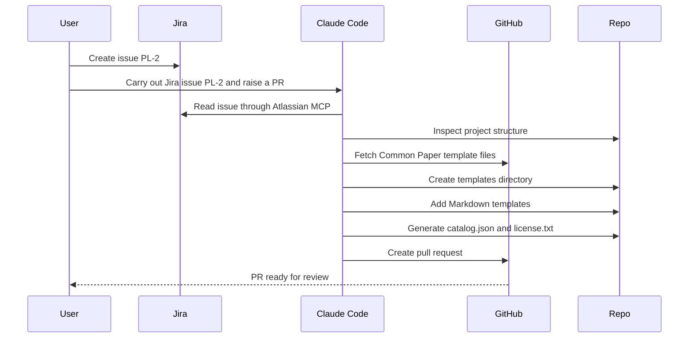
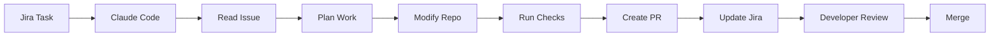

# 056 - Day 4 - Claude Code Autonomy: From Jira Issue to PR via MCP Server

## Lesson Information

| Item     | Details                                            |
| -------- | -------------------------------------------------- |
| Lesson   | 056                                                |
| Duration | 11 min                                             |
| Week     | Week 2 - Claude Code & Vibe Engineering            |
| Module   | Week 2 Day 4 - Jira, GitHub, Professional Workflow |

---

## Main Topic

This lesson demonstrates a complete **issue-to-PR workflow** using Claude Code, Jira, GitHub, and MCP servers.

Claude Code reads a Jira issue, understands the task, creates an implementation plan, collects the required data, modifies the repository, creates a pull request, updates the Jira issue, and attempts to merge the work.

The key idea is not just automation, but **agent autonomy**: Claude Code can adapt when the first approach fails and find another valid way to complete the task.

---

## Learning Objectives

After this lesson, students will be able to:

* Understand how Claude Code can work from a Jira issue to a GitHub pull request.
* Connect Claude Code to Jira through the Atlassian MCP server.
* Understand how MCP servers allow Claude Code to access external systems.
* Observe how Claude Code handles roadblocks and changes strategy.
* Recognize why human review is still required before merging AI-generated changes.
* Apply an issue-to-PR workflow in a real software project.

---

## Scenario Overview

In this demo, a new Jira task is created for a project called **pre-legal**.

The task asks Claude Code to create a dataset of legal document templates. These templates are sourced from the **Common Paper GitHub repositories**, which provide legal agreement templates such as mutual NDAs in Markdown format.

The expected output is:

* A `templates/` directory containing Markdown legal templates.
* A `catalog.json` file describing the available templates.
* A `license.txt` file acknowledging the Creative Commons license.
* A pull request containing all changes.

---

## Workflow Diagram



---

## Key Concepts

### 1. Jira Issue as the Source of Work

The workflow begins in Jira with a human-readable issue.

The issue does not contain exact implementation steps. Instead, it describes the desired outcome:

> Create a dataset of legal document templates that the system can later modify for the user.

This is important because real product work is often written at a high level. Claude Code must interpret the goal, inspect the repository, and decide how to execute the task.

---

### 2. MCP Server Integration

Claude Code needs access to external systems such as Jira and GitHub.

In this lesson, the Atlassian MCP server is added to Claude Code so Claude can read and update Jira issues.

Example setup flow:

```bash
claude mcp add atlassian
```

Then inside Claude Code:

```bash
/mcp
```

From there, the Atlassian MCP server can be selected and re-authenticated.

MCP acts as the bridge between Claude Code and external tools.

---

### 3. Agent Autonomy

The most important concept in this lesson is **autonomy**.

Claude Code is not only following fixed instructions. It can:

* Read the Jira issue.
* Understand what needs to be done.
* Choose tools.
* Fetch data from GitHub.
* Create files.
* Generate metadata.
* Open a pull request.
* Detect failure.
* Try another approach.

In the demo, Claude initially tries to retrieve files using GitHub tools. Later, it realizes that this approach is inefficient because the files are too long and would consume too much context.

Instead of stopping, Claude switches strategy and downloads the files directly using shell commands.

That is the core example of autonomy.

---

## Step-by-Step Breakdown

### Step 1: Create a Jira Issue

A Jira issue is created with the key:

```text
PL-2
```

The task description explains that this is a one-time data curation task for the pre-legal project.

The issue asks Claude Code to:

1. Browse the Common Paper GitHub repositories.
2. Pull down legal document Markdown files.
3. Place them inside a `templates/` directory.
4. Create a `catalog.json` file describing the templates.
5. Add a license file recognizing the Creative Commons license.

---

### Step 2: Connect Claude Code to Jira

Because the Atlassian MCP server was installed only for another project earlier, it needs to be added again for this project.

After adding it, Claude Code checks the available MCP servers:

```bash
/mcp
```

The Atlassian server appears connected, but the instructor re-authenticates to avoid permission issues.

This is an important practical point: MCP connections may appear active but still require re-authentication.

---

### Step 3: Give Claude Code a High-Level Task

The user gives Claude Code a simple instruction:

```text
Please carry out Jira issue PL-2 and raise a PR with your changes.
```

This instruction is intentionally high-level.

Claude Code must:

* Fetch the Jira issue.
* Understand the project goal.
* Determine what files are needed.
* Modify the repo.
* Create a PR.

This is closer to how a developer might delegate work to an AI coding agent in a real workflow.

---

### Step 4: Claude Reads the Issue and Plans the Work

Claude Code retrieves the Jira issue and starts analyzing the task.

It identifies that the task involves Common Paper legal templates and begins retrieving files from GitHub.

At first, Claude uses the GitHub tool to inspect and fetch content.

This was not exactly what the instructor expected, but it is still a valid approach.

---

### Step 5: Claude Changes Strategy

Claude Code notices that retrieving many long Markdown files through the GitHub tool is slow and context-heavy.

It then proposes a better approach:

```text
Download the files directly using shell commands.
```

This is a major lesson moment.

Claude Code:

* Encounters a limitation.
* Understands why the current approach is inefficient.
* Chooses a better strategy.
* Asks for permission before running commands.

This shows real autonomous problem-solving.

---

### Step 6: Claude Creates the Dataset

Claude Code creates the required directory:

```text
templates/
```

Then it downloads and saves the legal template Markdown files.

It also creates:

```text
catalog.json
license.txt
```

The final structure looks like this:

```text
pre-legal/
├── templates/
│   ├── mutual-nda.md
│   ├── consulting-agreement.md
│   ├── services-agreement.md
│   └── ...
├── catalog.json
└── license.txt
```

---

### Step 7: Claude Creates a Pull Request

Claude Code first tries to create the PR using the GitHub CLI.

However, the GitHub CLI is not installed.

Instead of failing completely, Claude recognizes that it has access to GitHub through MCP and uses the MCP tool to create the pull request.

The PR includes:

* A clear title.
* A description of the changes.
* A generated note from Claude Code.
* The new template files.
* The metadata catalog.
* The license file.

---

## PR Workflow Diagram



---

## MCP Authentication Issue

After creating the PR, Claude Code tries to update the Jira issue status to mark it as complete.

However, it hangs while waiting on Atlassian.

The likely cause is that the Atlassian MCP server needs re-authentication.

The instructor fixes this by:

1. Exiting the stuck action.
2. Opening the MCP menu.
3. Selecting the Atlassian MCP server.
4. Re-authenticating in the browser.
5. Asking Claude to try marking the Jira issue complete again.

After re-authentication, Claude successfully updates the Jira issue.

---

## Important Practical Lesson

MCP tools are powerful, but they can be slightly flaky.

Common issues include:

* Expired authentication.
* Hanging requests.
* Missing permissions.
* Tool availability problems.
* Incomplete access tokens.

The solution is often simple:

```text
Re-authenticate, retry, and verify the result.
```

Developers should always keep one eye on the agent and confirm that external tool actions actually succeeded.

---

## Merge Attempt and Permission Handling

After the PR is created, Claude is asked to merge the PR and switch the branch back to `main`.

Claude discovers that it does not have direct merge permissions through the token.

Instead of stopping, it works around the issue by:

1. Merging locally.
2. Pushing the result to `main`.

This is another example of autonomy.

Claude understands the reason behind the permission problem and finds another valid way to complete the goal.

---

## Final Workflow Summary



---

## What Claude Code Produced

Claude Code completed the task by creating:

| Output             | Purpose                                        |
| ------------------ | ---------------------------------------------- |
| `templates/`       | Stores the downloaded legal document templates |
| Markdown files     | The actual legal agreement templates           |
| `catalog.json`     | Metadata describing the templates              |
| `license.txt`      | License attribution for the source material    |
| Pull Request       | Reviewable GitHub change set                   |
| Updated Jira issue | Marks the work item as complete                |

---

## Why This Lesson Matters

This lesson is important because it shows a realistic professional AI coding workflow.

Claude Code is not just generating code from a prompt. It is operating across multiple systems:

* Jira for task management.
* GitHub for source control.
* MCP servers for external tool access.
* Local shell commands for file operations.
* Pull requests for review and collaboration.

This is the foundation of a modern AI-assisted software development workflow.

---

## Best Practices

### Always Review the Pull Request

Even if Claude Code completes the task successfully, a developer should review:

* File quality.
* Correctness.
* Licensing.
* Security risks.
* Naming conventions.
* Project structure.
* Generated metadata.

Claude Code can do the work, but the developer remains responsible for the final merge.

---

### Keep Tasks Clear but High-Level

A good Jira issue should explain:

* The goal.
* The context.
* The expected output.
* Any external sources.
* Licensing requirements.
* Acceptance criteria.

Claude Code works best when the issue is clear enough to guide the agent but not so rigid that it prevents problem-solving.

---

### Expect Tool Failures

MCP servers and external integrations may fail.

Typical recovery steps:

```text
1. Check MCP connection.
2. Re-authenticate.
3. Retry the action.
4. Verify the result in Jira or GitHub.
5. Continue from the last successful step.
```

---

## Example Prompt Used in Claude Code

```text
Please carry out Jira issue PL-2 and raise a PR with your changes.
```

Later, after Jira authentication failed:

```text
Please try marking the Jira issue complete again.
```

Finally, after the PR was created:

```text
Please go ahead and merge the PR, and also then switch the branch to main.
```

---

## Key Takeaways

* Claude Code can turn a Jira issue into a GitHub pull request.
* MCP servers allow Claude Code to interact with Jira and GitHub.
* Agent autonomy means Claude can adapt when the first approach fails.
* Claude can switch from GitHub tools to shell commands when needed.
* MCP authentication can be flaky and may require re-authentication.
* Human review is still essential before merging.
* The best workflow is not “AI replaces developer,” but “AI does the heavy lifting, developer reviews and guides.”

---

## Practice Exercise

Create a small Jira issue for your own project.

Example:

```text
Create a sample data folder containing three example JSON files and a README explaining how the data should be used.
```

Then ask Claude Code:

```text
Please carry out Jira issue PROJECT-123 and raise a PR with your changes.
```

Observe whether Claude Code can:

* Read the issue.
* Understand the task.
* Create the correct files.
* Commit the changes.
* Open a pull request.
* Update the Jira issue.

---

## Review Questions

1. What role does the Atlassian MCP server play in this workflow?
2. Why did Claude Code change its strategy while downloading the templates?
3. Why is it important to review the PR before merging?
4. What should you do if an MCP server hangs or loses authentication?
5. What does this lesson teach about agent autonomy?
6. Why is a Jira issue a useful starting point for AI-assisted development?

---

## Lesson Summary

In this lesson, Claude Code completes a full professional development workflow from Jira issue to GitHub pull request.

The task is to create a legal document template dataset from Common Paper repositories. Claude Code reads the Jira issue, plans the work, retrieves Markdown files, creates a `templates/` directory, generates `catalog.json`, adds `license.txt`, opens a pull request, and updates the Jira issue.

The most important lesson is Claude Code’s autonomy. When one approach is inefficient or blocked, Claude can reason about the problem and choose another path. However, developers must still monitor the process, handle MCP authentication issues, review the PR, and approve the final merge.

---

# Bài luyện tập

## Mục tiêu


## Đề bài


## Yêu cầu hoàn thành

- [ ] 
- [ ] 
- [ ] 

## Kết quả / lời giải


## Ghi chú
