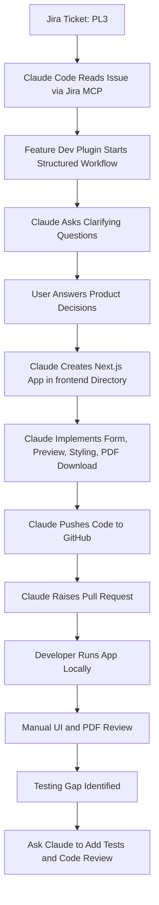
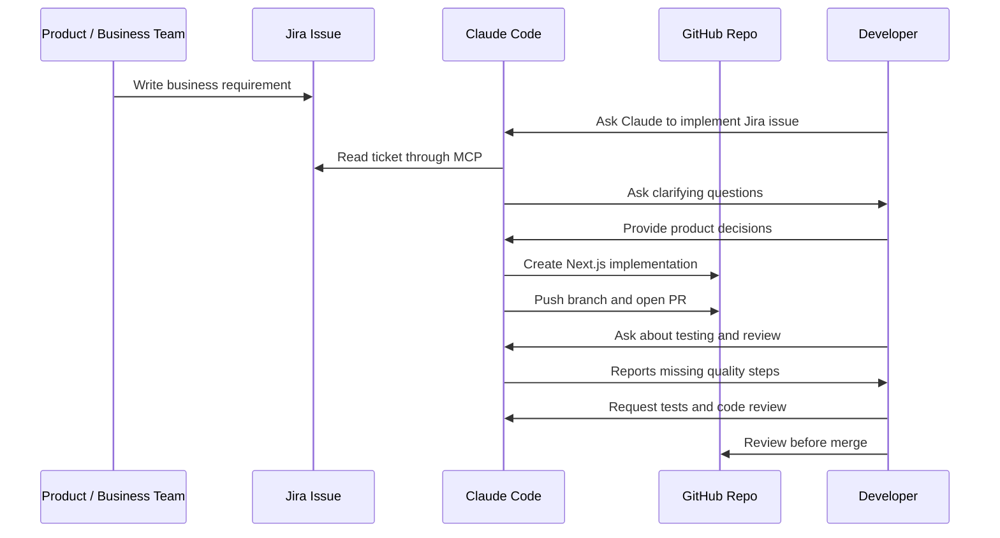

# 057 - Day 4 - Claude Code Builds a Full Next.js App from a Jira Ticket

## Lesson Information

| Item       | Details                                                              |
| ---------- | -------------------------------------------------------------------- |
| Lesson     | 057                                                                  |
| Duration   | 11 min                                                               |
| Week       | Week 2 - Claude Code & Vibe Engineering                              |
| Module     | Week 2 Day 4 - Jira, GitHub, Professional Workflow                   |
| Main Topic | Building a complete Next.js app from a Jira ticket using Claude Code |

---

## Lesson Summary

In this lesson, Claude Code is used to build a complete **Next.js web application** directly from a **Jira ticket**.

The Jira issue describes a prototype for a **Mutual NDA Creator**. The user enters key information into a form, the app dynamically generates a mutual NDA document, and the completed document can be downloaded locally as a PDF.

This lesson demonstrates a full professional workflow:

1. A business-style requirement is written in Jira.
2. Claude Code reads the Jira issue through the Jira MCP server.
3. A feature development plugin guides Claude through a structured process.
4. Claude asks clarifying questions before implementation.
5. Claude creates a Next.js app inside a `frontend` directory.
6. Claude pushes the implementation and raises a GitHub pull request.
7. The developer manually reviews the generated UI, PDF output, and testing coverage.

---

## Learning Objectives

By the end of this lesson, learners will be able to:

* Understand how Claude Code can convert a Jira ticket into a working application.
* Write clearer Jira tickets that AI coding agents can implement effectively.
* Use Claude Code with Jira MCP, GitHub MCP, and a feature development plugin.
* Evaluate AI-generated applications by checking routes, UI, components, and output behavior.
* Identify missing quality steps such as automated tests, manual testing, and code review agents.
* Understand why human review is still necessary even when the AI produces a working app.

---

## Key Concepts

### 1. Jira Ticket as a Business Requirement

The Jira issue is intentionally written like a real business request rather than a technical specification.

Example requirement:

```text
Create a web application to generate a mutual NDA document.

The user enters key information in a form.
The website displays the mutual NDA with the key information filled in.
The user can download the completed document locally.
```

This reflects how real product requirements often arrive: useful, but not fully specified.

Claude Code must interpret the requirement, ask questions, make decisions, and turn it into implementation.

---

### 2. Feature Development Workflow

The lesson uses a feature development plugin with a structured process.

Instead of simply asking Claude to “build the app,” the command invokes a guided workflow:

```text
feature-dev:feature-dev Please implement Jira issue PL3 with a Next.js application in a directory called frontend and raise a PR when done.
```

This connects three major parts of a professional workflow:

| Tool               | Role                                               |
| ------------------ | -------------------------------------------------- |
| Jira MCP           | Reads the issue requirement                        |
| Feature Dev Plugin | Guides planning, clarification, and implementation |
| GitHub MCP         | Pushes code and creates the pull request           |
| Claude Code        | Acts as the coding agent                           |

---

### 3. Clarifying Questions Before Coding

Claude does not immediately code everything. It first asks clarifying questions.

This is important because the Jira ticket is intentionally incomplete.

Example clarifying questions:

| Question                                              | Selected Answer  |
| ----------------------------------------------------- | ---------------- |
| What download format should the completed NDA use?    | PDF              |
| Should the app use a wizard or a single-page form?    | Single-page form |
| How should the NDA preview be displayed?              | Side-by-side     |
| Should this be a simple prototype or polished design? | Polished design  |

This shows a key professional behavior: a good coding agent should clarify ambiguity before implementation.

---

### 4. Building a Full Next.js App

Claude Code creates a complete application inside the `frontend` directory.

The generated app includes:

* A Next.js project structure.
* A form for entering NDA information.
* A live document preview.
* Dynamic data binding between form fields and document content.
* A PDF download feature.
* Styling and layout polish.
* GitHub PR creation.

The result is not just a code snippet. It is a working product prototype.

---

### 5. Live Preview and PDF Generation

The app has a side-by-side interface:

* Left side: user input form.
* Right side: live mutual NDA preview.

As the user types information such as company name, counterparty name, or governing law, the NDA preview updates immediately.

The app also supports downloading the completed NDA as a PDF.

This is an example of a practical product feature built from a relatively loose business requirement.

---

## Workflow Diagram



---

## Demo Flow

### Step 1: Create a New Jira Issue

The instructor creates a new Jira card:

```text
Prototype of mutual NDA creator
```

The issue description:

```text
It is a web application to create a mutual NDA document for a user.

The user enters some key information in a form.

The website then displays the mutual NDA with the key information filled in.

The user can download the completed document locally.
```

The issue is saved as:

```text
PL3
```

---

### Step 2: Run Claude Code with the Feature Dev Plugin

Claude Code is restarted with a clean context.

The user re-authenticates with Atlassian/Jira.

Then the plugin is invoked directly:

```text
feature-dev:feature-dev Please implement Jira issue PL3 with a Next.js application in a directory called frontend and raise a PR when done.
```

This instruction tells Claude to:

* Read Jira issue `PL3`.
* Build a Next.js app.
* Place the app in the `frontend` directory.
* Push the implementation.
* Raise a pull request when finished.

---

### Step 3: Claude Reads the Requirement and Asks Questions

Claude reviews the Jira issue and repository, then pauses to ask clarifying questions.

The selected decisions are:

```text
Download format: PDF
App structure: Single-page form
Preview layout: Side-by-side
Design quality: Polished design
```

These answers give Claude enough product direction to continue implementation.

---

### Step 4: Claude Builds the App

Claude creates the Next.js frontend and generates many files.

It implements:

* Frontend project setup.
* Form fields.
* Live preview.
* PDF generation.
* Styling.
* GitHub PR workflow.

This demonstrates an end-to-end AI-assisted feature implementation process.

---

### Step 5: Run the App Locally

The developer manually runs the app:

```bash
cd frontend
npm run dev
```

The app launches successfully.

The UI shows a Mutual NDA Creator with form inputs, document preview, and a download PDF button.

---

### Step 6: Test the Generated App Manually

The instructor fills in the form with sample company data.

The NDA preview updates live as each field changes.

Example:

```text
Governing Law: New York
```

When the field is edited, the preview updates immediately.

Then the instructor clicks:

```text
Download PDF
```

The PDF is generated and downloaded successfully.

The downloaded document includes:

* A clean cover sheet.
* Filled-in company information.
* NDA content.
* Proper document structure.
* License/reference information at the end.

---

## Important Observation: Testing Was Skipped

Although the app worked manually, the instructor notices a potential issue:

Claude may not have performed thorough testing.

After asking Claude what quality review was completed, Claude admits that some important steps were missing:

| Quality Step                | Status        |
| --------------------------- | ------------- |
| Build verification          | Completed     |
| Automated tests             | Not completed |
| Manual tests                | Not completed |
| Code reviewer agents        | Not completed |
| PDF download validation     | Not completed |
| Full phase 6 quality review | Skipped       |

This is a critical lesson.

Even when the generated app works, the AI may skip parts of the expected process unless explicitly instructed.

---

## Improved Follow-up Prompt

After discovering the testing gap, the instructor asks Claude to improve the quality process:

```text
Yes to all three.

Please add extensive automated tests and manual tests, and have the code reviewer agents do the review.
```

This follow-up request asks Claude to:

* Add automated tests.
* Perform manual testing.
* Run code reviewer agents.
* Strengthen the implementation before merge.

---

## Professional Workflow Pattern

This lesson demonstrates a realistic AI-assisted development workflow:



---

## What Claude Did Well

Claude successfully:

* Read a Jira issue.
* Interpreted a loose business requirement.
* Asked useful clarifying questions.
* Created a working Next.js app.
* Built a polished UI.
* Implemented live preview behavior.
* Generated a downloadable PDF.
* Raised a GitHub pull request.
* Responded honestly when asked about skipped testing.

---

## What Needed Human Review

The developer still had to check:

* Whether the app runs locally.
* Whether the UI is usable.
* Whether the PDF generation works.
* Whether the generated NDA content is acceptable.
* Whether the code structure is maintainable.
* Whether testing was actually performed.
* Whether the PR is safe to merge.

Claude can accelerate the workflow, but the developer remains responsible for quality.

---

## Best Practices

### 1. Write Jira Tickets Clearly

A good Jira ticket should include:

* User goal.
* Expected behavior.
* Input fields.
* Output format.
* Acceptance criteria.
* Edge cases.
* Testing expectations.

Poor example:

```text
Build NDA app.
```

Better example:

```text
Build a Next.js prototype that allows users to enter company details, counterparty details, effective date, governing law, and confidentiality terms. The app should display a live mutual NDA preview and allow the user to download the completed document as a PDF.
```

---

### 2. Ask Claude to Test Explicitly

Do not assume the agent will test everything.

Add testing requirements directly to the prompt:

```text
After implementation, run the build, add automated tests, test the PDF download manually, and summarize the verification steps before raising the PR.
```

---

### 3. Require Code Review Before Merge

AI-generated code should always be reviewed.

Review for:

* Security issues.
* Broken logic.
* Poor component design.
* Hardcoded assumptions.
* Missing validation.
* Accessibility problems.
* Incomplete tests.
* Incorrect business logic.

---

### 4. Use Follow-up Questions to Audit the Agent

After Claude completes the task, ask:

```text
What testing did you perform?
What did you not verify?
Were any workflow steps skipped?
What risks remain before merging?
```

This helps reveal hidden gaps in the agent’s process.

---

## Example Acceptance Criteria for This Jira Ticket

A stronger version of the Jira issue could include:

```markdown
## Acceptance Criteria

- The app is created in a `frontend` directory.
- The app uses Next.js.
- The user can enter party information into a form.
- The NDA preview updates live as the form changes.
- The preview is displayed side-by-side with the form on desktop.
- The user can download the completed NDA as a PDF.
- The app has a polished prototype-level UI.
- The project builds successfully.
- Automated tests are added for core form and preview behavior.
- PDF generation is manually tested.
- A GitHub pull request is created when implementation is complete.
```

---

## Practical Exercise

Create a Jira ticket for a small web app, then ask Claude Code to implement it.

Example app ideas:

| App Idea              | Description                                      |
| --------------------- | ------------------------------------------------ |
| Invoice Generator     | Form input + live invoice preview + PDF download |
| Contract Summary Tool | Paste contract text + show summarized clauses    |
| Resume Builder        | Input profile data + preview resume + export PDF |
| Meeting Notes App     | Add notes + action items + export summary        |
| Quote Generator       | Enter services + calculate total + export quote  |

Recommended prompt:

```text
feature-dev:feature-dev Please implement Jira issue [ISSUE_ID] with a Next.js application in a directory called frontend. Add automated tests, manually verify the main user flow, run a code review, and raise a PR when done.
```

---

## Key Takeaways

* Claude Code can turn a Jira ticket into a working Next.js application.
* MCP servers connect Claude Code to real tools like Jira and GitHub.
* Plugins can guide Claude through a more professional development workflow.
* Clarifying questions are essential when requirements are vague.
* A working demo does not prove the code is production-ready.
* Testing and review must be explicitly requested and verified.
* Human developers still need to inspect, test, and approve the final PR.

---

## Review Questions

1. Why did Claude ask clarifying questions before building the app?
2. What role did the Jira MCP server play in this workflow?
3. What role did the GitHub MCP server play?
4. Why was the PDF format not obvious from the original ticket?
5. What did Claude successfully build in the `frontend` directory?
6. Why was manual testing still necessary?
7. What quality steps were skipped initially?
8. How can the original prompt be improved to require stronger testing?
9. Why should developers ask Claude what it did not verify?
10. What should be checked before merging an AI-generated pull request?

---

## Suggested Final Prompt Template

```text
feature-dev:feature-dev Please implement Jira issue [ISSUE_ID] with a Next.js application in a directory called frontend.

Requirements:
- Read the Jira issue carefully.
- Ask clarifying questions before implementation if anything is ambiguous.
- Implement the full user flow.
- Add automated tests for core behavior.
- Run the build and test commands.
- Manually verify the main UI flow.
- Verify any file download or export behavior.
- Use code reviewer agents before finishing.
- Push the branch and raise a GitHub PR.
- Summarize what was tested, what was not tested, and any remaining risks.
```

---

## Final Lesson Conclusion

This lesson shows the power and risk of AI coding agents in professional software development.

Claude Code can now take a Jira ticket, clarify requirements, build a complete Next.js application, generate a PDF feature, and raise a GitHub pull request. This is a major productivity boost.

However, the lesson also shows that AI agents may skip important quality steps unless the developer explicitly asks for them. The correct workflow is not simply “let Claude build it,” but rather:

```text
Write clear ticket → Let Claude implement → Ask what was tested → Add missing tests → Review PR → Merge carefully
```

Claude Code is extremely powerful, but professional developers must still guide, inspect, and verify the final result.

---

# Bài luyện tập

## Mục tiêu


## Đề bài


## Yêu cầu hoàn thành

- [ ] 
- [ ] 
- [ ] 

## Kết quả / lời giải


## Ghi chú
