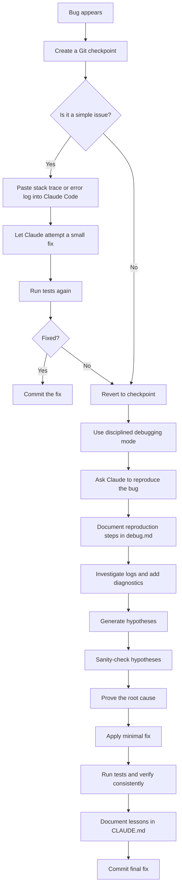
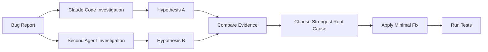
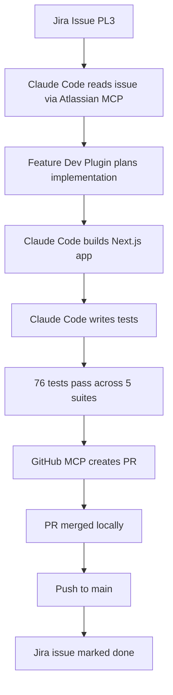

# 058 - Day 4 - Debugging Strategies for Claude Code: A Disciplined Approach

## Lesson Information

| Item     | Details                                            |
| -------- | -------------------------------------------------- |
| Lesson   | 058                                                |
| Duration | 12 minutes                                         |
| Week     | Week 2 - Claude Code & Vibe Engineering            |
| Module   | Week 2 Day 4 - Jira, GitHub, Professional Workflow |
| Topic    | Debugging Strategies for Claude Code               |

---

## Main Idea

This lesson explains how to debug with Claude Code in a disciplined and reliable way.

Instead of asking the AI to vaguely “fix everything,” the developer should provide clear error logs, ask Claude to reproduce the bug, identify the root cause, prove the cause, apply a fix, run tests, and document lessons learned.

The key message is:

> Do not accept unexplained workarounds.
> Always require evidence, root cause analysis, and repeatable tests.

---

## Learning Objectives

By the end of this lesson, learners should be able to:

* Use Claude Code for debugging without losing control of the codebase.
* Provide useful debugging inputs such as logs, stack traces, and failing test output.
* Ask Claude Code to reproduce an issue before attempting a fix.
* Require root cause analysis before accepting code changes.
* Use Git commits as safe checkpoints before debugging.
* Validate every fix with tests.
* Avoid AI-generated workarounds that are not properly explained.
* Document debugging lessons in project files such as `debug.md` and `CLAUDE.md`.

---

## Why This Lesson Matters

Debugging with AI coding agents can be extremely productive, but it can also become risky if the agent starts guessing, making unnecessary changes, or chasing false causes.

Claude Code can sometimes:

* Jump to conclusions too quickly.
* Overfit to one old Stack Overflow or GitHub issue.
* Apply a workaround without proving the actual cause.
* Rewrite large parts of the system unnecessarily.
* Forget previous findings after compaction or a new conversation.
* Repeat the same mistake if lessons are not documented.

A disciplined debugging workflow prevents this.

---

## Context from the Demo

Before discussing debugging strategies, the lesson reviews a successful Claude Code workflow:

* Claude Code built a full Next.js prototype application.
* It created an extensive test suite.
* The project reached more than 8,000 lines of code.
* 76 tests passed across five test suites.
* The app worked locally on `localhost:3000`.
* The live preview updated correctly.
* PDF download worked.
* The PR was merged locally and pushed to `main`.
* The Jira issue was marked as done.

The surprising part was that there was no serious bug to debug, so the lesson focused on the debugging strategy that should be used when bugs do appear.

---

## Core Principle

The wrong way to debug with Claude Code:

```text
Fix everything.
```

The better way:

```text
Here is the error log.
First reproduce the issue.
Then identify the root cause.
Prove the root cause.
Only then apply a fix.
Run tests after the fix.
Document what was learned.
```

---

## High-Level Debugging Workflow



---

## Strategy 1: Start with a Git Snapshot

Before debugging, create a clean checkpoint.

```bash
git status
git add .
git commit -m "checkpoint before debugging issue"
```

This matters because Claude Code may go down the wrong path.

Do not rely only on Claude Code’s rewind feature. Rewind can usually undo file edits, but it may not undo side effects caused by scripts, generated files, database changes, migrations, or external commands.

A Git commit gives you a reliable restore point.

---

## Strategy 2: Use Fast Copy-Paste Debugging for Simple Issues

For small errors, the fastest method is often:

1. Copy the stack trace.
2. Paste it directly into Claude Code.
3. Let Claude fix it.
4. Run the test again.
5. Repeat if another error appears.

Example prompt:

```text
Here is the error output:

[paste full stack trace]

Please identify the cause and apply the smallest correct fix.
After the fix, run the relevant test again.
```

For simple problems, Claude Code usually understands the surrounding context and fixes the issue efficiently.

This is useful for:

* Missing imports.
* Type errors.
* Broken test expectations.
* Small runtime errors.
* Simple configuration mistakes.
* Minor API mismatch issues.

---

## Strategy 3: Switch to Disciplined Debugging When Quick Fixing Fails

If quick copy-paste debugging does not work, stop.

Do not let Claude keep randomly changing files.

Revert to the last clean Git checkpoint and switch to a more controlled process.

```bash
git reset --hard HEAD
```

Then ask Claude Code to follow a structured debugging protocol.

---

## Disciplined Debugging Protocol

### Step 1: Reproduce the Issue

Claude should first prove that the issue can be reproduced consistently.

Example prompt:

```text
We need to debug this issue in a disciplined way.

First, do not fix anything yet.

Reproduce the issue consistently.
Document the exact reproduction steps in debug.md.
Include:
- command used
- input data
- expected behavior
- actual behavior
- full error output
```

The goal is to prevent Claude from guessing.

---

### Step 2: Gather Evidence

Claude should inspect logs, related files, test output, and runtime behavior.

Example prompt:

```text
Now investigate the issue.

Do not apply a fix yet.

Gather evidence from:
- relevant source files
- test files
- logs
- configuration
- package versions
- recent code changes

If needed, add temporary logging to understand the failure.

Document all findings in debug.md.
```

---

### Step 3: Generate Hypotheses

Claude should list possible causes instead of immediately choosing one.

Example prompt:

```text
Based on the evidence, list the possible root-cause hypotheses.

For each hypothesis, document:
- why it might explain the issue
- what evidence supports it
- what evidence contradicts it
- how we can test or disprove it

Write this in debug.md.
```

---

### Step 4: Sanity-Check the Hypotheses

This is one of the most important parts of the lesson.

Claude Code may find an old GitHub issue or Stack Overflow post and assume it has found the answer. This can be dangerous.

A single old internet report does not prove that your issue has the same cause.

Ask Claude to check:

* Was the issue reported by many people or only one person?
* Is the report recent or from several years ago?
* Does the environment match your project?
* Does the package version match?
* Is there official documentation confirming the issue?
* Is the workaround still valid?
* Is there local evidence that proves the same cause?

Example prompt:

```text
Sanity-check your hypotheses.

If you found online reports, do not assume they apply.

For each external source, check:
- whether it is recent
- whether multiple people reported it
- whether it matches our package versions
- whether it matches our actual error
- whether our local evidence supports it

Document whether each hypothesis is credible.
```

---

### Step 5: Prove the Root Cause

Before fixing, Claude must prove the root cause.

Example prompt:

```text
Choose the most likely root cause.

Do not fix it yet.

Prove that this is the real root cause.
Show the exact evidence.

Document:
- the root cause
- why it causes the observed failure
- how you proved it
- why other hypotheses were rejected
```

A good root-cause explanation should be specific.

Weak explanation:

```text
The dependency is probably broken.
```

Strong explanation:

```text
The test fails because the component expects `document.title` to exist, but the test environment uses a mock DOM where this value is undefined. The failure occurs only in the test runtime, not in the browser. Adding a default value fixes the crash and keeps browser behavior unchanged.
```

---

### Step 6: Apply the Smallest Correct Fix

Only after the root cause is proven should Claude change the code.

Example prompt:

```text
Now apply the smallest correct fix for the proven root cause.

Do not rewrite unrelated files.
Do not introduce a workaround unless you explain why it is the correct solution.
After the change, run the relevant tests.
```

---

### Step 7: Verify the Fix Consistently

The fix must pass repeatedly, not only once.

Example prompt:

```text
Verify the fix.

Run:
- the failing test
- the related test suite
- any relevant lint or type checks

Confirm that:
- the original issue no longer reproduces
- no related behavior was broken
- the fix is minimal and targeted

Document the result in debug.md.
```

---

### Step 8: Document Lessons Learned

After the fix, Claude should update project memory files such as `CLAUDE.md`.

Example prompt:

```text
Update CLAUDE.md with lessons learned from this bug.

Include:
- what caused the bug
- what pattern to avoid
- what test or check should be used next time
- any project-specific rule Claude Code should remember
```

This is important because Claude may later lose context due to compaction, a new session, or a cleared conversation.

---

## Recommended Debugging File: `debug.md`

A useful `debug.md` structure:

```markdown
# Debugging Report

## Issue Summary

## Reproduction Steps

## Expected Behavior

## Actual Behavior

## Error Output

## Investigation Notes

## Hypotheses

### Hypothesis 1

### Hypothesis 2

### Hypothesis 3

## Sanity Check

## Proven Root Cause

## Fix Applied

## Verification

## Tests Run

## Lessons Learned
```

---

## Recommended Project Memory File: `CLAUDE.md`

A useful `CLAUDE.md` entry:

```markdown
## Debugging Lesson: [Short Title]

When debugging [area of project], do not assume [wrong assumption].

Root cause from previous issue:
- [specific cause]

Correct approach:
- [specific rule]
- [test command]
- [file to inspect]

Avoid:
- [bad workaround]
- [false hypothesis]
```

---

## Common Claude Code Debugging Failure Modes

| Failure Mode         | Description                                              | How to Prevent It                      |
| -------------------- | -------------------------------------------------------- | -------------------------------------- |
| Vague fixing         | Claude changes many files without a clear reason         | Ask for root cause first               |
| Workaround addiction | Claude applies a hack instead of fixing the real problem | Require proof and explanation          |
| Internet overfitting | Claude trusts one old GitHub issue too much              | Ask for sanity checks                  |
| Over-rewriting       | Claude rebuilds large parts of the system unnecessarily  | Ask for the smallest correct fix       |
| Context loss         | Claude forgets lessons after compaction                  | Document in `CLAUDE.md`                |
| Red herring chase    | Claude follows a false cause confidently                 | Revert and restart from Git checkpoint |
| Test blindness       | Claude declares success without testing                  | Require test commands and results      |

---

## Red Flags to Watch For

Be careful when Claude says things like:

```text
This is a known issue.
```

```text
The solution is to downgrade the package.
```

```text
LLMs cannot use tool calling and structured outputs together.
```

```text
We need to rewrite this entire module.
```

```text
This workaround should solve it.
```

These statements may be true, but they require evidence.

Always ask:

```text
What evidence proves this is the root cause in our project?
```

---

## When to Revert and Restart

Revert to the last Git checkpoint when:

* Claude starts changing too many unrelated files.
* The fix becomes larger than the bug.
* The explanation sounds speculative.
* The same bug keeps reappearing.
* Claude keeps repeating an already-disproven hypothesis.
* The agent starts rebuilding architecture without permission.
* Tests are getting worse instead of better.

Recommended command:

```bash
git reset --hard HEAD
```

Then restart with a clearer instruction:

```text
The previous hypothesis was wrong.

This is not caused by [false cause].

Start again from the current code.
Reproduce the issue and generate new hypotheses.
Do not apply a fix until the root cause is proven.
```

---

## Pro Tip: Use a Second AI Agent

For difficult bugs, use a different model or agent as a second pair of eyes.

Examples:

* Claude Code
* Codex
* Cursor
* Antigravity
* Another LLM with a different prompt and model family

Why this helps:

* Different models make different assumptions.
* Another model may notice something Claude missed.
* It reduces the chance of being trapped by one false hypothesis.
* It can challenge Claude’s explanation.

Example workflow:



---

## Debugging Skills

The lesson also mentions that Claude Code has debugging-related skills available.

One useful type of skill is a systematic debugging skill. These skills usually enforce rules such as:

* Reproduce before fixing.
* Gather evidence before changing code.
* Prove the root cause.
* Avoid speculative fixes.
* Validate the solution with tests.
* Document lessons learned.

This is useful when the bug is complex or when Claude Code starts behaving too creatively.

---

## Practical Prompt Template

Use this prompt when you encounter a serious bug:

```text
We need to debug this carefully.

Do not fix anything yet.

1. Create or update debug.md.
2. Reproduce the issue consistently.
3. Document the exact reproduction steps.
4. Gather evidence from logs, tests, config, and related files.
5. Generate multiple root-cause hypotheses.
6. Sanity-check each hypothesis.
7. Prove the actual root cause with evidence.
8. Only after that, apply the smallest correct fix.
9. Run the failing test and related test suite.
10. Document verification results in debug.md.
11. Add lessons learned to CLAUDE.md.

Do not use unexplained workarounds.
Do not rewrite unrelated code.
Do not assume an online issue applies unless there is local evidence.
```

---

## Mini Case Study from the Lesson

Claude Code successfully completed the Jira-to-PR workflow:



This showed how powerful Claude Code can be when connected to:

* Jira MCP Server
* GitHub MCP Server
* Feature Dev Plugin
* Local development environment
* Test suite
* Git workflow

---

## Key Takeaways

* Always create a Git checkpoint before serious debugging.
* For simple bugs, paste the stack trace and iterate quickly.
* For difficult bugs, switch to disciplined debugging.
* Do not let Claude Code fix before reproducing the issue.
* Ask for root cause analysis before code changes.
* Require proof, not guesses.
* Be skeptical of “known issue” claims from old internet posts.
* Apply the smallest correct fix.
* Run tests after every fix.
* Document lessons in `debug.md` and `CLAUDE.md`.
* Use a second AI agent for hard problems.
* Revert quickly when Claude goes down the wrong path.

---

## Practice Exercise

Use Claude Code to debug a small failing test in your own project.

### Task

1. Create a Git checkpoint.
2. Introduce or locate one failing test.
3. Ask Claude Code to reproduce the issue.
4. Ask it to write findings into `debug.md`.
5. Require root cause proof before fixing.
6. Apply the smallest fix.
7. Run the test suite.
8. Add lessons learned to `CLAUDE.md`.

### Expected Output

By the end of the exercise, your project should contain:

```text
debug.md
CLAUDE.md
passing tests
a focused Git commit
```

---

## Final Summary

This lesson teaches a professional debugging strategy for Claude Code.

The main lesson is not simply how to fix bugs faster, but how to avoid losing control when an AI coding agent starts guessing.

A disciplined debugging process should move through:

```text
Checkpoint → Reproduce → Investigate → Hypothesize → Prove → Fix → Test → Document
```

This approach makes Claude Code more reliable, keeps the project safer, and helps developers build professional AI-assisted workflows.
