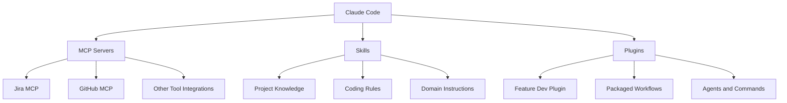
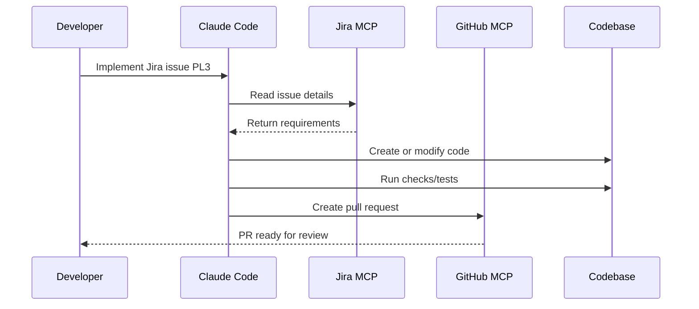
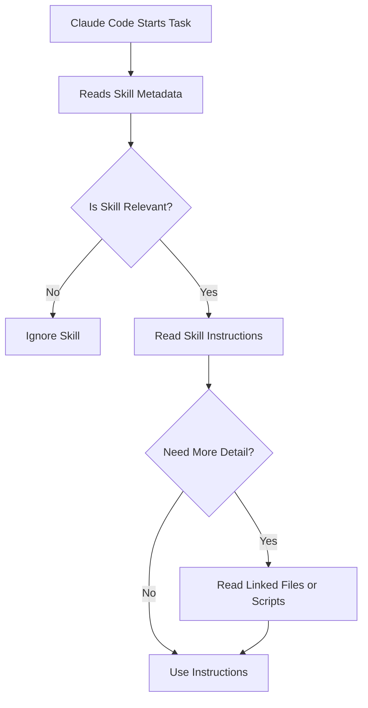
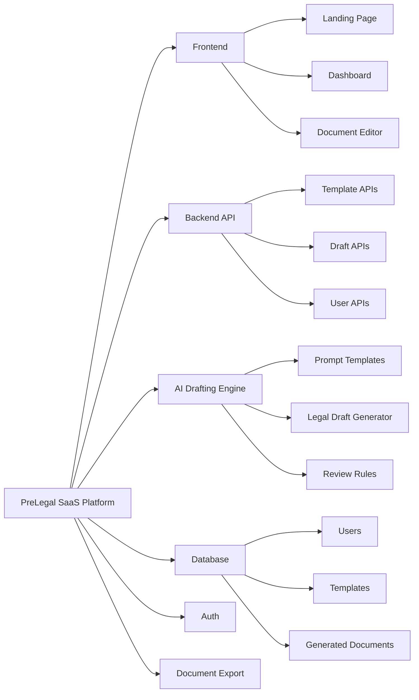
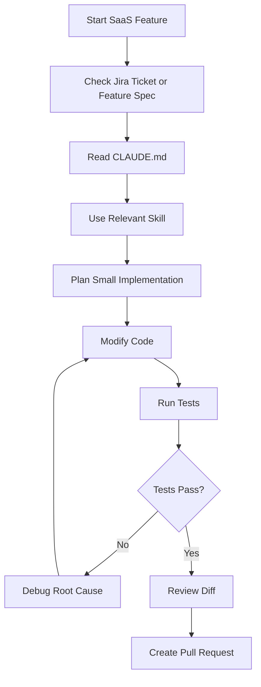

# 059 - Day 5 - Building a SaaS Platform: Claude Code Skills & `CLAUDE.md` Setup

## Lesson Information

| Item       | Details                                                                                |
| ---------- | -------------------------------------------------------------------------------------- |
| Lesson     | 059                                                                                    |
| Duration   | 11 minutes                                                                             |
| Week       | Week 2 - Claude Code & Vibe Engineering                                                |
| Module     | Week 2 Day 5 - SaaS Legal Assistant                                                    |
| Main Theme | Setting up a real SaaS project with Claude Code, project skills, and `CLAUDE.md` rules |

---

## 1. Lesson Overview

This lesson begins **Day 5**, the main building day of Week 2. The goal is to start building a real SaaS platform, using the legal document drafting app **PreLegal** as the example product.

The focus is not only on writing code, but on setting up the project so that Claude Code can work consistently, safely, and productively across the entire platform.

Key setup areas include:

* Creating and maintaining a strong `CLAUDE.md`
* Understanding personal vs project-level Claude instructions
* Defining Claude Code skills for the project
* Standardizing coding rules for the whole SaaS platform
* Preparing the repo so team members and agents follow the same workflow

---

## 2. Context: Why This Lesson Matters

In previous lessons, Claude Code was connected to tools like Jira and GitHub through MCP servers and plugins. Claude could read a Jira issue, implement the requested feature, and raise a pull request.

However, a real SaaS platform needs more than one-off task execution.

It needs:

* Shared project rules
* Repeatable workflows
* Consistent coding style
* Clear debugging principles
* Project-specific knowledge
* Skills that guide Claude Code when working on important domains

This lesson introduces that foundation.

---

## 3. The Three Ways to Extend Claude Code

Claude Code can be extended mainly through three mechanisms:

| Method  | Purpose                                       | Strengths                                           | Limitations                                                   |
| ------- | --------------------------------------------- | --------------------------------------------------- | ------------------------------------------------------------- |
| MCP     | Connect Claude to external tools and services | Flexible, ecosystem-friendly, powerful integrations | Can consume context, may be complex, authentication can break |
| Skills  | Add reusable project/domain knowledge         | Simple, lightweight, context-efficient              | Less powerful than full tool integrations                     |
| Plugins | Package capabilities for Claude Code          | Easy to install, can combine tools and workflows    | Specific to Claude Code                                       |

---

## 4. Extension Architecture



---

## 5. Recap: Previous Jira-to-PR Workflow

The previous workflow looked like this:



The command was simple from the developer’s side:

```bash
Implement Jira issue PL3 with a Next.js app in a directory called frontend, raise a PR when you're done.
```

Claude Code then used the plugin workflow, Jira MCP, and GitHub MCP to complete the task.

---

## 6. Where Skills Fit In

Skills give Claude Code reusable knowledge without forcing everything into the main prompt.

A skill usually contains:

* Metadata
* Instructions
* Optional linked files
* Optional scripts or supporting resources

Claude reads the metadata first. Then, only if the skill seems relevant, Claude loads more detailed instructions.

This makes skills efficient because they do not overload the context unless needed.

---

## 7. Skill Loading Model



---

## 8. Typical Skill Folder Structure

A project skill can be organized inside the Claude configuration folder.

```text
project-root/
├── CLAUDE.md
├── .claude/
│   ├── settings.json
│   └── skills/
│       └── legal-document-drafting/
│           ├── skill.md
│           ├── references/
│           │   └── document-types.md
│           └── scripts/
│               └── validate_template.py
└── frontend/
```

A personal Claude setup can also exist in the home directory:

```text
~/
├── CLAUDE.md
└── .claude/
    ├── settings.json
    └── skills/
```

---

## 9. Personal `CLAUDE.md` vs Project `CLAUDE.md`

There are two important levels of instruction.

| File                     | Scope            | Purpose                                              |
| ------------------------ | ---------------- | ---------------------------------------------------- |
| `~/CLAUDE.md`            | Personal/global  | Your default working preferences across all projects |
| `project-root/CLAUDE.md` | Project-specific | Rules, architecture, and workflow for one codebase   |

---

## 10. Personal `CLAUDE.md`

The personal `CLAUDE.md` should be short because it is loaded into every Claude Code session.

It should contain only the principles that matter across all projects.

Example personal rules:

```markdown
# Personal Claude Code Rules

## General Working Style

- Work incrementally.
- Prefer simple, clear solutions.
- Validate each step before moving on.
- Do not over-engineer.
- Keep changes small and reviewable.

## Debugging

- Always identify the root cause before fixing.
- Reproduce the issue consistently.
- Do not guess.
- Test one thing at a time.
- Avoid unexplained workarounds.

## Code Style

- Use concise docstrings.
- Avoid excessive comments outside docstrings.
- Favor short modules.
- Keep README files concise.
- Do not use emojis in code, logs, print statements, or documentation.

## Python

- Use `uv` as the Python package manager.
- Use `uv run`, not `python3`.
- Use `uv add`, not `pip install`.
```

---

## 11. Project `CLAUDE.md`

The project-level `CLAUDE.md` should define how Claude Code should behave inside the SaaS platform.

For the PreLegal SaaS example, it may include:

```markdown
# PreLegal Claude Code Guide

## Product Context

PreLegal is a SaaS platform for drafting legal documents using AI.

The product helps users:
- Select document templates
- Provide business or legal context
- Generate structured legal drafts
- Review, edit, and export documents

## Project Priorities

- Build incrementally.
- Keep the product simple for V1.
- Prefer working features over abstract architecture.
- Use clear module boundaries.
- Write code that is easy to review.

## SaaS Modules

The platform is organized into these modules:

1. Authentication
2. User dashboard
3. Legal document templates
4. AI document drafting
5. Document editor
6. Export/download
7. Billing or subscription placeholder
8. Admin and monitoring later

## Coding Rules

- Do not introduce unnecessary abstractions.
- Do not create large files.
- Do not silently ignore errors.
- Prefer explicit validation.
- Keep API contracts clear.
- Add tests for important business logic.

## Debugging Rules

- Reproduce the bug first.
- Identify the root cause.
- Fix the smallest responsible area.
- Run the relevant test after each fix.
- Avoid temporary workarounds unless clearly documented.
```

---

## 12. SaaS Platform Module Breakdown



---

## 13. Example Skill: Legal Document Drafting

A project skill can help Claude Code understand how legal document generation should work.

```markdown
---
name: legal-document-drafting
description: Use this skill when implementing or modifying legal document drafting features for the PreLegal SaaS platform.
---

# Legal Document Drafting Skill

## Purpose

This skill guides implementation of AI-powered legal document drafting features.

## Core Rules

- Treat generated documents as drafts, not final legal advice.
- Keep document structure clear and editable.
- Separate user input, template logic, and AI generation logic.
- Include disclaimers where appropriate.
- Preserve user-provided facts accurately.

## Expected Drafting Flow

1. User selects a document type.
2. User provides required details.
3. Backend validates the input.
4. AI generates a structured draft.
5. User can review and edit the draft.
6. User can export or save the document.

## Implementation Guidelines

- Keep prompt templates versioned.
- Store generated documents with metadata.
- Make generation failures visible to the user.
- Do not hardcode document-specific logic directly inside route handlers.
```

---

## 14. Recommended Build Workflow



---

## 15. Git Setup Step

The lesson also highlights an important repo hygiene step.

If Claude Code created or used `.claude` project configuration but did not commit it automatically, the developer should add it manually.

Example:

```bash
git status
git add .claude
git commit -m "Add Claude Code project settings"
git push
```

This ensures that other contributors and future Claude Code sessions use the same project setup.

---

## 16. Key Concepts

### 16.1 Building Days

Day 5 is described as a “blue day” or building day. The goal is to move from setup and workflow theory into actual product construction.

### 16.2 `CLAUDE.md` as Project Memory

`CLAUDE.md` acts like a persistent instruction layer for Claude Code. It tells the agent how to behave in a specific project.

Good `CLAUDE.md` files are:

* Short
* Specific
* Practical
* Opinionated where necessary
* Focused on real project rules

### 16.3 Skills as Context-Efficient Instructions

Skills are useful because Claude does not need to load all project knowledge at once. It can decide when a skill is relevant and load only what it needs.

### 16.4 MCP for Tool Access

MCP is best when Claude needs to interact with external systems like Jira, GitHub, databases, or other services.

### 16.5 Plugins for Packaged Workflows

Plugins are helpful when a workflow should be easy to repeat, such as feature development or issue-to-PR automation.

---

## 17. Practical Checklist

Before building the SaaS platform, prepare the following:

* [ ] Confirm the repo is on the correct branch
* [ ] Check `git status`
* [ ] Commit `.claude` project settings if needed
* [ ] Create or update personal `~/CLAUDE.md`
* [ ] Create or update project `CLAUDE.md`
* [ ] Define the first project skill
* [ ] Break the SaaS platform into modules
* [ ] Write clear coding and debugging rules
* [ ] Keep the V1 scope small
* [ ] Use Jira tickets for feature implementation

---

## 18. Example V1 SaaS Scope

For the PreLegal legal assistant, the V1 product may include:

| Module             | V1 Goal                                 |
| ------------------ | --------------------------------------- |
| Landing page       | Explain the product clearly             |
| Authentication     | Allow users to sign in                  |
| Dashboard          | Show saved legal drafts                 |
| Template selection | Let users choose document type          |
| AI drafting        | Generate first draft from user input    |
| Editor             | Let users review and edit               |
| Export             | Download or copy the document           |
| Disclaimer         | Clarify that output is not legal advice |

---

## 19. Common Mistakes to Avoid

| Mistake                             | Why It Hurts                                       |
| ----------------------------------- | -------------------------------------------------- |
| Making `CLAUDE.md` too long         | Wastes context and reduces clarity                 |
| Using vague project rules           | Claude cannot reliably follow unclear instructions |
| Skipping root cause analysis        | Leads to fragile fixes                             |
| Creating huge Jira tickets          | Makes agent work harder to review                  |
| Over-engineering V1                 | Slows down product validation                      |
| Not committing `.claude` settings   | Team members may not share the same workflow       |
| Putting all knowledge in one prompt | Makes context inefficient                          |

---

## 20. Practice Task

Create a project setup for your own SaaS idea.

Your task:

1. Define the SaaS product in one paragraph.
2. List the main V1 modules.
3. Write a short project-level `CLAUDE.md`.
4. Create one project skill.
5. Add coding and debugging rules.
6. Commit the Claude Code configuration to the repo.

Suggested folder structure:

```text
my-saas-project/
├── CLAUDE.md
├── .claude/
│   └── skills/
│       └── product-domain/
│           └── skill.md
├── frontend/
├── backend/
└── README.md
```

---

## 21. Review Questions

1. What is the difference between MCP, skills, and plugins?
2. Why should a personal `CLAUDE.md` be short?
3. What should go into a project-level `CLAUDE.md`?
4. Why are skills more context-efficient than putting everything in the prompt?
5. When should you use MCP instead of a skill?
6. Why should `.claude` project settings be committed?
7. What debugging rules should Claude Code follow?
8. Why is it important to keep the SaaS V1 scope small?

---

## 22. Lesson Summary

In this lesson, the project moves from workflow setup into real SaaS construction.

The main takeaway is that a productive Claude Code project needs a strong foundation before serious feature development begins.

That foundation includes:

* A personal `CLAUDE.md` for global preferences
* A project `CLAUDE.md` for repo-specific rules
* Project skills for domain-specific guidance
* Clear SaaS module boundaries
* Disciplined debugging rules
* Shared `.claude` settings committed to the repository

For the PreLegal SaaS platform, this setup prepares Claude Code to build features more consistently, follow project standards, and operate like a reliable coding agent inside a real product workflow.
