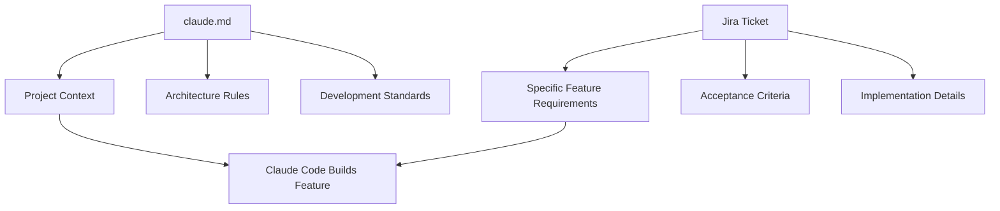
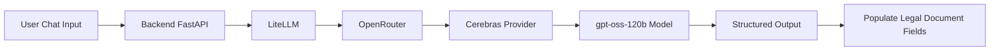

# 060 - Day 5 - Writing `claude.md` and Creating Custom Skills for Cerebras

## Lesson Information

| Item     | Details                                 |
| -------- | --------------------------------------- |
| Lesson   | 060                                     |
| Duration | 11 minutes                              |
| Week     | Week 2 - Claude Code & Vibe Engineering |
| Module   | Week 2 Day 5 - SaaS Legal Assistant     |

---

## Main Topic

This lesson focuses on preparing Claude Code to build a SaaS Legal Assistant more reliably by writing a strong `claude.md` file and creating a custom `cerebras` skill.

The `claude.md` file gives Claude Code project-level context, development rules, technical expectations, commands, architecture, and design preferences. The custom Cerebras skill teaches Claude Code how to call an LLM through OpenRouter using Cerebras as the inference provider.

---

## Learning Objectives

By the end of this lesson, learners should be able to:

* Understand why `claude.md` is important for guiding Claude Code.
* Write a project-specific `claude.md` file with useful context and constraints.
* Use file references such as `@catalog.json` inside `claude.md`.
* Define a clear development process for Claude Code.
* Create a custom Claude Code skill inside the `.claude/skills` directory.
* Configure a Cerebras skill for fast LLM inference through OpenRouter.
* Prepare environment variables such as `OPENROUTER_API_KEY`.
* Connect Claude Code instructions, Jira tickets, GitHub PRs, FastAPI, frontend, Docker, and SQLite into one coherent workflow.

---

# 1. Why `claude.md` Matters

`claude.md` is not just a random instruction file. It is one of the most important ways to influence how Claude Code behaves inside a project.

A weak `claude.md` might only contain one or two vague sentences. A strong `claude.md` gives Claude Code enough project context to make better architectural and implementation decisions.

## Key Idea

> `claude.md` is where the human developer provides direction, taste, standards, and project-specific expectations.

Claude Code can generate code, but the developer still needs to define:

* What the product is
* How the project is structured
* What tools should be used
* What commands should be run
* What coding style should be followed
* What model provider should be used
* How features should be developed and tested
* How pull requests should be created

---

# 2. Project Context for the SaaS Legal Assistant

The project in this lesson is called **Pre-Legal**.

It is a SaaS product that allows users to draft legal agreements based on templates.

## Product Overview

Users can:

* Chat with the application.
* Explain what legal document they want.
* Provide required information.
* Generate a legal agreement from predefined templates.
* Use documents listed inside `catalog.json`.

## Example `claude.md` Project Overview

```md
# Pre-Legal Project

This is a SaaS product that allows users to draft legal agreements based on templates in the `templates/` directory.

The user can carry out a chat in order to establish what document they want and how to fill in the required fields.

The available documents are covered in the `catalog.json` file in the project root.

@catalog.json

The initial implementation is a frontend-only prototype.
```

---

# 3. Using File References in `claude.md`

Claude Code can include file contents by using the `@filename` pattern.

For example:

```md
@catalog.json
```

This inserts the content of `catalog.json` into Claude’s project context.

This is useful when Claude needs to understand:

* Available document templates
* Configuration files
* API schemas
* Product rules
* Agent instructions
* Existing architecture

## Example

```md
The available documents are described here:

@catalog.json
```

This allows Claude Code to understand the product catalog without copying and pasting the entire file manually.

---

# 4. Separating Project Context from Feature Requirements

The lesson emphasizes that `claude.md` should not contain every feature requirement.

Instead:

* `claude.md` gives the global project context.
* Jira tickets contain specific feature instructions.

This keeps the workflow clean.



---

# 5. Development Process Instructions

The `claude.md` file should tell Claude Code how to work through a feature.

## Recommended Development Process

```md
## Development Process

Use your Atlassian tools to read the feature instructions from Jira.

For each feature:

1. Read the Jira ticket carefully.
2. Understand the acceptance criteria.
3. Develop the feature.
4. Do not skip any required steps.
5. Thoroughly test the feature with unit tests and integration tests.
6. Fix any issues found during testing.
7. Submit a pull request using your GitHub tools.
```

## Why This Matters

Without explicit workflow instructions, Claude Code may:

* Skip tests
* Implement only part of a ticket
* Ignore acceptance criteria
* Forget to create a PR
* Make assumptions that do not match the team workflow

A good `claude.md` forces the agent to follow a professional engineering process.

---

# 6. AI Design Instructions

The SaaS Legal Assistant needs to call an LLM to help generate legal documents.

The instructor wants these LLM calls to be fast, structured, and consistent.

## AI Design Requirement

Claude Code should use a custom Cerebras skill when writing LLM-calling code.

```md
## AI Design

When writing code that makes calls to LLMs, use your `cerebras` skill.

Use LiteLLM via OpenRouter to call the `openai/gpt-oss-120b` model with Cerebras as the inference provider.

Use structured output so the application can interpret the results and populate fields in the legal document.
```

## Why Cerebras?

Cerebras is used because it provides very fast inference.

The instructor wants the app to feel responsive, especially during legal document generation.



---

# 7. Technical Design Instructions

The `claude.md` file should also describe the technical architecture.

## Technical Design

```md
## Technical Design

The entire project should be packaged into a Docker container.

The backend should live in `backend/` and should be a `uv` project using FastAPI.

The frontend should live in `frontend/`.

The project should include scripts for starting and stopping the application.

The backend, frontend, and database should run inside Docker.

The database should use SQLite and should be created from scratch each time the Docker container is brought up.

The database should include a `users` table with sign up and sign in support.
```

## Expected Project Structure

```txt
pre-legal/
├── claude.md
├── catalog.json
├── .env
├── backend/
│   ├── pyproject.toml
│   ├── app/
│   └── tests/
├── frontend/
│   ├── package.json
│   └── src/
├── templates/
├── scripts/
│   ├── start.sh
│   └── stop.sh
├── docker-compose.yml
└── .claude/
    └── skills/
        └── cerebras/
            └── skill.md
```

---

# 8. Markdown Formatting Tip

The lesson also points out a small Markdown formatting issue.

When writing lines in Markdown, separate lines may still render as one paragraph unless you add proper spacing.

## Option 1: Use Bullet Points

```md
- Backend runs in `backend/`
- Frontend runs in `frontend/`
- Database uses SQLite
- Project runs inside Docker
```

## Option 2: Use Two Spaces at the End of Each Line

```md
Backend runs in `backend/`  
Frontend runs in `frontend/`  
Database uses SQLite  
Project runs inside Docker  
```

Using bullet points is usually cleaner and easier to maintain.

---

# 9. Creating a Custom Claude Code Skill

The lesson then creates a custom skill called `cerebras`.

A skill is a reusable instruction file that teaches Claude Code how to perform a specific type of task.

In this case, the skill teaches Claude Code how to write code that calls an LLM through OpenRouter using Cerebras.

---

## Skill Directory Structure

Inside the project, create this structure:

```txt
.claude/
└── skills/
    └── cerebras/
        └── skill.md
```

The folder name becomes the skill name.

So this skill is called:

```txt
cerebras
```

---

# 10. Creating `skill.md`

Inside `.claude/skills/cerebras/skill.md`, the file must begin with metadata in the required format.

## Example Skill Metadata

```md
---
name: cerebras
description: Use this to write code to call an LLM using LiteLLM and OpenRouter with the Cerebras inference provider.
---
```

The exact format matters. If the metadata is malformed, Claude Code may not recognize the skill.

---

# 11. Example Cerebras Skill Content

A complete skill should include:

* What the skill is for
* When to use it
* Required environment variables
* Model name
* Provider configuration
* Example code
* Structured output example
* Error handling guidance

## Example `skill.md`

````md
---
name: cerebras
description: Use this to write code to call an LLM using LiteLLM and OpenRouter with the Cerebras inference provider.
---

# Calling an LLM via Cerebras

Use these instructions when writing code that calls an LLM through OpenRouter with Cerebras as the inference provider.

## Goal

The goal is to make fast LLM calls for the Pre-Legal SaaS application.

Use this skill when implementing features that need to:

- Generate legal document drafts
- Extract fields from user chat
- Return structured output
- Populate legal agreement templates
- Call an LLM from the backend

## Required Environment Variable

The project root should contain a `.env` file with:

```env
OPENROUTER_API_KEY=your_api_key_here
````

## Model

Use the following model:

```txt
openai/gpt-oss-120b
```

## Provider

Use Cerebras as the inference provider through OpenRouter.

## Python Example

```python
import os
from litellm import completion

MODEL = "openai/gpt-oss-120b"

def call_cerebras(prompt: str) -> str:
    response = completion(
        model=MODEL,
        messages=[
            {
                "role": "system",
                "content": "You are a helpful assistant for drafting legal documents."
            },
            {
                "role": "user",
                "content": prompt
            }
        ],
        api_key=os.environ["OPENROUTER_API_KEY"],
        extra_body={
            "provider": {
                "only": ["cerebras"]
            }
        }
    )

    return response["choices"][0]["message"]["content"]
```

## Structured Output Example

When the application needs to populate legal document fields, use structured output.

```python
from pydantic import BaseModel
from litellm import completion
import os
import json

MODEL = "openai/gpt-oss-120b"

class LegalDocumentFields(BaseModel):
    document_type: str
    party_a: str
    party_b: str
    effective_date: str
    jurisdiction: str
    key_terms: list[str]

def extract_legal_fields(user_message: str) -> LegalDocumentFields:
    response = completion(
        model=MODEL,
        messages=[
            {
                "role": "system",
                "content": (
                    "Extract structured legal document fields from the user's message. "
                    "Return only valid JSON."
                )
            },
            {
                "role": "user",
                "content": user_message
            }
        ],
        api_key=os.environ["OPENROUTER_API_KEY"],
        extra_body={
            "provider": {
                "only": ["cerebras"]
            }
        }
    )

    raw_content = response["choices"][0]["message"]["content"]
    data = json.loads(raw_content)

    return LegalDocumentFields(**data)
```

## Implementation Rules

When using this skill:

1. Load the API key from the `.env` file.
2. Do not hardcode secrets.
3. Use Cerebras as the required provider.
4. Prefer structured output for legal document generation.
5. Validate model responses before inserting them into templates.
6. Add tests for LLM wrapper functions.
7. Handle provider errors gracefully.

````

---

# 12. Adding the OpenRouter API Key

The project also needs a `.env` file in the project root.

## Example `.env`

```env
OPENROUTER_API_KEY=your_openrouter_api_key_here
````

The instructor copies an existing `.env` file from another project:

```bash
cp ../pm/.env .
```

After copying, the project root contains:

```txt
pre-legal/
├── .env
├── claude.md
├── catalog.json
├── backend/
├── frontend/
└── .claude/
```

## Important Security Rule

Never commit `.env` files to Git.

Add this to `.gitignore`:

```gitignore
.env
```

---

# 13. Final `claude.md` Example

Below is a polished version of the project-level `claude.md`.

````md
# Pre-Legal Project

Pre-Legal is a SaaS product that allows users to draft legal agreements based on templates in the `templates/` directory.

Users interact with the application through chat. The chat helps determine what legal document the user needs and how the required fields should be filled in.

The available documents are described in the project root file:

@catalog.json

The initial implementation is a frontend-only prototype.

---

## Development Process

Use your Atlassian tools to read feature instructions from Jira.

For every feature:

1. Read the Jira ticket.
2. Understand the acceptance criteria.
3. Create an implementation plan.
4. Develop the feature.
5. Do not skip required steps.
6. Run unit tests.
7. Run integration tests where appropriate.
8. Fix all issues found during testing.
9. Submit a pull request using your GitHub tools.

---

## AI Design

When writing code that makes calls to LLMs, use your `cerebras` skill.

Use LiteLLM via OpenRouter to call the `openai/gpt-oss-120b` model with Cerebras as the inference provider.

Use structured output so the application can interpret the results and populate fields in legal documents.

There is an OpenRouter API key in the `.env` file in the project root.

---

## Technical Design

The entire project should be packaged into a Docker container.

The backend should live in `backend/`.

The backend should be a `uv` project using FastAPI.

The frontend should live in `frontend/`.

The application should include scripts for starting and stopping the project.

The database should use SQLite.

The database should be created from scratch each time the Docker container is brought up.

The database should include a `users` table with sign up and sign in support.

---

## Suggested Commands

Use scripts similar to:

```bash
./scripts/start.sh
./scripts/stop.sh
````

---

## Brand Style

Use the project brand colors from the slide deck.

Prefer a clean, modern SaaS interface with a trustworthy legal-tech feel.

````

---

# 14. Complete Workflow

```mermaid
flowchart TD
    A[Developer writes claude.md] --> B[Claude Code understands project context]
    B --> C[Developer creates Cerebras skill]
    C --> D[Claude Code learns LLM call pattern]
    D --> E[Developer adds .env with OpenRouter API key]
    E --> F[Claude Code reads Jira ticket]
    F --> G[Claude Code implements feature]
    G --> H[Backend uses FastAPI]
    G --> I[Frontend uses app UI]
    H --> J[LLM calls use LiteLLM + OpenRouter + Cerebras]
    J --> K[Structured output populates legal templates]
    G --> L[Tests run]
    L --> M[Claude Code creates GitHub PR]
````

---

# 15. Practical Checklist

Before building the SaaS application, make sure the project has:

* [ ] A clear `claude.md` file
* [ ] Project overview
* [ ] Reference to `@catalog.json`
* [ ] Development process instructions
* [ ] AI design instructions
* [ ] Technical architecture instructions
* [ ] Docker requirement
* [ ] FastAPI backend requirement
* [ ] Frontend directory requirement
* [ ] SQLite database requirement
* [ ] Sign up and sign in requirement
* [ ] `.env` file with `OPENROUTER_API_KEY`
* [ ] `.gitignore` entry for `.env`
* [ ] `.claude/skills/cerebras/skill.md`
* [ ] Valid skill metadata
* [ ] Cerebras usage instructions
* [ ] Structured output examples
* [ ] Jira workflow
* [ ] GitHub PR workflow

---

# 16. Key Concepts

## Concept 1: `claude.md` as Project Memory

`claude.md` gives Claude Code persistent project instructions.

It helps the agent understand the product, architecture, workflow, and coding standards.

---

## Concept 2: Custom Skills

A custom skill teaches Claude Code a reusable pattern.

In this lesson, the `cerebras` skill teaches the agent how to write LLM-calling code using:

* LiteLLM
* OpenRouter
* Cerebras
* Structured output

---

## Concept 3: Human Direction Still Matters

AI coding agents are powerful, but they need good instructions.

The quality of `claude.md`, Jira tickets, and custom skills directly affects the quality of the generated code.

---

# 17. Why This Lesson Is Important

This lesson is a key bridge between planning and implementation.

Before Claude Code starts building the SaaS Legal Assistant, the developer prepares the environment that will guide the agent.

Without this preparation, Claude Code may make inconsistent choices.

With a strong `claude.md` and a custom Cerebras skill, Claude Code can:

* Understand the product faster
* Follow the team workflow
* Use the correct LLM provider
* Generate structured legal outputs
* Build features from Jira tickets
* Test the implementation
* Create pull requests consistently

---

# 18. Summary

In this lesson, the instructor prepares Claude Code for building the SaaS Legal Assistant by writing a strong `claude.md` file and creating a custom `cerebras` skill.

The `claude.md` file explains the project, development process, AI design, technical architecture, Docker setup, database choice, and environment variable expectations.

The custom Cerebras skill gives Claude Code a reusable pattern for writing fast LLM-calling code through LiteLLM and OpenRouter, using Cerebras as the inference provider.

By the end of the lesson, the project is ready for the next stage: using Claude Code, Jira, GitHub, FastAPI, Docker, SQLite, and Cerebras together to build the SaaS application.

---

# Bài luyện tập

## Mục tiêu


## Đề bài


## Yêu cầu hoàn thành

- [ ] 
- [ ] 
- [ ] 

## Kết quả / lời giải


## Ghi chú
