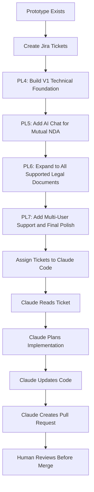
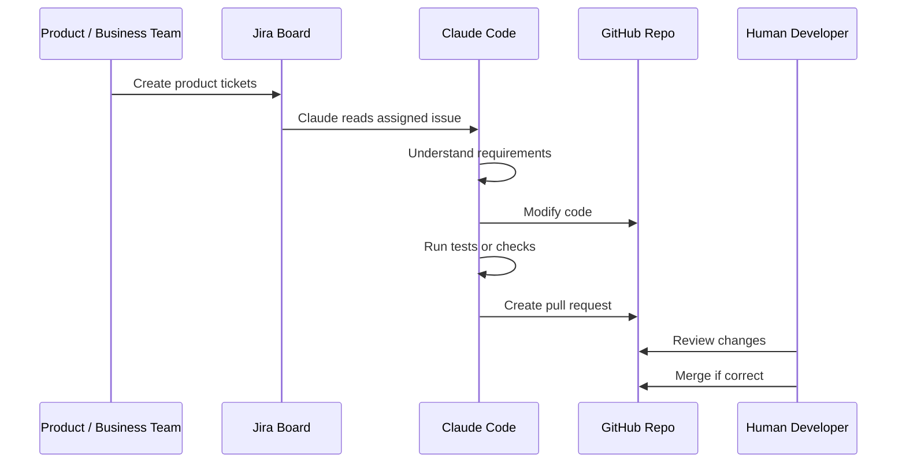

# 061 - Day 5 - Setting Up Jira Tickets for Claude Code to Build Our V1 Product

## Lesson Information

| Item       | Details                                                       |
| ---------- | ------------------------------------------------------------- |
| Lesson     | 061                                                           |
| Duration   | 8 minutes                                                     |
| Week       | Week 2 - Claude Code & Vibe Engineering                       |
| Module     | Week 2 Day 5 - SaaS Legal Assistant                           |
| Main Topic | Creating Jira tickets for Claude Code to build the V1 product |

---

## Main Idea

This lesson shows how to prepare a set of Jira tickets that Claude Code can use to build the first real version of a SaaS Legal Assistant product.

Instead of giving Claude Code one vague instruction like “build the whole app,” the product is divided into smaller Jira tickets. Each ticket describes a focused piece of work, making it easier for Claude Code to understand, plan, implement, and later create a pull request.

---

## Learning Objectives

By the end of this lesson, learners should be able to:

* Understand how to break a V1 product into manageable Jira tickets.
* Write clear ticket descriptions for an AI coding agent.
* Separate business requirements from technical implementation details.
* Understand why small, well-scoped tickets produce better AI-generated code.
* Prepare Jira issues that can later be assigned to Claude Code.

---

## Why This Lesson Matters

When working with AI coding agents, the quality of the input directly affects the quality of the output.

A vague ticket usually creates vague implementation.
A clear ticket gives Claude Code a better chance of building the correct feature.

This lesson is important because it connects product planning with AI-assisted software development. Jira becomes the bridge between the business idea and the coding agent.

---

## Core Concept

### Jira Tickets as AI Instructions

A Jira ticket is not only a task for a human developer. In an AI coding workflow, it also becomes a structured prompt for the coding agent.

A good ticket should explain:

* What needs to be built.
* Why it is needed.
* What should not be built yet.
* What the expected behavior should be.
* How the work fits into the larger product roadmap.

---

## Product Context

The team is building a **SaaS Legal Assistant**.

The prototype already exists, but now the project needs to move toward a more complete V1 product.

The instructor creates several Jira tickets to guide the next development steps.

---

## Jira Tickets Created in This Lesson

| Ticket | Title                                          | Purpose                                                          |
| ------ | ---------------------------------------------- | ---------------------------------------------------------------- |
| PL4    | From Prototype, Build Foundation of V1 Product | Upgrade the prototype into a proper technical foundation         |
| PL5    | Add AI Chat, But Still Just Mutual NDA         | Replace form-based input with free-form AI chat                  |
| PL6    | Expand to All Supported Legal Document Types   | Support every legal document type that has a template            |
| PL7    | Support Multiple Users and Other Final Polish  | Add sign-in, document history, SaaS polish, and legal disclaimer |

---

## Ticket PL4 - From Prototype, Build Foundation of V1 Product

### Goal

Upgrade the prototype so that it becomes the technical foundation for the full V1 product.

### Description

The product should be upgraded from a prototype into a proper V1 technical foundation. This includes:

* Frontend structure.
* Backend structure.
* Temporary database.
* Scripts to start and stop the application.
* No major product feature changes yet.

### Important Constraint

Only include a fake login screen for now.

There should be:

* No real authentication.
* No real user account system.
* A simple flow that lets the user enter the platform.

### Why This Ticket Is Useful

This ticket is mostly technical. It prepares the project for future development without changing the user-facing product too much.

It gives Claude Code a clear foundation-building task instead of asking it to build multiple product features at once.

---

## Ticket PL5 - Add AI Chat, But Still Just Mutual NDA

### Goal

Change the way users interact with the product.

Instead of answering a fixed series of questions, users should interact through a free-form AI chat.

### Description

The product should allow the user to chat with an AI. The AI should:

* Ask about the legal document.
* Ask questions related to the required fields.
* Collect information from the user.
* Populate the document based on the user’s answers.

### Important Scope

At this stage, the product still only needs to support the **Mutual NDA** document.

The instructor intentionally avoids mentioning specific technical details such as:

* Cerebras.
* Structured outputs.
* Model implementation.
* Backend architecture.

This keeps the ticket written from a product/business perspective and allows the engineering agent to decide how to implement it.

---

## Ticket PL6 - Expand to All Supported Legal Document Types

### Goal

Expand the product beyond Mutual NDA.

The product should support every legal document type for which the team already has a template.

### Description

The product should:

* Detect which legal document the user wants.
* Generate supported legal document types.
* Use existing templates.
* Handle unsupported document requests politely.

### Unsupported Document Behavior

If the user asks for a document type that is not supported, the platform should:

1. Explain that the system cannot generate that document yet.
2. Offer the closest supported document type.
3. Guide the user back toward a valid option.

### Why This Ticket Matters

This ticket moves the product from a single-document demo to a broader legal document assistant.

It also teaches Claude Code how to handle edge cases instead of failing silently.

---

## Ticket PL7 - Support Multiple Users and Other Final Polish

### Goal

Add user-facing polish and prepare the app to feel like a professional SaaS product.

### Description

The product should include:

* A proper sign-in screen.
* A proper sign-up screen.
* The ability for users to register.
* The ability for users to return to the platform.
* Storage of previously generated documents.
* A document history view.
* Professional SaaS-style UI polish.
* A disclaimer that generated documents are drafts and should be reviewed legally.

### Temporary Database Constraint

The database does not need to be production-ready yet.

It can be temporary and may reset every time the server restarts.

### Legal Disclaimer Requirement

The product should clearly state that:

> Generated documents should be considered drafts and are subject to legal review.

This is important because the product is dealing with legal documents, and users should not treat AI-generated output as final legal advice.

---

## Jira Ticket Planning Flow



---

## How the Tickets Build on Each Other

| Step | Focus                         | Result                                          |
| ---- | ----------------------------- | ----------------------------------------------- |
| 1    | Technical foundation          | The app becomes easier to extend                |
| 2    | AI chat UX                    | The user experience becomes more natural        |
| 3    | More legal document types     | The product becomes more useful                 |
| 4    | Multi-user support and polish | The product starts to feel like a real SaaS app |

---

## Good Ticket Writing Principles

### 1. Keep Tickets Small Enough

Each ticket should be focused enough that Claude Code can understand and complete it.

Bad example:

```text
Build the whole SaaS Legal Assistant product.
```

Better example:

```text
Add a free-form AI chat flow for the Mutual NDA document.
```

---

### 2. Separate Product Requirements from Technical Decisions

The instructor writes PL5 in business language instead of technical language.

This is useful because business stakeholders usually care about outcomes, not implementation details.

For example:

```text
The AI asks the user questions and populates the document based on the responses.
```

This is better than prematurely saying:

```text
Use structured outputs with a specific inference provider and JSON schema.
```

Technical details can be handled later by the engineering workflow.

---

### 3. Add Constraints Clearly

A good ticket should also say what should not be built yet.

For example, in PL4:

```text
Only have a fake login screen for now. No authentication.
```

This prevents Claude Code from overbuilding.

---

### 4. Include Edge Cases

PL6 includes an important edge case:

```text
If the user asks for an unsupported document, explain that we cannot generate it and offer the closest supported document.
```

This makes the product behavior more robust.

---

### 5. Include Legal and Product Safety Notes

PL7 includes a legal disclaimer requirement.

This is important because AI-generated legal documents should not be presented as final legal advice.

---

## Suggested Acceptance Criteria

Although the instructor mainly writes descriptions, each Jira ticket would become stronger with acceptance criteria.

### PL4 Acceptance Criteria

* The project has a clean frontend and backend structure.
* The app can be started and stopped using scripts.
* A temporary database is available.
* The existing prototype functionality still works.
* A fake login screen exists.
* No real authentication is added.

### PL5 Acceptance Criteria

* The user can interact with the product through a chat interface.
* The AI asks questions related to the Mutual NDA.
* The system collects field values from user responses.
* The generated NDA is populated using chat responses.
* The old question-by-question flow is replaced or hidden.

### PL6 Acceptance Criteria

* The app supports all legal document types with available templates.
* The user can request different supported document types.
* Unsupported document requests are handled gracefully.
* The app suggests the closest supported document type when possible.

### PL7 Acceptance Criteria

* Users can access sign-in and sign-up screens.
* Users can register and return to the platform.
* Previously generated documents are stored temporarily.
* Users can view prior generated documents.
* The UI looks polished and SaaS-like.
* A legal draft disclaimer is shown clearly.
* Temporary data reset on server restart is acceptable.

---

## Claude Code Setup Check

Before assigning work to Claude Code, the instructor checks the Claude Code context.

The project has:

* Atlassian MCP server.
* GitHub MCP server.
* Project skills.
* Plugins.
* Cerebras inference project skill.

The instructor also reauthenticates with Atlassian because the Jira connection may expire.

---

## Claude Code Workflow



---

## Key Lesson

The most important lesson is:

> Claude Code works better when the work is broken into clear, small, well-scoped Jira tickets.

Instead of asking the AI to build an entire product at once, the team creates a step-by-step product roadmap inside Jira.

Each ticket gives Claude Code a focused mission.

---

## Common Mistakes to Avoid

| Mistake                      | Why It Is a Problem                    |
| ---------------------------- | -------------------------------------- |
| Writing vague tickets        | Claude may misunderstand the task      |
| Making tickets too large     | The agent may overbuild or lose focus  |
| Mixing too many features     | Harder to test and review              |
| Forgetting constraints       | Claude may build unnecessary features  |
| Skipping acceptance criteria | Harder to know when the ticket is done |
| No human review              | AI-generated code may contain mistakes |

---

## Practical Takeaways

* Treat Jira tickets as structured prompts for AI coding agents.
* Break the product roadmap into small development steps.
* Give each ticket a clear goal.
* Add constraints when something should not be built yet.
* Include edge cases and user behavior.
* Add acceptance criteria before assigning the work.
* Always review Claude Code’s output before merging.

---

## Summary

In this lesson, the instructor sets up four Jira tickets for the V1 SaaS Legal Assistant product.

The tickets move the product from prototype to a more complete SaaS application:

1. Build the V1 technical foundation.
2. Add AI chat for Mutual NDA.
3. Expand to all supported legal document templates.
4. Add multiple users, document history, polish, and legal disclaimer.

The lesson demonstrates that Jira is not just a project management tool. In an AI coding workflow, Jira becomes the instruction layer that guides Claude Code from business requirements to actual implementation.

A clear Jira ticket leads to clearer planning, better code, easier review, and a more reliable AI-assisted development process.

---

# Bài luyện tập

## Mục tiêu


## Đề bài


## Yêu cầu hoàn thành

- [ ] 
- [ ] 
- [ ] 

## Kết quả / lời giải


## Ghi chú
