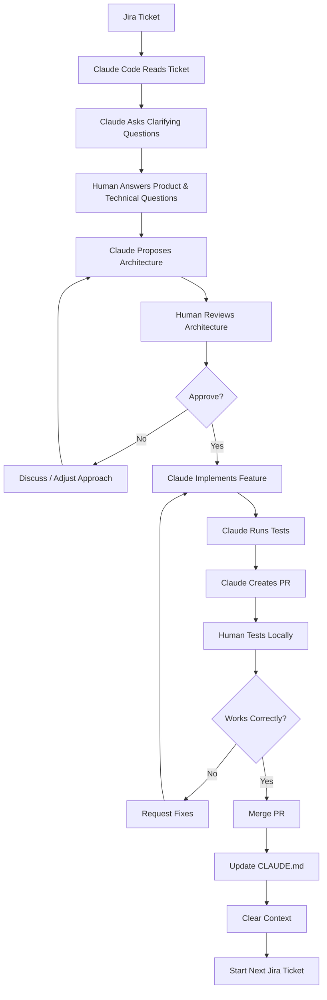
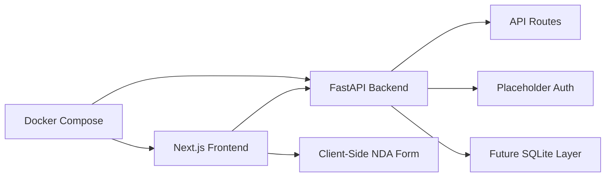
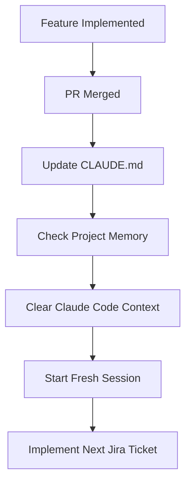
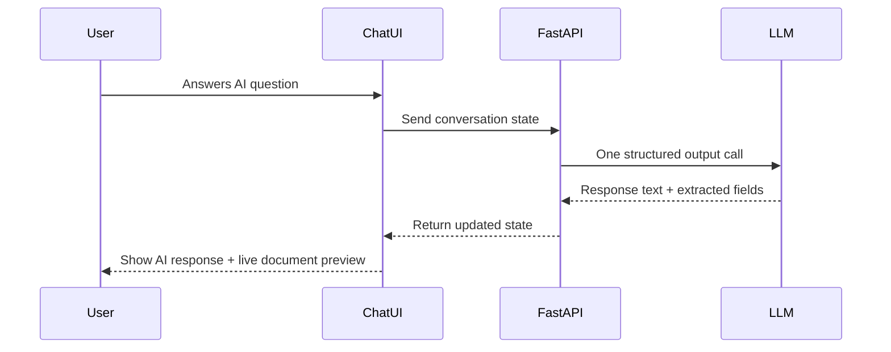

# 062 - Day 5 - Building Features with Claude Code, Jira, and FastAPI

## Lesson Information

| Item       | Details                                                                                                         |
| ---------- | --------------------------------------------------------------------------------------------------------------- |
| Lesson     | 062                                                                                                             |
| Duration   | 13 minutes                                                                                                      |
| Week       | Week 2 - Claude Code & Vibe Engineering                                                                         |
| Module     | Week 2 Day 5 - SaaS Legal Assistant                                                                             |
| Main Topic | Building product features with Claude Code, Jira tickets, FastAPI, frontend integration, testing, and PR review |

---

## Main Idea

This lesson demonstrates how to use **Claude Code** as a feature development agent connected to **Jira**, **FastAPI**, and a frontend codebase.

Instead of manually describing every implementation detail, the developer asks Claude Code to:

1. Read a Jira ticket.
2. Understand the feature requirements.
3. Ask clarification questions.
4. Propose an architecture.
5. Implement the backend and frontend changes.
6. Run tests.
7. Create a pull request.
8. Let the human review, test, and merge.

The key lesson is not simply “let AI build the feature.”
The real lesson is learning how to **manage the AI coding agent like a technical lead**.

---

## Learning Objectives

By the end of this lesson, learners should be able to:

* Use Claude Code to implement a feature from a Jira ticket.
* Guide Claude Code through clarification questions before coding.
* Review architecture proposals before allowing implementation.
* Understand how FastAPI can be added as a backend layer to a SaaS project.
* Test AI-generated changes locally before merging.
* Maintain project memory using `CLAUDE.md`.
* Avoid context degradation by clearing and resetting Claude Code at the right time.
* Handle MCP reauthentication when Claude Code loses access to Jira or Atlassian.

---

## Core Workflow



---

## Feature Development Flow

### Step 1: Start Feature Development from Jira

The developer begins with a simple command:

```bash
/feature-dev
```

Then asks Claude Code:

```text
Implement Jira ticket PL4 and make a PR.
```

Claude Code connects to Atlassian, reads the Jira ticket, and begins planning the implementation.

---

## Important Clarification Questions

Claude Code asks several questions before coding. This is a good sign because the agent is trying to avoid incorrect assumptions.

### Example Questions

| Claude Code Question                                     | Human Decision      |
| -------------------------------------------------------- | ------------------- |
| Should authentication be functional or placeholder only? | Placeholder only    |
| Should the NDA form data be persisted to the backend?    | Keep it client-side |
| Should the architecture proceed as proposed?             | Yes, after review   |

---

## Key Concept 1: AI Should Ask Before It Builds

A strong coding agent should not immediately start modifying files when the ticket has ambiguity.

Good Claude Code behavior includes:

* Reading the Jira ticket.
* Detecting missing requirements.
* Asking product-level questions.
* Asking architecture-level questions.
* Waiting for human approval before implementation.

This makes the workflow safer and more professional.

---

## Key Concept 2: The Human Is Still the Technical Lead

Even if Claude Code writes the code, the human must still make decisions.

In the lesson, the developer reviews the architecture proposal carefully:

* Static frontend with Next.js.
* FastAPI backend.
* `uv` for Python project management.
* SQLite prepared for future use.
* Placeholder authentication.
* Single container multistage build.
* `pyproject.toml` included.
* Database files added to `.gitignore`.
* Docker Compose support.

The developer does not blindly accept the proposal.
They inspect it, reason through it, and then approve it.

---

## Architecture Overview



---

## Target Architecture

| Layer          | Technology              | Purpose                             |
| -------------- | ----------------------- | ----------------------------------- |
| Frontend       | Next.js                 | User interface and NDA form         |
| Backend        | FastAPI                 | API routes and backend structure    |
| Python Tooling | uv + pyproject.toml     | Dependency and project management   |
| Database       | SQLite                  | Prepared for future persistence     |
| Auth           | Placeholder routes      | Foundation for later authentication |
| Deployment     | Docker / Docker Compose | Local and containerized running     |
| PR Workflow    | GitHub PR               | Reviewable code change              |

---

## Key Concept 3: Review the Architecture Before Coding

Claude Code proposes an architecture and asks:

```text
Does this architecture approach look good to proceed with the implementation?
```

This is the correct checkpoint.

Before approving, the developer checks:

* Is the backend structure clean?
* Are routes separated properly?
* Is `main.py` too monolithic?
* Is dependency management correct?
* Is Docker setup reasonable?
* Are generated files ignored properly?
* Does the implementation match the Jira ticket?

This is where the human prevents bad architecture from entering the codebase.

---

## Implementation Result

Claude Code reports that:

* The FastAPI backend has been added.
* API endpoints are implemented.
* Tests have passed.
* A PR has been created.
* The application can run locally.
* The previous frontend behavior still works.

The developer then tests manually.

---

## Local Testing

The developer runs the start script:

```bash
scripts/start-mac.sh
```

The app starts locally and is tested through the browser.

### Manual Test Checklist

| Test                  | Expected Result                         |
| --------------------- | --------------------------------------- |
| App opens locally     | The UI loads correctly                  |
| NDA form still works  | User can enter data                     |
| Location input works  | Example: New York appears correctly     |
| Download button works | File downloads successfully             |
| Backend route works   | App runs through the new infrastructure |
| No visible regression | Existing behavior remains intact        |

---

## Why Manual Testing Still Matters

Even when Claude Code says:

```text
All 76 tests pass.
```

The human still needs to test the product manually.

Automated tests are useful, but they do not always catch:

* Broken UI behavior.
* Incorrect user flow.
* Missing download behavior.
* Bad local startup scripts.
* Integration issues between frontend and backend.
* Wrong assumptions from the Jira ticket.

---

## Merging the PR

After testing, the developer asks Claude Code:

```text
Please merge the PR locally, push to main, and switch branch to main.
```

This completes the feature workflow.

---

## Updating Project Memory

Before moving to the next ticket, the developer updates `CLAUDE.md`.

Example instruction:

```text
Please add some concise details to the end of CLAUDE.md with an update on what has been implemented.

Also change anything that is no longer accurate in CLAUDE.md.
```

This is important because `CLAUDE.md` acts as the project memory for future Claude Code sessions.

---

## Why Updating CLAUDE.md Matters

Claude Code has limited context.
As the conversation gets longer, context fills up and may eventually need to be compacted.

Compaction can sometimes cause the model to forget details that still matter.

Updating `CLAUDE.md` helps preserve:

* Current architecture.
* Implemented features.
* Important technical decisions.
* Current project status.
* What is no longer true.
* How future tickets should be approached.

---

## Context Management Workflow



---

## Clearing Context

After updating `CLAUDE.md`, the developer clears Claude Code context:

```bash
/clear
```

This gives the agent a fresh working context while preserving important project memory in `CLAUDE.md`.

This is safer than letting the session become too long and relying only on automatic compaction.

---

## Handling MCP Reauthentication

When starting the next ticket, Claude Code may appear stuck while trying to read Jira.

This can mean the Atlassian MCP connection needs reauthentication.

### Fix

```bash
/mcp
```

Then:

1. Select Atlassian.
2. Reauthenticate.
3. Approve access in the browser.
4. Return to Claude Code.
5. Retry the Jira ticket command.

---

## Implementing the Next Ticket: PL5

After clearing context and reauthenticating MCP, the developer starts the next ticket:

```text
Implement Jira ticket PL5 and make a PR.
```

Claude Code again asks useful product questions.

---

## Product Questions for PL5

| Question                                                          | Decision                              |
| ----------------------------------------------------------------- | ------------------------------------- |
| Should the chat UI replace the form or coexist with it?           | Replace the form entirely             |
| Should the document preview update live or only after completion? | Live updates                          |
| How should the AI conversation begin?                             | AI greets and asks the first question |
| What happens when all required fields are filled?                 | AI confirms and shows download        |

These are strong questions because they clarify the user experience before implementation.

---

## Architecture Debate for PL5

Claude Code proposes several possible approaches:

| Approach           | Description                                         | Decision               |
| ------------------ | --------------------------------------------------- | ---------------------- |
| Minimal            | Replace NDA form with chat UI, reuse existing logic | Considered             |
| Clean Architecture | Full session management, persistence, SSE           | Too complex            |
| Pragmatic Balance  | Structured extraction, simple backend, better UX    | Preferred with changes |

The developer chooses a simple pragmatic approach:

```text
I want the simple backend, the pragmatic choice, except I only want one LLM call and no streaming because Cerebras is so fast that streaming is not necessary.

One LLM call with structured outputs, including the response, is cleaner.
```

---

## Important Technical Decision: No Streaming

Claude Code suggested streaming, but the developer rejected it.

### Reason

Streaming adds complexity:

* More backend logic.
* More frontend state handling.
* More error cases.
* More testing burden.

Since Cerebras is fast enough, the developer prefers:

* One LLM call.
* Structured output.
* Response text and extracted fields returned together.
* Simpler implementation.
* Easier debugging.

---

## Recommended LLM Interaction Design



---

## Good Prompting Pattern

A useful feature development prompt should be short but specific:

```text
Implement Jira ticket PL5 and make a PR.
Before coding, ask any necessary product or architecture questions.
Propose the architecture first and wait for approval.
Run tests before creating the PR.
```

---

## Better Prompt for Professional Use

```text
Implement Jira ticket PL5 and make a PR.

Requirements:
- Read the Jira ticket carefully.
- Ask clarification questions before coding if anything is ambiguous.
- Propose an architecture and wait for approval.
- Keep the implementation simple and maintainable.
- Avoid unnecessary streaming or persistence unless required by the ticket.
- Run all relevant tests.
- Confirm what changed before creating the PR.
```

---

## Best Practices from This Lesson

### 1. Do Not Let Claude Code Guess Important Requirements

If the ticket is unclear, Claude should ask.

Examples:

* Auth: real or placeholder?
* Data: client-side or persisted?
* UI: replace or coexist?
* Preview: live or final-only?
* LLM: streaming or single call?

---

### 2. Review Architecture Before Implementation

Never approve architecture blindly.

Check:

* Folder structure.
* Backend route design.
* Dependency management.
* Docker setup.
* Test strategy.
* Frontend/backend boundary.
* Whether the solution is too complex.

---

### 3. Prefer Simplicity Unless Complexity Is Needed

For this project, the developer avoids:

* Full session management.
* Database persistence too early.
* SSE streaming.
* Multiple LLM calls.
* Over-engineered architecture.

The chosen approach is simple, fast, and easier to maintain.

---

### 4. Always Test Locally

Do not trust “tests passed” as the final proof.

Run the app and test the user flow yourself.

---

### 5. Keep CLAUDE.md Updated

Update project memory after every major feature.

This helps future Claude Code sessions understand:

* What has been built.
* What architecture exists.
* What decisions were made.
* What assumptions are no longer valid.

---

### 6. Clear Context Between Major Tickets

A clean context helps prevent degradation.

Recommended flow:

```text
Finish feature → Merge PR → Update CLAUDE.md → Clear context → Start next ticket
```

---

## Common Mistakes to Avoid

| Mistake                               | Why It Is Dangerous                      |
| ------------------------------------- | ---------------------------------------- |
| Saying “fix everything”               | Too vague and risky                      |
| Letting Claude code without questions | Leads to wrong assumptions               |
| Skipping architecture review          | Bad structure may enter the project      |
| Trusting tests without manual testing | UI regressions may be missed             |
| Ignoring CLAUDE.md                    | Future context becomes stale             |
| Letting context get too full          | Performance may degrade after compaction |
| Adding streaming too early            | Adds complexity without clear benefit    |
| Building persistence too early        | May overcomplicate an early feature      |

---

## Practical Checklist

Before Claude Code implements a feature:

* [ ] Jira ticket is clear.
* [ ] Claude Code can access Jira through MCP.
* [ ] Claude asks clarification questions.
* [ ] Human answers product questions.
* [ ] Claude proposes architecture.
* [ ] Human reviews and approves architecture.
* [ ] Claude implements changes.
* [ ] Tests are run.
* [ ] PR is created.
* [ ] Human tests locally.
* [ ] PR is merged.
* [ ] `CLAUDE.md` is updated.
* [ ] Context is cleared before the next feature.

---

## Summary

In this lesson, Claude Code is used to build real SaaS product features from Jira tickets.

The first feature adds a FastAPI backend foundation while keeping authentication and persistence as placeholders. The developer reviews the architecture, approves the implementation, tests locally, and merges the PR.

Before moving to the next ticket, the developer updates `CLAUDE.md` and clears context to prevent context degradation.

The second ticket begins the transition from a static form to a chat-based UI. Claude Code asks product questions and proposes different architecture options. The developer chooses a simple pragmatic approach: one fast LLM call with structured outputs, no streaming, and live document preview.

The main lesson is that Claude Code can build impressive features, but the human must still guide the product decisions, review the architecture, test the result, and manage context carefully.

---

## Key Takeaways

* Claude Code works best when connected to structured tickets like Jira.
* The agent should ask questions before coding.
* Architecture review is a critical human responsibility.
* FastAPI is a strong choice for adding backend structure to a SaaS app.
* Do not add unnecessary complexity such as streaming or persistence too early.
* Always test locally before merging.
* Keep `CLAUDE.md` updated as project memory.
* Clear context between major tickets to maintain agent quality.
* The human is not just a user of Claude Code; the human is the technical lead.

---

## Reflection Questions

1. What information should a Jira ticket include so Claude Code can implement it safely?
2. When should a developer reject Claude Code’s proposed architecture?
3. Why is updating `CLAUDE.md` important before clearing context?
4. When is streaming worth the added complexity?
5. What should be tested manually even after automated tests pass?
