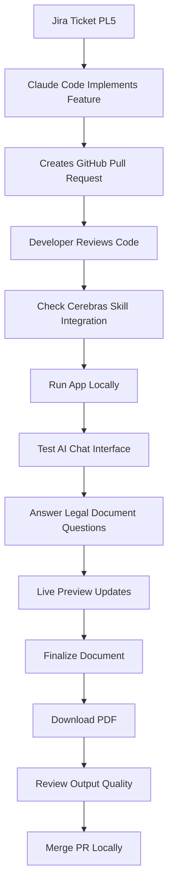
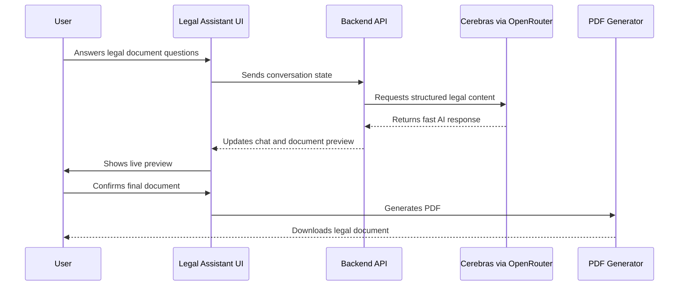

# 063 - Day 5 - Testing the AI Legal Doc Generator with Cerebras and Claude Code

## Lesson Information

| Item     | Details                                 |
| -------- | --------------------------------------- |
| Lesson   | 063                                     |
| Duration | 11 min                                  |
| Week     | Week 2 - Claude Code & Vibe Engineering |
| Module   | Week 2 Day 5 - SaaS Legal Assistant     |

---

## Main Topic

This lesson focuses on testing the AI legal document generator built with Claude Code and Cerebras. The goal is to verify that the generated legal documents work correctly, the Cerebras LLM integration behaves as expected, API errors are handled properly, and the final document can be previewed and downloaded as a PDF.

---

## Learning Objectives

By the end of this lesson, learners will be able to:

* Test an AI-powered legal document generator from end to end.
* Review a Claude Code-generated pull request before merging.
* Verify whether Claude Code correctly followed a custom LLM integration skill.
* Test Cerebras/OpenRouter API integration in a real SaaS workflow.
* Identify UX issues during testing, such as input focus and missing follow-up questions.
* Confirm that generated legal documents can be previewed and downloaded as PDF files.
* Continue an AI coding workflow across Jira tickets, GitHub PRs, and Claude Code sessions.

---

## Key Concepts

### 1. End-to-End Testing of an AI Legal Document Generator

The lesson demonstrates how to test the full product flow after Claude Code implements a Jira ticket.

The tested flow includes:

1. Starting the local app.
2. Opening the legal assistant interface.
3. Answering the AI’s questions.
4. Watching the live document preview update.
5. Finalizing the document.
6. Downloading the generated PDF.
7. Reviewing the output quality.

This is important because AI-generated features should not only compile successfully; they must also work correctly for real users.

---

### 2. Reviewing the Generated Pull Request

Claude Code creates a pull request for Jira ticket `PL5`.

The instructor reviews the PR in GitHub and checks:

* Number of changed files.
* Lines of code added.
* Backend API changes.
* Pydantic data models.
* LLM integration code.
* Whether the implementation followed the custom skill instructions.
* Whether the correct model and request body were used.

The key validation point is that Claude Code correctly used the `extra_body` configuration from the custom Cerebras skill.

---

### 3. Cerebras LLM Integration

The lesson shows that Claude Code successfully integrated the legal document generator with Cerebras through OpenRouter.

The AI response is extremely fast, which leads to an important product decision:

> Streaming may not be necessary if the model returns complete responses almost instantly.

In this case, Cerebras provides such fast responses that the first returned chunk effectively contains the full answer.

---

### 4. Live Preview and PDF Download

The legal document generator provides a live preview on the right side of the interface.

As the user answers questions, the document preview fills in automatically.

At the end of the conversation, the app enables a **Download PDF** button. The generated PDF can then be opened and reviewed.

This confirms that the product has moved beyond a prototype and now has a usable document generation workflow.

---

## Testing Flow Diagram



---

## Demo Summary

### Step 1: Review the Pull Request

Claude Code completes Jira ticket `PL5` and creates a pull request.

The PR includes:

* AI chat interface.
* Backend API.
* Cerebras LLM integration.
* Structured legal document outputs.
* Live preview updates.
* PDF generation and download.

The instructor checks the code and confirms that Claude Code correctly used the custom skill configuration.

---

### Step 2: Start the Local App

The instructor stops any existing server and starts the local development environment again.

```bash
scripts/stop-mac
scripts/start-mac
```

After the app starts, the interface is opened in the browser.

---

### Step 3: Test the NDA Generator

The AI assistant begins by helping the user create a mutual non-disclosure agreement.

Example conversation:

```text
AI: I'll help you create a mutual non-disclosure agreement. What's the purpose?

User: I'm evaluating a business relationship.

AI: When would you like it to take effect?

User: Today.

AI: How long should it last?

User: Three years, please.
```

The AI responds very quickly, confirming that the Cerebras integration is working well.

---

### Step 4: Identify UX Issues

During testing, the instructor notices two UX problems:

1. The text input field does not automatically regain focus after each answer.
2. The AI sometimes stops asking follow-up questions even when it still needs more information.

These issues are important because they affect the user experience and conversation flow.

The instructor later asks Claude Code to fix both issues in the next ticket.

---

### Step 5: Download the PDF

After the document is finalized, the **Download PDF** button appears.

The instructor downloads and opens the PDF successfully.

This confirms that the legal document generator can produce a usable output file.

---

## Product Workflow After PL5



---

## Merge and Context Management

After testing PL5, the instructor asks Claude Code to:

```text
Merge the PR locally, push, and switch to the main branch.
Then check that CLAUDE.md is up to date with the project status.
```

Claude Code confirms that the project context file is up to date.

The instructor then checks context usage with:

```text
/context
```

Because the context window is almost full, the instructor clears the session:

```text
/clear
```

After clearing, the instructor reauthenticates MCP:

```text
/mcp
```

Then they approve the Jira connection again.

---

## Moving to Jira Ticket PL6

After PL5 is merged, the instructor starts the next ticket:

```text
Implement ticket PL6.

Also, please make a couple of fixes:
1. Ensure that after answering a question, the UI focus goes back to the text input field.
2. Ensure that the AI always asks a follow-on question if it needs more information.

When PL6 and these enhancements are done, test everything and make a PR.
```

PL6 expands the app to support more legal document types.

---

## Testing PL6

After Claude Code completes PL6, the instructor tests the updated app.

The app now asks:

```text
What type of document do you need?
```

The user chooses:

```text
Cloud SaaS Agreement
```

The AI then asks structured questions, such as:

* Provider company name.
* Customer company name.
* Service description.
* Start date.
* Governing law.
* Subscription period.
* Support terms.
* Pricing structure.
* Invoice terms.

The live preview updates as the answers are provided.

Example:

```text
User: Please use invented placeholder names for both companies.
User: The cloud service is an AI assistant.
User: Today, please.
User: New York, please.
User: $10,000 per annum, invoice net 30.
```

The document is finalized and the PDF download works successfully.

---

## PL6 Improvements

Claude Code successfully implements:

* Support for multiple legal document types.
* Improved follow-up question behavior.
* Automatic input refocus after answering.
* Better product flow.
* Additional quality improvements based on review.
* A new GitHub pull request for PL6.

The instructor confirms that the product now feels much more complete.

---

## Final Result

By the end of the lesson, the SaaS Legal Assistant can:

* Generate legal documents through an AI chat interface.
* Use Cerebras via OpenRouter for fast LLM responses.
* Ask structured follow-up questions.
* Update a live document preview.
* Generate a downloadable PDF.
* Support multiple legal document types.
* Track work through Jira tickets and GitHub PRs.
* Continue development safely using Claude Code, MCP, and context management.

---

## Why This Lesson Matters

This lesson is important because it shows the transition from implementation to real product validation.

Claude Code does not just write code. The developer still needs to:

* Review the generated PR.
* Check whether custom instructions were followed.
* Test the app manually.
* Identify UX issues.
* Ask for targeted fixes.
* Merge only after confirming the feature works.

This is a practical example of professional AI-assisted software development.

---

## Key Takeaways

* AI coding agents can implement complex SaaS features from Jira tickets.
* Pull requests still need human review.
* Custom skills can guide Claude Code to use specific API patterns.
* Cerebras can provide very fast LLM responses for chat-based workflows.
* Fast model responses may reduce the need for streaming.
* Manual testing is essential for catching UX issues.
* Live preview and PDF download are critical features for a legal document generator.
* Context management is important when working across long Claude Code sessions.
* Jira, GitHub, MCP, and Claude Code can form a complete professional workflow.

---

## Practice Task

Try to reproduce the workflow from this lesson:

1. Create a Jira ticket for a legal document generator feature.
2. Ask Claude Code to implement the ticket.
3. Review the generated pull request.
4. Check whether the LLM integration follows your project rules.
5. Run the app locally.
6. Test the document generation flow.
7. Identify at least two UX issues.
8. Ask Claude Code to fix them.
9. Generate a PDF.
10. Merge the PR only after successful testing.

---

## Suggested Developer Checklist

```markdown
- [ ] PR created from the correct Jira ticket
- [ ] Backend API works
- [ ] LLM integration uses the correct model
- [ ] Custom skill instructions were followed
- [ ] Chat flow asks enough follow-up questions
- [ ] Input field refocuses after each answer
- [ ] Live preview updates correctly
- [ ] Final document can be generated
- [ ] PDF download works
- [ ] CLAUDE.md or project context is updated
- [ ] PR is reviewed before merge
```

---

## Lesson Summary

In this lesson, the instructor tests the AI Legal Document Generator implemented by Claude Code. The app successfully integrates Cerebras through OpenRouter, provides a fast AI chat experience, updates a live legal document preview, and generates downloadable PDFs.

The first test exposes a few UX issues, such as missing input focus and incomplete follow-up questioning. These issues are then passed into the next Jira ticket, PL6, where Claude Code expands the product to support more legal document types and improves the conversation flow.

By the end, the SaaS Legal Assistant has become a functional AI-powered legal document generation product with a professional Jira-to-PR development workflow.

---

# Bài luyện tập

## Mục tiêu


## Đề bài


## Yêu cầu hoàn thành

- [ ] 
- [ ] 
- [ ] 

## Kết quả / lời giải


## Ghi chú
