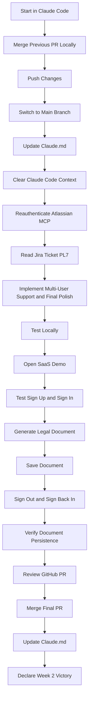
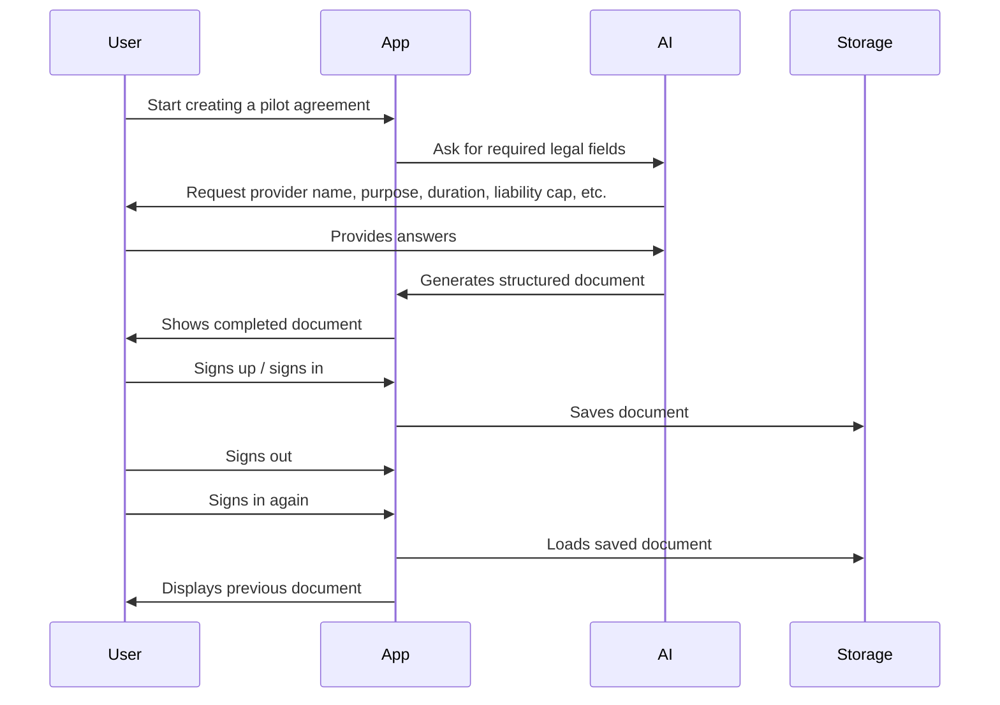

# 064 - Day 5 - Final PR Merge, Full SaaS Demo & Week 2 Victory in Claude Code

## Lesson Information

| Item     | Details                                 |
| -------- | --------------------------------------- |
| Lesson   | 064                                     |
| Duration | 15 min                                  |
| Week     | Week 2 - Claude Code & Vibe Engineering |
| Module   | Week 2 Day 5 - SaaS Legal Assistant     |

---

## Main Topic

This lesson completes the SaaS Legal Assistant project by merging the final pull request, testing the full application, reviewing the finished SaaS demo, updating project documentation, and celebrating the completion of Week 2.

By the end of this lesson, learners have experienced a professional Claude Code workflow from Jira ticket to GitHub pull request, review, merge, and final demo.

---

## Learning Objectives

After this lesson, learners will be able to:

* Merge a final feature PR after local review and testing.
* Use Claude Code to update project status documentation.
* Validate a full SaaS application workflow from user sign-up to document generation.
* Understand the importance of manual review even when AI agents complete most of the work.
* Reflect on the complete Week 2 workflow: Jira, GitHub, MCP, plugins, skills, structured outputs, and Claude Code.

---

## Key Concepts

### 1. Final PR Merge Workflow

The lesson starts by asking Claude Code to merge the pull request locally, push the result, and switch the branch back to `main`.

This reinforces a professional Git workflow:

```bash
merge PR locally
push changes
switch back to main
update project documentation
```

The goal is not only to let the AI complete the task, but also to keep the repository clean and aligned with the latest project status.

---

### 2. Context Reset Before the Final Ticket

Before starting the final Jira ticket, the instructor clears the Claude Code context.

This is important because a long AI coding session can accumulate too much context. If the context has been compacted, some details may be compressed or distorted.

A clean context helps Claude Code work with a fresh and reliable project state.

```bash
/clear
/context
/mcp
```

The instructor also reauthenticates the Atlassian MCP connection before continuing with Jira.

---

### 3. Implementing the Final Jira Ticket: PL7

The final ticket is `PL7`, focused on:

* Supporting multiple users
* Adding final polish
* Improving the SaaS experience
* Testing the final application
* Submitting the final pull request

Claude Code reads the Jira ticket, implements the requested changes, tests the app, and creates a GitHub pull request.

The result is a large feature PR with around 1,500 lines of code added across 22 files.

---

## Workflow Diagram



---

## Full SaaS Demo

The completed SaaS Legal Assistant now includes a polished user experience.

The demo shows that users can:

* Use the app without signing in at first.
* Sign up from the document flow.
* Continue from the previous context after signing in.
* Generate a pilot agreement.
* Provide missing document details through a conversational flow.
* Download the generated document as a PDF.
* Save the document.
* Sign out and sign back in.
* Open saved documents from the user account.

This is a strong example of a product-led growth pattern, where users can experience value before being asked to create an account.

---

## Example User Flow



---

## What Worked Well

The final application exceeded expectations in several areas:

* The UI looked polished and professional.
* The sign-up and sign-in flow worked smoothly.
* The app preserved context when the user signed up during the document creation flow.
* Document persistence worked correctly.
* Saved documents could be reopened after signing out and signing back in.
* The AI-generated legal assistant flow felt fast and useful.
* Claude Code successfully handled a large implementation with minimal human intervention.

---

## Important Critique

Even though the result was impressive, the instructor highlights that AI coding agents are not perfect.

Two issues were noticed:

1. The final AI response became slightly silent or unclear at the end of the document generation flow.
2. The Jira ticket likely requested a legal disclaimer, but the final app did not clearly show one.

This is a key lesson: even when Claude Code writes good code and passes tests, human review is still required.

AI agents can build quickly, but developers must still verify that all requirements are actually satisfied.

---

## Professional AI Coding Workflow

This lesson demonstrates a complete professional workflow:


The developer remains in control throughout the process.

Claude Code does the heavy implementation work, but the human developer still:

* Defines the tickets
* Reviews the output
* Answers clarification questions
* Tests the application
* Checks requirement coverage
* Approves the merge
* Updates project documentation

---

## Tools and Techniques Used

| Tool / Technique   | Purpose                                           |
| ------------------ | ------------------------------------------------- |
| Claude Code        | Main AI coding agent                              |
| Jira               | Project and ticket management                     |
| Atlassian MCP      | Connect Claude Code to Jira                       |
| GitHub             | Pull requests, review, and merge workflow         |
| Feature Dev Plugin | Helps Claude Code implement feature tickets       |
| Structured Outputs | Used to map AI responses into document fields     |
| Cerebras Skill     | Provides fast inference for AI responses          |
| Claude.md          | Stores project status and context for future work |

---

## Why This Lesson Matters

This lesson is important because it completes the Week 2 goal: becoming productive with Claude Code in a professional software workflow.

The project is no longer just a simple prototype. It now demonstrates:

* Multi-user behavior
* Authentication
* Saved documents
* Legal document generation
* PDF download
* GitHub PR workflow
* Jira-driven development
* AI-assisted implementation
* Human-guided review

This proves that AI coding agents can be used to build meaningful SaaS products quickly when the task is well scoped and well managed.

---

## Week 2 Victory

The instructor declares victory because the project successfully demonstrates an end-to-end AI-assisted development workflow.

Week 2 focused on becoming professional with Claude Code, Jira, GitHub, MCP, plugins, and structured development practices.

The learner is now expected to repeat the process by building their own SaaS product.

---

## Assignment

Build your own SaaS product using the same workflow.

Recommended steps:

1. Choose a simple SaaS idea.
2. Break the product into Jira tickets or GitHub issues.
3. Use Claude Code to implement one ticket at a time.
4. Review every pull request.
5. Test the app locally.
6. Merge only after confirming the feature works.
7. Update project documentation.
8. Share your result publicly, especially on LinkedIn.

The key is to stay at the helm. Claude Code can implement quickly, but you still guide the product, review the output, and make final decisions.

---

## Key Takeaways

* Claude Code can build complex SaaS features quickly when tickets are clear.
* Jira and GitHub integration creates a professional AI development workflow.
* Context clearing is useful before starting major new tasks.
* AI-generated code still needs human review.
* A polished SaaS demo can be built rapidly with the right structure.
* Product-led growth patterns can emerge naturally from AI-assisted development.
* Week 2 marks a major milestone: the learner now has a professional Claude Code workflow.

---

## Summary

In this final Week 2 lesson, the instructor completes the SaaS Legal Assistant project by merging the final PR, implementing the last Jira ticket, testing the full app, reviewing the finished SaaS demo, and updating `Claude.md`.

The completed app supports sign-up, sign-in, document generation, PDF download, saved documents, and document persistence. Although a few small issues remain, such as a missing legal disclaimer, the result is highly impressive and demonstrates the power of Claude Code when combined with Jira, GitHub, MCP, plugins, and strong human review.

This lesson closes Week 2 with a clear message: learners are now capable of using AI coding agents professionally to build real software products.

---

# Bài luyện tập

## Mục tiêu


## Đề bài


## Yêu cầu hoàn thành

- [ ] 
- [ ] 
- [ ] 

## Kết quả / lời giải


## Ghi chú
