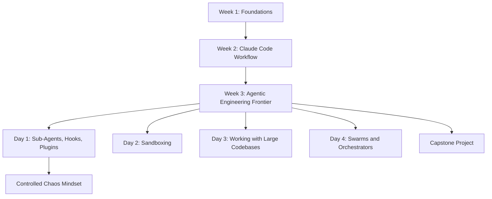
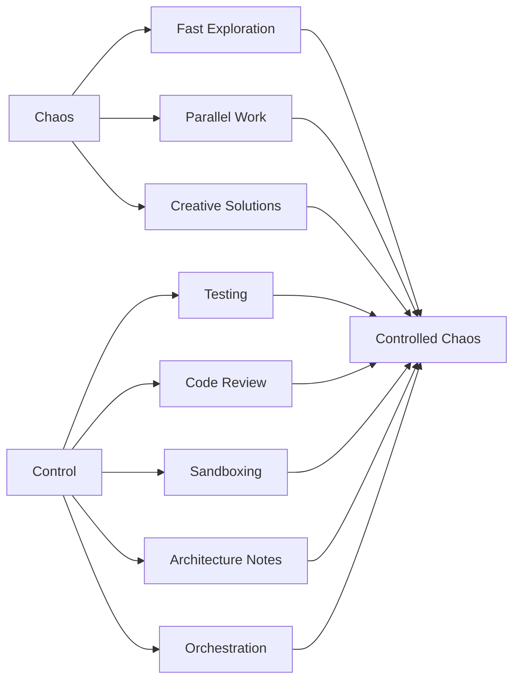
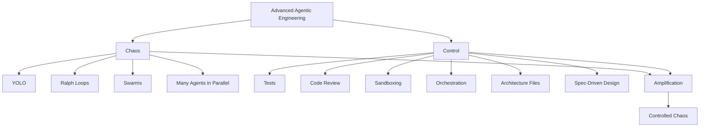
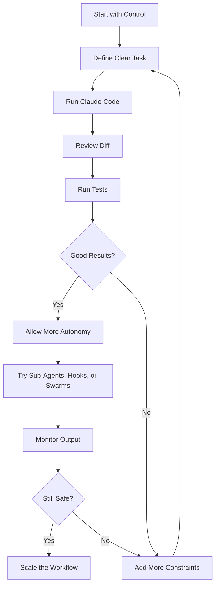
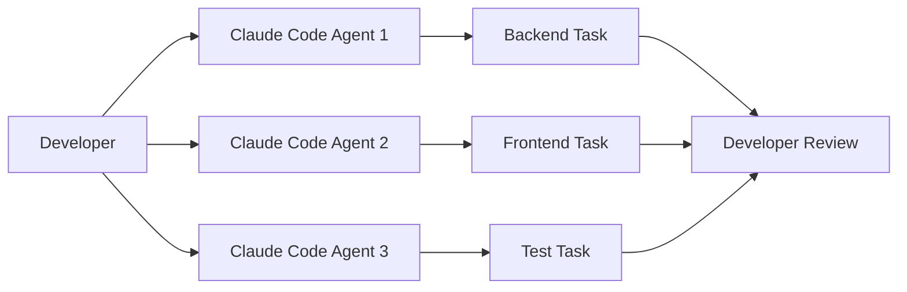
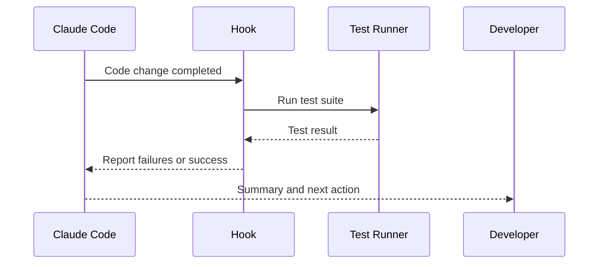
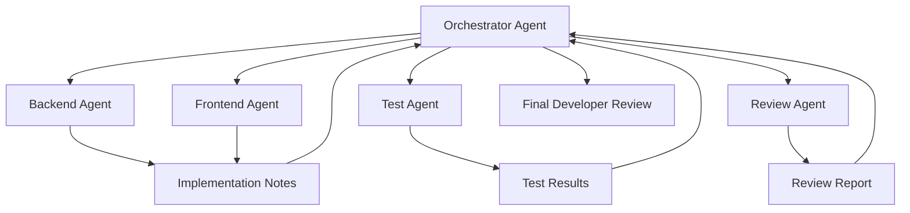
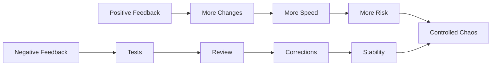
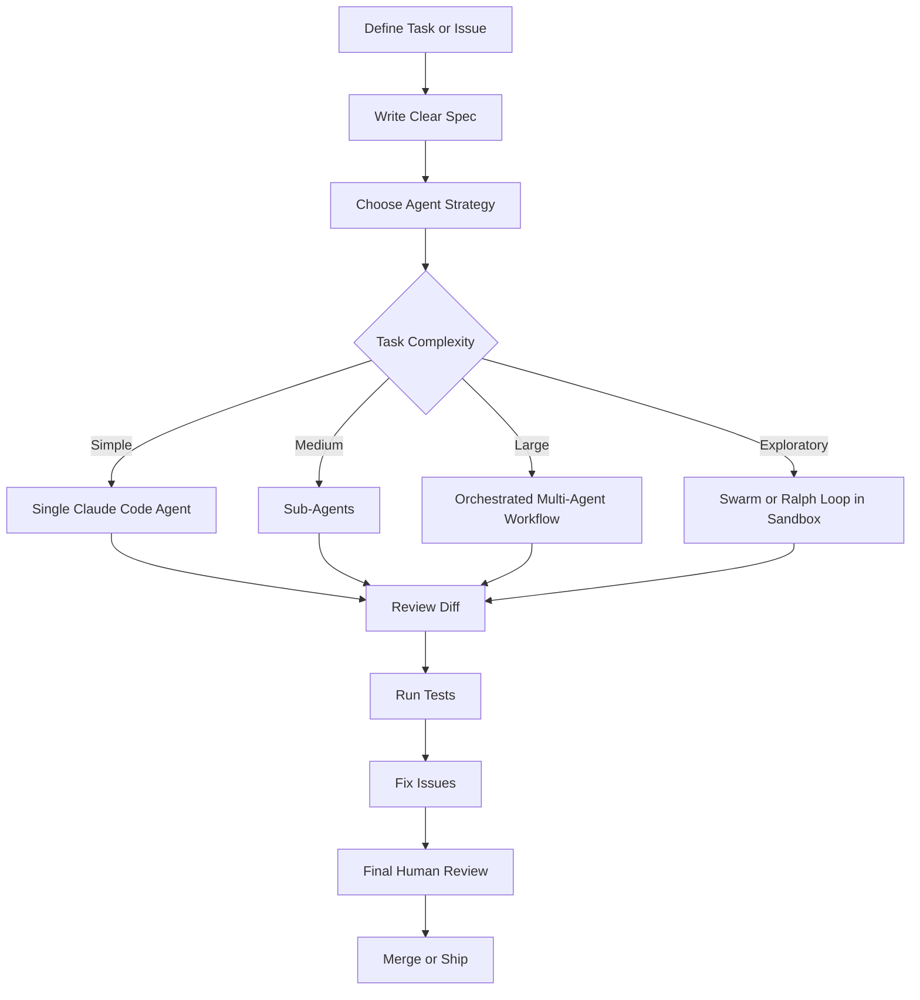

# 065 - Day 1 - Claude Code Pro: Sub-Agents, Hooks, Swarms & Controlled Chaos

## Lesson Information

| Item     | Details                                                                              |
| -------- | ------------------------------------------------------------------------------------ |
| Lesson   | 065                                                                                  |
| Duration | 9 minutes                                                                            |
| Week     | Week 3 - Agentic Engineering Frontier                                                |
| Module   | Week 3 Day 1 - Sub-Agents, Hooks, Plugins                                            |
| Topic    | Pro-level Claude Code workflows with sub-agents, hooks, swarms, and controlled chaos |

---

## Main Idea

This lesson introduces the **pro-level frontier of Claude Code**.

After learning structured Claude Code workflows in Week 2, Week 3 moves into more advanced agentic engineering patterns:

* **Sub-agents** for splitting responsibilities
* **Hooks** for triggering automatic actions
* **Swarms** for running many agents in parallel
* **Orchestration** for coordinating agent teams
* **Controlled chaos** as the main mindset for using powerful AI coding workflows safely

The key message is simple:

> AI coding agents can greatly amplify your work, but you are still accountable for the final code.

---

## Learning Objectives

By the end of this lesson, learners should be able to:

* Understand the difference between basic Claude Code usage and pro-level agentic workflows
* Explain what sub-agents, hooks, swarms, and orchestration are
* Recognize the trade-off between speed and control
* Understand why “controlled chaos” is necessary when working with advanced coding agents
* Choose the right level of automation based on project risk, team maturity, and codebase complexity
* Prepare for the deeper agentic engineering topics covered later in Week 3

---

## Week 3 Overview

Week 3 focuses on the **Agentic Engineering Frontier**.

The course moves beyond one developer working with one coding agent and begins exploring multi-agent systems, automation loops, swarms, sandboxing, and orchestration.

---

## From Stage 5 to Stages 6, 7, and 8

In previous lessons, the course focused heavily on **Stage 5** of the coding agent evolution:

> One developer works closely with one CLI coding agent.

This included workflows such as:

* Writing Jira issues
* Giving Claude Code clear implementation tasks
* Letting diffs scroll by
* Reviewing changes
* Running tests
* Creating pull requests
* Merging only after verification

Week 3 moves toward more advanced stages:

| Stage   | Pattern                      | Description                                      |
| ------- | ---------------------------- | ------------------------------------------------ |
| Stage 5 | One human + one coding agent | Structured CLI-based development                 |
| Stage 6 | Multi-agent workflows        | Multiple agents working on different parts       |
| Stage 7 | Swarms                       | Many agents exploring or building in parallel    |
| Stage 8 | Orchestration                | Coordinated agent teams with hierarchy and roles |

---

## Core Concept: Controlled Chaos

The central theme of this lesson is **controlled chaos**.

Advanced agentic workflows can create a lot of speed, but they can also create risk. The goal is not to remove chaos entirely. The goal is to make it productive, observable, and reversible.

Controlled chaos means:

* Move fast, but keep safety rails
* Let agents explore, but review the output
* Use automation, but preserve accountability
* Run many processes, but coordinate them clearly
* Allow experimentation, but isolate risky changes

---

## Chaos-Oriented Techniques

Some pro techniques increase the amount of activity, speed, and unpredictability in the workflow.

These techniques are powerful, but they can easily become messy if used without guardrails.

| Technique               | Purpose                                     | Risk                                  |
| ----------------------- | ------------------------------------------- | ------------------------------------- |
| YOLO mode               | Let the agent act with minimal interruption | May introduce uncontrolled changes    |
| Ralph loops             | Let an agent keep iterating for a long time | Can drift away from the original goal |
| GSD workflows           | Push agents to get things done quickly      | May prioritize speed over quality     |
| Swarms                  | Run many agents in parallel                 | Can create conflicting changes        |
| Multi-agent exploration | Explore multiple approaches at once         | Requires careful synthesis and review |

---

## Control-Oriented Techniques

Other techniques help keep agentic workflows organized, safe, and reliable.

| Technique                | Purpose                                                 | Benefit                             |
| ------------------------ | ------------------------------------------------------- | ----------------------------------- |
| File-system coordination | Use files to track decisions, plans, and open questions | Keeps agents aligned                |
| Testing agents           | Assign agents to validate code                          | Creates quality feedback            |
| Review agents            | Assign agents to inspect changes                        | Reduces blind trust                 |
| Sandboxing               | Run risky work in isolated environments                 | Makes experiments disposable        |
| Orchestration            | Coordinate agents through roles and hierarchy           | Prevents chaos from becoming random |
| Spec-driven workflows    | Define expected behavior before implementation          | Keeps work grounded                 |

---

## Chaos vs Control

The lesson frames advanced Claude Code usage as a balance between two forces:

The best workflow is not pure chaos and not pure control.

The best workflow is:

> Enough chaos to amplify productivity, and enough control to keep the project safe.

---

## Important Mindset

The instructor emphasizes that AI coding agents are tools.

They can:

* Accelerate coding
* Explore ideas quickly
* Generate implementations
* Debug issues
* Create pull requests
* Help manage large codebases

But they do not replace responsibility.

The developer remains accountable for:

* Code quality
* Security
* Architecture
* Correctness
* Testing
* Production readiness
* Final delivery

> The coding agent helps you move faster, but the final work product is still yours.

---

## Practical Rule: Start with Control

A key recommendation from the lesson:

> Begin with more control, then gradually allow more chaos as you gain confidence.

Do not start a real production project by launching huge swarms or long autonomous loops without structure.

Instead:

1. Start with a clear plan
2. Define the task or issue
3. Let the agent work within boundaries
4. Review the diff
5. Run tests
6. Add more autonomy only after good results
7. Reintroduce control if the workflow goes off track

---

## Key Concepts

### 1. Sub-Agents

Sub-agents are specialized agents with narrower responsibilities.

Instead of asking one agent to do everything, you can divide work by role.

Examples:

| Sub-Agent Role      | Responsibility                               |
| ------------------- | -------------------------------------------- |
| Backend agent       | Implements API logic                         |
| Frontend agent      | Updates UI components                        |
| Test agent          | Writes and runs tests                        |
| Review agent        | Checks for bugs and quality issues           |
| Documentation agent | Updates docs and explanations                |
| Refactor agent      | Improves structure without changing behavior |

Sub-agents are useful because they reduce cognitive overload and make the workflow more modular.

---

### 2. Multi-Agent Workflows

Multi-agent workflows involve running more than one agent process.

This can be as simple as opening multiple Claude Code sessions and assigning each one a different task.

However, the term “multi-agent” can be broad. It does not always mean a sophisticated system. Sometimes it simply means multiple agent instances working at the same time.

Example:

---

### 3. Swarms

A swarm is a more aggressive form of multi-agent work.

Instead of one or two agents, many agents may work in parallel, exploring different solutions or implementing different parts of a project.

Swarms can be useful for:

* Rapid prototyping
* Exploring many solution paths
* Large refactors
* Generating multiple implementation options
* Stress-testing ideas

But swarms can also create:

* Conflicting changes
* Duplicate work
* Inconsistent architecture
* Difficult review burden
* Loss of direction

That is why swarms need control mechanisms.

---

### 4. Hooks

Hooks allow automatic actions to run when certain events happen.

In Claude Code workflows, hooks can be used to trigger behavior such as:

* Running tests after code changes
* Formatting files after edits
* Logging decisions
* Triggering review steps
* Restarting a loop
* Enforcing workflow rules

Hooks are powerful because they turn manual discipline into automated guardrails.

---

### 5. Orchestration

Orchestration means coordinating multiple agents through structure.

Instead of many agents acting randomly, orchestration gives them:

* Roles
* Responsibilities
* Communication paths
* Hierarchy
* Review checkpoints
* Shared files or shared state

Example:

Orchestration belongs on the **control** side because it organizes the chaos created by multiple agents.

---

## File System as Coordination Layer

One practical control technique is to use the file system as a shared coordination layer.

Agents can read and write files such as:

| File                | Purpose                                   |
| ------------------- | ----------------------------------------- |
| `architecture.md`   | Tracks key design decisions               |
| `open-questions.md` | Lists unresolved issues                   |
| `test-strategy.md`  | Defines how quality will be verified      |
| `agent-plan.md`     | Describes the current implementation plan |
| `review-notes.md`   | Stores reviewer feedback                  |
| `progress.md`       | Tracks what has been completed            |

This gives agents a shared source of truth and reduces confusion.

---

## Positive and Negative Feedback Loops

The lesson compares chaos and control using the idea of feedback loops.

| Feedback Type     | Meaning in Agentic Coding                                                                        |
| ----------------- | ------------------------------------------------------------------------------------------------ |
| Positive feedback | More agents, more actions, more changes, more speed                                              |
| Negative feedback | Tests, reviews, constraints, sandboxes, and orchestration pulling the system back into stability |

Good agentic engineering requires both.

---

## Topics Introduced in This Lesson

This lesson previews the main pro Claude Code features that will be explored throughout the week.

| Topic          | Description                                 | When It Becomes Useful                            |
| -------------- | ------------------------------------------- | ------------------------------------------------- |
| Slash commands | Custom commands for repeated workflows      | When you repeat the same prompts or tasks         |
| Multi-agents   | Multiple agent sessions working in parallel | When one task can be split into independent parts |
| Sub-agents     | Specialized agents with focused roles       | When work requires different responsibilities     |
| Agent teams    | Coordinated groups of agents                | For larger and more structured workflows          |
| Hooks          | Automatic triggers for workflow actions     | For tests, formatting, review, or loop behavior   |
| Plugins        | Shareable extensions for teams              | When you want reusable workflows across projects  |
| Sandboxing     | Isolated environments for risky work        | When experiments may break things                 |
| Orchestration  | Structured coordination of multiple agents  | When many agents need alignment                   |

---

## Recommended Workflow

For real projects, a safe pro-level workflow could look like this:

---

## Why This Lesson Matters

This lesson is important because it marks the shift from basic AI-assisted coding to **agentic engineering**.

In earlier workflows, the developer mostly worked with one agent at a time. In Week 3, the developer begins thinking like a system designer:

* How should agents be assigned?
* How should they communicate?
* How much autonomy should they have?
* What safety rails should exist?
* What should be automated?
* What should remain human-reviewed?
* When is chaos useful?
* When is chaos dangerous?

This is the foundation for working with more advanced AI coding systems.

---

## Practical Takeaways

* Pro-level Claude Code is not just about faster coding.
* The real skill is designing a safe workflow around powerful agents.
* Sub-agents help divide responsibilities.
* Hooks automate repeated checks and actions.
* Swarms create speed, but also risk.
* Sandboxing makes risky work disposable.
* Orchestration gives structure to multi-agent workflows.
* Start with control, then add more chaos gradually.
* The developer remains responsible for the final result.

---

## Summary

Lesson **065 - Day 1 - Claude Code Pro: Sub-Agents, Hooks, Swarms & Controlled Chaos** introduces the advanced direction of Week 3.

The lesson explains that modern AI coding is moving beyond one developer working with one agent. The next frontier includes sub-agents, hooks, swarms, plugins, sandboxes, and orchestrated agent teams.

The most important concept is **controlled chaos**: using agentic systems to amplify speed and creativity while maintaining enough control through testing, review, sandboxing, file-based coordination, and orchestration.

This lesson prepares learners for the rest of Week 3, where these advanced techniques will be tested in real repositories and eventually combined into a capstone project.

---

## Reflection Questions

1. When should you use one Claude Code agent instead of multiple agents?
2. What risks appear when many agents work in parallel?
3. Why are hooks useful in an advanced coding workflow?
4. How can the file system help coordinate multiple agents?
5. What does “controlled chaos” mean in software development?
6. Why should the developer remain accountable even when the agent writes most of the code?
7. How would you gradually introduce swarms into a real project safely?

---

## Suggested Practice

Try the following after the lesson:

1. Create a small project task.
2. Ask one Claude Code agent to implement it.
3. Ask a second agent to review the implementation.
4. Ask a third agent to write or improve tests.
5. Use a shared markdown file to track the plan, questions, and results.
6. Compare this workflow with a single-agent workflow.
7. Identify where the process felt faster and where it felt more chaotic.
