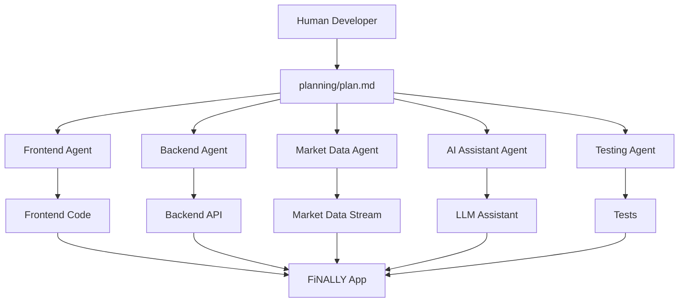
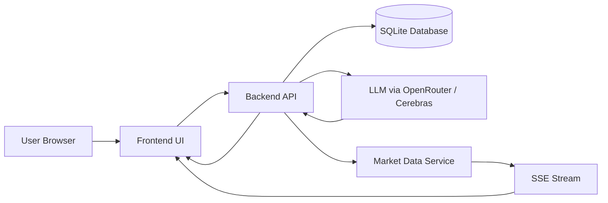
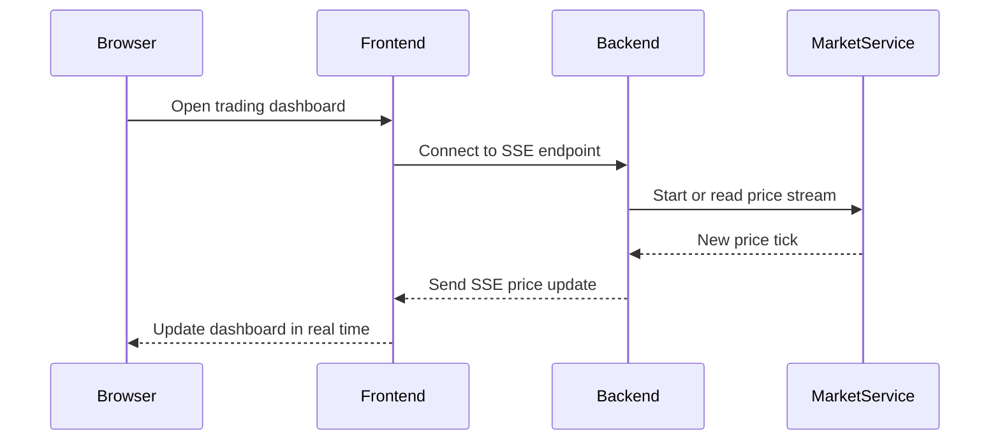
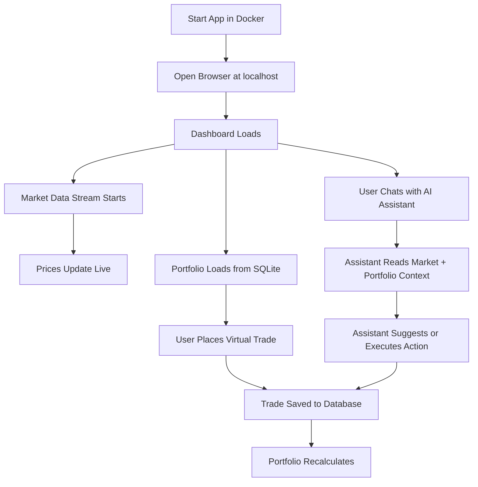

# 066 - Day 1 - Setting Up the FiNALLY Project: Our Multi-Agent Trading App

## Lesson Information

| Item       | Details                                               |
| ---------- | ----------------------------------------------------- |
| Lesson     | 066                                                   |
| Duration   | 10 minutes                                            |
| Week       | Week 3 - Agentic Engineering Frontier                 |
| Module     | Week 3 Day 1 - Sub-Agents, Hooks, Plugins             |
| Project    | FiNALLY — Finance Ally                                |
| Main Theme | Setting up a capstone multi-agent trading application |

---

## 1. Lesson Overview

In this lesson, we begin setting up **FiNALLY**, the final capstone project of the course.

FiNALLY stands for **Finance Ally**. It is designed to become an AI-powered trading workstation that combines:

* Live or simulated market data
* A portfolio dashboard
* Virtual trading
* An AI trading assistant
* A multi-agent coding workflow
* Shared project documentation
* Docker-based local deployment

The key idea is not only to build a trading app, but to build it using **multiple AI coding agents working together through shared files and clear boundaries**.

---

## 2. Project Vision

The FiNALLY project aims to become a modern AI-powered trading workstation.

It should feel like a high-end finance application, similar in spirit to a modern Bloomberg Terminal with an AI co-pilot.

The application will allow users to:

* Watch market prices stream live
* Monitor a simulated portfolio
* Place virtual trades
* Chat with an AI assistant
* Let the assistant analyze portfolios
* Let the assistant suggest or execute simulated trades
* Run the entire application locally through Docker

This is the capstone project because it demonstrates how agentic engineering can be used to produce a full-stack application with multiple moving parts.

---

## 3. Initial Setup

The lesson starts inside VS Code.

The basic setup flow is:

```bash
cd ~/projects
git clone <finally-repo-url>
cd finally
code .
```

The starter repository contains a simple scaffold that will be expanded throughout the week.

Expected project structure:

```text
finally/
├── README.md
├── CLAUDE.md
├── .env
├── .gitignore
├── planning/
│   └── plan.md
├── backend/
├── frontend/
├── db/
├── tests/
└── .claude/
    └── skills/
```

Some directories may appear empty at the beginning. Their purpose is to create a foundation that different agents can work inside safely.

---

## 4. Why `CLAUDE.md` Matters

The `CLAUDE.md` file acts as the main instruction file for Claude Code and other coding agents.

In this project, `CLAUDE.md` is intentionally short. Its main job is to point agents toward the shared project documentation.

A simplified version of the idea:

```md
# FiNALLY Project

All project documentation is in the `planning/` directory.

The key document is:

@planning/plan.md
```

The `@planning/plan.md` reference ensures that the project plan is pulled into context whenever the agent works on the codebase.

This gives all agents a shared source of truth.

---

## 5. Shared Documentation as the Control System

In a multi-agent project, agents need a way to coordinate.

Instead of letting each agent make isolated decisions, the project uses the `planning/` directory as the shared coordination layer.

Agents can use this directory to:

* Read the business requirements
* Understand the architecture
* Check module boundaries
* Leave notes for other agents
* Track decisions
* Avoid duplicate work
* Stay aligned with the project vision

### Multi-Agent Coordination Diagram



The important principle is:

> Multi-agent work becomes more stable when all agents converge on shared documentation.

---

## 6. The Role of `planning/plan.md`

The `planning/plan.md` file is the business requirements document for the entire application.

It explains:

* What the product should become
* What the user experience should feel like
* What modules need to exist
* How market data should work
* How the database should work
* How the LLM assistant should behave
* How the frontend should be designed
* How the app should run in Docker
* How testing should be approached

This document becomes the main control surface for the project.

Before agents write code, they should understand the plan.

---

## 7. Core Application Modules

The FiNALLY app is divided into several major modules.

| Module         | Responsibility                                            |
| -------------- | --------------------------------------------------------- |
| Dashboard      | Shows portfolio, market data, charts, and trading status  |
| Market Data    | Streams simulated or real market prices                   |
| Virtual Trades | Lets users place simulated buy/sell orders                |
| Portfolio      | Tracks holdings, cash, profit/loss, and trade history     |
| AI Assistant   | Analyzes portfolio and market context                     |
| Backend API    | Provides endpoints for frontend and assistant actions     |
| Database       | Persists trades, portfolio state, and settings            |
| Frontend       | Provides the visual trading workstation interface         |
| Tests          | Validates backend logic, frontend behavior, and app flows |

---

## 8. High-Level Architecture

The project uses a simple full-stack architecture.

The goal is to keep the system powerful but not over-engineered.



The application includes:

* A frontend running in the browser
* A backend API
* SQLite for persistence
* A market data background task
* Server-Sent Events for live streaming updates
* OpenRouter or Cerebras for LLM integration
* One Docker container for simple local execution

---

## 9. Market Data Strategy

The project supports two market data modes.

| Mode                  | Description                                                                 |
| --------------------- | --------------------------------------------------------------------------- |
| Simulated Market Data | Built-in fake live data that behaves like a real market                     |
| Real Market Data      | Optional integration through an external provider such as Massive / Polygon |

The simulated mode is important because it allows everyone to build and test the application without paying for financial data.

The app should still feel alive even when using fake prices.

---

## 10. Why Use SSE for Market Data?

The app will use **Server-Sent Events**, or SSE, to stream market data from the backend to the frontend.

SSE is a good fit because:

* The backend continuously sends price updates
* The browser receives updates in real time
* The frontend can update charts and prices immediately
* The pattern is simpler than WebSockets for one-way streaming
* It is similar to how AI streaming responses are often handled

### Market Data Streaming Flow



---

## 11. Database Design Principle

The project uses SQLite to keep the setup simple.

SQLite is enough for this course because:

* It requires no separate database server
* It works well for local development
* It can persist data between sessions
* It is easy for agents to reason about
* It keeps the Docker setup simple

The database should store things like:

* User cash balance
* Portfolio holdings
* Trade history
* Market data snapshots
* Assistant actions
* App configuration

The lesson also points out that SQLite could later be replaced with a cloud database such as Supabase or Postgres.

---

## 12. LLM Assistant Integration

The AI assistant is one of the core parts of FiNALLY.

It should be able to:

* Chat with the user
* Analyze portfolio state
* Review current market data
* Suggest trades
* Execute simulated trades through structured tool calls
* Explain its reasoning clearly
* Change or influence UI behavior when appropriate

The project will use the same OpenRouter / Cerebras-style setup from previous lessons.

The key technical idea is to use **structured outputs**, so the assistant does not only produce text, but can return reliable actions.

Example structured action:

```json
{
  "action": "place_trade",
  "symbol": "AAPL",
  "side": "buy",
  "quantity": 5,
  "reason": "The portfolio is underexposed to large-cap technology stocks."
}
```

This allows the AI assistant to become part of the application workflow rather than just a chatbot.

---

## 13. Reusing Skills from Week 2

The project includes a `.claude/` directory with skills from the previous week.

One reused skill is the Cerebras / OpenRouter skill.

This is important because it shows how skills can be transferred across projects.

Instead of teaching the agent the same integration pattern again, we can place the skill inside the project and let Claude Code use it automatically.

```text
finally/
└── .claude/
    └── skills/
        └── cerebras/
            └── skill.md
```

This helps agents follow known project patterns more consistently.

---

## 14. Agent Boundaries

Because multiple coding agents may work on the app at the same time, boundaries are critical.

Without boundaries, agents may overwrite each other’s work or make conflicting design decisions.

Good boundaries answer questions like:

* Which agent owns the frontend?
* Which agent owns the backend API?
* Which agent owns market data?
* Which agent owns database schema?
* Which agent owns tests?
* Which files should an agent avoid touching?
* How should agents communicate changes?

### Example Agent Responsibilities

| Agent             | Owns                                                | Should Avoid                              |
| ----------------- | --------------------------------------------------- | ----------------------------------------- |
| Frontend Agent    | UI components, dashboard layout, charts             | Database migrations                       |
| Backend Agent     | API routes, service layer, validation               | Styling decisions                         |
| Market Data Agent | Simulated stream, real provider adapter, SSE        | Portfolio UI                              |
| Trading Agent     | Trade execution rules, portfolio updates            | LLM prompts                               |
| Assistant Agent   | LLM prompts, structured outputs, assistant behavior | Core database schema without coordination |
| Testing Agent     | Unit tests, integration tests, end-to-end tests     | Product scope changes                     |

---

## 15. Keeping Architecture Simple

A major lesson from this setup is that human judgment is still essential.

LLMs often try to over-engineer applications.

For example, an LLM may suggest:

* Multiple Docker containers
* Separate services too early
* Complex message queues
* Cloud databases before they are needed
* Overly abstracted architecture

The instructor intentionally simplifies the architecture into one Docker container.

This keeps the project easier to:

* Run
* Debug
* Deploy
* Understand
* Build with agents

The guiding question is:

> Could this be simpler?

---

## 16. Docker Deployment Strategy

The project is intended to run in one Docker container.

This gives the app a simple local startup experience.

Expected user flow:

```bash
docker build -t finally .
docker run -p 8000:8000 finally
```

Then the user opens:

```text
http://localhost:8000
```

This pattern also makes future deployment easier.

Potential deployment targets include:

* Hugging Face Spaces
* AWS App Runner
* Render
* Railway
* Fly.io
* Any simple container hosting platform

---

## 17. End-to-End Product Flow



This flow shows how the main app pieces connect together.

---

## 18. Key Concepts

### Concept 1: Capstone Project Setup

FiNALLY is not a small demo app. It is the main Week 3 capstone project.

The setup phase matters because the quality of the foundation will determine how well multiple agents can work later.

A good setup includes:

* Clear folder structure
* Clear documentation
* Clear architecture
* Clear module boundaries
* Clear environment variables
* Clear testing expectations

---

### Concept 2: Shared Context for Multi-Agent Work

Multiple agents need shared context.

The `planning/plan.md` file gives agents a common reference point.

This reduces confusion and helps agents work toward the same product vision.

In agentic engineering, shared documentation acts like a coordination protocol.

---

### Concept 3: Controlled Chaos

The course is moving toward “controlled chaos.”

This means allowing multiple agents to work in parallel, but not randomly.

The chaos is useful because many agents can build faster.

The control comes from:

* Shared documentation
* Strong boundaries
* Good architecture
* Clear file ownership
* Human review
* Tests
* Repeatable workflows

---

### Concept 4: Simulated Systems Are Powerful

The market data system does not need to use real paid data at first.

A simulated market can still test:

* Streaming updates
* Trading behavior
* Portfolio changes
* AI assistant reasoning
* Frontend real-time UI
* Risk and decision logic

This is a practical engineering pattern: simulate external complexity before integrating expensive or fragile real systems.

---

### Concept 5: Human Simplicity Checks

The human developer still plays a key role.

The human should challenge the architecture and ask:

* Is this too complex?
* Do we really need this dependency?
* Can this run locally?
* Can an agent understand this?
* Can this be tested?
* Can this be deployed simply?

AI agents can produce a lot of code quickly, but humans still guide product shape and architectural simplicity.

---

## 19. Practical Demo Summary

In the lesson, the instructor:

1. Opens VS Code
2. Opens the terminal
3. Clones the FiNALLY starter repository
4. Opens the project folder
5. Reviews the project structure
6. Reviews `CLAUDE.md`
7. Explains the importance of `planning/plan.md`
8. Walks through the business requirements
9. Explains the product vision
10. Reviews the architecture
11. Discusses market data options
12. Explains the SQLite database choice
13. Reviews LLM integration
14. Shows reused Claude skills
15. Explains why one Docker container is enough
16. Sets the stage for multi-agent development

---

## 20. What Students Should Practice

After this lesson, students should be able to:

* Clone and open the FiNALLY project
* Understand the purpose of `CLAUDE.md`
* Understand why `planning/plan.md` is central
* Explain the high-level app architecture
* Identify the main modules of the trading app
* Understand why simulated market data is useful
* Explain why SSE is suitable for streaming prices
* Understand why SQLite is chosen for the first version
* Recognize the importance of agent boundaries
* Prepare a project for multi-agent coding workflows

---

## 21. Suggested Student Exercise

Create or improve the initial `planning/plan.md` for your own app.

Include these sections:

```md
# Product Vision

# User Experience

# Core Features

# Architecture

# Directory Structure

# Environment Variables

# Backend API

# Database

# Frontend Design

# LLM Integration

# Agent Boundaries

# Testing Strategy

# Deployment Strategy
```

Then ask an AI coding agent to read the file and produce an implementation plan.

---

## 22. Common Mistakes to Avoid

| Mistake                                  | Why It Is a Problem                           |
| ---------------------------------------- | --------------------------------------------- |
| Starting to code before writing the plan | Agents will make inconsistent decisions       |
| Giving every agent access to everything  | Agents may overwrite each other               |
| Over-engineering the architecture        | The project becomes harder to build and debug |
| Using paid APIs too early                | External dependencies slow down development   |
| Skipping tests                           | Multi-agent changes become risky              |
| Ignoring documentation                   | Agents lose shared context                    |
| Making the Docker setup too complex      | The app becomes harder to run and deploy      |

---

## 23. Reflection Questions

1. Why is `planning/plan.md` more important in a multi-agent project than in a normal solo project?
2. What could go wrong if multiple agents work without clear boundaries?
3. Why is simulated market data a smart starting point?
4. Why might one Docker container be better than multiple containers for this project?
5. How can structured outputs make the AI assistant more useful than a normal chatbot?
6. What parts of this architecture should remain simple until the product proves it needs more complexity?

---

## 24. Key Takeaways

* FiNALLY is the final capstone project of the course.
* It is an AI-powered trading workstation called Finance Ally.
* The app will include market data, virtual trading, portfolio tracking, and an AI assistant.
* The project is designed to be built with multiple coding agents.
* `planning/plan.md` acts as the shared source of truth.
* `CLAUDE.md` ensures agents load the project plan into context.
* Clear module boundaries are essential for multi-agent work.
* Simulated market data allows the app to feel live without paid APIs.
* SSE is used for real-time price streaming.
* SQLite keeps the first version simple and persistent.
* One Docker container keeps the project easy to run and deploy.
* Human review is still critical to prevent over-engineering.

---

## 25. Final Summary

This lesson introduces the FiNALLY project, the capstone trading application for Week 3.

The main goal is not just to build a finance dashboard, but to prepare a full-stack application that can be built by multiple AI coding agents working together.

The lesson focuses on the project scaffold, the importance of `CLAUDE.md`, the central role of `planning/plan.md`, the app architecture, market data strategy, SQLite persistence, LLM assistant integration, Docker deployment, and the need for clear agent boundaries.

FiNALLY becomes the foundation for practicing advanced agentic engineering: sub-agents, hooks, plugins, skills, shared context, and controlled chaos.
