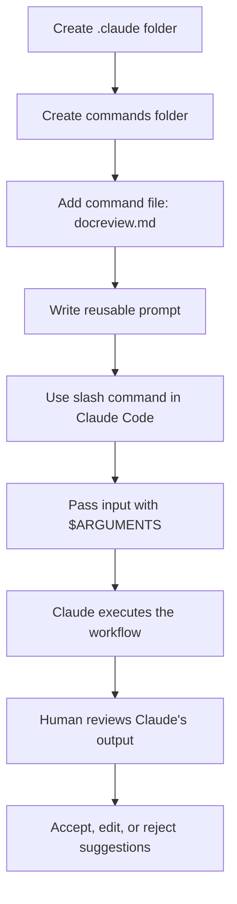
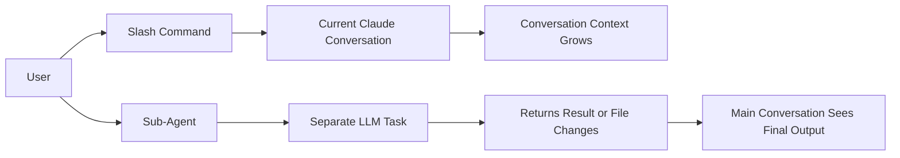

# 067 - Day 1 - Creating Custom Slash Commands in Claude Code

## Lesson Information

| Item       | Details                                       |
| ---------- | --------------------------------------------- |
| Lesson     | 067                                           |
| Duration   | 11 minutes                                    |
| Week       | Week 3 - Agentic Engineering Frontier         |
| Module     | Week 3 Day 1 - Sub-Agents, Hooks, Plugins     |
| Main Topic | Creating custom slash commands in Claude Code |

---

## Main Idea

This lesson explains how to create **custom slash commands** in Claude Code to speed up repeated workflows.

A slash command allows you to type something like:

```text
/docreview plan.md
```

Instead of manually writing a long prompt every time.

Slash commands are useful for repeated actions such as:

* Reviewing documentation
* Running tests
* Explaining code
* Scaffolding files
* Checking implementation plans
* Adding feedback to project documents

The key idea is simple:

> A slash command is a reusable prompt shortcut that helps standardize repeated Claude Code workflows.

---

## Why This Lesson Matters

As projects become larger, manually typing the same instructions again and again becomes inefficient.

Custom slash commands help you:

* Reduce repetitive prompting
* Create reusable project workflows
* Share commands with your team through Git
* Standardize how reviews, tests, and documentation updates are done
* Prepare for more advanced automation with sub-agents, hooks, and plugins

This lesson is an important bridge between basic Claude Code usage and more advanced **agentic engineering workflows**.

---

## Learning Objectives

By the end of this lesson, learners should be able to:

* Understand what custom slash commands are in Claude Code
* Create a new project-level slash command
* Use `$ARGUMENTS` to pass user input into a command
* Understand the difference between slash commands and sub-agents
* Apply slash commands to real project workflows such as documentation review
* Recognize when human oversight is still required

---

## Core Concept 1: What Is a Slash Command?

A slash command is a shortcut that lets you run a predefined instruction inside Claude Code.

Instead of typing a full prompt like:

```text
Review the documentation file in the planning folder called plan.md and add questions, clarifications, or feedback to a new section at the end.
```

You can create a command and simply type:

```text
/docreview plan.md
```

Claude Code then expands that command into the instruction you wrote in the command file.

---

## Core Concept 2: Where Slash Commands Live

Custom slash commands are usually stored inside a `.claude` folder.

You can create commands at two levels:

| Level                 | Location                                       | Purpose                                  |
| --------------------- | ---------------------------------------------- | ---------------------------------------- |
| Project-level command | `.claude/commands/` inside the project         | Shared with everyone working on the repo |
| User-level command    | `.claude/commands/` inside your home directory | Available across your personal projects  |

For a project-specific workflow, the common structure is:

```text
project-root/
└── .claude/
    └── commands/
        └── docreview.md
```

Each Markdown file inside the `commands` folder becomes a slash command.

For example:

```text
.claude/commands/docreview.md
```

Creates the command:

```text
/docreview
```

---

## Core Concept 3: Creating a Custom Slash Command

To create a custom slash command:

### Step 1: Create the `.claude` folder

```text
.claude/
```

### Step 2: Create a `commands` folder inside it

```text
.claude/commands/
```

### Step 3: Add a Markdown file for the command

Example:

```text
.claude/commands/docreview.md
```

### Step 4: Write the command prompt inside the file

Example:

```markdown
Review the documentation file in the planning folder called $ARGUMENTS and add questions, clarifications, or feedback to a new section at the end, along with any opportunities to simplify.
```

Now you can use:

```text
/docreview plan.md
```

Claude Code will replace `$ARGUMENTS` with `plan.md`.

---

## Example: `docreview` Command

### Command File

```text
.claude/commands/docreview.md
```

### Command Content

```markdown
Review the documentation file in the planning folder called $ARGUMENTS and add questions, clarifications, or feedback to a new section at the end, along with any opportunities to simplify.
```

### Usage in Claude Code

```text
/docreview plan.md
```

### What Claude Does

Claude interprets the command as:

```text
Review the documentation file in the planning folder called plan.md and add questions, clarifications, or feedback to a new section at the end, along with any opportunities to simplify.
```

Then it reads the file, reviews it, and adds a review section.

---

## Slash Command Workflow Diagram



---

## Understanding `$ARGUMENTS`

`$ARGUMENTS` is a placeholder.

It represents whatever the user types after the slash command.

For example:

```text
/docreview plan.md
```

In this case:

```text
$ARGUMENTS = plan.md
```

So this command:

```markdown
Review the documentation file in the planning folder called $ARGUMENTS.
```

Becomes:

```markdown
Review the documentation file in the planning folder called plan.md.
```

This makes slash commands flexible and reusable.

---

## Practical Use Cases

Custom slash commands are useful for many common development tasks.

| Command                    | Purpose                                      |
| -------------------------- | -------------------------------------------- |
| `/docreview plan.md`       | Review a planning document                   |
| `/test feature-x`          | Run or suggest tests for a feature           |
| `/explain auth.ts`         | Explain how a file works                     |
| `/scaffold component-name` | Generate a basic file or component structure |
| `/review-pr`               | Review changes before opening a pull request |
| `/summarize`               | Summarize project state or a document        |

---

## Important Distinction: Slash Commands vs Sub-Agents

A key point in the lesson is that slash commands are **not the same as sub-agents**.

### Slash Commands

A slash command is basically a shortcut for a prompt.

It runs inside the current Claude Code conversation.

That means the work becomes part of the current conversation history and consumes context.

### Sub-Agents

A sub-agent is different.

A sub-agent runs as a separate LLM call or separate task. It can perform work independently and then return results.

The main conversation does not necessarily need to include all the details of the sub-agent's reasoning or intermediate steps.

---

## Comparison Table

| Feature                      | Slash Command             | Sub-Agent                                                   |
| ---------------------------- | ------------------------- | ----------------------------------------------------------- |
| Main purpose                 | Reusable prompt shortcut  | Independent task execution                                  |
| Runs in current conversation | Yes                       | Usually separate                                            |
| Adds to current context      | Yes                       | Less directly                                               |
| Best for                     | Simple repeated workflows | Larger delegated tasks                                      |
| Example                      | `/docreview plan.md`      | A documentation-review agent that edits files independently |
| Complexity                   | Low                       | Higher                                                      |

---

## Slash Command vs Sub-Agent Diagram



---

## Human Oversight Still Matters

The lesson also emphasizes that Claude's suggestions should not be accepted blindly.

In the example, Claude reviewed `plan.md` and suggested several simplifications.

Some suggestions were useful, such as simplifying the response flow and avoiding unnecessary streaming.

However, some suggestions were rejected because they weakened the project design.

Examples of rejected suggestions included:

* Removing user IDs from tables
* Dropping important API integration
* Over-simplifying backend responsibilities
* Removing useful testing tools

This shows an important principle:

> AI can suggest improvements, but the human developer must decide what actually fits the product vision.

---

## Key Engineering Lesson

Claude Code can help you move faster, but you are still the project manager.

You need to:

* Review Claude's suggestions carefully
* Keep the suggestions that improve the project
* Reject suggestions that damage future scalability
* Ask follow-up questions when needed
* Use Claude as a collaborator, not as the final authority

---

## Recommended Command Naming Style

The lesson recommends using simple, lowercase command names.

Good examples:

```text
docreview.md
code-review.md
run-tests.md
explain-file.md
scaffold-feature.md
```

Less ideal examples:

```text
DocReview.md
ReviewDocumentationFile.md
RUN_TESTS.md
```

A clean naming convention makes commands easier to discover and use.

---

## Two Ways to Create Slash Commands

The lesson explains that there are two main ways to create slash commands in Claude Code.

### Method 1: Commands Folder

Create a Markdown file inside:

```text
.claude/commands/
```

Example:

```text
.claude/commands/docreview.md
```

This creates:

```text
/docreview
```

### Method 2: Skills

Claude Code skills can also appear as slash commands.

If you create a skill, Claude Code may expose it as a command automatically.

This means many people now prefer using skills for more structured workflows.

---

## Commands vs Skills

| Approach     | Best For                             |
| ------------ | ------------------------------------ |
| Command file | Simple reusable prompt               |
| Skill        | More structured reusable capability  |
| Sub-agent    | Delegated task with separate context |

A simple documentation review can be a command.

A more advanced reusable capability with metadata, instructions, and structured behavior may be better as a skill.

A complex independent reviewer may be better as a sub-agent.

---

## Example Project Structure

```text
finally-trading-app/
├── .claude/
│   ├── commands/
│   │   ├── docreview.md
│   │   ├── test-feature.md
│   │   └── explain-file.md
│   └── skills/
│       └── cerebras-inference/
│           └── skill.md
├── planning/
│   └── plan.md
├── src/
│   ├── dashboard/
│   ├── market-data/
│   ├── virtual-trades/
│   └── ai-assistant/
└── README.md
```

---

## Example Commands for a Real Project

### Documentation Review

```markdown
Review the documentation file in the planning folder called $ARGUMENTS and add questions, clarifications, feedback, and simplification opportunities to a new section at the end.
```

Usage:

```text
/docreview plan.md
```

---

### Code Explanation

```markdown
Explain the file $ARGUMENTS in clear language. Describe its purpose, key functions, dependencies, and any risks or confusing parts.
```

Usage:

```text
/explain-file src/api/client.ts
```

---

### Test Review

```markdown
Review the tests related to $ARGUMENTS. Identify missing cases, weak assertions, edge cases, and opportunities to simplify the test structure.
```

Usage:

```text
/test-review auth
```

---

### Feature Scaffold

```markdown
Create a basic scaffold for the feature named $ARGUMENTS. Include suggested files, responsibilities, and implementation steps before writing code.
```

Usage:

```text
/scaffold-feature portfolio-tracker
```

---

## Best Practices

### 1. Keep Commands Focused

A good command should do one clear job.

Bad:

```text
/review-and-fix-and-test-and-refactor-everything
```

Better:

```text
/docreview
/test-review
/refactor-plan
```

---

### 2. Use `$ARGUMENTS` for Flexibility

Avoid hardcoding one file name unless the command is only for one specific file.

Better:

```markdown
Review the file called $ARGUMENTS.
```

Instead of:

```markdown
Review plan.md.
```

---

### 3. Check Commands Into Git

If a command is useful for the team, store it in the project-level `.claude` folder and commit it.

This allows everyone on the project to use the same workflow.

---

### 4. Treat Claude's Output as a Draft

Slash commands make prompting faster, but they do not remove the need for human judgment.

Always review the result.

---

### 5. Upgrade Repeated Commands Into Skills

If a command becomes more advanced, consider turning it into a skill.

A skill is better when you need:

* More detailed instructions
* Front matter or metadata
* Reusable behavior across many situations
* More structured workflows

---

## Common Mistakes

| Mistake                                   | Why It Is a Problem                          |
| ----------------------------------------- | -------------------------------------------- |
| Creating vague commands                   | Claude may produce inconsistent results      |
| Making one command do too much            | Harder to control and review                 |
| Accepting all suggestions blindly         | May damage architecture or product direction |
| Forgetting `$ARGUMENTS`                   | Command becomes less reusable                |
| Not sharing useful commands with the team | Team members repeat manual prompts           |

---

## Mini Practice

Create a command named:

```text
implementation-review.md
```

Inside:

```text
.claude/commands/
```

Add this content:

```markdown
Review the implementation related to $ARGUMENTS. Check whether it matches the plan, whether the code is simple, whether tests are missing, and whether any architectural risks should be addressed before merging.
```

Then run:

```text
/implementation-review portfolio-module
```

Observe how Claude reviews the feature.

---

## Lesson Summary

In this lesson, you learned how to create custom slash commands in Claude Code.

The main workflow is:

```text
Create .claude/commands/
Add a Markdown file
Write a reusable prompt
Use the file name as a slash command
Pass input with $ARGUMENTS
Review Claude's output carefully
```

Slash commands are powerful because they turn repeated prompts into reusable workflows.

However, they are still part of the current conversation context. They are not the same as sub-agents.

The most important takeaway is:

> Slash commands help you move faster, but human judgment is still required to decide which suggestions should become part of the project.

---

## Key Takeaways

* Slash commands are reusable prompt shortcuts in Claude Code.
* Commands can be stored in `.claude/commands/`.
* Each Markdown file becomes a slash command.
* `$ARGUMENTS` passes user input into the command.
* Commands are useful for repeated workflows like review, test, scaffold, and explain.
* Slash commands run inside the current conversation context.
* Sub-agents are different because they can run separate delegated tasks.
* Skills can also expose slash-command-like behavior.
* Human oversight is essential when reviewing Claude's suggestions.

---

## Suggested Next Step

Create three project commands:

```text
docreview.md
test-review.md
scaffold-feature.md
```

Then use them on your own project documentation or codebase to practice building a faster Claude Code workflow.

---

# Bài luyện tập

## Mục tiêu


## Đề bài


## Yêu cầu hoàn thành

- [ ] 
- [ ] 
- [ ] 

## Kết quả / lời giải


## Ghi chú
