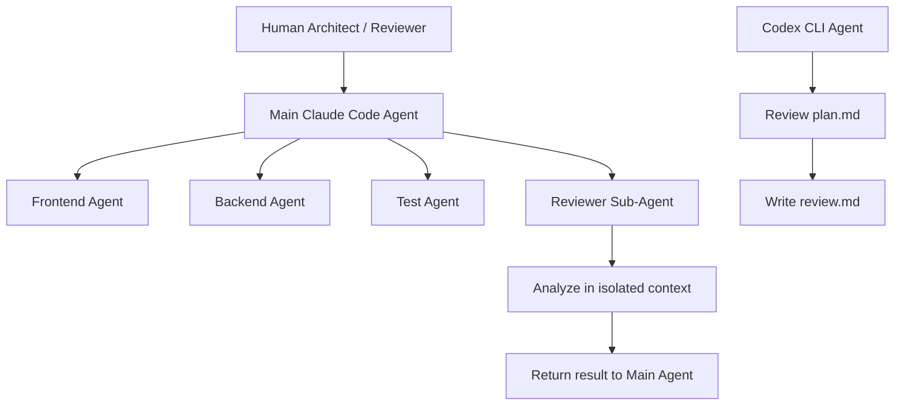
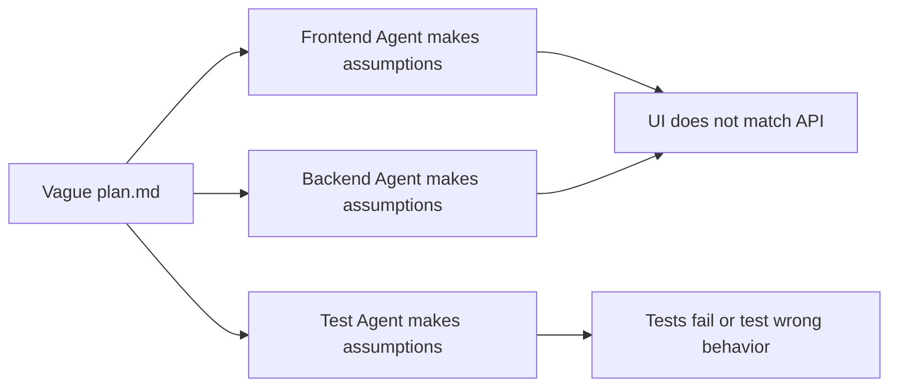
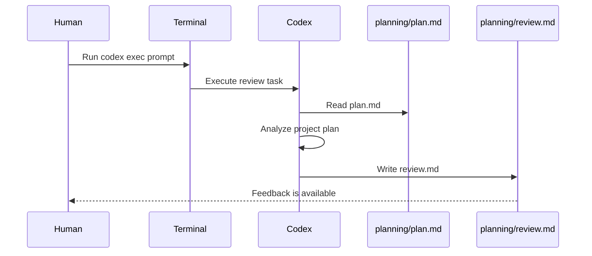
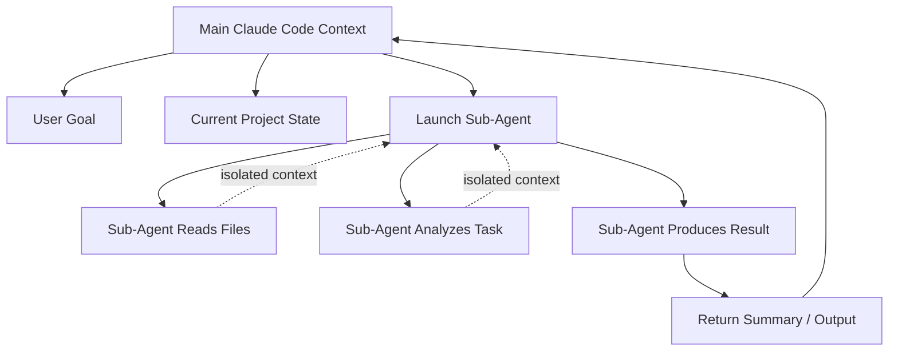
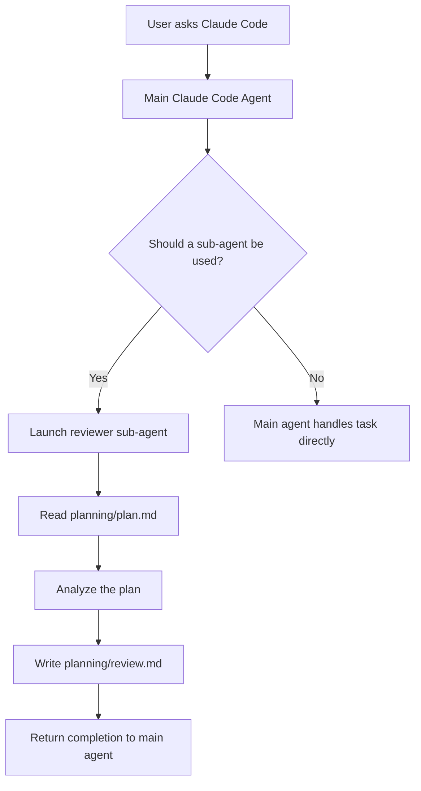
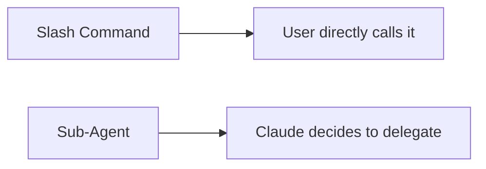
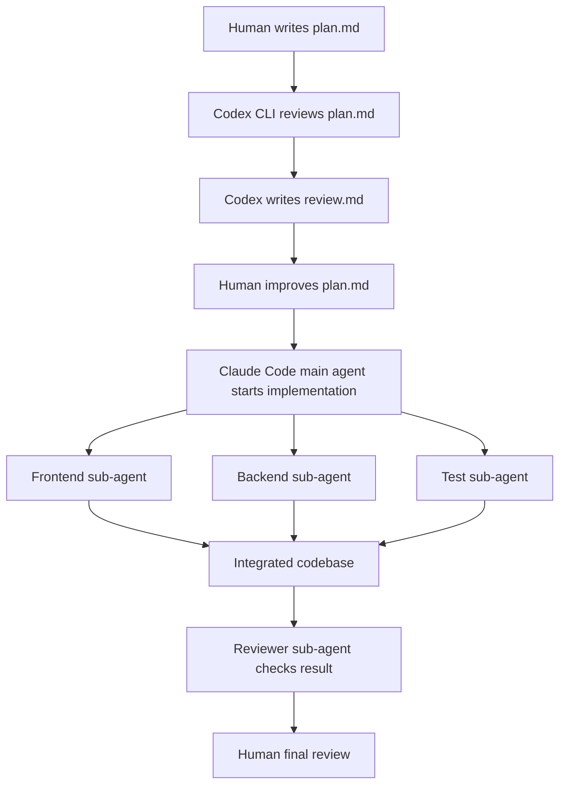

# 068 - Day 1 - Building Agents & Sub-Agents with Claude Code and Codex CLI

## Lesson Information

| Item       | Details                                                       |
| ---------- | ------------------------------------------------------------- |
| Lesson     | 068                                                           |
| Duration   | 12 minutes                                                    |
| Week       | Week 3 - Agentic Engineering Frontier                         |
| Module     | Week 3 Day 1 - Sub-Agents, Hooks, Plugins                     |
| Main Topic | Building agents and sub-agents with Claude Code and Codex CLI |

---

## Main Idea

This lesson introduces how to build and coordinate **agents** and **sub-agents** using **Claude Code** and **Codex CLI**.

The core idea is that multi-agent workflows allow different AI coding agents to take on specialized roles such as:

* Frontend builder
* Backend builder
* Test writer
* Code reviewer
* Planning assistant

However, the lesson also warns that simply launching multiple agents at once can easily create chaos if the project boundaries, responsibilities, and integration points are not clearly defined.

---

## Learning Objectives

By the end of this lesson, learners should be able to:

* Understand the difference between agents and sub-agents
* Run multiple Claude Code sessions as simple parallel agents
* Use Codex CLI as an external coding agent
* Understand how Claude Code sub-agents isolate context
* Create a custom reviewer sub-agent using a Markdown configuration file
* Recognize when multi-agent workflows are useful and when they may become chaotic
* Keep the human developer in the role of architect and reviewer

---

## Why This Lesson Matters

This lesson is a key part of **Week 3 Day 1 - Sub-Agents, Hooks, Plugins**.

It moves beyond single-agent coding and introduces a more advanced workflow where multiple agents can work together. This is important because modern AI coding workflows increasingly depend on:

* Task decomposition
* Specialized roles
* Parallel execution
* Context isolation
* Human supervision
* Clear project architecture

A strong agent workflow can speed up development, but a poorly designed one can create confusion, conflicting changes, and broken integrations.

---

## Big Picture: Agents vs Sub-Agents



---

## Concept 1: Multi-Agent Workflows

A simple version of a multi-agent workflow is opening multiple terminal sessions and running multiple Claude Code instances.

For example:

| Agent            | Responsibility     |
| ---------------- | ------------------ |
| Claude Session 1 | Build the frontend |
| Claude Session 2 | Build the backend  |
| Claude Session 3 | Write tests        |

This sounds powerful, but it can become dangerous if the work is not clearly divided.

### Risk of Chaos

If the plan is vague, each agent may make different assumptions.

For example:



### Key Lesson

Multi-agent development only works well when the architecture is clear.

Before launching multiple agents, define:

* Clear responsibilities
* Shared interfaces
* File boundaries
* API contracts
* Expected outputs
* Testing strategy
* Integration rules

---

## Concept 2: Using Codex CLI as Another Agent

The lesson demonstrates using **Codex CLI** as a separate coding agent alongside Claude Code.

Instead of only running multiple Claude agents, you can introduce a different AI coding agent into the workflow.

Example command pattern:

```bash
codex exec "Please review the file planning/plan.md and write your feedback to planning/review.md."
```

This command asks Codex to:

1. Read `planning/plan.md`
2. Review the plan
3. Write feedback into `planning/review.md`

---

## Codex CLI Workflow



---

## Why Use Codex CLI?

Codex CLI is useful because it can behave like a separate agent that runs from the command line.

It can be used for tasks such as:

* Reviewing a plan
* Reviewing code
* Writing tests
* Auditing files
* Generating documentation
* Comparing implementation against requirements

This opens the door to hybrid agent workflows where Claude Code coordinates the main work and Codex performs supporting tasks.

---

## Concept 3: Sub-Agents in Claude Code

Claude Code already uses built-in sub-agents internally.

A sub-agent is a specialized assistant that can take on a specific task in a separate context.

This is useful because the sub-agent can:

* Explore files
* Plan work
* Review code
* Analyze a specific problem
* Return a focused result to the main agent

The key benefit is that the sub-agent does not pollute the main Claude Code context.

---

## Why Context Isolation Matters



The main agent does not need to carry every detail of the sub-agent's investigation.

This helps with:

* Reducing context bloat
* Keeping the main conversation cleaner
* Running focused tasks
* Parallelizing work
* Using cheaper or faster models for smaller jobs

---

## Built-In and Plugin Sub-Agents

Claude Code can have different kinds of agents:

| Agent Type      | Description                                                     |
| --------------- | --------------------------------------------------------------- |
| Built-in agents | Included by Claude Code, such as exploration or planning agents |
| Plugin agents   | Added by installed plugins                                      |
| Project agents  | Defined inside the project folder                               |
| Global agents   | Defined in the user's home Claude configuration                 |
| Custom agents   | Created manually as Markdown files                              |

---

## Viewing Agents in Claude Code

You can inspect available agents using:

```bash
/agents
```

This shows:

* Built-in agents
* Plugin-provided agents
* Custom project agents
* Options to create new agents

---

## Creating a Custom Reviewer Sub-Agent

The lesson creates a custom sub-agent called `reviewer`.

The file is placed inside the project-level Claude configuration folder.

Example structure:

```text
.claude/
├── commands/
├── skills/
└── agents/
    └── reviewer.md
```

---

## Example: `reviewer.md`

```md
---
name: reviewer
description: Carry out a comprehensive review when requested.
---

You review the file `planning/plan.md` and write your feedback to `planning/review.md`.
```

This defines a simple reviewer sub-agent.

The agent has:

| Field             | Purpose                              |
| ----------------- | ------------------------------------ |
| `name`            | The agent name                       |
| `description`     | When Claude should consider using it |
| Body instructions | What the agent should actually do    |

---

## Calling the Reviewer Sub-Agent

Sub-agents are not called like slash commands.

Instead of typing:

```bash
/reviewer
```

You should ask Claude Code naturally:

```text
Use the reviewer sub-agent to carry out a review.
```

Claude Code decides whether to invoke the sub-agent based on your request and the agent description.

---

## Sub-Agent Execution Flow



---

## Agent vs Command vs Skill

The lesson points out that the reviewer example could also be implemented as a command or skill.

However, each mechanism has a different purpose.

| Mechanism         | Best For                                           |
| ----------------- | -------------------------------------------------- |
| Slash command     | Manually triggering a repeatable workflow          |
| Skill             | Teaching Claude a reusable capability or pattern   |
| Agent / Sub-agent | Delegating a focused task into an isolated context |

---

## Key Difference: Sub-Agents Are Delegated, Not Directly Triggered

A slash command is directly invoked by the user.

A sub-agent is selected by Claude Code when it decides the task matches the sub-agent's purpose.



---

## Human Role in Multi-Agent Workflows

Even when multiple AI agents are working, the human should remain the architect and reviewer.

The human is responsible for:

* Defining the system architecture
* Assigning clear boundaries
* Reviewing outputs
* Checking integration quality
* Preventing agent chaos
* Approving final changes

AI agents can accelerate work, but they should not replace architectural judgment.

---

## Common Mistakes

### 1. Launching Multiple Agents Without a Clear Plan

Bad approach:

```text
Agent 1: Build frontend
Agent 2: Build backend
Agent 3: Build tests
```

Without shared contracts, this can easily fail.

Better approach:

```text
Frontend agent:
- Build only UI components
- Use API contract from docs/api.md
- Do not modify backend files

Backend agent:
- Implement endpoints from docs/api.md
- Do not modify frontend files

Test agent:
- Write tests only after API and UI contracts are stable
```

---

### 2. Not Defining File Boundaries

Agents may overwrite or conflict with each other if they are working in the same files.

Define ownership clearly:

| Area        | Owner                       |
| ----------- | --------------------------- |
| `src/app/`  | Frontend agent              |
| `src/api/`  | Backend agent               |
| `tests/`    | Test agent                  |
| `planning/` | Reviewer or architect agent |

---

### 3. Trusting Agent Reviews Blindly

The transcript shows that sub-agents may sometimes report issues that are technically true but not very useful.

For example, an agent may flag environment files or repository access issues without understanding the full project context.

The human reviewer must judge whether the feedback is actually important.

---

## Practical Workflow Example



---

## Suggested Practice

### Exercise 1: Create a Reviewer Agent

Create:

```text
.claude/agents/reviewer.md
```

Add:

```md
---
name: reviewer
description: Carry out a comprehensive review when requested.
---

Review `planning/plan.md` and write your feedback to `planning/review.md`.
```

Then ask Claude Code:

```text
Use the reviewer sub-agent to review the project plan.
```

---

### Exercise 2: Use Codex CLI as a Review Agent

Run:

```bash
codex exec "Please review planning/plan.md and write your feedback to planning/review.md."
```

Then compare:

| Reviewer         | Strength                                               |
| ---------------- | ------------------------------------------------------ |
| Claude sub-agent | Integrated with Claude Code workflow                   |
| Codex CLI        | Separate external agent, useful for independent review |

---

### Exercise 3: Design a Multi-Agent Plan

Before launching agents, write a small coordination document:

```md
# Agent Coordination Plan

## Frontend Agent
- Files allowed:
- Goal:
- Inputs:
- Outputs:

## Backend Agent
- Files allowed:
- Goal:
- Inputs:
- Outputs:

## Test Agent
- Files allowed:
- Goal:
- Inputs:
- Outputs:

## Integration Rules
- Shared API contract:
- Branch strategy:
- Review process:
```

---

## Key Takeaways

* Multi-agent development can be powerful, but it requires clear boundaries.
* Running multiple Claude sessions is a simple form of multi-agent work.
* Codex CLI can act as a separate external coding agent.
* Claude Code supports built-in, plugin-based, and custom sub-agents.
* Sub-agents run in isolated contexts and return focused results.
* Custom agents can be created using simple Markdown files.
* Sub-agents are not directly called like slash commands.
* The human developer should remain the architect and final reviewer.

---

## Review Questions

1. What is the difference between an agent and a sub-agent?
2. Why can launching multiple coding agents at once create chaos?
3. How does Codex CLI act as a separate agent?
4. What is the benefit of context isolation in sub-agents?
5. Where can project-level Claude Code agents be stored?
6. Why are sub-agents not called like slash commands?
7. What role should the human developer play in an agentic workflow?

---

## Short Summary

In this lesson, learners explore how to build agent and sub-agent workflows using Claude Code and Codex CLI. The lesson begins with the idea of running multiple Claude Code sessions in parallel, but warns that this can quickly become chaotic without clear project boundaries. It then demonstrates using Codex CLI as an external review agent that can read `planning/plan.md` and write feedback to `planning/review.md`.

The lesson then introduces Claude Code sub-agents, explaining how they work in isolated contexts and help reduce context pollution. Learners create a custom `reviewer` sub-agent using a Markdown file inside `.claude/agents/`. The main lesson is that agentic workflows are powerful, but they require strong architecture, clear responsibilities, and human review.

---

# Bài luyện tập

## Mục tiêu


## Đề bài


## Yêu cầu hoàn thành

- [ ] 
- [ ] 
- [ ] 

## Kết quả / lời giải


## Ghi chú
