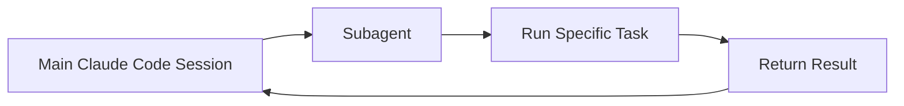
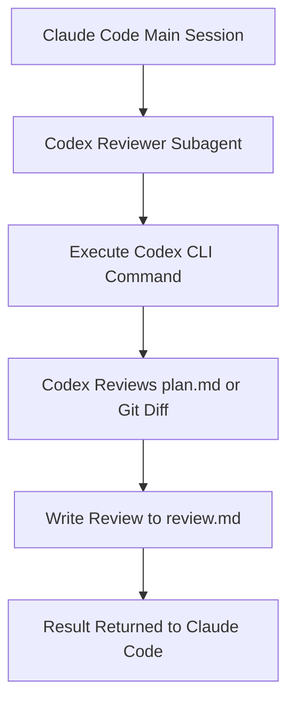
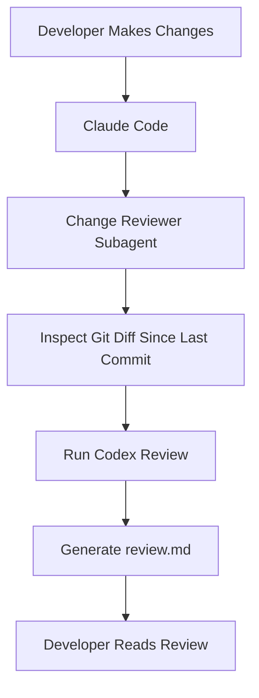
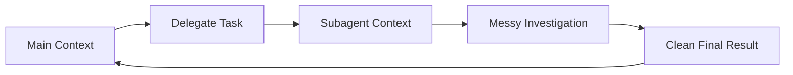
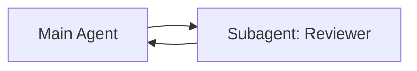
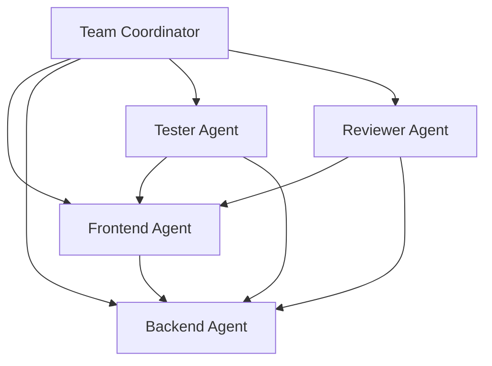
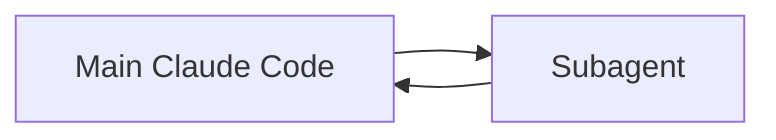
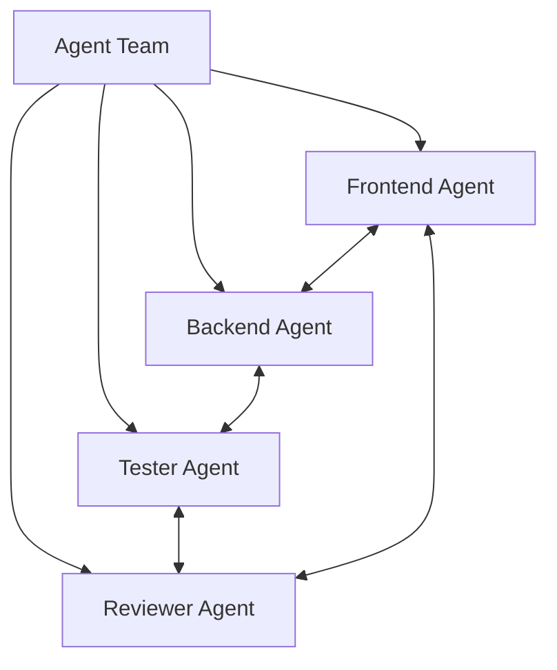
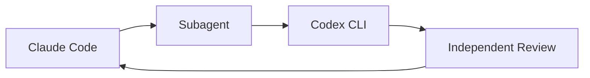

# 069 - Day 1 - Subagents vs Agent Teams in Claude Code with Codex Review

## Lesson Information

| Item     | Details                                   |
| -------- | ----------------------------------------- |
| Lesson   | 069                                       |
| Duration | 9 min                                     |
| Week     | Week 3 - Agentic Engineering Frontier     |
| Module   | Week 3 Day 1 - Sub-Agents, Hooks, Plugins |

---

## Main Topic

This lesson compares **subagents** and **agent teams** in Claude Code.

A **subagent** is usually used inside one workflow to complete one delegated task with isolated context. An **agent team** is a more advanced setup where multiple agents have clearer roles, can collaborate, and may communicate with each other.

The lesson also demonstrates how **Codex CLI** can be used as an independent reviewer inside a Claude Code subagent workflow.

---

## Learning Objectives

After this lesson, learners should be able to:

* Understand the difference between **subagents** and **agent teams**
* Use a Claude Code subagent to run an independent review
* Understand why isolated context is useful for reviews and analysis
* Use Codex CLI as an optional external reviewer
* Choose the right agent structure based on project complexity

---

## Key Concepts

### 1. Subagents

A **subagent** is a specialized agent that receives one task from the main Claude Code session.

The main agent delegates the task, the subagent handles the work in its own context, and then returns the result.



Subagents are useful when you want to:

* Keep the main context clean
* Delegate a focused task
* Run reviews, tests, research, or planning in isolation
* Avoid polluting the main conversation with intermediate reasoning
* Package repeatable workflows into reusable tools

In this lesson, the subagent is used to run a review through Codex CLI.

---

### 2. Codex as an Independent Reviewer

The instructor creates a subagent called something like **Codex Reviewer**.

Its job is not to review the file itself using Claude. Instead, it must call Codex through a shell command and let Codex perform the review.

The key instruction is:

> Do not review the file yourself. Use Codex to perform the review.

This creates a workflow where Claude Code orchestrates the task, but Codex performs the independent review.



This is valuable because the review is performed by a different model and toolchain, giving the workflow a more independent second opinion.

---

### 3. Reviewing `planning/plan.md`

The first version of the reviewer is designed to review a specific planning document.

Example task:

```bash
Use your Codex-Reviewer sub-agent to carry out a review of planning/plan.md
```

The reviewer then runs Codex through a shell command and writes the result to a review file.

The review may include:

* Strengths of the plan
* Risks and gaps
* Missing assumptions
* Concerns about undefined skills or unclear requirements
* Questions about pricing, dependencies, or external services
* Overall readiness for parallel execution

The important point is not whether every finding is perfect. The important point is that the review was produced independently and did not clutter the main Claude Code context.

---

## Improved Workflow: Reviewing Changes Since Last Commit

After reviewing a single file, the instructor improves the subagent into a more general **change reviewer**.

Instead of only reviewing `planning/plan.md`, the new subagent reviews all changes since the last Git commit.

Example task:

```bash
Use the change reviewer sub-agent to review changes since last commit
```

This makes the subagent more useful in daily development.



This is closer to a real engineering workflow because code review often happens after a set of changes rather than for one planning file.

---

## Why Isolated Context Matters

One of the biggest benefits of subagents is **context isolation**.

When the subagent investigates changes, runs commands, analyzes files, and writes findings, all of that intermediate work does not pollute the main Claude Code conversation.

The main session only receives the useful final output.



This keeps the main session:

* Cleaner
* Easier to reason about
* Less noisy
* More efficient
* Better focused on high-level orchestration

The instructor confirms this by using `/context` and seeing that the main context window remains clean.

---

## Subagents vs Agent Teams

### Subagents

Subagents are simple and task-focused.

They work best when there is one main Claude Code session that delegates a specific job to another agent.

| Feature       | Subagents                                 |
| ------------- | ----------------------------------------- |
| Structure     | Main agent delegates to one subagent      |
| Context       | Isolated from the main session            |
| Purpose       | Complete one focused task                 |
| Communication | Usually returns result back to main agent |
| Best for      | Reviews, tests, research, small utilities |
| Complexity    | Lower                                     |

Subagents follow this pattern:



The relationship is simple:

> Main agent delegates one task → subagent completes it → result returns to main agent.

---

### Agent Teams

Agent teams are more advanced.

Instead of one main agent delegating one task, an agent team contains multiple agents with different roles. These agents can work together, communicate, challenge each other, and solve problems collaboratively.

| Feature       | Agent Teams                             |
| ------------- | --------------------------------------- |
| Structure     | Multiple agents working together        |
| Context       | Agents may have longer-running roles    |
| Purpose       | Solve larger problems collaboratively   |
| Communication | Agents may communicate with each other  |
| Best for      | Complex projects, swarms, orchestration |
| Complexity    | Higher                                  |

Example agent team:



In an agent team, agents may interact directly.

For example:

* A tester agent can give feedback to the frontend agent
* A reviewer agent can challenge backend decisions
* A frontend agent and backend agent can coordinate API contracts
* Multiple agents can test different hypotheses in parallel

This is closer to a multi-agent engineering organization.

---

## Core Difference

The main difference is the relationship between agents.

### Subagent Model



A subagent is like a specialized tool that completes one delegated task.

### Agent Team Model



An agent team is like a group of collaborators working together over time.

---

## When to Use Subagents

Use subagents when the task is clear, contained, and repeatable.

Good use cases:

* Code review
* Git diff review
* Test generation
* Documentation review
* Plan review
* Security review
* Linting or formatting checks
* Small research tasks
* Generating a report from a known input

Subagents are best when you want a clean input and a clean output.

---

## When to Use Agent Teams

Use agent teams when the project is large enough to benefit from multiple collaborating roles.

Good use cases:

* Building a full-stack feature
* Running frontend, backend, and testing in parallel
* Complex refactoring
* Multi-module systems
* Large architectural changes
* Experimenting with multiple implementation strategies
* Long-running development workflows

Agent teams are best when the problem requires coordination, feedback loops, and parallel execution.

---

## Practical Example from the Lesson

The instructor starts with a specific reviewer:

```text
Codex Reviewer
- Reviews planning/plan.md
- Uses Codex CLI
- Writes findings to review.md
- Does not review by itself
```

Then the instructor improves it into a more general reviewer:

```text
Change Reviewer
- Reviews all changes since the last commit
- Uses shell commands to inspect the diff
- Uses Codex CLI for review
- Writes findings to review.md
```

This shows how a narrow subagent can evolve into a reusable development tool.

---

## Important Insight

Using Codex is optional.

Claude Code itself can also perform the review. The value of using Codex here is that it introduces a different model into the workflow.

This creates a lightweight multi-model collaboration pattern:



This is not yet a full agent team, but it is an early step toward multi-agent orchestration.

---

## Why This Lesson Matters

This lesson is important because it shows the transition from simple agent delegation to more advanced multi-agent workflows.

Learners begin with a concrete subagent pattern:

> Delegate one task, isolate context, return result.

Then they are introduced to the bigger idea of agent teams:

> Multiple agents with roles, communication, and collaboration.

This prepares learners for later lessons on:

* Agent teams
* Swarms
* Orchestration
* Parallel execution
* AI-assisted engineering workflows

---

## Key Takeaways

* A **subagent** is best for one focused delegated task.
* A **subagent** keeps the main Claude Code context clean.
* Codex CLI can be used as an independent reviewer inside a Claude Code workflow.
* A reviewer subagent can review a specific file or all changes since the last commit.
* **Agent teams** are more collaborative and complex than subagents.
* Agent teams can contain frontend, backend, tester, and reviewer agents.
* Subagents are simple and practical.
* Agent teams are better suited for larger, more complex orchestration.
* Using different LLMs together can improve review quality and reduce single-model bias.

---

## Suggested Practice

Try creating a simple reviewer subagent for your own project.

Start with this workflow:

```text
1. Make changes in your project
2. Ask Claude Code to use a reviewer subagent
3. Let the subagent inspect the Git diff
4. Generate review.md
5. Read the findings
6. Fix real issues
7. Ignore incorrect or irrelevant findings
```

Then improve the workflow by adding specialized reviewers:

```text
- Security Reviewer
- Test Reviewer
- Architecture Reviewer
- Frontend Reviewer
- Backend Reviewer
```

This helps you slowly move from simple subagents toward an agent-team mindset.

---

## Summary

In this lesson, the instructor demonstrates how to use a Claude Code subagent to run an independent Codex review. The first version reviews `planning/plan.md`, while the improved version reviews all changes since the last Git commit.

The lesson shows that subagents are useful because they isolate messy investigation work from the main Claude Code context. The main session remains clean, while the subagent handles the detailed review process.

The lesson then explains the difference between subagents and agent teams. Subagents are simple, task-focused, and delegated by one main agent. Agent teams are more advanced, with multiple agents working together, communicating, testing, reviewing, and coordinating across a larger project.

This lesson lays the foundation for multi-agent orchestration, swarms, and more advanced AI engineering workflows later in the course.
