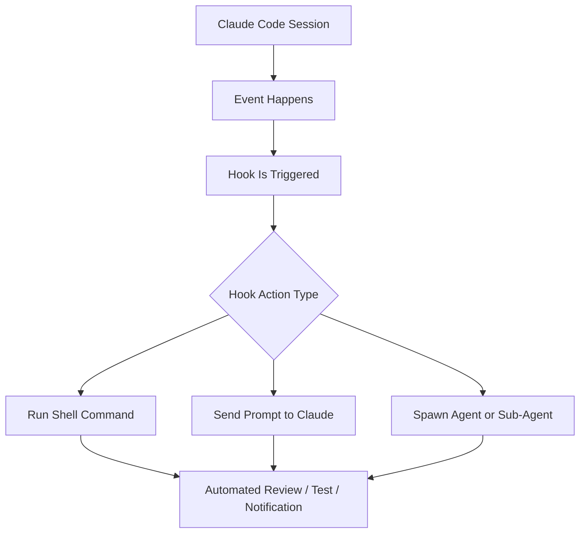
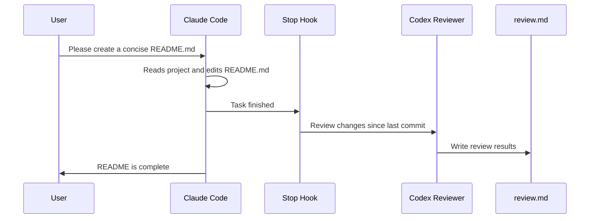
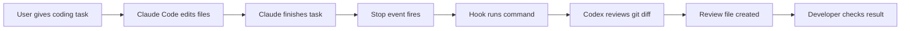

# 070 - Day 1 - Claude Code Hooks: Auto-Trigger Reviews with Events & Commands

## Lesson Information

| Item       | Details                                   |
| ---------- | ----------------------------------------- |
| Lesson     | 070                                       |
| Duration   | 9 minutes                                 |
| Week       | Week 3 - Agentic Engineering Frontier     |
| Module     | Week 3 Day 1 - Sub-Agents, Hooks, Plugins |
| Main Topic | Claude Code Hooks                         |

---

## Main Idea

This lesson introduces **Claude Code Hooks**, a pro-level feature that allows Claude Code to automatically trigger actions when specific events happen.

Hooks can be used to:

* Automatically run reviews after Claude finishes coding.
* Trigger shell commands or tests after file changes.
* Send notifications when Claude needs permission.
* Reduce the risk of letting coding agents work autonomously.
* Create safer, more disciplined agentic workflows.

The key concept is simple:

> **An event happens → a hook is triggered → Claude Code runs a predefined action.**

---

## Learning Objectives

By the end of this lesson, learners should be able to:

* Understand what hooks are in Claude Code.
* Explain how events trigger hooks.
* Know where hooks are configured.
* Identify the three main hook actions: command, prompt, and agent.
* Set up a simple hook that runs an automatic code review.
* Understand when hooks are useful and when they add unnecessary complexity.

---

## What Are Hooks?

A **hook** is an automated trigger inside Claude Code.

It listens for a specific **event**, such as:

* Claude is about to use a tool.
* Claude has finished working.
* Claude is asking for permission.
* A sub-agent starts or stops.
* A session starts or ends.
* Claude is about to compact context.

When that event happens, Claude Code can automatically run an action.

---

## Hook Workflow



---

## Common Hook Events

Claude Code supports multiple hook events, including:

| Event              | Meaning                               |
| ------------------ | ------------------------------------- |
| `PreToolUse`       | Runs before Claude uses a tool        |
| `PostToolUse`      | Runs after Claude uses a tool         |
| `UserPromptSubmit` | Runs when the user submits a prompt   |
| `Notification`     | Runs when Claude needs user attention |
| `SessionStart`     | Runs when a session begins            |
| `SessionEnd`       | Runs when a session ends              |
| `Stop`             | Runs when Claude finishes a task      |
| `SubagentStart`    | Runs when a sub-agent starts          |
| `SubagentStop`     | Runs when a sub-agent finishes        |
| `PreCompact`       | Runs before Claude compacts context   |

In this lesson, the focus is on the **Stop** event.

---

## Why Use the Stop Hook?

The **Stop** event is triggered when Claude thinks it has finished its work.

This is a powerful moment to automatically run:

* A code review.
* A test suite.
* A formatting command.
* A linting command.
* A second-agent review.
* A safety check before accepting the work.

Example:



Important detail:

> Claude may not be aware that the hook triggered another tool or agent in the background.

---

## Hook Action Types

A hook can trigger three main types of actions.

| Action Type | Description                   | Best Use Case                                     |
| ----------- | ----------------------------- | ------------------------------------------------- |
| `command`   | Runs a shell command          | Most reliable and predictable                     |
| `prompt`    | Sends a prompt back to Claude | Useful for reminders or follow-up instructions    |
| `agent`     | Spawns an agent or sub-agent  | Useful for independent review or specialized work |

The lesson recommends starting with **command hooks**, because they are the easiest to understand and the most predictable.

---

## Example Use Cases

### 1. Enforce a Preferred Command

If Claude keeps using:

```bash
python script.py
```

But your project uses:

```bash
uv run python script.py
```

You could create a hook that checks commands before execution and reminds Claude to use `uv run`.

---

### 2. Notify When Claude Needs Permission

A hook can notify you when Claude pauses and waits for approval.

This is useful when you leave Claude Code running and do not want to return later only to discover that it has been waiting for your input.

---

### 3. Auto-Review After Claude Finishes

This is the main demo in the lesson.

When Claude finishes a task, the Stop hook automatically runs a review command.

Example command idea:

```bash
codex exec "Review the changes since the last commit and write results to a file named review.md"
```

This creates an automatic second-pass review after every Claude Code task.

---

## Where Hooks Are Configured

Hooks are usually configured inside the project’s `.claude` folder.

Typical file:

```text
.claude/settings.json
```

You can configure hooks in two ways:

1. Manually editing `settings.json`
2. Using the interactive Claude Code menu:

```text
/hooks
```

The `/hooks` menu lets you inspect events and add hooks interactively.

---

## Example Hook Structure

A simplified hook configuration may look like this:

```json
{
  "hooks": {
    "Stop": [
      {
        "type": "command",
        "command": "codex exec \"Review the changes since the last commit and write results to a file named review.md\""
      }
    ]
  }
}
```

The exact syntax may vary depending on the Claude Code version, so the safest habit is:

> When you need hooks, check the latest Claude Code documentation and confirm the current format.

---

## Demo Flow

In the lesson, the workflow is:

1. Create or edit `.claude/settings.json`.
2. Add a hook for the `Stop` event.
3. Configure the hook to run a shell command.
4. Use `codex exec` to review changes since the last commit.
5. Ask Claude Code to make a concise `README.md`.
6. Claude edits the file.
7. Claude stops.
8. The Stop hook runs automatically.
9. Codex reviews the changes.
10. Codex writes the review into a review file.

---

## Practical Workflow Diagram



---

## Why This Is Useful

Hooks are useful because they add automation around agent work.

When coding agents become more autonomous, the risk increases:

* They may forget project conventions.
* They may skip tests.
* They may finish too early.
* They may introduce subtle regressions.
* They may not review their own changes carefully.

Hooks help reduce that risk by automatically adding safety checks.

---

## Important Warning

Hooks are powerful, but they also add complexity.

You should not use hooks just because they are available.

Use hooks when you have a repeated workflow problem, such as:

* “Claude keeps forgetting this command.”
* “I always want tests to run after changes.”
* “I want automatic review after every task.”
* “I want notifications when Claude needs approval.”
* “I want a sub-agent to check work before I review it.”

A good rule:

> Do not add hooks until you clearly feel the need for them.

---

## Key Concepts

### 1. Hooks

Hooks are automated actions triggered by Claude Code events.

They allow you to build repeatable automation into your AI coding workflow.

---

### 2. Events

Events are moments inside Claude Code where something important happens.

Examples:

* Before tool use
* After tool use
* When Claude stops
* When permission is needed
* When a session starts or ends

---

### 3. Commands

Commands are the most reliable hook action.

They allow you to run shell commands such as:

```bash
npm test
```

```bash
pnpm lint
```

```bash
uv run pytest
```

```bash
codex exec "Review the latest changes"
```

---

### 4. Prompt Hooks

Prompt hooks send instructions back to Claude.

They can be useful, but they may require more experimentation to make them predictable.

---

### 5. Agent Hooks

Agent hooks can spawn sub-agents.

This is useful when you want a separate reviewer, tester, or analyzer without polluting the main Claude context.

---

## Example: Auto Review Hook

A practical auto-review hook could work like this:

```bash
codex exec "Review the changes since the last commit. Focus on bugs, regressions, missing tests, and unclear code. Write the results to review.md."
```

This gives you a lightweight review loop:

```text
Claude Code writes code
        ↓
Stop hook runs
        ↓
Codex reviews the diff
        ↓
review.md is created
        ↓
Developer checks the review
```

---

## Best Practices

| Practice                        | Reason                                                  |
| ------------------------------- | ------------------------------------------------------- |
| Start with command hooks        | They are easier to debug                                |
| Keep hooks simple               | Complex hooks become hard to maintain                   |
| Use hooks for repeated problems | Avoid unnecessary automation                            |
| Review generated hook behavior  | Make sure it does what you expect                       |
| Avoid duplicate workflows       | Do not have multiple review systems fighting each other |
| Keep review output in a file    | Easier to inspect after the hook runs                   |

---

## Common Mistakes

### Mistake 1: Using Hooks Too Early

Do not add hooks before you know what workflow problem they solve.

Bad mindset:

```text
Hooks are cool, so I should use them everywhere.
```

Better mindset:

```text
Claude repeatedly forgets this step, so I will automate it with a hook.
```

---

### Mistake 2: Making Hooks Too Complicated

A hook should do one clear thing.

Good example:

```text
When Claude stops, run tests.
```

Bad example:

```text
When Claude stops, review code, rewrite files, update docs, create tickets, notify Slack, and spawn three agents.
```

---

### Mistake 3: Forgetting That Hooks Run Automatically

Hooks can run without Claude clearly explaining every background action.

Always know what your hooks are doing, especially if they run commands.

---

## Suggested Practice

Try creating a simple Stop hook that runs one of these commands:

### Option 1: Run Tests

```bash
npm test
```

### Option 2: Run Linting

```bash
npm run lint
```

### Option 3: Run Python Tests

```bash
uv run pytest
```

### Option 4: Run External Review

```bash
codex exec "Review the changes since the last commit and write the results to review.md"
```

---

## Summary

Claude Code Hooks allow you to automatically trigger actions when specific events happen inside Claude Code.

The most important idea is:

```text
Event → Hook → Action
```

In this lesson, the main example is a **Stop hook** that runs an automatic code review after Claude finishes a task.

This creates a stronger agentic engineering workflow:

* Claude writes code.
* A hook triggers after completion.
* Another command or agent reviews the result.
* The developer gets a safer final output.

Hooks are not needed for every project, but they are extremely useful when you want to standardize repeated safety checks, reviews, commands, and notifications.

---

## Key Takeaway

> Hooks are a way to turn repeated coding-agent habits into automatic workflow rules.

Use them when your workflow needs reliability, automation, or an extra layer of review.

---

# Bài luyện tập

## Mục tiêu


## Đề bài


## Yêu cầu hoàn thành

- [ ] 
- [ ] 
- [ ] 

## Kết quả / lời giải


## Ghi chú
