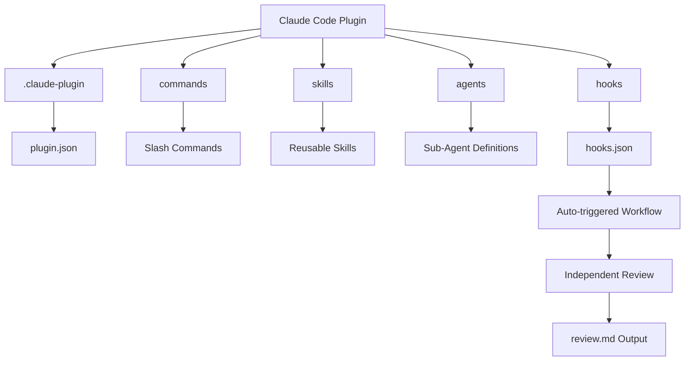
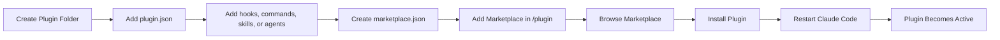
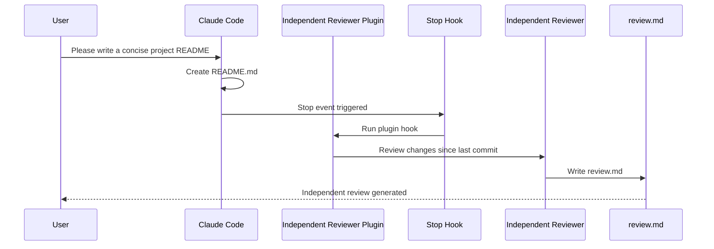
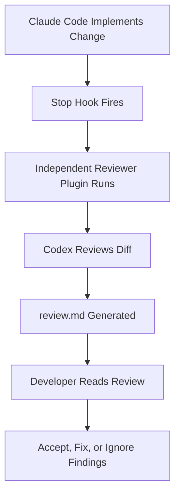
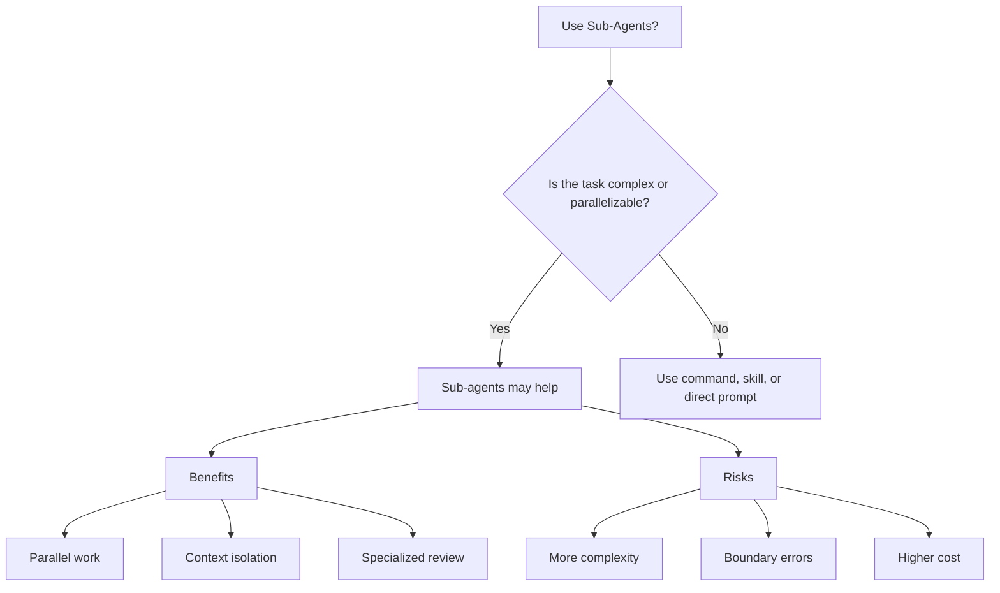
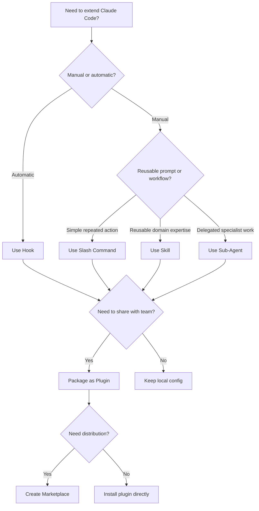

# 071 - Day 1 - Building Custom Claude Code Plugins and Marketplaces

## Lesson Information

| Item       | Details                                                      |
| ---------- | ------------------------------------------------------------ |
| Lesson     | 071                                                          |
| Duration   | 13 min                                                       |
| Week       | Week 3 - Agentic Engineering Frontier                        |
| Module     | Week 3 Day 1 - Sub-Agents, Hooks, Plugins                    |
| Main Topic | Building custom Claude Code plugins and private marketplaces |

---

## 1. Lesson Overview

This lesson introduces how to build a **custom Claude Code plugin** and distribute it through a **plugin marketplace**.

A plugin is a way to package reusable Claude Code functionality, such as:

* Slash commands
* Skills
* Sub-agents
* Hooks
* Team-specific workflows

The demo builds an **Independent Reviewer** plugin that automatically runs an independent review after Claude Code finishes making changes.

The bigger idea is that teams can create internal plugins and publish them through a private marketplace so everyone in the organization can install and use the same workflows consistently.

---

## 2. Why Custom Plugins Matter

Custom plugins are not something every beginner needs immediately, but they become useful when working with larger projects or teams.

They help you:

* Package advanced workflows into reusable tools
* Share standardized automation across a team
* Avoid manually copying commands, hooks, and skills between projects
* Build internal marketplaces for company-specific Claude Code extensions
* Improve consistency, safety, and review quality across repositories

In short, plugins allow teams to turn repeated Claude Code workflows into installable building blocks.

---

## 3. Core Idea

A Claude Code plugin is a folder that contains configuration and optional features.

A plugin can include:

```text
commands/
skills/
agents/
hooks/
.claude-plugin/
```

Each folder represents one type of Claude Code extension.

| Folder            | Purpose                                      |
| ----------------- | -------------------------------------------- |
| `commands/`       | Stores custom slash commands                 |
| `skills/`         | Stores reusable skills                       |
| `agents/`         | Stores sub-agent definitions                 |
| `hooks/`          | Stores hook configuration                    |
| `.claude-plugin/` | Stores plugin metadata such as `plugin.json` |

---

## 4. Demo Plugin: Independent Reviewer

The demo creates a plugin called **Independent Reviewer**.

Its purpose is to:

> Carry out an independent review of all changes since the last commit.

The plugin uses a hook to trigger a review automatically after Claude Code finishes its work.

A possible plugin manifest looks like this:

```json
{
  "name": "Independent Reviewer",
  "description": "Carry out an independent review of all changes since last commit",
  "version": "1.0.0"
}
```

This file is saved as:

```text
Independent Reviewer/
└── .claude-plugin/
    └── plugin.json
```

---

## 5. Plugin Folder Structure

The plugin starts with a normal folder:

```text
Independent Reviewer/
```

Inside it, create the required plugin metadata folder:

```text
Independent Reviewer/
└── .claude-plugin/
    └── plugin.json
```

Then add any feature folders needed by the plugin.

For this demo, the plugin uses hooks:

```text
Independent Reviewer/
├── .claude-plugin/
│   └── plugin.json
└── hooks/
    └── hooks.json
```

A fuller plugin could look like this:

```text
Independent Reviewer/
├── .claude-plugin/
│   └── plugin.json
├── commands/
│   └── review.md
├── skills/
│   └── independent-reviewer.md
├── agents/
│   └── reviewer-agent.md
└── hooks/
    └── hooks.json
```

---

## 6. Plugin Architecture Diagram



---

## 7. Creating the Hook

The demo moves an existing hook from the local Claude Code settings into the plugin’s `hooks.json`.

Instead of keeping the hook only in one project’s settings, the hook becomes part of the plugin.

This means anyone who installs the plugin can receive the same behavior.

Example structure:

```text
Independent Reviewer/
└── hooks/
    └── hooks.json
```

Conceptually, the hook says:

```text
When Claude Code stops working,
run an independent review command,
then write the result to review.md.
```

This turns the review process into an automated team workflow.

---

## 8. Why Use a Marketplace?

Claude Code can load a plugin directly, but the better approach is to create a marketplace.

A marketplace is a collection of plugins that can be discovered and installed.

This is especially useful for:

* Teams
* Companies
* Shared internal tooling
* Standardized development workflows
* Plugin version management

A marketplace can be local or hosted in a Git repository.

---

## 9. Marketplace Folder Structure

The marketplace is defined at the repository level using another `.claude-plugin` folder.

Example:

```text
repo-root/
├── .claude-plugin/
│   └── marketplace.json
└── Independent Reviewer/
    ├── .claude-plugin/
    │   └── plugin.json
    └── hooks/
        └── hooks.json
```

The marketplace file lists available plugins.

Example:

```json
{
  "name": "edtools",
  "owner": {
    "name": "Ed",
    "email": "ed@example.com"
  },
  "plugins": [
    {
      "name": "Independent Reviewer",
      "path": "Independent Reviewer",
      "description": "Carry out independent review of all changes"
    }
  ]
}
```

---

## 10. Marketplace Flow



---

## 11. Installing the Plugin

The demo installs the plugin through the Claude Code `/plugin` interface.

The process is:

1. Open Claude Code.
2. Run `/plugin`.
3. Go to **Marketplaces**.
4. Choose **Add Marketplace**.
5. Provide the local path, such as:

```text
./
```

6. Claude Code detects the marketplace.
7. Browse plugins inside the marketplace.
8. Select **Independent Reviewer**.
9. Install it for the project.
10. Restart Claude Code.

After restarting, the plugin appears under installed plugins.

---

## 12. Testing the Plugin

To test whether the plugin works, the demo removes existing files and asks Claude Code to create a new concise project README.

Prompt example:

```text
Please write a concise project README.
```

Claude Code writes the README.

Then the plugin’s stop hook is triggered.

The expected result:

```text
review.md
```

The plugin successfully creates an independent review file, proving that the hook from the plugin is active.

---

## 13. Demo Execution Flow



---

## 14. Key Concepts

### 14.1 Plugin

A plugin is a packaged Claude Code extension.

It can contain commands, skills, agents, and hooks.

Instead of manually configuring each project, a plugin allows you to install all related functionality at once.

---

### 14.2 Plugin Manifest

The `plugin.json` file describes the plugin.

It usually contains:

* Plugin name
* Description
* Version
* Metadata needed by Claude Code

This file tells Claude Code what the plugin is and what it provides.

---

### 14.3 Hooks

Hooks allow Claude Code to automatically run actions when certain events happen.

In this lesson, a stop hook runs after Claude Code finishes a task.

This is useful for:

* Automatic code reviews
* Running tests
* Checking formatting
* Updating documentation
* Creating review reports

---

### 14.4 Marketplace

A marketplace is a registry of plugins.

It allows users to discover, browse, and install plugins.

A team can maintain its own internal marketplace so everyone uses the same approved tools.

---

### 14.5 Project Scope Installation

The plugin is installed at the project scope.

This means the plugin becomes part of the repository’s Claude Code environment and can be shared with collaborators.

This is useful when a whole team should use the same automation.

---

## 15. Plugins vs Commands vs Skills vs Sub-Agents

| Tool           | Best Used For                                          |
| -------------- | ------------------------------------------------------ |
| Slash Commands | Repeated manual workflows                              |
| Skills         | Reusable task-specific instructions                    |
| Hooks          | Automatic event-triggered behavior                     |
| Sub-agents     | Delegated specialized work                             |
| Plugins        | Packaging commands, skills, agents, and hooks together |
| Marketplace    | Sharing plugins across people or teams                 |

---

## 16. When to Build a Plugin

Build a plugin when you have a workflow that should be reused across multiple projects or people.

Good plugin examples:

* Independent code reviewer
* Security checklist runner
* PR preparation assistant
* Documentation generator
* Test runner hook
* Team-specific architecture reviewer
* Frontend design checker
* API contract validator

Do not build a plugin too early.

If the workflow is still experimental, start with a simple command, skill, or hook first.

Once it becomes stable and useful, package it as a plugin.

---

## 17. Practical Example: Independent Reviewer Plugin

The Independent Reviewer plugin is useful because it creates separation between implementation and review.

The main Claude Code session writes or edits code.

The plugin then triggers an independent review.

This helps reduce the risk of the same agent blindly approving its own work.



---

## 18. Benefits of Custom Plugins

Custom plugins provide several advantages:

| Benefit          | Explanation                                               |
| ---------------- | --------------------------------------------------------- |
| Reusability      | Package workflows once and use them across projects       |
| Team consistency | Everyone uses the same commands, hooks, and agents        |
| Automation       | Common tasks can run automatically                        |
| Scalability      | Internal tooling can grow into a private marketplace      |
| Safety           | Approved plugins can enforce review and testing standards |
| Productivity     | Developers spend less time repeating setup steps          |

---

## 19. Risks and Safety Considerations

Plugins are powerful, so they should be designed carefully.

Important safety rules:

* Keep plugin scope clear.
* Avoid plugins that do too many unrelated things.
* Review hooks carefully before sharing.
* Make sure automatic commands cannot cause destructive changes.
* Avoid recursive loops where a hook triggers itself repeatedly.
* Document what the plugin does.
* Version plugins properly.
* Prefer project-scoped installation for team workflows.
* Use trusted marketplaces only.

A plugin should make the workflow safer and clearer, not more mysterious.

---

## 20. Sub-Agents Recap

At the end of the lesson, the instructor also summarizes the pros and cons of sub-agents.

Sub-agents are powerful because they allow Claude Code to delegate work.

They can help with:

* Parallel work
* Independent review
* Context management
* Specialized tasks
* Self-correction

However, they also introduce more complexity.

---

## 21. Pros of Sub-Agents

| Advantage          | Explanation                                             |
| ------------------ | ------------------------------------------------------- |
| Parallel work      | Multiple agents can work on different parts of a task   |
| Self-correction    | One agent can review or critique another agent’s output |
| Context efficiency | Work can be moved out of the main Claude Code context   |
| Specialization     | Each sub-agent can focus on one narrow task             |
| Better prompting   | A focused sub-agent can have a highly optimized prompt  |

---

## 22. Cons of Sub-Agents

| Drawback            | Explanation                                                         |
| ------------------- | ------------------------------------------------------------------- |
| More moving parts   | More components means more potential failure points                 |
| Harder debugging    | Problems may happen across agent boundaries                         |
| Boundary issues     | Main agent and sub-agent may misunderstand each other               |
| Error amplification | Small mistakes can compound across agents                           |
| Higher cost         | More agents may mean more tokens, more calls, and more review loops |
| More complexity     | The system can become harder to reason about                        |

---

## 23. Sub-Agent Trade-Off Diagram



---

## 24. Choosing the Right Extension Type

Use this decision guide:



---

## 25. Recommended Plugin Design Principles

A good Claude Code plugin should be:

* **Focused**: It should solve one clear problem.
* **Documented**: Users should understand what it does.
* **Safe**: It should avoid destructive or uncontrolled actions.
* **Composable**: It should work well with other plugins.
* **Versioned**: Updates should be trackable.
* **Team-friendly**: It should support consistent workflows.
* **Testable**: You should be able to verify that it works.

Bad plugins usually try to do too much or hide too much behavior.

---

## 26. Example Use Cases for Team Marketplaces

A company could create a marketplace with plugins like:

```text
company-devtools/
├── security-reviewer/
├── api-contract-checker/
├── frontend-design-reviewer/
├── test-coverage-runner/
├── docs-generator/
├── jira-ticket-implementer/
└── release-prep-assistant/
```

Each plugin could package a different workflow.

The marketplace becomes an internal library of approved Claude Code extensions.

---

## 27. What Was Successfully Demonstrated

By the end of the demo, the instructor successfully showed that:

* A custom plugin folder can be created.
* The plugin can define a `plugin.json`.
* The plugin can include hooks.
* A marketplace can be created with `marketplace.json`.
* Claude Code can add the marketplace.
* Claude Code can install the plugin from the marketplace.
* The installed plugin can trigger a hook.
* The hook can generate a `review.md` file automatically.

The key result:

> The Independent Reviewer plugin worked successfully through the marketplace installation flow.

---

## 28. Key Takeaways

* Plugins package Claude Code extensions into reusable units.
* A plugin can contain commands, skills, agents, and hooks.
* `plugin.json` describes the plugin.
* `hooks.json` can define automated event-triggered behavior.
* A marketplace allows plugins to be discovered and installed.
* Internal marketplaces are useful for teams and companies.
* Plugins should have clear scope and strong safety standards.
* Sub-agents are powerful but add complexity and cost.
* Start simple with commands, skills, or hooks before packaging them as plugins.

---

## 29. Practice Exercise

Create a small Claude Code plugin called:

```text
Project README Reviewer
```

The plugin should:

1. Trigger after Claude Code finishes a task.
2. Check whether `README.md` exists.
3. Review whether the README includes:

   * Project purpose
   * Installation steps
   * Usage instructions
   * Testing instructions
4. Write feedback to:

```text
readme-review.md
```

Suggested structure:

```text
Project README Reviewer/
├── .claude-plugin/
│   └── plugin.json
└── hooks/
    └── hooks.json
```

Then create a local marketplace:

```text
repo-root/
├── .claude-plugin/
│   └── marketplace.json
└── Project README Reviewer/
    ├── .claude-plugin/
    │   └── plugin.json
    └── hooks/
        └── hooks.json
```

---

## 30. Review Questions

1. What problem does a Claude Code plugin solve?
2. What is the purpose of `plugin.json`?
3. Why is a marketplace better than manually loading one plugin?
4. What folders can a plugin contain?
5. When should you use a hook instead of a slash command?
6. Why might a team create a private plugin marketplace?
7. What are the risks of using too many sub-agents?
8. How can a plugin improve code review workflows?
9. Why should plugins have clear scope?
10. What safety checks should be applied before sharing a plugin?

---

## 31. Final Summary

This lesson shows how Claude Code can be extended beyond individual commands and hooks by packaging functionality into custom plugins.

The demo builds an **Independent Reviewer** plugin, places its metadata in `plugin.json`, adds a hook through `hooks.json`, then publishes it through a local marketplace using `marketplace.json`.

After installing the plugin through Claude Code’s `/plugin` interface, the hook successfully runs and creates a `review.md` file.

The broader lesson is that plugins and marketplaces allow teams to create reusable, standardized, and shareable Claude Code workflows.

They are advanced features, but they become powerful when a team wants consistent automation, review standards, and reusable agentic engineering tools.
