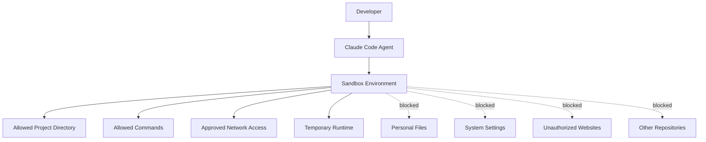
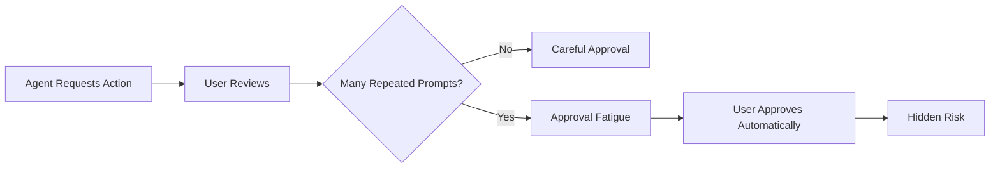
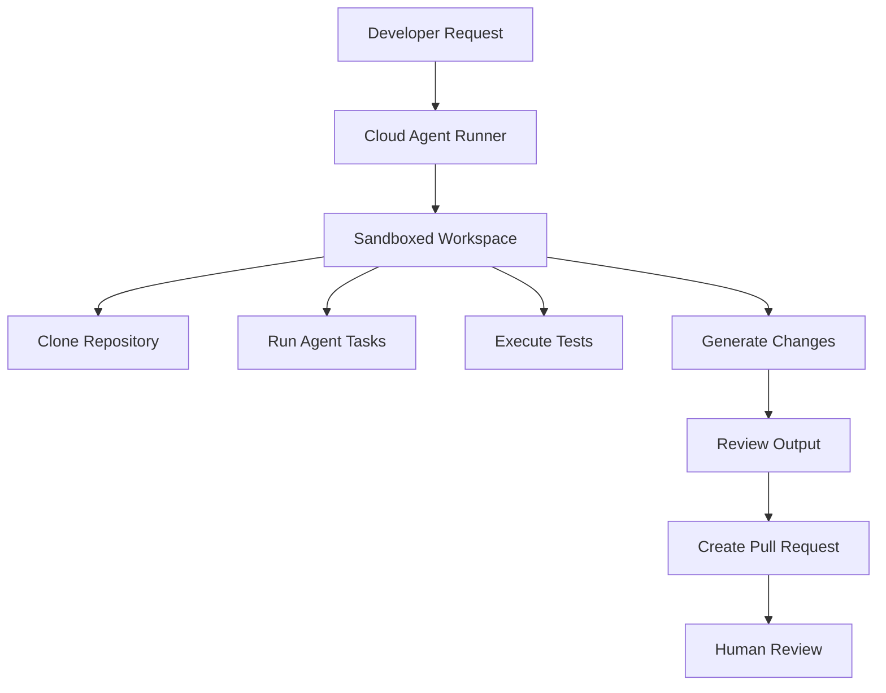

# 072 - Day 2 - Claude Code Sandboxing and Cloud Execution Deep Dive

## Lesson Information

| Item     | Details                                      |
| -------- | -------------------------------------------- |
| Lesson   | 072                                          |
| Duration | 8 min                                        |
| Week     | Week 3 - Agentic Engineering Frontier        |
| Module   | Week 3 Day 2 - Sandboxing & Remote Execution |

---

## Main Topic

This lesson introduces **sandboxing** and **cloud execution** in Claude Code.

Sandboxing helps isolate the environment where an AI coding agent runs. This reduces risk when using high-autonomy modes such as **YOLO mode**, where the agent can make many changes quickly.

Cloud execution extends this idea by allowing agents to run remotely, making autonomous coding workflows more scalable, flexible, and practical.

---

## Learning Objectives

By the end of this lesson, learners should be able to:

* Understand what sandboxing means in the context of AI coding agents.
* Explain why sandboxing is important for safety and productivity.
* Recognize the risks of unsandboxed YOLO workflows.
* Understand the relationship between sandboxing and cloud execution.
* Connect sandboxing with previous Claude Code features such as skills, sub-agents, hooks, and plugins.

---

## Quick Recap from the Previous Day

The previous lesson covered several advanced Claude Code features:

| Feature           | Main Purpose                                              |
| ----------------- | --------------------------------------------------------- |
| Slash Commands    | Quickly trigger reusable workflows                        |
| Skills            | Package reusable agent capabilities                       |
| Sub-agents        | Delegate specialized tasks and preserve main context      |
| Hooks             | Automatically trigger actions based on events             |
| Plugins           | Bundle commands, skills, agents, hooks, and configuration |
| MCP Servers       | Connect Claude Code to external tools and systems         |
| LSP Configuration | Add language support through Language Server Protocol     |

The main advice is not to feel overwhelmed. In practice, most users will focus on:

1. **Skills**
2. **Sub-agents**
3. Occasionally **hooks**
4. Sometimes **plugins** for team sharing

---

## Plugin Structure Review

A Claude Code plugin can contain several parts:

```text
my-plugin/
├── commands/
│   └── custom-slash-command.md
├── skills/
│   └── my-skill.md
├── agents/
│   └── reviewer-agent.md
├── hooks/
│   └── post-edit-hook.md
├── .mcp.json
└── .lsp.json
```

### Important Files

| File / Folder | Purpose                                                          |
| ------------- | ---------------------------------------------------------------- |
| `commands/`   | Stores custom slash commands                                     |
| `skills/`     | Stores reusable agent skills                                     |
| `agents/`     | Stores sub-agent definitions                                     |
| `hooks/`      | Stores event-triggered automations                               |
| `.mcp.json`   | Defines MCP servers included in the plugin                       |
| `.lsp.json`   | Defines language server support for custom or uncommon languages |

---

## Core Concept 1: What Is Sandboxing?

**Sandboxing** means creating a controlled environment where Claude Code can operate safely.

Instead of giving the agent unrestricted access to the entire machine, sandboxing limits what the agent can do.

For example:

* It can read and write files only inside a specific project folder.
* It cannot access files outside the repository.
* It can use the network only through approved websites or services.
* It can run commands only within a controlled environment.

In simple terms:

> A sandbox lets the agent work freely, but only inside a safe boundary.

---

## Core Concept 2: Why Sandboxing Matters

Sandboxing matters because AI coding agents are becoming more autonomous.

When an agent can:

* edit files,
* run terminal commands,
* install packages,
* access the network,
* create commits,
* or modify project structure,

there is real risk if the environment is not controlled.

Sandboxing reduces that risk by limiting damage if the agent makes a mistake.

---

## Sandboxing Diagram



---

## Core Concept 3: Sandboxing and YOLO Mode

YOLO mode allows the agent to move quickly with fewer manual confirmations.

This can be powerful, but also risky.

Without sandboxing:

```text
YOLO Mode + Full Machine Access = High Risk
```

With sandboxing:

```text
YOLO Mode + Controlled Environment = Safer Autonomy
```

Sandboxing makes developers more comfortable using YOLO-style workflows because the agent has freedom, but only within safe boundaries.

---

## The Problem of Approval Fatigue

One important point from the lesson is **approval fatigue**.

In a normal unsandboxed workflow, Claude Code may ask for permission before doing something.

For example:

```text
Approve this command?
1. Yes
2. No
```

At first, this feels safe.

But after many repeated approvals, the developer may stop reading carefully and simply press approve again and again.

This creates a false sense of safety.

```text
Manual Approval ≠ Real Safety
```

If the user blindly approves everything, the workflow becomes similar to YOLO mode, but without the protection of a sandbox.

---

## Approval Fatigue Flow



---

## Sandboxing vs Approval-Based Safety

| Approach        | Strength                           | Weakness                     |
| --------------- | ---------------------------------- | ---------------------------- |
| Manual Approval | User has control over each action  | Can lead to approval fatigue |
| YOLO Mode       | Very fast and productive           | Risky without isolation      |
| Sandboxing      | Limits damage and increases safety | Requires setup               |
| Sandboxed YOLO  | Fast and safer                     | Still needs good boundaries  |

---

## Cloud Execution

Cloud execution means running Claude Code or coding agents in a remote environment instead of only on your local machine.

This is useful because remote environments can be:

* isolated,
* reproducible,
* scalable,
* easier to reset,
* safer for autonomous tasks,
* better suited for long-running agent workflows.

Cloud execution becomes especially powerful when combined with sandboxing.

---

## Sandboxing + Cloud Execution



This workflow is ideal for autonomous coding because the agent can work remotely without directly affecting the developer's local machine.

---

## Practical Example

A safe agent workflow might look like this:

```text
1. Create a sandboxed environment.
2. Clone the project repository.
3. Allow Claude Code to edit only files inside the repo.
4. Restrict network access to approved services.
5. Let the agent implement a feature.
6. Run tests inside the sandbox.
7. Review the generated changes.
8. Create a pull request.
```

This gives the agent enough freedom to be useful while keeping the system protected.

---

## Key Takeaways

* Sandboxing creates a safe boundary for AI coding agents.
* It is especially important when using YOLO mode or autonomous workflows.
* Manual approvals are useful, but they can fail because of approval fatigue.
* Sandboxed environments make high-speed agent workflows safer.
* Cloud execution allows agents to run remotely in isolated environments.
* Sandboxing and cloud execution together are essential for serious autonomous coding.

---

## Why This Lesson Matters

This lesson is a key part of **Week 3 Day 2 - Sandboxing & Remote Execution**.

Previous lessons introduced powerful Claude Code features such as skills, sub-agents, hooks, and plugins. This lesson explains how to use those capabilities more safely.

As AI coding agents become more autonomous, developers need systems that balance:

```text
Speed + Safety + Control
```

Sandboxing provides that foundation.

---

## Suggested Practice

To reinforce this lesson, learners should try the following:

1. Create a small test repository.
2. Run Claude Code in a limited project folder.
3. Experiment with a YOLO-style workflow.
4. Observe what risks appear.
5. Think about which actions should be restricted.
6. Design a simple sandbox policy for agent coding.

---

## Review Questions

1. What does sandboxing mean in the context of Claude Code?
2. Why is sandboxing useful when using YOLO mode?
3. What is approval fatigue?
4. Why is manual approval not always enough?
5. How does cloud execution support autonomous coding?
6. What should an agent be allowed to access inside a sandbox?
7. What should an agent be blocked from accessing?

---

## Summary

In this lesson, we explored why **sandboxing** is one of the most important foundations for safe AI coding.

Sandboxing isolates the environment where Claude Code runs, limiting access to files, commands, and networks. This makes it safer to use autonomous workflows and YOLO-style productivity.

The lesson also introduced **cloud execution**, where agents run remotely in controlled environments. When combined with sandboxing, cloud execution enables safer, scalable, and more practical autonomous coding workflows.

The core lesson is simple:

> The more autonomy you give an AI coding agent, the more important sandboxing becomes.

---

# Bài luyện tập

## Mục tiêu


## Đề bài


## Yêu cầu hoàn thành

- [ ] 
- [ ] 
- [ ] 

## Kết quả / lời giải


## Ghi chú
