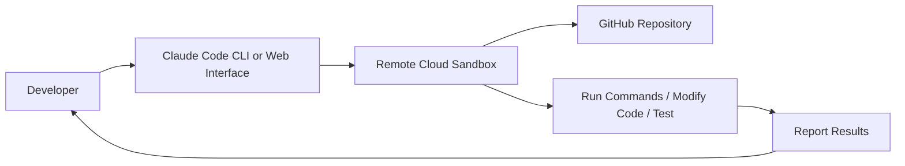
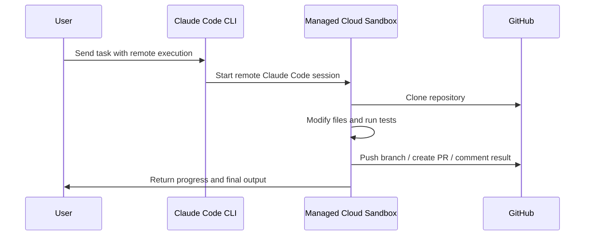
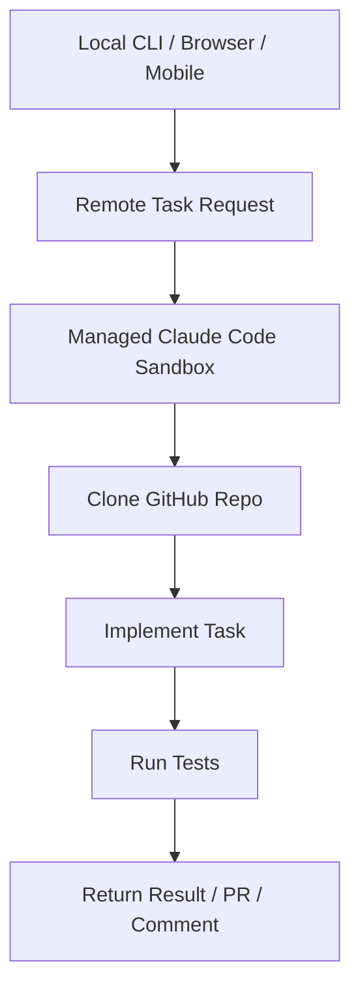
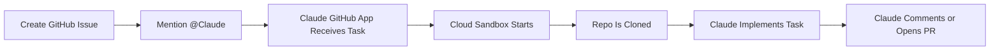
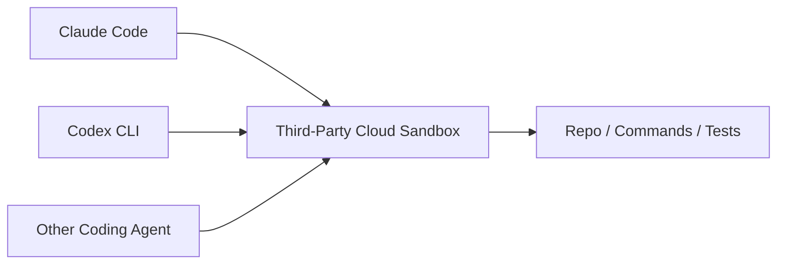
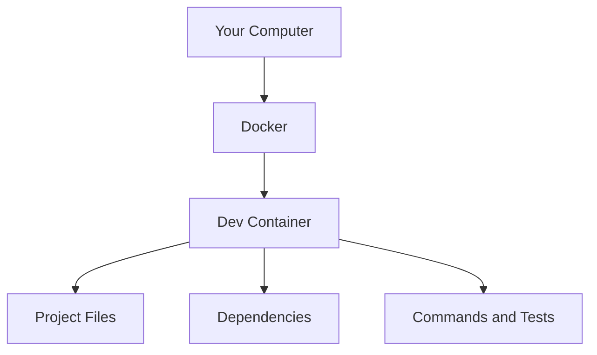
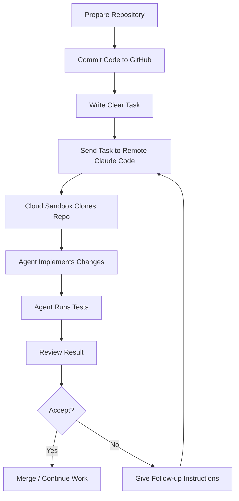
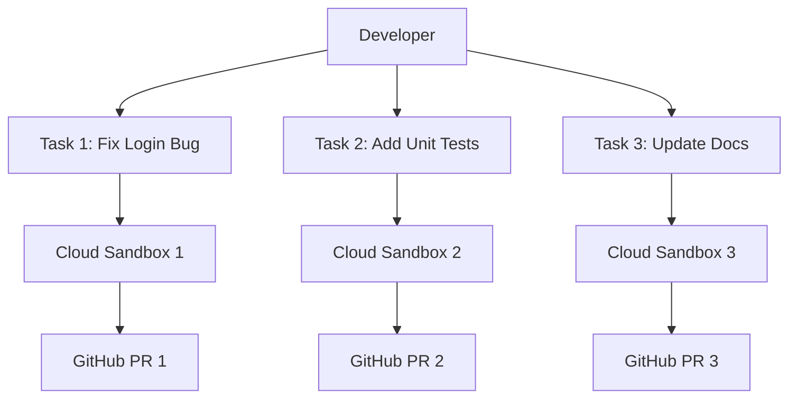

# 073 - Day 2 - Remote Execution & Cloud Sandboxes with Claude Code on the Web

## Lesson Information

| Item       | Details                                                                                         |
| ---------- | ----------------------------------------------------------------------------------------------- |
| Lesson     | 073                                                                                             |
| Duration   | 10 min                                                                                          |
| Week       | Week 3 - Agentic Engineering Frontier                                                           |
| Module     | Week 3 Day 2 - Sandboxing & Remote Execution                                                    |
| Main Topic | Remote execution, cloud sandboxes, Claude Code on the Web, and web-based coding-agent workflows |

---

## Main Idea

This lesson introduces **remote execution** and **cloud sandboxes** for coding agents.

Instead of running Claude Code only on your local machine, you can send tasks to a remote execution environment. The work happens in a managed sandbox, usually connected to a GitHub repository. This allows you to run coding tasks from anywhere, monitor progress through the web, and continue the workflow later from another device.

The key idea is:

> You are no longer limited to your local computer.
> Claude Code can execute tasks remotely in a controlled cloud environment.

---

## Why This Matters

Remote execution changes how developers work with coding agents.

It allows you to:

* Run agent tasks without keeping your local machine active
* Start work from a laptop, browser, or even mobile phone
* Delegate coding tasks to remote cloud sandboxes
* Run multiple tasks in parallel
* Keep risky execution isolated from your local machine
* Connect coding agents directly to GitHub issues and repositories
* Continue a remote task later by attaching back to the session

This is especially important for autonomous and semi-autonomous coding workflows.

---

## Core Concepts

### 1. Remote Execution

Remote execution means the coding agent does not run commands directly on your local computer.

Instead, the workflow looks like this:



The developer gives instructions, but the actual coding, command execution, and testing happen somewhere else.

---

### 2. Cloud Sandbox

A cloud sandbox is an isolated execution environment in the cloud.

It gives the coding agent a safe place to:

* Clone the repository
* Install dependencies
* Read and modify files
* Run tests
* Generate commits or pull requests
* Report progress back to the user

The sandbox helps reduce risk because the agent is not directly operating inside your personal machine.

---

### 3. Claude Code on the Web

Claude Code on the Web is a managed remote execution workflow.

Instead of manually creating your own cloud server or Docker environment, the platform manages the remote sandbox for you.

A typical flow:



---

## Three Main Approaches

The lesson explains three different approaches to sandboxing and remote execution.

---

## Approach 1: Native Local Sandbox

A native sandbox runs locally but isolates the agent from the rest of your system.

In Claude Code, this can be triggered with:

```bash
/sandbox
```

This is not remote execution yet. It still runs on your machine, but inside a more controlled environment.

### Key Characteristics

| Feature                  | Description                                            |
| ------------------------ | ------------------------------------------------------ |
| Runs locally             | The work still happens on your computer                |
| Sandboxed                | Agent actions are isolated and controlled              |
| Lightweight              | Usually faster and lighter than full Docker containers |
| OS-level isolation       | Uses operating-system sandboxing features              |
| Useful for auto-approval | Some actions can be safely approved inside the sandbox |

### Platform Notes

| Platform            | Support Consideration                     |
| ------------------- | ----------------------------------------- |
| macOS               | Usually easiest                           |
| Linux               | Usually works well                        |
| Windows             | May require WSL                           |
| Windows without WSL | Better to focus on cloud approaches first |

### When to Use

Use native local sandboxing when:

* You want faster local execution
* You trust the project but still want isolation
* You want fewer approval interruptions
* You are developing on macOS, Linux, or WSL

---

## Approach 2: Managed Cloud Sandbox

This is the most powerful and surprising workflow in the lesson.

A managed cloud sandbox means Claude Code runs remotely on infrastructure managed by the provider.

You can send a task from your CLI or web interface, and the agent runs it in the cloud.



### Key Characteristics

| Feature              | Description                                           |
| -------------------- | ----------------------------------------------------- |
| Runs remotely        | The task does not execute on your machine             |
| Managed by provider  | Infrastructure is handled for you                     |
| GitHub-centered      | Code usually needs to be checked into GitHub          |
| Parallel-friendly    | Multiple remote tasks can run at once                 |
| Mobile-friendly      | You can start or monitor work away from your computer |
| Sandboxed by default | Remote execution happens in an isolated environment   |

---

## Remote Execution from CLI

The lesson describes a workflow where you can send a task remotely from Claude Code.

Conceptually, instead of saying:

```bash
claude "Fix this bug"
```

You can run a remote version of the task, such as:

```bash
claude remote "Fix this bug and run the tests"
```

Or use special syntax inside Claude Code to send the instruction to a remote execution engine.

The exact command may vary by platform and version, but the principle is:

> Same coding-agent instruction, different execution location.

---

## Remote Execution from GitHub Issues

Another powerful workflow is triggering Claude from GitHub.

Example flow:



This makes GitHub issues more than just planning documents. They can become task triggers for remote coding agents.

### Example GitHub Issue

```markdown
@Claude please implement the login validation described below.

Requirements:
- Validate email format
- Show clear error messages
- Add tests for invalid input
- Do not change unrelated files
```

Claude can then pick up the issue, run in a cloud sandbox, and work on the repository.

---

## Teleport and Remote Sessions

The lesson also introduces the idea of **Teleport**.

Teleport allows you to attach to a remote Claude Code session that is already running.

This means you can:

* Start a task remotely
* Let it work in the cloud
* Inspect the task later
* Attach to the session
* Continue the conversation from your local machine

Conceptually:

```mermaid
flowchart TD
    A[Remote Claude Task Running] --> B[/tasks]
    B --> C[View Active Tasks]
    C --> D[Select Task]
    D --> E[Teleport Into Session]
    E --> F[Continue Conversation Locally]
```

This makes remote execution feel like having multiple Claude Code sessions running outside your computer.

---

## Approach 3: Third-Party Cloud Sandboxes

The third approach uses cloud sandbox providers outside the main coding-agent platform.

These are third-party services designed to run coding agents inside fast, isolated cloud environments.

Examples may include services like cloud containers, dev environments, or agent-focused sandbox platforms.

### Why This Matters

Third-party sandboxes are useful because they can work with different coding agents, not just Claude Code.



### Key Characteristics

| Feature                 | Description                                               |
| ----------------------- | --------------------------------------------------------- |
| Agent-agnostic          | Can support multiple coding agents                        |
| Cloud-hosted            | Runs outside your machine                                 |
| Sandbox-based           | Isolates execution                                        |
| Flexible                | Can be customized for different workflows                 |
| Good for advanced users | Useful when you want more control than a managed platform |

---

## Comparison of the Three Approaches

| Approach                  | Runs Where?             | Managed By                         | Best For                                      | Limitation                   |
| ------------------------- | ----------------------- | ---------------------------------- | --------------------------------------------- | ---------------------------- |
| Native Local Sandbox      | Your machine            | Claude Code / local OS             | Safer local work                              | Still uses local resources   |
| Managed Cloud Sandbox     | Provider cloud          | Anthropic or coding-agent provider | Remote work, GitHub tasks, parallel execution | Depends on platform features |
| Third-Party Cloud Sandbox | External cloud provider | Third-party sandbox service        | Flexible multi-agent workflows                | May require more setup       |

---

## Docker and Dev Containers

The lesson also mentions Docker and VS Code Dev Containers.

These are older or more traditional ways to create isolated development environments.



Docker is still useful, but the lesson focuses on newer workflows that go beyond basic local containers.

### Docker / Dev Containers Are Useful When

* You want reproducible development environments
* You need strict dependency isolation
* Your team already uses containers
* You want local sandboxing without relying on a managed cloud platform

### But Cloud Sandboxes Go Further

Cloud sandboxes add:

* Remote execution
* Web-based monitoring
* Parallel task execution
* GitHub issue integration
* Agent-specific optimization

---

## Practical Workflow

A typical remote execution workflow looks like this:



---

## Best Practices

### 1. Keep Everything Checked Into GitHub

Remote execution usually depends on GitHub.

Before sending a remote task, make sure:

* Your latest code is committed
* The branch is pushed
* The repo has clear setup instructions
* The agent can access the repository

---

### 2. Write Clear Tasks

Bad instruction:

```text
Fix the app.
```

Better instruction:

```text
Fix the login form validation bug.

Expected behavior:
- Invalid email should show an error message
- Empty password should show an error message
- Valid inputs should submit normally

Please run the existing test suite after changes.
```

---

### 3. Limit Permissions

Remote agents should only get the access they need.

Recommended controls:

* Restrict repository access
* Avoid giving broad organization-wide permissions
* Review generated pull requests before merging
* Do not expose unnecessary secrets
* Use temporary or scoped credentials when possible

---

### 4. Always Review Output

Even if the agent runs remotely and completes the task, the developer is still responsible for reviewing the result.

Check:

* Code quality
* Test results
* Security impact
* Unexpected file changes
* Dependency changes
* Generated pull request content

---

### 5. Use Remote Execution for the Right Tasks

Good remote tasks:

* Small feature implementation
* Bug fixes
* Test generation
* Refactoring with clear scope
* Documentation updates
* Issue-based implementation

Riskier remote tasks:

* Large architecture rewrites
* Security-sensitive changes
* Production deployment changes
* Secret management
* Database migrations without review

---

## Example Task Prompt

```text
Implement the password reset flow.

Requirements:
- Add a "Forgot password?" link to the login page
- Create a password reset request form
- Validate email input
- Add backend endpoint if missing
- Add tests for successful and invalid requests
- Do not modify unrelated authentication logic
- Run tests and summarize what changed
```

---

## Mental Model

Think of remote execution as having multiple coding agents working in separate cloud workspaces.



Instead of opening many local terminals, the remote platform creates separate execution environments for each task.

---

## Common Mistakes

| Mistake                     | Why It Is a Problem                     | Better Approach                             |
| --------------------------- | --------------------------------------- | ------------------------------------------- |
| Sending vague tasks         | Agent may change too much               | Provide clear scope and acceptance criteria |
| Not pushing latest code     | Remote sandbox sees outdated repo state | Commit and push first                       |
| Giving too much repo access | Security risk                           | Use least-privilege access                  |
| Skipping review             | Agent output may contain bugs           | Review every PR                             |
| Running huge tasks remotely | Hard to validate                        | Break into smaller tasks                    |
| Forgetting setup docs       | Agent may fail to run project           | Keep README and commands updated            |

---

## Demo Checklist

Before trying remote execution, prepare the following:

* [ ] GitHub repository is ready
* [ ] Latest branch is pushed
* [ ] Project has install instructions
* [ ] Project has test commands
* [ ] Claude GitHub app or equivalent integration is installed
* [ ] Permissions are limited to the correct repository
* [ ] Task is written clearly
* [ ] Expected output is defined
* [ ] You know how to inspect running tasks
* [ ] You know how to review the final result

---

## Key Takeaways

* Remote execution lets Claude Code run tasks outside your local machine.
* Cloud sandboxes provide isolated environments for safer agent execution.
* Claude Code on the Web enables GitHub-connected coding workflows.
* GitHub issues can become direct task triggers for coding agents.
* Teleport allows you to attach to remote sessions and continue working.
* Third-party cloud sandboxes can support multiple coding agents.
* Docker and dev containers are still useful, but cloud sandboxes provide more powerful remote workflows.
* Remote execution is useful, but human review remains essential.

---

## Review Questions

1. What is the difference between local sandboxing and remote execution?
2. Why does remote execution usually depend on GitHub?
3. What are the benefits of running coding-agent tasks in cloud sandboxes?
4. When should you use a native local sandbox instead of a managed cloud sandbox?
5. What is the purpose of Teleport in remote Claude Code workflows?
6. Why should developers still review code generated by remote agents?
7. What kinds of tasks are best suited for remote execution?
8. What security precautions should you take before giving a coding agent repo access?

---

## Short Summary

In this lesson, students learn how remote execution and cloud sandboxes extend Claude Code beyond the local machine. Claude Code can run tasks in managed cloud environments, interact with GitHub repositories, respond to GitHub issues, and allow developers to monitor or reattach to remote sessions. This workflow enables mobile, parallel, and sandboxed coding-agent execution, but it also requires clear task instructions, controlled permissions, and careful human review.
