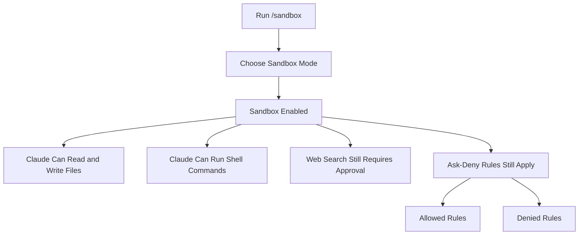
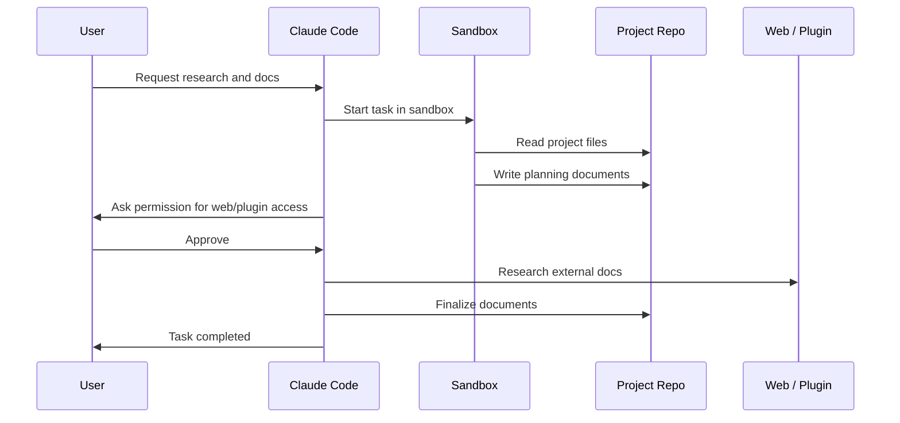
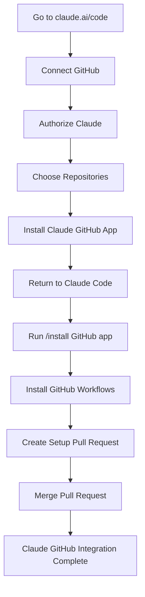
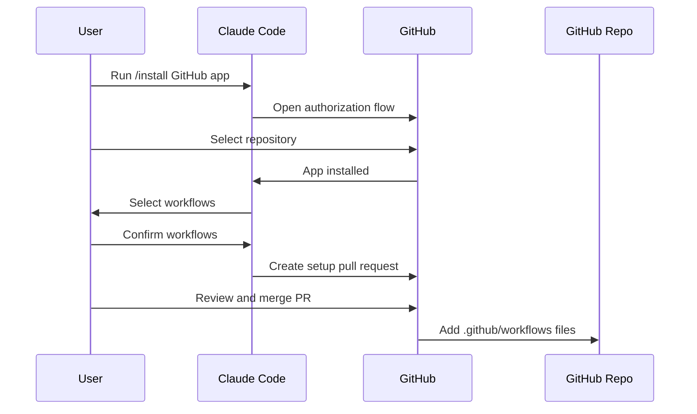
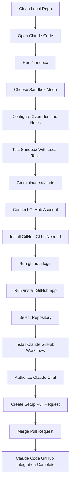

# 074 - Day 2 - Setting Up Claude Code Sandbox & GitHub Integration

## Lesson Information

| Item       | Details                                          |
| ---------- | ------------------------------------------------ |
| Lesson     | 074                                              |
| Duration   | 13 minutes                                       |
| Week       | Week 3 - Agentic Engineering Frontier            |
| Module     | Week 3 Day 2 - Sandboxing & Remote Execution     |
| Main Topic | Claude Code sandbox setup and GitHub integration |

---

## Main Idea

This lesson shows how to set up **Claude Code Sandbox** and connect Claude Code with a **GitHub repository**.

The goal is to let Claude Code run coding tasks in an isolated environment, reduce repeated permission prompts, and enable GitHub-based workflows such as pull requests, code review, and issue-driven automation.

---

## Why This Lesson Matters

As AI coding agents become more autonomous, they need a safe execution environment.

Without sandboxing, an agent may request many permissions or accidentally run risky commands. With sandboxing, Claude Code can read, write, and run many local development tasks inside an isolated environment while still respecting security rules.

GitHub integration is also important because it allows Claude Code to work directly with repositories, create workflows, open pull requests, and support remote coding workflows from Claude on the web.

---

## Learning Objectives

By the end of this lesson, learners should be able to:

* Enable and configure Claude Code Sandbox.
* Understand different sandbox modes.
* Use sandboxing to reduce manual permission approvals.
* Connect Claude Code to a GitHub account.
* Install the Claude Code GitHub app into a repository.
* Understand the GitHub workflows added by Claude Code.
* Review and merge Claude-generated setup pull requests safely.

---

# 1. Starting From a Clean Claude Code Setup

Before setting up sandboxing, the instructor returns to VS Code and Claude Code.

The project has been cleaned up:

* The previous plugin was removed.
* Unneeded files were deleted.
* Changes were pushed to Git.
* The `.claude` directory is mostly empty.
* Only the Cerebras skill remains because it will be needed later.

This creates a cleaner environment before enabling sandbox mode.

---

# 2. Enabling Claude Code Sandbox

Inside Claude Code, run:

```bash
/sandbox
```

Claude Code shows that sandboxing is currently disabled.

You can press **Enter** to configure it.

---

## Sandbox Modes

Claude Code provides several sandbox options.

| Mode                | Description                                                                                                                               |
| ------------------- | ----------------------------------------------------------------------------------------------------------------------------------------- |
| No Sandbox          | Claude runs without sandbox isolation. More permission prompts may be required.                                                           |
| Regular Sandbox     | Allows shell scripts and commands to run with normal sandbox permissions.                                                                 |
| Sandboxed YOLO Mode | Commands try to run automatically inside the sandbox. If something must run outside the sandbox, Claude falls back to normal permissions. |
| Strict Sandbox      | Commands must stay inside the sandbox and cannot fall back outside.                                                                       |

The instructor chooses the first sandboxed option, which behaves like a safer version of YOLO mode.

---

## Sandbox Configuration Diagram



---

# 3. Understanding Sandbox Overrides

After enabling sandbox mode, Claude Code allows further configuration.

Important areas include:

| Setting Area    | Purpose                                                                          |
| --------------- | -------------------------------------------------------------------------------- |
| Current Setting | Shows the active sandbox mode.                                                   |
| Overrides       | Controls whether Claude can fall back outside the sandbox or must remain strict. |
| Config          | Defines what is allowed and denied.                                              |

The instructor points out that the config section includes commands that probably should be denied by default.

This is important because sandboxing is not just about convenience. It is also about limiting risk.

---

# 4. What Claude Can Do Inside the Sandbox

Once sandboxing is enabled, Claude Code can perform many actions without asking for permission every time.

Inside the sandbox, Claude can usually:

* Read files.
* Write files.
* Run bash scripts.
* Run shell commands.
* Create or modify documentation.
* Work across the project directory.

However, some actions still require approval:

* Web searches.
* External plugin usage.
* Actions outside the sandbox.
* Commands blocked by deny rules.

---

# 5. Demo: Running a Research and Documentation Task

The instructor gives Claude Code a larger task:

> Carry out comprehensive research and write three documents to the planning directory.

The requested documents are about:

1. The Massive market data API, formerly Polygon.
2. The market data interface design.
3. A market data simulator.

Because sandbox mode is enabled, Claude can:

* Read project files.
* Think through the task.
* Create documents.
* Write files to the planning directory.
* Run local commands without repeated permission prompts.

The only extra permission needed is for web research or plugin-based research.

---

## Sandbox Task Flow



---

# 6. Plugin Permission Example

During the demo, Claude asks permission to use the `context7` plugin.

This happens because plugin usage is separate from standard sandbox permissions.

The instructor approves the plugin because it is useful for researching documentation more accurately than a basic web search.

This shows an important point:

> Sandbox mode reduces permission prompts, but it does not remove all permission checks.

Claude still asks when it needs access to tools or actions that are not already approved.

---

# 7. Reviewing Sandbox Output

After Claude finishes, the requested documents are created.

The instructor does not deeply review the documents at this stage because the lesson is focused on setup and workflow.

However, in a real project, the recommended process is:

1. Let Claude generate the files.
2. Review the files manually.
3. Check for correctness.
4. Commit only the useful changes.
5. Avoid blindly trusting generated work.

---

# 8. Sandbox Security Notes

The instructor emphasizes that learners should read the sandbox documentation.

Important security considerations include:

* Understand what Claude can and cannot run.
* Use deny rules for dangerous commands.
* Be careful with file deletion commands.
* Be careful with secrets, tokens, and credentials.
* Avoid giving unnecessary access.
* Prefer strict rules for sensitive projects.
* Review generated code before merging.

---

## Recommended Deny Rules

Common commands that should often be denied or restricted include:

```bash
rm -rf
sudo
chmod -R
curl | bash
wget | bash
git push --force
```

These commands can be dangerous if executed incorrectly.

---

# 9. Moving to Claude Code on the Web

After local sandboxing is configured, the lesson moves to remote Claude Code on the web.

The instructor opens:

```text
claude.ai/code
```

This page allows users to run Claude Code tasks from:

* Browser.
* Terminal.
* Mobile.
* Cloud environment.

The first setup step is connecting Claude with GitHub.

---

# 10. Connecting Claude to GitHub

On the Claude Code web page, select:

```text
Connect to GitHub
```

Claude then asks the user to authorize access to GitHub.

After authorization, Claude asks which repositories should be connected.

Options may include:

| Option                | Meaning                                                      |
| --------------------- | ------------------------------------------------------------ |
| All repositories      | Claude can access all repositories under the GitHub account. |
| Selected repositories | Claude can access only chosen repositories.                  |

The instructor chooses **only selected repositories** for better control.

---

## GitHub Integration Flow



---

# 11. Installing GitHub CLI

Claude Code may require the GitHub CLI command:

```bash
gh
```

If it is not installed, Claude Code shows instructions.

On macOS, install it with:

```bash
brew install gh
```

Then authenticate with GitHub:

```bash
gh auth login
```

The authentication flow usually opens a browser and asks the user to enter a code.

After completing the flow, the local machine is authenticated with GitHub CLI.

---

## Platform Notes

| Platform | Setup                                                           |
| -------- | --------------------------------------------------------------- |
| macOS    | Use Homebrew to install `gh`.                                   |
| Windows  | Use the Windows installation instructions shown by Claude Code. |
| Linux    | Follow the GitHub CLI Linux installation guide.                 |

---

# 12. Checking Git Status Before Setup

Before continuing, the instructor commits all current work.

Useful commands:

```bash
git add .
git commit -m "Prepare for Claude GitHub integration"
git status
```

The repository should be clean before installing workflows.

This makes it easier to see which files Claude Code adds later.

---

# 13. Running the GitHub App Install Command

Back inside Claude Code, run:

```bash
/install GitHub app
```

Claude Code asks the user to select a repository.

For this course, the target repository is the `finally` project.

Claude may open a browser window to confirm GitHub App installation.

The user may need to:

1. Select the repository.
2. Confirm app installation.
3. Return to Claude Code.
4. Press Enter after installation is complete.

---

# 14. Installing Claude GitHub Workflows

Claude Code then asks which GitHub workflows to install.

The instructor selects both available workflows.

These workflows allow Claude to interact with GitHub through repository automation.

They can support actions such as:

* Claude code review.
* Issue-driven coding tasks.
* Pull request workflows.
* Repository automation.

---

## Workflow Installation Process



---

# 15. Claude Chat Authorization

Claude Code may also ask to connect to the user’s Claude chat account.

The user should press:

```text
Authorize
```

This links Claude Code, Claude web, GitHub, and the repository workflow together.

---

# 16. Setup Pull Request

After the setup is complete, Claude opens GitHub and creates a pull request.

The pull request adds Claude Code workflow files to the repository.

The user needs to:

1. Open the pull request.
2. Review the changes.
3. Click **Create Pull Request** if needed.
4. Click **Merge Pull Request**.
5. Confirm the merge.

After merging, the repository contains new workflow files.

---

# 17. Files Added to the Repository

Claude Code adds files under:

```bash
.github/workflows
```

Example files include:

```bash
.github/workflows/claude-code-review.yml
.github/workflows/claude.yml
```

These YAML workflow files are what allow Claude to interact with the GitHub repository.

---

## Repository Structure After Setup

```text
finally/
├── .claude/
│   └── skills/
│       └── cerebras/
├── .github/
│   └── workflows/
│       ├── claude-code-review.yml
│       └── claude.yml
├── docs/
├── planning/
├── src/
└── README.md
```

---

# 18. What the GitHub Workflows Enable

Once the workflows are installed, Claude can participate in GitHub-based development.

Possible workflows include:

| Workflow                     | Purpose                                           |
| ---------------------------- | ------------------------------------------------- |
| Claude Code Review           | Claude can review pull requests.                  |
| Claude Issue Workflow        | Claude can respond to tagged GitHub issues.       |
| Claude Pull Request Workflow | Claude can create or update pull requests.        |
| Remote Claude Code           | Claude can work on the repository from the cloud. |

This creates the bridge between Claude and the GitHub repository.

---

# 19. Local Sandbox vs Remote Claude Code

| Feature                             | Local Claude Code Sandbox     | Claude Code on the Web |
| ----------------------------------- | ----------------------------- | ---------------------- |
| Runs on                             | Local machine                 |                        |
| Cloud/browser                       |                               |                        |
| Main purpose                        | Safer local command execution |                        |
| Remote coding tasks                 |                               |                        |
| Needs GitHub integration            | Not always                    |                        |
| Yes                                 |                               |                        |
| Can edit repo files                 | Yes                           |                        |
| Yes, through GitHub                 |                               |                        |
| Permission model                    | Sandbox rules and approvals   |                        |
| GitHub app and workflow permissions |                               |                        |
| Best for                            | Local development             |                        |
| Remote autonomous tasks             |                               |                        |

---

# 20. Complete Setup Workflow



---

# 21. Practical Checklist

## Local Sandbox Checklist

* [ ] Clean up unnecessary plugins and files.
* [ ] Commit current project state.
* [ ] Run `/sandbox`.
* [ ] Choose a sandbox mode.
* [ ] Review sandbox overrides.
* [ ] Review allowed and denied commands.
* [ ] Test sandbox with a documentation or coding task.
* [ ] Approve web or plugin access only when needed.

## GitHub Integration Checklist

* [ ] Go to `claude.ai/code`.
* [ ] Connect Claude to GitHub.
* [ ] Install GitHub CLI if needed.
* [ ] Run `gh auth login`.
* [ ] Run `/install GitHub app` inside Claude Code.
* [ ] Select the correct repository.
* [ ] Install Claude GitHub workflows.
* [ ] Authorize Claude chat connection.
* [ ] Create and merge the setup pull request.
* [ ] Confirm `.github/workflows` files were added.

---

# 22. Common Problems and Fixes

| Problem                     | Cause                                  | Fix                                |
| --------------------------- | -------------------------------------- | ---------------------------------- |
| `gh` command not found      | GitHub CLI is not installed            | Install GitHub CLI.                |
| GitHub authentication fails | CLI is not logged in                   | Run `gh auth login`.               |
| Claude cannot access repo   | GitHub app not installed for that repo | Reconfigure selected repositories. |
| Workflow files missing      | Setup pull request not merged          | Merge the Claude setup PR.         |
| Too many permission prompts | Sandbox not enabled or too strict      | Recheck `/sandbox` settings.       |
| Claude cannot run command   | Command blocked by sandbox rule        | Review allowed and denied config.  |

---

# 23. Key Concepts

## 1. Sandbox

A sandbox is an isolated execution environment where Claude can run commands and modify files with reduced risk.

It helps balance speed and safety.

---

## 2. Sandboxed YOLO Mode

Sandboxed YOLO mode allows Claude to run many commands automatically inside the sandbox while still respecting explicit ask-deny rules.

This is useful when you want faster agent workflows but still want some protection.

---

## 3. GitHub App Integration

Claude Code uses a GitHub app to connect with repositories.

This allows Claude to participate in GitHub workflows, such as reviewing pull requests or working from issues.

---

## 4. GitHub Workflows

GitHub workflows are YAML files stored in:

```bash
.github/workflows
```

They define automated actions that run inside GitHub.

Claude Code installs workflows that allow Claude to operate inside the repository.

---

## 5. Pull Request-Based Setup

Claude does not silently modify the repository setup.

Instead, it creates a pull request that the user must review and merge.

This keeps the setup process transparent and auditable.

---

# 24. Best Practices

## Use Selected Repositories

Instead of giving Claude access to all GitHub repositories, select only the repositories needed for the project.

This follows the principle of least privilege.

---

## Review Workflow Pull Requests

Before merging the setup pull request, check the files being added.

Pay special attention to:

```bash
.github/workflows/claude.yml
.github/workflows/claude-code-review.yml
```

---

## Keep Secrets Safe

Do not store API keys, passwords, or tokens directly in files.

Use environment variables or GitHub Secrets when needed.

---

## Start With Documentation Tasks

When testing sandbox mode for the first time, start with lower-risk tasks such as:

* Writing planning documents.
* Refactoring comments.
* Creating README updates.
* Generating architecture notes.

Avoid immediately giving the agent large destructive tasks.

---

## Commit Before Major Agent Work

Before allowing Claude to perform larger changes, commit the current project state.

This makes rollback easier.

```bash
git status
git add .
git commit -m "Checkpoint before Claude Code task"
```

---

# 25. Example Prompt for Sandbox Testing

```text
Please research the market data API we plan to use and write three documents in the planning directory:

1. market-data-api-overview.md
2. market-data-interface-design.md
3. market-data-simulator-plan.md

Use the existing project structure and keep the writing practical for implementation.
```

---

# 26. Example Prompt for GitHub Workflow Usage

```text
Please review issue #12, create an implementation plan, make the required code changes on a new branch, and open a pull request for review.
```

This type of prompt becomes more useful after Claude Code GitHub integration is complete.

---

# 27. Lesson Summary

In this lesson, we set up two important parts of an advanced Claude Code workflow.

First, we enabled **Claude Code Sandbox**, which allows Claude to work more autonomously inside a safer local environment. This reduces repeated permission prompts while still respecting security rules.

Second, we connected Claude Code to **GitHub** by installing the Claude GitHub app, authenticating with GitHub CLI, selecting a repository, installing Claude workflows, and merging the setup pull request.

After this setup, Claude can work more effectively across local development, GitHub pull requests, and remote cloud coding workflows.

---

# 28. Key Takeaways

* Use `/sandbox` to enable Claude Code sandboxing.
* Sandbox mode helps Claude run local tasks with fewer permission prompts.
* Web searches and plugin usage may still require approval.
* Use selected GitHub repositories instead of giving access to all repos.
* Install GitHub CLI and authenticate with `gh auth login`.
* Run `/install GitHub app` to connect Claude Code with a repo.
* Claude adds GitHub workflow files through a pull request.
* Merge the setup pull request to complete integration.
* Always review Claude-generated code and workflow changes before merging.

---

# 29. Practice Task

Set up Claude Code Sandbox and GitHub integration for your own project.

Then ask Claude to complete a safe first task:

```text
Please inspect the repository structure and create a planning document that explains the current architecture, main modules, and suggested next improvements.
```

After Claude finishes:

1. Review the generated document.
2. Check the Git diff.
3. Commit only useful changes.
4. Push to GitHub.
5. Use Claude Code GitHub workflow for the next task.

---

# Bài luyện tập

## Mục tiêu


## Đề bài


## Yêu cầu hoàn thành

- [ ] 
- [ ] 
- [ ] 

## Kết quả / lời giải


## Ghi chú
