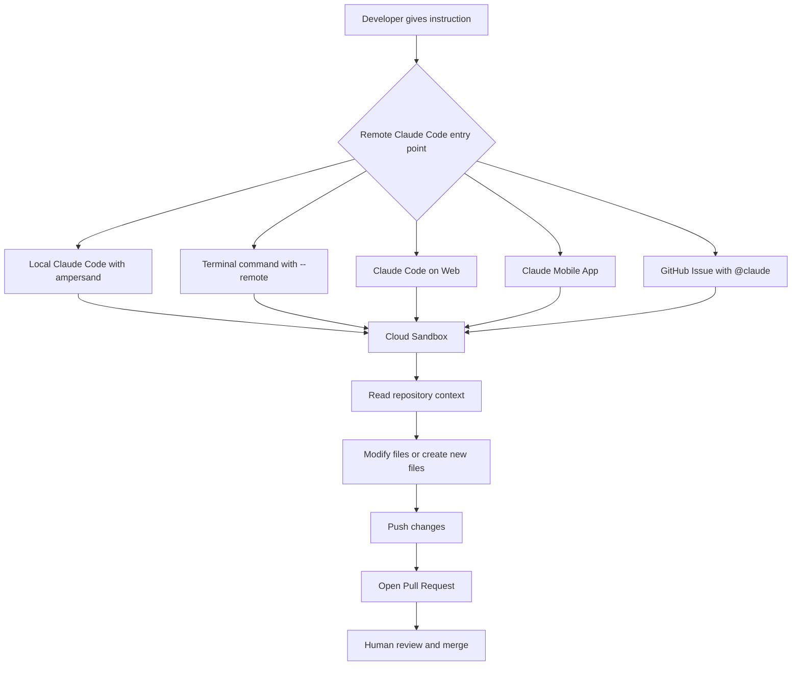
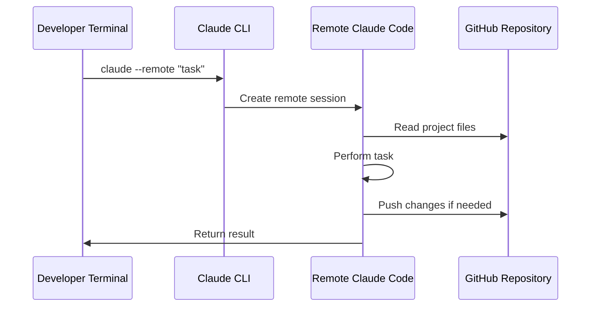
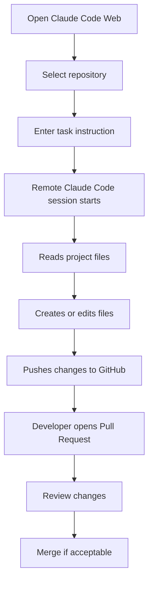
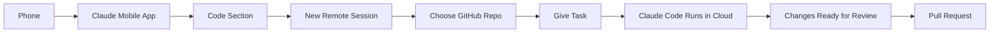
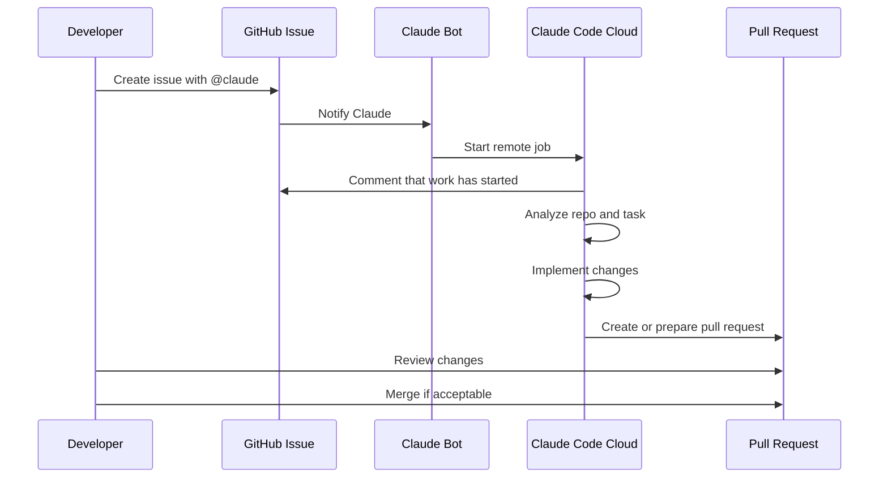
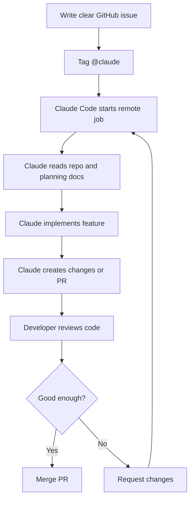

# 075 - Day 2 - 5 Ways to Run Claude Code Remotely: Cloud, Web, Mobile & GitHub

## Lesson Information

| Item       | Details                                                                                      |
| ---------- | -------------------------------------------------------------------------------------------- |
| Lesson     | 075                                                                                          |
| Duration   | 12 minutes                                                                                   |
| Week       | Week 3 - Agentic Engineering Frontier                                                        |
| Module     | Week 3 Day 2 - Sandboxing & Remote Execution                                                 |
| Main Topic | Running Claude Code remotely through cloud, web, mobile, GitHub, and sandbox-based workflows |

---

## Lesson Overview

In this lesson, we explore **five different ways to run Claude Code remotely** instead of only running it locally on your own machine.

The main idea is simple:

> Claude Code can now work for you in a remote cloud environment, read your repository, modify files, create documents, build features, and even open pull requests through GitHub.

This enables a much more flexible agentic engineering workflow where you can start coding tasks from:

* Your local Claude Code session
* Your terminal
* The Claude web interface
* The Claude mobile app
* GitHub issues using `@claude`

---

## Learning Objectives

After this lesson, students should be able to:

* Understand the five main ways to run Claude Code remotely
* Explain the difference between local execution and cloud execution
* Use Claude Code on the web to work with a GitHub repository
* Understand how Claude Code can create files and submit pull requests
* Use GitHub issues to trigger Claude Code remotely
* Recognize the benefits and risks of remote coding agents
* Apply remote Claude Code workflows to real-world software projects

---

## Core Concept

Claude Code is no longer limited to your local development environment.

You can now run Claude Code in a **remote sandboxed environment**, where it can:

* Access a selected GitHub repository
* Read project files
* Follow instructions
* Modify or create files
* Run implementation tasks
* Generate pull requests
* Work asynchronously in the cloud

This allows developers to delegate tasks to Claude Code while their own machine remains idle.

---

## The Big Picture



---

# 1. Running Remote Tasks from a Local Claude Code Session

The first way to run Claude Code remotely is from an existing local Claude Code session.

Normally, when you type a command inside Claude Code, the task runs locally on your machine.

However, by prefixing the instruction with an ampersand `&`, the task can be sent to the cloud instead.

Example:

```bash
& what is 2 + 2?
```

Instead of running locally, Claude Code sends the task to a remote cloud environment.

This remote task runs in a sandbox, and when it finishes, the result is returned to you.

---

## What Makes This Useful?

You can send real development tasks remotely, such as:

```bash
& rewrite my README and improve the installation instructions
```

Or:

```bash
& read the planning docs and create a new architecture document
```

The important point is that the remote Claude Code session receives the conversation context so far. This means it can continue from the work already happening in your local Claude Code session.

---

## Viewing Remote Tasks

You can view active remote tasks using:

```bash
/tasks
```

This shows tasks currently running in the cloud.

You can start multiple cloud tasks in parallel, similar to launching multiple local Claude Code sessions, but without consuming resources on your own computer.

---

# 2. Running Claude Code Remotely from the Terminal

The second way is to launch Claude Code remotely directly from your terminal.

Example:

```bash
claude --remote "what is 2 + 2?"
```

Or a more useful task:

```bash
claude --remote "Read the planning directory and write a market data design document"
```

This command starts a remote Claude Code session from the command line.

---

## Terminal Remote Execution Flow



---

## When to Use This Method

Use terminal remote execution when you want to:

* Quickly launch a remote task
* Avoid opening the Claude web app
* Automate Claude Code commands
* Run tasks from shell scripts or developer workflows
* Delegate work without keeping a local coding session active

---

# 3. Running Claude Code on the Web

The third method is using Claude Code directly in the browser through the web interface.

The workflow is:

1. Go to Claude Code on the web
2. Set up a cloud environment
3. Choose network access permissions
4. Select a GitHub repository
5. Give Claude Code a task
6. Review the output
7. Create or merge a pull request

---

## Cloud Environment Setup

When you first use Claude Code on the web, you may need to configure a cloud environment.

Typical network access options include:

| Option  | Meaning                        |
| ------- | ------------------------------ |
| None    | No network access              |
| Trusted | Limited trusted network access |
| Full    | Broad network access           |

For most normal coding tasks, **Trusted** is usually the practical choice.

---

## Example Web Task

In the lesson, the instructor gives Claude Code a task like:

```text
Please read all the documents in the planning directory.
Then design the market data backend in detail.
Write a new document called market-data-design.md.
Include code snippets and implementation examples.
```

Claude Code then runs remotely in the cloud, reads the repository, creates the document, and pushes the result to GitHub.

---

## Web-Based Claude Code Workflow



---

## Important Notes

Claude Code on the web may be slower than running locally.

In the lesson example, writing a large design document took around 10 minutes. The instructor also notes that the web version may feel slightly flaky because it is still a preview-style experience.

However, the workflow is powerful because your local machine does not need to do the work.

---

# 4. Running Claude Code from the Mobile App

The fourth way is using the Claude mobile app.

Inside the Claude app, there is a **Code** section where you can access the same remote Claude Code sessions that appear on the web.

From mobile, you can:

* Start a new Claude Code session
* Select a repository
* Give a coding instruction
* Let Claude Code work remotely
* Return later to review the result
* Create or review pull requests

---

## Why Mobile Claude Code Is Powerful

The mobile workflow means you can launch coding tasks from anywhere.

For example, while away from your desk, you could instruct Claude Code to:

```text
Read the planning documents and implement the market data simulator with unit tests.
```

Then Claude Code works in the cloud while you are not at your computer.

This turns coding agents into something closer to a remote engineering team that you can direct from your phone.

---

## Mobile Workflow Diagram



---

# 5. Running Claude Code from GitHub Issues

The fifth and most powerful method is triggering Claude Code directly from GitHub.

This works by creating a GitHub issue and tagging Claude with:

```text
@claude
```

Claude Code then starts working on the issue automatically.

---

## Example GitHub Issue

```markdown
## Build Complete Market Data Backend

Read all documents in the planning directory.

Build the complete market data backend, including:

- An interface to a market data provider
- A unified market data interface
- A market data simulator
- Full unit tests

@claude
```

After the issue is created, Claude Code responds in the GitHub issue and begins working.

It can create a job run, maintain a task list, read files, implement changes, and eventually prepare code for review.

---

## GitHub Issue to Claude Code Flow



---

## Why GitHub Integration Matters

This is one of the most agentic workflows because GitHub issues can become executable tasks.

Instead of manually copying requirements into Claude Code, you can:

1. Create a GitHub issue
2. Write detailed instructions
3. Tag `@claude`
4. Let Claude Code work in the cloud
5. Review the generated pull request

This makes Claude Code feel like a remote software engineering assistant integrated directly into your development workflow.

---

# Comparison of the 5 Remote Claude Code Methods

| Method                      | Entry Point                  | Best For                          | Key Benefit                              |
| --------------------------- | ---------------------------- | --------------------------------- | ---------------------------------------- |
| Local Claude Code with `&`  | Existing Claude Code session | Sending a quick task to the cloud | Keeps local context but runs remotely    |
| `claude --remote`           | Terminal                     | CLI-based remote tasks            | Fast command-line workflow               |
| Claude Code Web             | Browser                      | Repository-based remote coding    | Visual interface and GitHub integration  |
| Claude Mobile App           | Phone                        | Launching tasks away from desk    | Start coding work from anywhere          |
| GitHub Issue with `@claude` | GitHub                       | Issue-driven development          | Turns issues into executable agent tasks |

---

## Recommended Workflow

For serious project work, the most useful workflow is:



---

## Key Takeaways

Claude Code can now run in several remote environments, not just locally.

The five main ways are:

1. Local Claude Code session with `&`
2. Terminal command using `claude --remote`
3. Claude Code on the web
4. Claude mobile app
5. GitHub issue using `@claude`

The most important shift is that coding agents can now operate in remote cloud sandboxes connected to your repository.

This allows you to:

* Start many tasks in parallel
* Keep your local machine idle
* Use GitHub as the control center
* Review changes through pull requests
* Treat coding tasks as delegatable work items

---

## Best Practices

### 1. Write Clear Instructions

Remote Claude Code works best when the task is specific.

Weak instruction:

```text
Build the backend.
```

Better instruction:

```text
Read all planning documents.
Build the market data backend.
Include provider abstraction, simulator, API endpoints, and unit tests.
Create a pull request when complete.
```

---

### 2. Use GitHub Issues Like Jira Tickets

A good GitHub issue should include:

* Goal
* Background context
* Required files or directories to read
* Acceptance criteria
* Testing requirements
* Expected output

---

### 3. Always Review Before Merging

Even if Claude Code produces a useful implementation, the human developer should still review:

* Code quality
* Security implications
* Test coverage
* Architecture consistency
* Unexpected file changes
* Whether the implementation matches the issue

---

### 4. Start with Planning Tasks

Before asking Claude Code to implement a large feature, it can be useful to ask it to first create a design document.

Example:

```text
Read the planning directory and write a detailed design document for the market data subsystem.
Do not implement yet.
```

Then review the design before asking Claude Code to build.

---

### 5. Run Multiple Tasks in Parallel Carefully

Remote execution makes it easy to launch many Claude Code sessions at once.

However, parallel tasks can conflict if they edit the same files.

Good parallel tasks:

* Separate modules
* Separate documentation tasks
* Independent test improvements
* Different feature branches

Risky parallel tasks:

* Multiple agents editing the same backend files
* Multiple agents changing shared interfaces
* Multiple agents refactoring the same architecture

---

## Practical Exercise

Create a GitHub issue for a small feature in your own project.

Use this structure:

```markdown
## Goal

Build or improve one specific feature.

## Context

Read the following files or directories first:

- `/docs/planning`
- `/src/api`
- `/src/services`

## Requirements

- Implement the feature
- Follow the existing architecture
- Add or update tests
- Update documentation if needed

## Acceptance Criteria

- Feature works as described
- Tests pass
- Code follows project conventions
- Pull request is ready for review

@claude
```

Then observe how Claude Code responds and review the output carefully.

---

## Reflection Questions

1. Which remote Claude Code method feels most useful for your workflow?
2. When should you use Claude Code locally instead of remotely?
3. What kinds of tasks are safe to delegate to a remote coding agent?
4. What kinds of tasks require careful human review?
5. How can GitHub issues become executable development tasks?
6. How does remote Claude Code change the role of the developer?

---

## Summary

This lesson introduces five ways to run Claude Code remotely: from a local Claude Code session, from the terminal, through the web interface, through the mobile app, and directly from GitHub issues.

The biggest idea is that Claude Code can now operate as a cloud-based coding agent. It can read your repository, follow instructions, create files, implement features, and prepare work for review through GitHub.

This unlocks a more powerful agentic engineering workflow where the developer acts less like a manual coder for every step and more like an architect, reviewer, and task manager for remote coding agents.

The final and most powerful workflow is using GitHub issues with `@claude`, because it turns normal software planning artifacts into executable work items.
