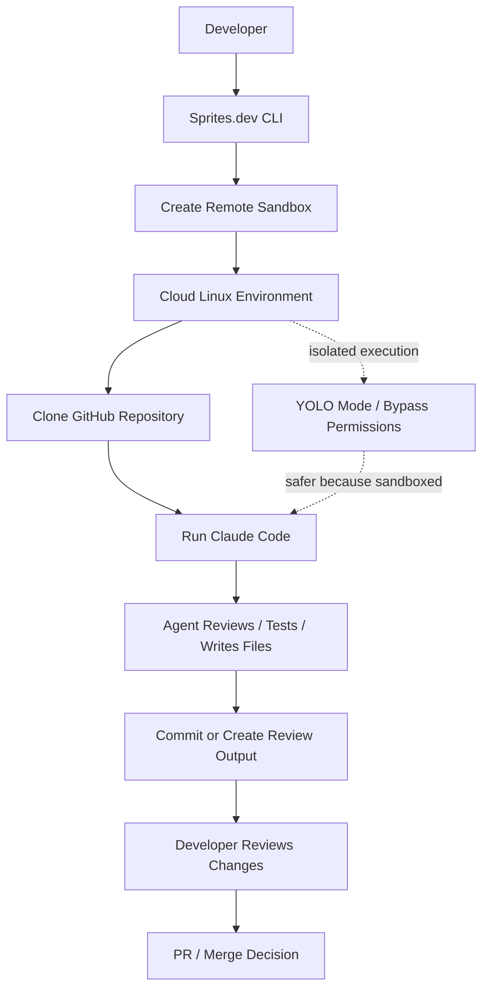
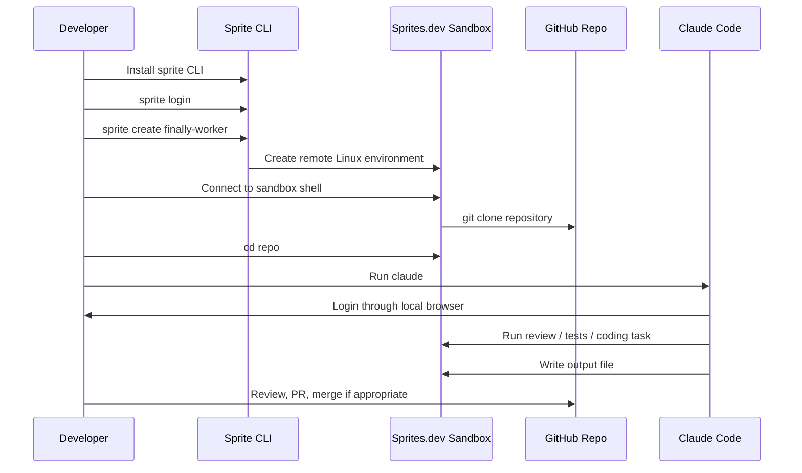
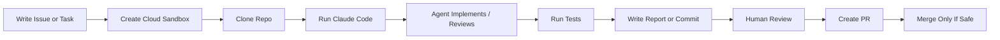

# 076 - Day 2 - Third-Party Cloud Sandboxes: Running Claude Code on Sprites.dev

## Lesson Information

| Item     | Details                                                                  |
| -------- | ------------------------------------------------------------------------ |
| Lesson   | 076                                                                      |
| Duration | 10 minutes                                                               |
| Week     | Week 3 - Agentic Engineering Frontier                                    |
| Module   | Week 3 Day 2 - Sandboxing & Remote Execution                             |
| Topic    | Running Claude Code inside a third-party cloud sandbox using Sprites.dev |

---

## Main Idea

This lesson introduces **Sprites.dev**, a third-party cloud sandbox platform built by **Fly.io**, as another way to run Claude Code remotely.

Instead of running Claude Code on your local machine or Anthropic’s cloud environment, you can spin up an isolated cloud machine, clone your repository, launch Claude Code, and let the coding agent work inside that sandbox.

This approach is especially useful for experimenting with **YOLO mode**, remote execution, and isolated agent workflows where you want speed and safety.

---

## Learning Objectives

By the end of this lesson, learners should be able to:

* Understand what a third-party cloud sandbox is.
* Explain how Sprites.dev can be used to run Claude Code remotely.
* Create a remote sandbox instance using the `sprite` CLI.
* Clone a GitHub repository into the sandbox.
* Launch Claude Code inside the remote environment.
* Understand the benefits and risks of running Claude Code in bypass-permissions mode.
* Manage repository access, secrets, and permissions safely when using cloud sandboxes.

---

## Why This Lesson Matters

This lesson completes the third major approach to sandboxed Claude Code execution.

Earlier in the module, three approaches were introduced:

1. **Native sandboxing**

   * Using Claude Code’s own sandbox features.
   * Example: `/sandbox`.

2. **Claude Code on the web / cloud**

   * Running Claude Code remotely using Anthropic-supported cloud workflows.
   * Includes web, mobile, and GitHub-based workflows.

3. **Third-party cloud sandboxes**

   * Running Claude Code inside external sandbox infrastructure.
   * Example: Sprites.dev.

Sprites.dev represents a newer and more experimental style of agent execution. It gives you a fast, isolated Linux environment where you can run arbitrary code, coding agents, or full development workflows without relying on your local machine.

---

## Big Picture Diagram



---

## Key Concept 1: Third-Party Cloud Sandbox

A **third-party cloud sandbox** is an isolated environment hosted by an external platform.

In this lesson, the platform is **Sprites.dev**.

Sprites.dev provides a remote Linux computer that can run code, store state, and be used as a sandboxed workspace for development tasks.

The key idea is:

> Instead of letting an AI coding agent operate directly on your local computer, you let it operate inside a disposable or isolated cloud machine.

This reduces risk because the agent does not have direct access to your personal machine, local files, or private environment unless you explicitly provide access.

---

## Key Concept 2: Sprites.dev

Sprites.dev is presented as a cloud sandbox product built by Fly.io.

Its core value is that it can quickly create isolated environments called **Sprites**.

The lesson describes Sprites.dev as providing:

* Stateful sandbox environments.
* Checkpoint and restore functionality.
* Hardware-isolated execution.
* Persistent Linux computers.
* Fast startup time.
* A place to run arbitrary code or AI agents.

In this lesson, Sprites.dev is used to run Claude Code remotely.

---

## Key Concept 3: YOLO Mode in a Sandbox

Claude Code can run in a bypass-permissions mode, often described informally as **YOLO mode**.

In this mode, Claude Code can perform actions without repeatedly asking for permission.

This is powerful but risky on a local machine.

However, inside a remote sandbox, the risk is reduced because the agent is operating in an isolated environment.

The lesson emphasizes that this is why cloud sandboxes are useful:

> You can give the agent more freedom while still keeping it away from your real local machine.

---

## Workflow Overview



---

## Setup Flow

### Step 1: Sign Up for Sprites.dev

The lesson starts by visiting:

```text
Sprites.dev
```

The instructor signs up for an account.

Sprites.dev may offer free trial credits, but the lesson notes that a credit card may still be required.

This makes the tool optional for learners.

You can either follow along or simply watch the workflow and consider using it later.

---

### Step 2: Install the Sprite CLI

After signing up, Sprites.dev provides an installation command for the `sprite` CLI.

The command includes a private key or token.

Because of that, you should not share or expose the command publicly.

The instructor emphasizes:

> Copy the install command exactly as Sprites.dev gives it to you, but do not reveal your key.

Example structure:

```bash
# Example only
# Use the real command from your Sprites.dev dashboard
curl ... | sh
```

---

### Step 3: Log In

After installing the CLI, log in:

```bash
sprite login
```

This opens a browser window locally so you can authenticate.

Even though the sandbox is remote, the login flow is designed to work from your local machine.

---

### Step 4: Create a Sprite

Create a new remote sandbox instance:

```bash
sprite create finally-worker
```

In the lesson, the instructor names the instance:

```text
finally-worker
```

Sprites.dev creates the environment very quickly.

The instructor notes that it was created in less than a second.

---

### Step 5: Enter the Remote Environment

After the Sprite is created, the terminal prompt changes to indicate that you are now connected to the remote sandbox.

You are no longer operating directly on your local machine.

You are inside a remote Linux environment.

To inspect the current directory:

```bash
ls
```

At first, the directory is empty.

---

### Step 6: Clone the Repository

Clone the project repository into the sandbox:

```bash
git clone <your-repo-url>
```

Then enter the project directory:

```bash
cd finally
```

Check the project files:

```bash
ls
```

The instructor sees files and folders such as:

```text
backend
claude.md
LICENSE
planning
README.md
```

---

### Step 7: Run Claude Code

Inside the remote sandbox, run:

```bash
claude
```

Claude Code is already installed in the Sprite environment.

The first launch may ask setup questions, such as:

* Theme preference.
* Login method.
* Authorization flow.
* Permission mode confirmation.

The browser login opens locally, even though Claude Code is running remotely.

---

## Important Security Note

Claude Code may run in bypass-permissions mode inside the sandbox.

This means it can perform actions without asking for confirmation each time.

This is acceptable in the lesson because:

* The environment is isolated.
* The repository is cloned into a cloud sandbox.
* The sandbox does not have access to the user’s full local machine.
* The agent can work more autonomously.

However, you still need to be careful with:

* API keys.
* `.env` files.
* GitHub permissions.
* Private repositories.
* Production credentials.
* Write access to important branches.

---

## Example Task Given to Claude Code

The instructor gives Claude Code a review task:

```text
Please read all the documentation in the planning folder.

The market data backend has been implemented with tests.

Carry out a comprehensive code review, run all the tests,
and write your conclusions to market-data-review.md
in the planning folder.
```

This is a good example of a sandbox-friendly agent task because it is:

* Clear.
* Bounded.
* Repository-based.
* Testable.
* Review-oriented.
* Safe to run remotely.

---

## Recommended Agent Task Pattern

When using Claude Code inside a cloud sandbox, give it tasks like this:

```text
Read the relevant documentation first.

Understand the implementation.

Run the tests.

Review the code.

Write a report.

Do not merge changes automatically.

Wait for human review.
```

This pattern keeps the agent useful while preserving human control.

---

## Practical Workflow



---

## Comparison with Previous Approaches

| Approach           | Where Claude Code Runs               | Main Benefit                     | Main Risk                                                    |
| ------------------ | ------------------------------------ | -------------------------------- | ------------------------------------------------------------ |
| Native sandbox     | Local machine with sandbox controls  | Easy to use locally              | Still close to your local environment                        |
| Claude web / cloud | Anthropic-managed remote environment | Integrated cloud workflow        | Depends on Anthropic cloud availability                      |
| GitHub integration | GitHub-based remote workflow         | Great for issue-to-PR automation | Requires careful repo permission control                     |
| Sprites.dev        | Third-party cloud sandbox            | Fast, isolated, flexible         | Requires third-party account, billing, and secret management |

---

## When to Use Sprites.dev

Sprites.dev is useful when you want to:

* Run Claude Code away from your local machine.
* Experiment with YOLO mode safely.
* Spin up isolated development environments quickly.
* Test agent workflows in a disposable cloud machine.
* Run code review, test execution, or implementation tasks remotely.
* Avoid installing everything locally.
* Explore third-party infrastructure for AI coding agents.

---

## When Not to Use Sprites.dev

You may not need Sprites.dev if:

* You are satisfied with Claude Code’s built-in sandboxing.
* You already use Anthropic’s cloud workflow.
* You do not want to enter credit card details.
* You are working with highly sensitive private code.
* You do not want to manage another cloud account.
* You are not ready to think carefully about secrets and permissions.

---

## Secret and Permission Management

When running a coding agent in a cloud sandbox, always treat secrets carefully.

### Avoid putting these directly into the sandbox:

```text
Production API keys
Database passwords
Private SSH keys
Personal access tokens with broad permissions
Cloud provider admin credentials
Customer data
Sensitive .env files
```

### Prefer safer alternatives:

```text
Use test credentials
Use read-only tokens
Use temporary tokens
Use limited-scope GitHub permissions
Use throwaway branches
Use public or demo repositories
Rotate secrets after experiments
```

---

## Best Practices

### 1. Use a Dedicated Branch

Do not let the agent work directly on `main`.

Use a branch such as:

```bash
git checkout -b agent/market-data-review
```

---

### 2. Keep Tasks Small

Instead of asking:

```text
Fix the whole app.
```

Ask:

```text
Review the market data backend, run the tests, and write a report.
```

---

### 3. Require Test Output

Ask Claude Code to run tests and summarize results.

Example:

```text
Run the backend test suite and include passing, failing, and skipped tests in your report.
```

---

### 4. Ask for a Written Review

A written review file is easier to inspect than a long terminal conversation.

Example output file:

```text
planning/market-data-review.md
```

---

### 5. Review Before Merge

Even if the agent produces a pull request, do not merge blindly.

Review:

* Code changes.
* Test results.
* Security impact.
* Dependency changes.
* Generated files.
* Permission-sensitive logic.

---

## Example Review Output Structure

Claude Code could write a review file like this:

```markdown
# Market Data Backend Review

## Summary

Brief overview of what was reviewed.

## Files Reviewed

List of important files inspected.

## Test Results

Commands run and results.

## Findings

### Strengths

What is working well.

### Issues

Bugs, risks, or unclear areas.

### Security Notes

Secret handling, permission risks, API exposure.

## Recommendations

Prioritized next steps.

## Final Verdict

Ready to merge / needs changes / needs deeper review.
```

---

## Lesson Summary

In this lesson, we explored how to run Claude Code inside a third-party cloud sandbox using Sprites.dev.

The instructor demonstrated how to:

1. Sign up for Sprites.dev.
2. Install the `sprite` CLI.
3. Log in from the terminal.
4. Create a new Sprite instance.
5. Clone a GitHub repository.
6. Launch Claude Code remotely.
7. Run Claude Code in bypass-permissions mode inside an isolated environment.
8. Ask Claude Code to review the market data backend and write a report.

The key takeaway is that third-party cloud sandboxes give developers another powerful option for remote agent execution.

They are especially useful when you want to let an AI coding agent work autonomously, but you do not want it operating directly on your local machine.

---

## Key Takeaways

* Sprites.dev provides fast, isolated cloud sandboxes.
* Claude Code can run inside a Sprite like it is running locally.
* The environment is remote, but the workflow feels familiar from VS Code or a terminal.
* YOLO mode is safer when used inside an isolated sandbox.
* Cloud sandboxes are useful for agentic coding workflows.
* Human review is still essential before merging changes.
* Secret and permission management are critical.

---

## Practice Exercise

Try designing a safe remote agent task.

### Task

Write a prompt for Claude Code that asks it to:

1. Read the project documentation.
2. Review one backend module.
3. Run the relevant tests.
4. Write a review report.
5. Avoid making direct changes unless explicitly asked.

### Example Answer

```text
Please read the documentation in the planning folder.

Then review the authentication backend module.

Run the relevant test suite and inspect any failing tests.

Do not modify the code yet.

Write your findings to planning/auth-backend-review.md.

Include:
- Summary
- Files reviewed
- Test commands run
- Test results
- Bugs or risks found
- Security concerns
- Recommended next steps
```

---

## Reflection Questions

1. Why is YOLO mode safer inside a cloud sandbox than on a local machine?
2. What kinds of secrets should never be placed inside a temporary sandbox?
3. When would you choose Sprites.dev instead of Claude’s built-in sandboxing?
4. Why should agent-generated pull requests still require human review?
5. How can GitHub issues and cloud sandboxes be combined into a powerful coding workflow?

---

## Mental Model

Think of Sprites.dev as:

```text
A disposable cloud computer for your coding agent.
```

Claude Code runs inside that remote computer.

Your local machine stays protected.

Your repository can be cloned, tested, reviewed, and modified in isolation.

The agent gets freedom.

You keep control.

---

## Final Note

Third-party cloud sandboxes are still an emerging workflow, but they point toward the future of agentic engineering.

Instead of doing all coding work locally, developers can increasingly delegate bounded tasks to remote agents running inside controlled environments.

The winning pattern is not full automation without oversight.

The winning pattern is:

```text
Clear task → isolated execution → tests → written report → human review → controlled merge
```
