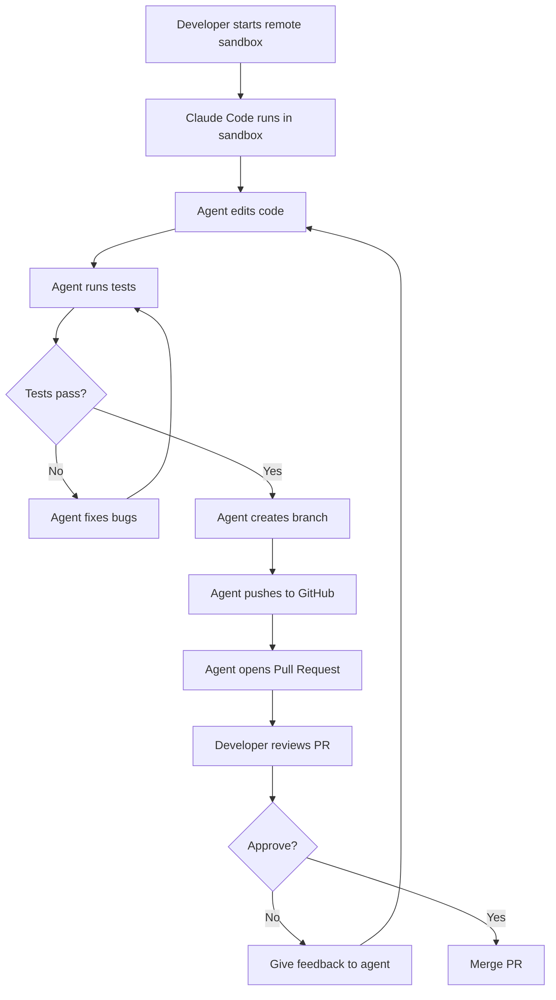
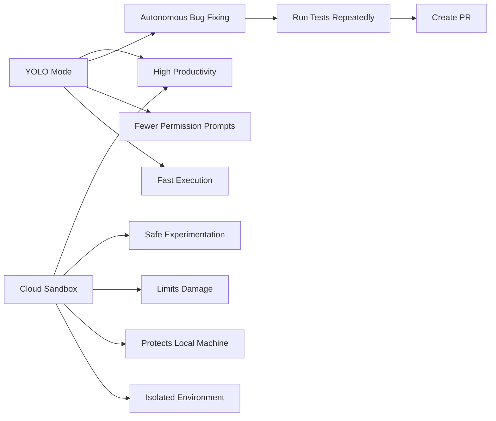
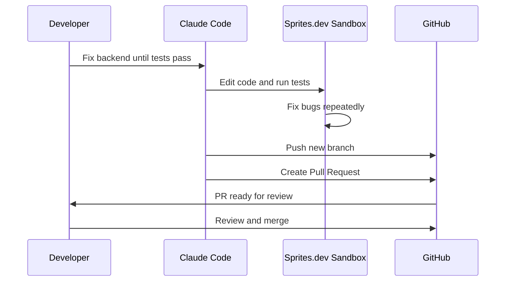
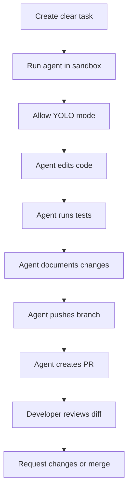
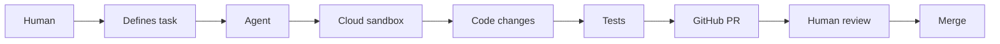

# 077 - Day 2 - Cloud Sandbox Recap: YOLO Mode with Sprites.dev & GitHub PRs

## Lesson Information

| Item       | Details                                                                       |
| ---------- | ----------------------------------------------------------------------------- |
| Lesson     | 077                                                                           |
| Duration   | 8 minutes                                                                     |
| Week       | Week 3 - Agentic Engineering Frontier                                         |
| Module     | Week 3 Day 2 - Sandboxing & Remote Execution                                  |
| Main Topic | Cloud sandbox recap, YOLO mode, Sprites.dev, and GitHub Pull Request workflow |

---

## 1. Lesson Overview

This lesson recaps the full cloud sandbox workflow used throughout Day 2.

The instructor demonstrates how an AI coding agent can safely work inside a remote sandbox, make changes, run tests, push branches to GitHub, and create Pull Requests for developer review.

The key idea is simple:

> Let the agent move fast in a sandbox, but keep the final merge under human control.

Instead of letting the agent directly modify the developer’s local machine, the work happens in an isolated cloud environment such as **Sprites.dev**. This makes YOLO mode much safer because the agent has freedom to act, but the blast radius is limited.

---

## 2. Core Workflow



---

## 3. What Happened in the Demo

The instructor quickly recaps several important actions:

1. He used `Ctrl + O` to inspect the full Claude Code conversation.
2. He checked whether the agent correctly understood which tests passed and which tests failed.
3. He asked the agent to push its changes to GitHub.
4. The push failed at first because GitHub authentication was missing.
5. He ran:

```bash
gh auth login
```

6. After logging into GitHub, he restarted Claude Code.
7. He used:

```bash
/resume
```

to continue the previous Claude Code conversation.

8. The agent then pushed a branch to GitHub.
9. The agent created a Pull Request.
10. The developer reviewed and merged the PR.
11. The developer asked the agent to continue fixing the backend until all tests passed.
12. The agent worked in the cloud sandbox, created another branch, pushed it, and opened another PR.
13. The developer reviewed and merged the final PR.

---

## 4. Why `/resume` Matters

When Claude Code was restarted, the previous session did not automatically continue.

The instructor used:

```bash
/resume
```

to return to the earlier conversation.

This is important because agentic coding workflows often involve long-running sessions. If the session restarts, `/resume` helps continue from the previous context instead of starting from scratch.

---

## 5. GitHub Authentication in a Cloud Sandbox

The agent could not push to GitHub at first because the sandbox was not authenticated.

The fix was:

```bash
gh auth login
```

Even though the coding agent was running in the cloud, the login flow opened a browser window on the instructor’s computer. After authentication, the cloud environment could push branches and create Pull Requests.

### Key point

A cloud sandbox still needs access to GitHub if the agent must:

* Push branches
* Create Pull Requests
* Read private repositories
* Interact with issues or PRs

---

## 6. YOLO Mode in a Sandbox

YOLO mode means the agent can run commands and make changes without asking for permission every time.

This can be risky on a local machine, but it becomes much safer inside a sandbox.



The instructor describes this as getting the best of both worlds:

| Benefit       | Explanation                                          |
| ------------- | ---------------------------------------------------- |
| Speed         | The agent can work without constant approval prompts |
| Safety        | The work happens away from the local machine         |
| Reviewability | All changes are submitted through GitHub PRs         |
| Control       | The developer still decides what gets merged         |

---

## 7. Pull Request-Based Safety

The Pull Request is the control point in the workflow.

Even if the agent works autonomously, the developer still reviews the final output before merging.



This prevents the agent from directly changing production code without review.

---

## 8. Three Sandbox Approaches Recapped

The instructor summarizes three approaches used during the day.

### 8.1 Built-in Local Sandbox

This is the lightweight sandbox built into Claude Code.

It behaves somewhat like a local container or isolated environment.

| Feature    | Description                     |
| ---------- | ------------------------------- |
| Runs on    | Developer machine               |
| Best for   | Quick local safety              |
| Strength   | Easy to start                   |
| Limitation | Still tied to local environment |

---

### 8.2 Anthropic Remote Execution

This approach uses Anthropic’s own remote execution environment.

Examples include:

* Claude web interface
* Claude mobile app
* GitHub issue or PR tagging workflow

The agent can pick up tasks remotely, run them in a cloud environment, and submit changes back to GitHub.

| Feature    | Description                            |
| ---------- | -------------------------------------- |
| Runs on    | Anthropic-managed remote environment   |
| Best for   | Remote agent workflows                 |
| Strength   | Integrated with Claude ecosystem       |
| Limitation | Some workflows may vary in reliability |

---

### 8.3 Third-Party Cloud Sandbox

The final approach uses a third-party sandbox provider.

In this lesson, the provider is **Sprites.dev**, built by **Fly.io**.

This gives the developer a remote command-line environment that feels like a local machine but actually runs in the cloud.

| Feature    | Description                                       |
| ---------- | ------------------------------------------------- |
| Runs on    | Third-party cloud sandbox                         |
| Example    | Sprites.dev                                       |
| Best for   | YOLO mode, remote coding, GitHub PR workflows     |
| Strength   | Fast, flexible, isolated                          |
| Limitation | Requires careful secret and permission management |

---

## 9. Comparison of the Three Approaches

| Approach                   | Location                | Safety Level |     Speed | Best Use Case                       |
| -------------------------- | ----------------------- | -----------: | --------: | ----------------------------------- |
| Built-in sandbox           | Local machine           |       Medium |      Fast | Quick local experiments             |
| Anthropic remote execution | Anthropic cloud         |         High |      Fast | Web, mobile, GitHub agent workflows |
| Third-party sandbox        | External cloud provider |         High | Very fast | YOLO coding with GitHub PR workflow |

---

## 10. Practical Developer Workflow

A strong real-world workflow looks like this:



---

## 11. Example Prompt Used in the Workflow

The instructor gives the agent a clear task after merging a previous PR:

```text
I've merged. Please switch to main, do a pull, then carry out all the fixes and improvements that you've documented in the review file.

Keep working until all tests pass and the market data backend is ready.

Then push your new branch to GitHub.
```

This prompt is effective because it gives the agent:

* A starting point
* A source of truth
* A clear success condition
* A final delivery step

---

## 12. Why This Workflow Feels Productive

The instructor emphasizes that the workflow feels powerful because the agent can:

* Work continuously
* Fix bugs one by one
* Re-run tests
* Report problems
* Create branches
* Push changes
* Open Pull Requests

The developer does not need to approve every single command.

Instead, the developer reviews the final PR.

This changes the developer’s role from manual operator to reviewer and supervisor.

---

## 13. Security Perspective

Sandboxing does not remove all risk, but it reduces the danger significantly.

### Risks reduced by sandboxing

| Risk                            | How sandboxing helps                |
| ------------------------------- | ----------------------------------- |
| Breaking local files            | Agent works in isolated environment |
| Damaging local machine          | Commands run remotely               |
| Polluting local dependencies    | Dependencies stay inside sandbox    |
| Running unsafe commands locally | Dangerous actions are contained     |
| Messing up main branch          | Changes go through PR review        |

### Risks that still remain

| Risk                     | Mitigation                                    |
| ------------------------ | --------------------------------------------- |
| Bad code quality         | Review the PR carefully                       |
| Leaked secrets           | Use limited permissions and secret management |
| Incorrect logic          | Run tests and inspect behavior                |
| Over-broad GitHub access | Use least-privilege permissions               |
| Merging too quickly      | Keep human review in the loop                 |

---

## 14. Key Concepts

### Concept 1: Cloud Sandbox

A cloud sandbox is an isolated remote environment where the coding agent can run commands, edit files, install dependencies, and test code.

It protects the developer’s local machine from direct damage.

---

### Concept 2: YOLO Mode

YOLO mode allows the agent to work without asking permission for every action.

This is powerful but risky.

It becomes much safer when combined with sandboxing.

---

### Concept 3: Pull Request Workflow

The Pull Request is the review boundary.

The agent can work quickly, but the developer still decides whether the changes should be merged.

---

### Concept 4: Remote Agent Productivity

Remote execution allows coding agents to continue working without depending on the developer’s local machine.

This is especially useful for:

* Long-running bug fixes
* Test-driven repair loops
* Backend implementation tasks
* GitHub issue workflows
* Autonomous coding experiments

---

## 15. Best Practices

### Use sandboxes for risky agent work

Do not give an autonomous agent full freedom on your local machine unless you understand the risks.

Prefer a sandbox for YOLO workflows.

---

### Keep GitHub review mandatory

Even if the agent creates a PR, do not merge blindly.

Always inspect:

* Changed files
* Test results
* New dependencies
* Security-sensitive code
* Generated documentation
* Environment variable usage

---

### Give clear completion criteria

A good agent task should include success conditions.

Examples:

```text
Keep working until all tests pass.
```

```text
Create a PR when the backend is ready.
```

```text
Document any remaining problems in a review file.
```

---

### Use `/resume` when continuing sessions

If Claude Code restarts, use:

```bash
/resume
```

This helps restore the previous coding context.

---

## 16. Useful Commands

```bash
# Authenticate GitHub CLI
gh auth login
```

```bash
# Start Claude Code
claude
```

```bash
# Resume previous Claude Code conversation
/resume
```

```bash
# Typical GitHub flow
git checkout main
git pull
git checkout -b fix-market-data-backend
git push origin fix-market-data-backend
```

---

## 17. Mental Model

Think of the workflow like this:



The agent is not replacing the developer.

The agent is doing the heavy execution work, while the developer remains responsible for direction, review, and final approval.

---

## 18. Why This Lesson Is Important

This lesson is important because it connects several major ideas from Week 3:

* Remote execution
* Sandboxing
* YOLO mode
* GitHub PR workflows
* Agent autonomy
* Human-in-the-loop review

Together, these ideas form a professional workflow for using AI coding agents safely and effectively.

Without sandboxing, YOLO mode can be dangerous.

Without Pull Requests, agent changes can be hard to control.

Without human review, fast automation can create hidden problems.

The ideal workflow combines all three:

> Sandbox for safety, YOLO mode for speed, and Pull Requests for control.

---

## 19. Main Takeaways

* Cloud sandboxes allow coding agents to work remotely and safely.
* YOLO mode is much more practical when the agent is isolated from the local machine.
* GitHub authentication is required before the agent can push branches or create PRs.
* `/resume` is useful when restarting Claude Code sessions.
* Pull Requests create a clean human review boundary.
* Sprites.dev is one example of a third-party cloud sandbox.
* This workflow can be used not only with Claude Code but also with tools like Codex or OpenCode.
* The developer’s role shifts from approving every command to reviewing final changes.

---

## 20. Connection to the Next Lesson

The next topic is working with large codebases.

This is a natural next step because once agents can work safely in remote sandboxes, the next challenge is scale:

* Can the agent understand a large repo?
* Can it modify complex systems safely?
* Can it keep context across many files?
* Can it coordinate changes across frontend, backend, tests, and documentation?

The sandbox workflow from this lesson provides the safe execution foundation for those larger tasks.

---

## 21. Final Summary

In this lesson, the instructor recaps how to use a remote cloud sandbox with Claude Code, Sprites.dev, and GitHub Pull Requests.

The agent works inside a sandbox, runs in YOLO mode, fixes bugs, runs tests, pushes branches, and creates PRs. The developer then reviews and merges the changes.

This creates a powerful workflow:

```text
Fast agent execution + sandbox isolation + GitHub PR review = safe autonomous coding
```

By the end of this lesson, students should understand how cloud sandboxes make AI coding agents more productive while keeping the developer in control.
