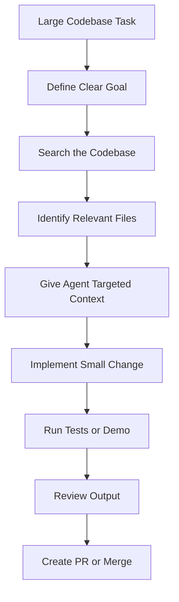
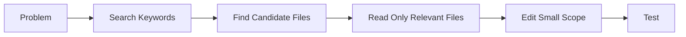
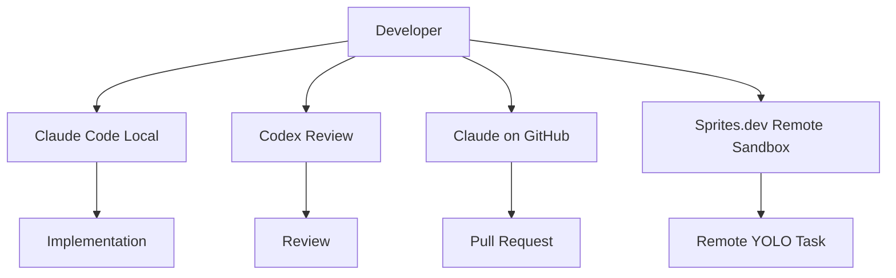
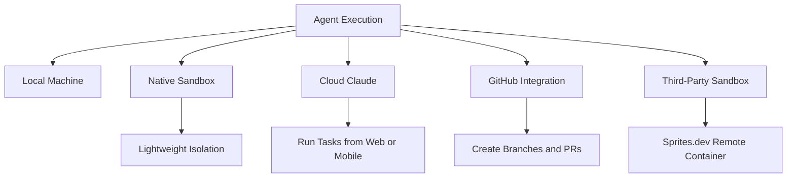
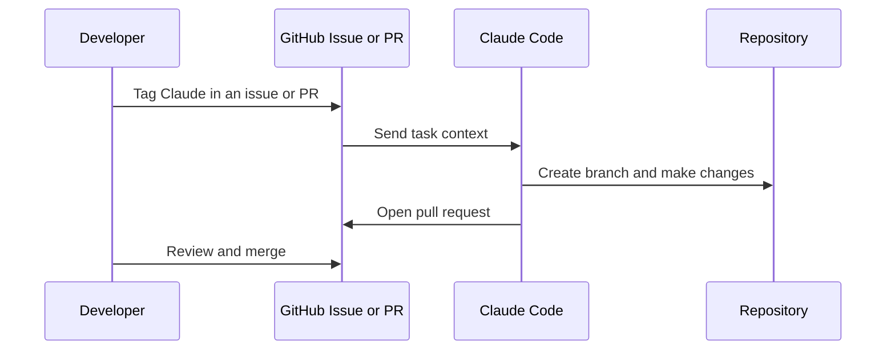
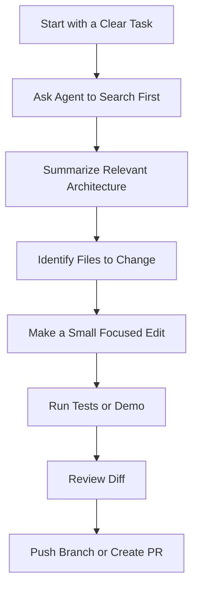

# 078 - Day 3 - Large Codebases with Claude Code, Codex & Sprites.dev

## Lesson Information

| Item     | Details                                               |
| -------- | ----------------------------------------------------- |
| Lesson   | 078                                                   |
| Duration | 9 minutes                                             |
| Week     | Week 3 - Agentic Engineering Frontier                 |
| Module   | Week 3 Day 3 - Large Codebases, SDK, Cowork, OpenClaw |

---

## Main Topic

This lesson introduces the workflow for working with **large codebases** using modern coding agents such as **Claude Code**, **Codex**, and **Sprites.dev**.

The key idea is that large codebases require a clear **context strategy**. Instead of letting an agent randomly read files and waste context, developers should guide the agent with search, grep, targeted files, scoped tasks, and sandboxed execution.

---

## Learning Objectives

By the end of this lesson, learners should be able to:

* Understand why large codebases require a different workflow from small projects.
* Use context strategy to guide coding agents effectively.
* Avoid letting agents explore code randomly without direction.
* Apply tools such as search, grep, file targeting, and sub-agents.
* Understand how Claude Code, Codex, and Sprites.dev can work together on larger tasks.
* Connect large-codebase workflows with previous topics such as skills, hooks, plugins, sandboxes, and remote execution.

---

## Why This Lesson Matters

This lesson is the beginning of the final stretch of the program.

By this point, learners have already covered many foundational agentic engineering skills:

* Slash commands
* Skills
* Sub-agents
* Multi-agent workflows
* Hooks
* Plugins
* Sandboxing
* Remote execution
* GitHub PR workflows
* Cloud sandboxes such as Sprites.dev

Now the focus shifts toward applying those skills to **large, professional codebases**.

Large codebases are more complex because:

* There are many files and folders.
* The agent can easily waste context reading irrelevant code.
* Changes may affect multiple modules.
* Documentation and architecture matter more.
* Testing and review become essential.
* Multiple agents or remote sandboxes may be needed for bigger tasks.

---

## Core Idea

> In large codebases, the most important skill is not simply asking the agent to code.
> The most important skill is controlling the agent’s context.

A good large-codebase workflow should help the agent answer these questions:

1. What part of the codebase matters?
2. Which files should be read first?
3. Which files should not be touched?
4. What is the exact task?
5. How should the result be tested?
6. Should the task run locally, remotely, or inside a sandbox?

---

## Large Codebase Workflow



---

## Key Concepts

### 1. Context Strategy

Large codebases can overwhelm coding agents if they read too much irrelevant code.

Instead of saying:

> “Look through the repo and fix this.”

A better instruction is:

> “Search for the market data service, inspect the simulator and CLI entry point, then update only the files needed to add a terminal demo.”

Good context strategy includes:

* Search first.
* Read only relevant files.
* Target specific modules.
* Ask the agent to summarize findings before editing.
* Keep the change scoped.
* Verify with tests or a demo.

---

### 2. Search, Grep, and File Targeting

When working with large repos, agents should use tools like:

* `grep`
* `ripgrep`
* file search
* directory inspection
* symbol search
* targeted file reads

This prevents the agent from wasting time and context.



---

### 3. Skills

Skills are reusable instructions or workflows that help coding agents perform specific tasks consistently.

In this lesson, skills are positioned as increasingly important because they work across tools such as:

* Claude Code
* Codex
* Other coding agents

Skills are becoming a preferred way to package functionality into coding agents.

Examples of useful skills:

* Code review skill
* Test-writing skill
* Documentation update skill
* API integration skill
* Debugging skill
* Refactoring skill

---

### 4. Slash Commands

Slash commands are custom commands inside Claude Code.

They can be used to trigger common workflows quickly.

Examples:

```text
/review
/test
/explain
/scaffold
/debug
```

However, the lesson notes that many workflows that previously used slash commands are now often handled through **skills**, because skills are more portable across tools.

---

### 5. Multi-Agent Workflows

Multi-agent workflows involve running multiple agents at the same time or across different environments.

Examples:

* Running several Claude Code sessions in parallel.
* Using Codex as an independent reviewer.
* Assigning GitHub issues to Claude.
* Running agents in remote cloud sandboxes.
* Using Sprites.dev to run Claude Code remotely.



---

### 6. Sub-Agents

Sub-agents are smaller delegated agent instances that handle a specific task.

A sub-agent may:

* Explore files.
* Summarize architecture.
* Investigate a bug.
* Review one module.
* Return findings to the main agent.

A common built-in example is the **exploration sub-agent**, which can inspect many files and return a concise summary without polluting the main context.

---

### 7. Agent Teams

Agent teams are more advanced than simple sub-agents.

They involve multiple agents with roles, such as:

| Agent Role     | Responsibility          |
| -------------- | ----------------------- |
| Architect      | Plans the change        |
| Backend Agent  | Implements server logic |
| Frontend Agent | Updates UI              |
| Reviewer       | Reviews code quality    |
| Tester         | Writes or runs tests    |

The lesson mentions that agent teams, swarms, and orchestration will be explored more deeply later.

---

### 8. Hooks

Hooks allow actions to automatically trigger when something happens.

For example:

* When Claude uses a tool.
* When a file changes.
* When a command finishes.
* When a test fails.
* When a review is needed.

Hooks can trigger:

* Shell commands
* Prompts
* Sub-agents
* Automated checks

Hooks are powerful but should be used carefully.

---

### 9. Plugins

Plugins package multiple agent features together.

A plugin can include:

* Skills
* Slash commands
* Sub-agents
* Hooks
* Configuration

Plugins can also be shared through marketplaces, making them useful for larger teams and reusable workflows.

---

## Recap of Previous Topics

### Week 3 Day 1: Pro Agent Features

| Feature        | Purpose                              |
| -------------- | ------------------------------------ |
| Slash Commands | Run custom workflows quickly         |
| Skills         | Reusable cross-agent capabilities    |
| Multi-Agents   | Run multiple agents in parallel      |
| Sub-Agents     | Delegate a focused task              |
| Agent Teams    | Coordinate agents with roles         |
| Hooks          | Trigger actions automatically        |
| Plugins        | Package workflows and tools together |

---

### Week 3 Day 2: Sandboxing and Remote Execution

Sandboxing is important because coding agents can be risky when they run commands directly on your local machine.

Potential risks include:

* Modifying local files incorrectly.
* Running unsafe shell scripts.
* Accessing sensitive files.
* Using network access unexpectedly.
* Breaking the local development environment.

Sandboxes reduce these risks by creating isolated environments.

---

## Sandboxing Options



---

## Claude Code Remote Execution

Claude Code can run tasks remotely.

One useful workflow is using a command prefix that sends the current conversation context to a remote Claude instance instead of running locally.

This allows the developer to:

* Start work from the local terminal.
* Run the task remotely.
* Check remote tasks later.
* Avoid blocking the local machine.
* Use cloud resources for larger work.

---

## GitHub Workflow

Claude can also work through GitHub.

A typical workflow:



This is useful for larger teams because the agent’s work becomes reviewable through normal GitHub workflows.

---

## Sprites.dev

Sprites.dev is presented as a fast third-party cloud sandbox.

It allows developers to run Claude Code in a remote container that feels like a normal terminal.

Key benefits:

* Very fast startup.
* Remote development environment.
* Stateful workspace.
* Good for YOLO mode.
* Useful for large codebase experimentation.
* Accessible from different machines.
* Reduces risk to the local environment.

---

## Demo: Market Data Demo

In the lesson, the instructor shows a project called `finally`.

A remote Sprite environment was used to ask Claude to:

1. Update documentation.
2. Create a summary document.
3. Build a terminal-based market data demo.
4. Push the changes to GitHub.

Then the instructor pulled the latest code locally and ran the demo:

```bash
cd backend
uv run market data demo
```

The demo displayed:

* Stock tickers
* Changing prices
* Red and green price movement
* Terminal-based sparkline charts
* Live simulated market data

This showed that the agent was able to build a useful demo with very little manual intervention.

---

## Important Lesson from the Demo

The demo is impressive because it was created in a mostly zero-shot way.

That means:

* The instructor asked for the demo.
* Claude created it.
* Claude pushed it.
* The instructor pulled it locally.
* The demo worked on the first try.

This shows the power of combining:

* Remote sandbox execution
* GitHub workflow
* Large-codebase context strategy
* Coding agents
* Terminal-based demos

---

## Recommended Large Codebase Workflow



---

## Do’s and Don’ts

### Do

* Give the agent a clear objective.
* Ask it to search before editing.
* Use grep and file targeting.
* Keep changes small.
* Ask for a plan before implementation.
* Use sandboxes for risky tasks.
* Use GitHub PRs for review.
* Run demos or tests after changes.
* Use skills for repeatable workflows.

### Don’t

* Tell the agent to read the whole repo blindly.
* Let it modify unrelated files.
* Run risky commands locally without a sandbox.
* Skip review.
* Accept a change without testing it.
* Give vague prompts like “fix everything”.
* Let multiple agents work on the same files without coordination.

---

## Practical Prompt Template

```text
You are working in a large codebase.

Task:
[Describe the exact task]

Rules:
- Search the repo first.
- Identify the relevant files before editing.
- Do not modify unrelated files.
- Explain the architecture briefly before making changes.
- Make the smallest safe change.
- Run the relevant test or demo.
- Summarize the final diff.
```

---

## Example Prompt

```text
We need a terminal demo for the market data simulator.

Please search the backend codebase for the market data module, simulator, and CLI entry points.

Before editing:
1. Summarize the relevant files.
2. Explain how the simulator currently works.
3. Propose the smallest implementation plan.

Then implement the demo, run it locally, and summarize the result.
```

---

## Summary

Lesson 078 introduces how to work with **large codebases** using Claude Code, Codex, and Sprites.dev.

The main message is that large codebases require disciplined context management. Developers should not let coding agents wander randomly through files. Instead, they should guide agents using search, grep, file targeting, scoped tasks, sandboxes, and reviewable GitHub workflows.

This lesson also recaps key Week 3 concepts such as slash commands, skills, sub-agents, multi-agents, hooks, plugins, remote execution, and cloud sandboxes.

The Sprites.dev demo shows how powerful this workflow can be: an agent working remotely created documentation updates and a terminal-based market data demo, pushed the changes to GitHub, and the demo worked locally after pulling the code.

The lesson prepares learners for more advanced topics such as agent teams, orchestration, swarms, SDKs, coworking workflows, and OpenClaw.

---

## Key Takeaway

> Large codebase success is not about giving the agent more freedom.
> It is about giving the agent better direction, better context, and safer execution environments.
