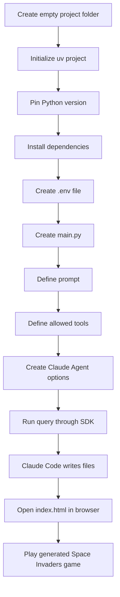
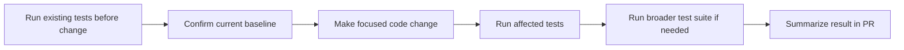
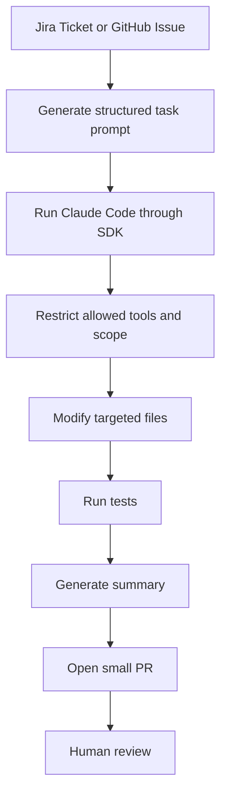

# 079 - Day 3 - Best Practices for Using Claude Code on Large Team Codebases

## Lesson Information

| Item       | Details                                                                                              |
| ---------- | ---------------------------------------------------------------------------------------------------- |
| Lesson     | 079                                                                                                  |
| Duration   | 11 minutes                                                                                           |
| Week       | Week 3 - Agentic Engineering Frontier                                                                |
| Module     | Week 3 Day 3 - Large Codebases, SDK, Cowork, OpenClaw                                                |
| Main Theme | Best practices for using Claude Code and the Claude Agent SDK in larger codebases and team workflows |

---

## 1. Lesson Overview

This lesson introduces an important transition point in the course: moving beyond direct terminal interaction with Claude Code and exploring related tools that can support larger, more structured engineering workflows.

The transcript focuses especially on the **Claude Agent SDK**, which allows developers to programmatically drive Claude Code from inside their own Python applications.

Although the lesson title emphasizes **large team codebases**, the demo shows how Claude Code can be controlled through code, which becomes especially useful when teams want to build repeatable, structured, or automated agent workflows.

---

## 2. Core Idea

Claude Code is usually used interactively through a terminal.

However, with the **Claude Agent SDK**, you can control Claude Code through your own code.

Instead of typing instructions manually into Claude Code, you can write a Python script that:

* Defines a prompt.
* Defines which tools Claude is allowed to use.
* Sets options such as model, permissions, and tool access.
* Runs Claude Code programmatically.
* Streams or prints the resulting messages.
* Allows Claude Code to create or modify files.

In the demo, the instructor uses the SDK to generate a simple **Space Invaders-style game** using vanilla HTML, CSS, and JavaScript.

---

## 3. Important Clarification: Claude Agent SDK Is Not a Full Agent Framework

The lesson makes an important distinction:

> The Claude Agent SDK is not really a complete agent framework, even though the name may sound like one.

Instead, it is better understood as a way to **drive Claude Code programmatically**.

### Claude Agent SDK Is

* A way to call Claude Code from Python.
* A way to give Claude Code controlled tool access.
* A way to build custom applications on top of Claude Code.
* A way to integrate Claude Code into repeatable engineering workflows.

### Claude Agent SDK Is Not

* A full replacement for agent frameworks.
* A complete orchestration system by itself.
* Something every developer needs for daily coding.
* Always necessary for normal Claude Code usage.

---

## 4. Demo Goal

The instructor creates an empty project called `space`.

The goal is to use Python and the Claude Agent SDK to generate a full browser game:

```text
Make a vanilla HTML + JS + CSS website for a game of Space Invaders.
Write the code to files in the current directory, including index.html.
```

Claude Code then uses file-writing tools to create the project files.

The result is a playable Space Invaders-style game in the browser.

---

## 5. Demo Workflow



---

## 6. Project Setup Steps

The instructor starts with a completely empty folder and sets up a Python project.

### Step 1: Initialize the project

```bash
uv init --bare
```

This creates a minimal Python project structure.

### Step 2: Pin the Python version

```bash
uv python pin 3.13
```

This ensures the project uses a specific Python version.

### Step 3: Add dependencies

```bash
uv add python-dotenv requests claude-agent-sdk
```

The dependencies include:

| Package            | Purpose                                |
| ------------------ | -------------------------------------- |
| `python-dotenv`    | Load environment variables from `.env` |
| `requests`         | General-purpose HTTP library           |
| `claude-agent-sdk` | Programmatically control Claude Code   |

---

## 7. Environment Setup

The instructor copies in a `.env` file that contains API keys, such as the Anthropic API key.

A `.gitignore` file is also created so sensitive files are not committed accidentally.

Example:

```gitignore
.env
.venv/
__pycache__/
```

This is a small but important security habit.

---

## 8. Basic Code Structure

The Python script does four main things:

1. Loads environment variables.
2. Defines the prompt.
3. Defines the tools Claude Code is allowed to use.
4. Calls Claude Code through the SDK.

A simplified structure looks like this:

```python
import asyncio
from dotenv import load_dotenv
from claude_agent_sdk import query, ClaudeAgentOptions

load_dotenv(override=True)

prompt = """
Make a vanilla HTML + JS + CSS website for a game of Space Invaders.
Write the code to files in the current directory, including index.html.
"""

tools = [
    "Read",
    "Write",
    "Edit",
    "Bash"
]

async def main():
    options = ClaudeAgentOptions(
        allowed_tools=tools,
        model="claude-opus-4.6"
    )

    async for message in query(prompt=prompt, options=options):
        print(message)

asyncio.run(main())
```

The exact SDK API may vary depending on the installed version, but the concept is clear:

> Write code that instructs Claude Code to perform coding tasks.

---

## 9. Tool Control

A key concept in this demo is **allowed tools**.

Instead of giving the agent unlimited freedom, the script explicitly defines which tools Claude Code can use.

For example:

```python
tools = [
    "Read",
    "Write",
    "Edit",
    "Bash"
]
```

This matters because tool access determines what Claude Code can actually do.

In larger team codebases, this becomes even more important.

You may want Claude Code to:

* Read files.
* Search the codebase.
* Edit only specific files.
* Run tests.
* Avoid destructive commands.
* Avoid touching unrelated modules.

---

## 10. Why This Matters for Large Codebases

Large team codebases require discipline.

Claude Code can be very powerful, but on a large codebase, uncontrolled changes can create risk.

Good usage means giving the agent enough context and permission to complete the task, but not so much freedom that it changes unrelated parts of the system.

### Bad Pattern

```text
Please improve this whole codebase.
```

This is too broad.

The agent may:

* Read too many files.
* Modify unrelated modules.
* Refactor unnecessarily.
* Introduce hard-to-review changes.
* Ignore existing architecture.

### Better Pattern

```text
Fix the bug in the compatibility streaming response.
Focus only on the streaming flow and fallback rendering logic.
Do not refactor unrelated UI components.
Run the existing tests before and after the change.
Create a small PR with a clear explanation.
```

This gives the agent a clear, bounded task.

---

## 11. Best Practices for Team Codebases

### 1. Respect the Existing Architecture

Claude Code should work with the current architecture, not fight it.

Before changing code, the agent should understand:

* Folder structure.
* Naming conventions.
* Existing abstractions.
* Current data flow.
* Existing service boundaries.

Do not ask the agent to rewrite architecture unless that is the actual goal.

---

### 2. Read the Contributing Guide

In real team projects, always check files such as:

```text
README.md
CONTRIBUTING.md
CLAUDE.md
docs/
architecture.md
```

These files often explain:

* How to run the project.
* How to run tests.
* Code style rules.
* Branching rules.
* PR expectations.
* Local setup requirements.

---

### 3. Run Tests Before and After Changes

A good workflow is:



Running tests before the change helps you know whether failures already existed.

Running tests after the change helps verify that the agent did not break anything.

---

### 4. Keep the Scope Small

Large team codebases are easier to maintain when changes are small.

A good Claude Code task should usually focus on:

* One bug.
* One feature.
* One endpoint.
* One component.
* One test case.
* One refactor with clear boundaries.

Avoid combining unrelated changes in the same PR.

---

### 5. Avoid Unrequested Refactors

Claude Code may notice many possible improvements.

However, in a team codebase, not every improvement should be made immediately.

Avoid prompts like:

```text
Clean up anything you see.
```

Instead, use:

```text
Only modify the files needed to fix this issue.
Do not perform broad refactors.
If you notice unrelated improvements, list them separately.
```

This keeps the PR reviewable.

---

### 6. Create Small, Reviewable Pull Requests

A good agent-generated PR should include:

* Clear problem statement.
* Small diff.
* Focused file changes.
* Tests added or updated.
* Explanation of what was changed.
* Notes about what was intentionally not changed.

This makes it easier for human reviewers to trust the result.

---

## 12. How Claude Agent SDK Fits Into This

The Claude Agent SDK is useful when you want to build a repeatable workflow around Claude Code.

For example, a team could build a script that:

* Reads a Jira ticket.
* Generates a focused prompt.
* Restricts tool access.
* Runs Claude Code.
* Runs tests.
* Summarizes the diff.
* Creates a PR draft.
* Sends the result to a human reviewer.

### Possible Team Workflow



The SDK is not just for toy demos.

The Space Invaders example is simple, but the same pattern can be applied to real engineering workflows.

---

## 13. Practical Example: Safer Prompt for a Large Codebase

Instead of asking Claude Code to broadly improve a project, use a structured task prompt:

```text
Task:
Fix the rendering delay and fallback content issue in the Compatibility screen.

Scope:
Only inspect and modify files related to:
- Compatibility streaming response
- Fallback UI rendering
- Stream state management
- QA rendering path if directly related

Rules:
- Do not refactor unrelated components.
- Do not change public API contracts unless necessary.
- Preserve existing architecture.
- Add or update tests if the project already has tests for this area.
- Run tests before and after the change.
- Summarize all changed files and why each change was needed.

Expected Result:
The real streamed response should render quickly.
Fallback content should not appear during or after successful streaming.
The fix should be small enough for a focused PR review.
```

This prompt is much safer for a large team codebase.

---

## 14. Key Takeaways

| Topic            | Key Takeaway                                  |
| ---------------- | --------------------------------------------- |
| Claude Agent SDK | Lets you drive Claude Code programmatically   |
| Agent framework  | The SDK is not a complete agent framework     |
| Tool control     | Allowed tools should be explicitly controlled |
| Large codebases  | Scope must be narrow and intentional          |
| Team workflow    | Respect architecture and contribution rules   |
| Testing          | Run tests before and after changes            |
| PR quality       | Small PRs are easier to review and trust      |
| Refactoring      | Avoid broad refactors unless requested        |

---

## 15. Mental Model

Claude Code should not be treated as a random code generator.

In a serious team codebase, Claude Code should behave like a careful junior-to-mid engineer who:

* Reads the relevant docs.
* Understands the existing architecture.
* Changes only what is needed.
* Runs tests.
* Explains the change clearly.
* Leaves unrelated improvements for later.

The Claude Agent SDK makes it possible to turn that behavior into a programmable workflow.

---

## 16. Final Summary

In this lesson, the instructor introduces the Claude Agent SDK and demonstrates how to use it to drive Claude Code from a Python script.

The demo creates a simple Space Invaders-style game using vanilla HTML, CSS, and JavaScript. While the example is playful, the underlying idea is powerful: Claude Code can be controlled programmatically, given specific tools, and integrated into larger development workflows.

For large team codebases, this matters because agent work must be controlled, scoped, testable, and reviewable. The best practice is not to let the agent freely modify everything, but to give it a clear task, narrow file scope, existing project context, test expectations, and PR review discipline.

A strong Claude Code workflow for teams should combine:

```text
Clear task + limited scope + controlled tools + tests + small PR + human review
```

That is the foundation for using AI coding agents safely and effectively in real-world engineering teams.
