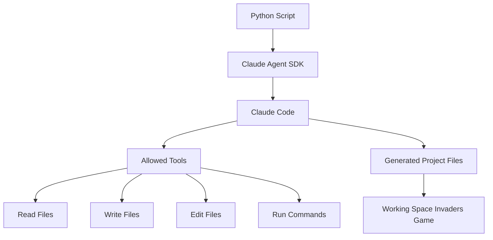
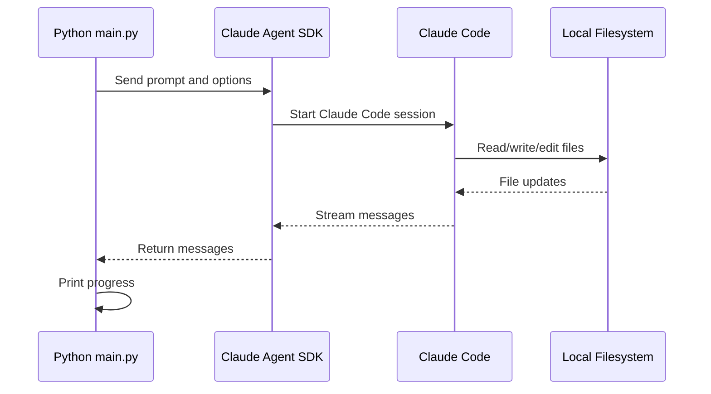
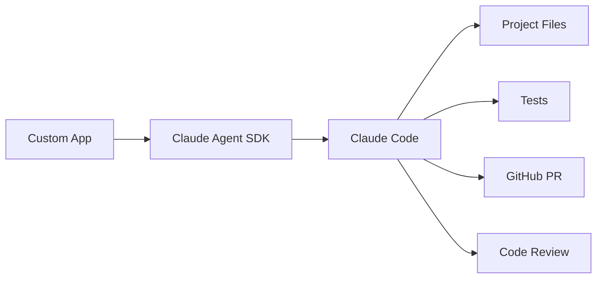
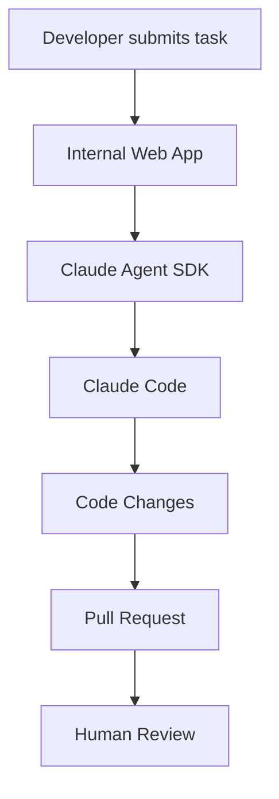
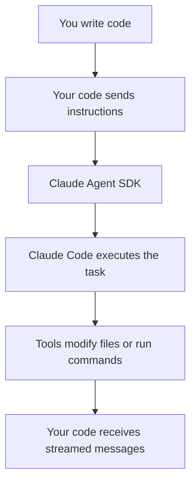

# 080 - Day 3 - Driving Claude Code Programmatically with Claude Agent SDK

## Lesson Information

| Item     | Details                                                    |
| -------- | ---------------------------------------------------------- |
| Lesson   | 080                                                        |
| Duration | 9 minutes                                                  |
| Week     | Week 3 - Agentic Engineering Frontier                      |
| Module   | Week 3 Day 3 - Large Codebases, SDK, Cowork, OpenClaw      |
| Topic    | Driving Claude Code programmatically with Claude Agent SDK |

---

## Main Idea

This lesson introduces the **Claude Agent SDK** as a way to control **Claude Code through code** instead of interacting with it manually in the terminal.

The key point is:

> Claude Agent SDK is not a full agent framework. It is a programmatic interface for driving Claude Code and giving it access to tools such as reading files, writing files, editing files, and executing workflows.

In the demo, Claude Code is controlled by a Python script to generate a working **vanilla HTML, CSS, and JavaScript Space Invaders game**.

---

## Why This Lesson Matters

Most developers use Claude Code interactively through the terminal. That works well for day-to-day development.

However, when you want to build your own system, orchestrator, automation workflow, or internal developer platform, you may need to call Claude Code from code.

The Claude Agent SDK enables this kind of workflow:



---

## Core Concept

### Claude Agent SDK

The Claude Agent SDK allows you to **programmatically drive Claude Code**.

Instead of typing a prompt directly into Claude Code, you write a Python script that sends a prompt and controls what tools Claude Code is allowed to use.

This makes Claude Code usable inside larger systems.

Example use cases:

* Automating repetitive coding tasks
* Building custom internal coding tools
* Creating agent-powered developer workflows
* Integrating Claude Code into a platform
* Running Claude Code inside an orchestrated pipeline
* Creating structured agent workflows from Python

---

## Important Clarification

Although the name is **Claude Agent SDK**, the lesson emphasizes that it is **not really a general-purpose agent framework**.

It is better understood as:

> A software development kit for controlling Claude Code programmatically.

This means it gives you access to Claude Code’s agentic capabilities, but from your own code.

---

## Demo Overview

The demo starts with an empty project folder called `space`.

The goal is to ask Claude Code, through Python, to create a simple Space Invaders game using:

* HTML
* CSS
* JavaScript

The generated project should include an `index.html` file and run directly in the browser.

---

## Project Setup

The instructor uses `uv` to initialize a Python project.

```bash
uv init --bare
uv python pin 3.13
```

Then the required dependencies are installed:

```bash
uv add python-dotenv requests claude-agent-sdk
```

### Dependencies Used

| Dependency         | Purpose                                                     |
| ------------------ | ----------------------------------------------------------- |
| `python-dotenv`    | Loads API keys and environment variables from a `.env` file |
| `requests`         | Common Python HTTP library                                  |
| `claude-agent-sdk` | Allows Python code to drive Claude Code                     |

---

## Environment Setup

A `.env` file is added to store keys such as the Anthropic API key.

A `.gitignore` file is also created to prevent secrets from being committed.

Example:

```gitignore
.env
.venv/
__pycache__/
```

This is important because API keys should never be committed to a repository.

---

## Programmatic Claude Code Workflow

The Python script does four main things:

1. Loads environment variables.
2. Defines a prompt.
3. Defines which tools Claude Code can use.
4. Sends the prompt to Claude Code through the SDK.



---

## Example Prompt

The prompt used in the demo is simple and direct:

```text
Make a vanilla HTML plus JS plus CSS website for a game of Space Invaders.
Write the code to files in the current directory including index.html.
```

This prompt gives Claude Code a clear goal and tells it where to write the result.

---

## Example Python Structure

A simplified version of the script looks like this:

```python
import asyncio
from dotenv import load_dotenv
from claude_agent_sdk import ClaudeAgentOptions, query

load_dotenv(override=True)

prompt = """
Make a vanilla HTML plus JS plus CSS website for a game of Space Invaders.
Write the code to files in the current directory including index.html.
"""

tools = [
    "Read",
    "Write",
    "Edit",
    "Bash"
]

async def main():
    options = ClaudeAgentOptions(
        allowed_tools=tools,
        model="claude-opus-4-6"
    )

    async for message in query(
        prompt=prompt,
        options=options
    ):
        print(message)

asyncio.run(main())
```

The exact available tools and model names may depend on the installed SDK version and environment, but the overall pattern is the key idea.

---

## Key SDK Elements

### `ClaudeAgentOptions`

This is where you configure how Claude Code should behave.

Common configuration areas include:

| Option            | Purpose                                  |
| ----------------- | ---------------------------------------- |
| `allowed_tools`   | Controls which tools Claude Code can use |
| `model`           | Selects which Claude model to use        |
| `permission_mode` | Controls permission behavior             |
| `mcp_servers`     | Allows MCP server integration            |
| Other options     | Can customize the agent workflow further |

---

### `query`

The `query` function sends the prompt to Claude Code and streams back messages.

The demo uses:

```python
async for message in query(prompt=prompt, options=options):
    print(message)
```

This means the script receives Claude Code’s progress as it works.

---

## What Claude Code Generated

Claude Code created an `index.html` file and built a working Space Invaders-style browser game.

The generated game included:

* A start screen
* Player movement
* Arrow key controls
* Aliens
* Sound effects
* Score tracking
* Visual styling
* A playable game loop

The instructor then opened the generated `index.html` in a browser and confirmed that the game worked.

---

## Why This Is Powerful

The important part is not the Space Invaders game itself.

The important part is that Claude Code was controlled by another program.

This opens the door to workflows like:



Instead of manually prompting Claude Code, you can build systems that call Claude Code automatically.

---

## Practical Applications

### 1. Repetitive Coding Tasks

You can automate common tasks such as:

* Creating boilerplate files
* Updating documentation
* Generating tests
* Refactoring small modules
* Creating example apps
* Running code checks

---

### 2. Internal Developer Platforms

A company could build a web interface where developers submit tasks, and behind the scenes, Claude Code performs the work using the SDK.

Example:



---

### 3. Agent Orchestration

The SDK can be used as part of a larger orchestrator.

For example:

* One agent creates code.
* Another agent reviews it.
* Another agent runs tests.
* Another agent prepares a pull request.

The Claude Agent SDK can become one part of that larger automation system.

---

## Important Warning About Cost

The instructor intentionally uses a powerful model for the demo, but warns that this is not always a good idea.

For real workflows, especially loops or automated systems, you should be careful with model cost.

Recommended practice:

* Use cheaper models for simple tasks.
* Avoid uncontrolled loops.
* Set clear limits.
* Monitor token usage and cost.
* Do not run expensive models repeatedly unless necessary.

---

## Best Practices

### Use Clear Prompts

A vague prompt can produce unpredictable results.

Better:

```text
Create a vanilla HTML, CSS, and JavaScript Space Invaders game.
Write all files into the current directory.
Include index.html as the entry point.
```

Avoid:

```text
Make a game.
```

---

### Restrict Tools

Only allow the tools Claude Code actually needs.

For example, if Claude Code only needs to create files, allow file-writing tools. If it does not need shell access, avoid giving it shell access.

---

### Protect Secrets

Always keep API keys in `.env`.

Do not commit:

```text
.env
API keys
Access tokens
Private credentials
```

---

### Start Small

Before using the SDK on a large codebase, test it on a small isolated folder.

A good first task:

```text
Create a small static website in the current directory.
```

A risky first task:

```text
Refactor my entire production backend.
```

---

## Mental Model

Think of the Claude Agent SDK like this:



The SDK is the bridge between your application and Claude Code.

---

## Key Takeaways

* Claude Agent SDK lets you control Claude Code from code.
* It is not a full agent framework.
* It is useful when you want to build automation around Claude Code.
* You can define prompts, allowed tools, model choice, and options.
* The SDK streams messages back while Claude Code works.
* This enables custom coding workflows, internal platforms, and orchestrators.
* Be careful with expensive models and automated loops.
* Always protect secrets with `.env` and `.gitignore`.

---

## Summary

In this lesson, the instructor demonstrates how to use the **Claude Agent SDK** to drive Claude Code programmatically from a Python script.

The demo starts with an empty folder and uses the SDK to ask Claude Code to generate a complete Space Invaders game using HTML, CSS, and JavaScript.

The main lesson is not about the game itself, but about the workflow:

> Instead of manually interacting with Claude Code in the terminal, you can control Claude Code through your own software.

This is useful for automation, custom platforms, internal tools, agent orchestration, and repeatable coding workflows.

---

## Practice Task

Create a new empty folder and use Claude Agent SDK to generate a small web app.

Suggested prompt:

```text
Create a vanilla HTML, CSS, and JavaScript todo app.
Write all files into the current directory.
Use index.html as the entry point.
The app should allow adding, completing, and deleting tasks.
```

Then open `index.html` in a browser and test the result.

---

## Review Questions

1. What is the Claude Agent SDK used for?
2. Why is it not the same as a full agent framework?
3. What does `allowed_tools` control?
4. Why should you be careful with expensive models in automated workflows?
5. How could you use the SDK inside a custom developer platform?
6. Why is `.env` important in this kind of project?
7. What are the benefits of streaming messages back from Claude Code?
