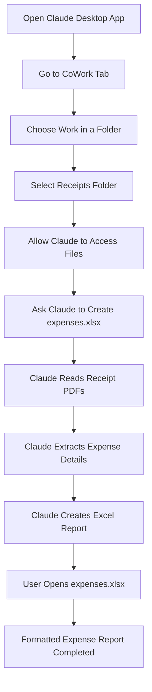

# 081 - Day 3 - Claude CoWork: Agentic AI for Everyday Tasks Demo

## Lesson Information

| Item     | Details                                               |
| -------- | ----------------------------------------------------- |
| Lesson   | 081                                                   |
| Duration | 6 minutes                                             |
| Week     | Week 3 - Agentic Engineering Frontier                 |
| Module   | Week 3 Day 3 - Large Codebases, SDK, CoWork, OpenClaw |

---

## Main Idea

This lesson introduces **Claude CoWork**, an Anthropic product that brings the agentic experience of Claude Code into everyday productivity tasks.

Instead of only helping engineers write and manage code, Claude CoWork allows users to apply agentic AI to tasks such as:

* Organizing files
* Reading PDFs and images
* Creating reports
* Working with spreadsheets
* Reviewing contracts
* Processing receipts
* Managing business workflows

The key idea is that **agentic AI is not limited to coding**. The same workflow that helps developers manage large codebases can also help business users handle practical, repetitive, multi-step work.

---

## Learning Objectives

After this lesson, learners should be able to:

* Understand what Claude CoWork is and how it differs from Claude Code.
* Explain how agentic workflows can be applied beyond software engineering.
* Recognize everyday productivity tasks that are suitable for AI agents.
* Understand how Claude CoWork uses folders, files, plugins, and cloud execution.
* Connect Claude CoWork with the broader concept of an AI coworker.

---

## Key Concepts

### 1. Claude CoWork as an AI Coworker

Claude CoWork takes the agentic capabilities familiar from Claude Code and applies them to non-coding tasks.

In Claude Code, the agent can inspect files, reason through a task, make changes, and produce outputs. Claude CoWork follows a similar pattern, but the target tasks are everyday business or personal productivity workflows.

Examples include:

* Creating an expense report from receipts
* Sorting screenshots
* Reviewing documents
* Summarizing files
* Extracting data from PDFs
* Creating structured outputs such as spreadsheets

The important shift is from **AI as a chat assistant** to **AI as an active coworker**.

---

### 2. Agentic Workflows Beyond Coding

Claude CoWork shows that agentic AI is a general workflow pattern.

A coding agent usually works like this:

```text
Understand task
→ Inspect files
→ Plan steps
→ Modify or generate files
→ Validate result
→ Return final output
```

Claude CoWork applies the same structure to everyday work:

```text
Understand task
→ Inspect folder/files
→ Extract information
→ Process and organize data
→ Generate final document
→ Save output file
```

This means the agent is not just answering questions. It is doing work across multiple steps.

---

### 3. Working with Files and Folders

In the demo, the instructor selects a local folder containing receipt PDFs.

Claude CoWork is given access to that folder and asked to create an Excel expense report:

```text
In the folder that I shared with you, there are a bunch of receipts.
They are all PDFs of images.
Please review these and make me an expenses report as an Excel file:
expenses.xlsx
```

Claude CoWork then:

1. Reads the folder.
2. Detects the receipt files.
3. Attempts to read the PDFs.
4. Handles the fact that some PDFs are image-based.
5. Extracts receipt details.
6. Builds a structured spreadsheet.
7. Saves the result as `expenses.xlsx`.

---

## Demo Flow



---

## What Happened in the Demo?

The instructor opens Claude Desktop and navigates to the **CoWork** tab.

Claude CoWork presents example tasks such as:

* Optimize my week
* Organize my screenshots
* Work in a folder

The instructor chooses to work inside a folder named `receipts`. This folder contains around 12 receipt PDFs.

Claude CoWork is asked to review all receipt files and create an Excel spreadsheet called:

```text
expenses.xlsx
```

Claude begins by reading an Excel-related skill, then inspects the receipt files. It realizes that the PDFs contain images, so it needs to process them visually rather than simply extracting text.

After several minutes, Claude creates a new Excel file in the folder. The file contains a formatted expenses report with receipt details and a total amount.

---

## Conceptual Comparison: Claude Code vs Claude CoWork

| Area             | Claude Code                              | Claude CoWork                                     |
| ---------------- | ---------------------------------------- | ------------------------------------------------- |
| Main audience    | Developers                               | Business users, general users, productivity users |
| Primary use case | Coding and codebase tasks                | Everyday work tasks                               |
| Typical input    | Source code, repo files, issues          | PDFs, images, folders, documents, spreadsheets    |
| Typical output   | Code changes, PRs, scripts, explanations | Reports, organized files, summaries, spreadsheets |
| Workflow style   | Agentic engineering                      | Agentic productivity                              |
| Core value       | Helps engineers build software faster    | Helps users complete repetitive work faster       |

---

## Why This Lesson Matters

This lesson is important because it expands the learner’s understanding of agentic AI.

Up to this point, many examples focus on Claude Code and software engineering. Claude CoWork shows that the same ideas can be applied to broader productivity workflows.

The lesson demonstrates that agentic systems are useful when a task requires:

* Reading multiple files
* Understanding messy inputs
* Performing several steps
* Making decisions along the way
* Producing a useful final artifact

This is why Claude CoWork represents the idea of an **AI coworker**, not just an AI chatbot.

---

## Practical Use Cases

Claude CoWork can be useful for tasks such as:

| Use Case              | Example                                    |
| --------------------- | ------------------------------------------ |
| Expense reporting     | Convert receipt PDFs into an Excel report  |
| File organization     | Sort screenshots or documents into folders |
| Document review       | Review contracts, NDAs, or legal files     |
| Data extraction       | Pull structured data from PDFs or images   |
| Business operations   | Prepare summaries, reports, or checklists  |
| Personal productivity | Organize weekly plans or task lists        |

---

## Mental Model

Think of Claude CoWork as:

```text
Claude Code for everyday work
```

Instead of asking:

```text
Can Claude help me change this codebase?
```

Claude CoWork asks:

```text
Can Claude help me complete this real-world task using my files?
```

The agentic pattern stays the same. Only the domain changes.

---

## Key Takeaways

* Claude CoWork brings agentic AI workflows to everyday tasks.
* It is designed for productivity, business, and file-based work rather than only coding.
* It can work with folders, PDFs, images, spreadsheets, and plugins.
* The demo shows Claude creating an Excel expense report from receipt PDFs.
* Claude CoWork demonstrates the broader future of AI as a practical coworker.
* The main lesson is that agentic thinking applies far beyond software engineering.

---

## Summary

In this lesson, the instructor demonstrates **Claude CoWork**, an Anthropic product that extends the Claude Code-style agentic experience to everyday productivity tasks.

The demo shows Claude CoWork working inside a local folder of receipt PDFs. The agent reads the files, handles image-based PDFs, extracts expense information, and generates a formatted Excel spreadsheet named `expenses.xlsx`.

The lesson highlights an important shift: agentic AI is not only for developers. It can also help business users and general users complete practical, repetitive, multi-step tasks involving files, documents, calendars, email, and data.

Claude CoWork represents the broader idea of the **AI coworker**: an assistant that does not simply chat, but actively works through tasks and produces useful outputs.

---

# Bài luyện tập

## Mục tiêu


## Đề bài


## Yêu cầu hoàn thành

- [ ] 
- [ ] 
- [ ] 

## Kết quả / lời giải


## Ghi chú
