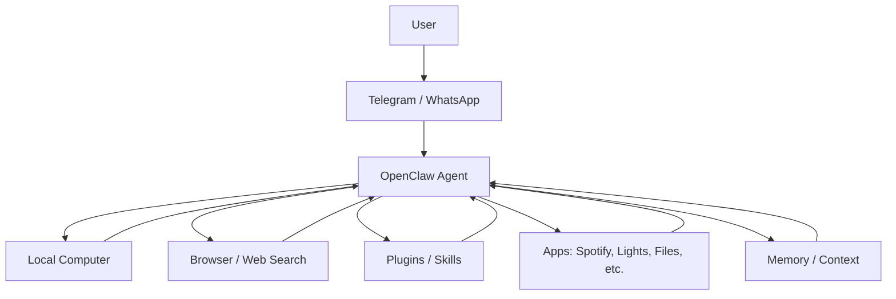
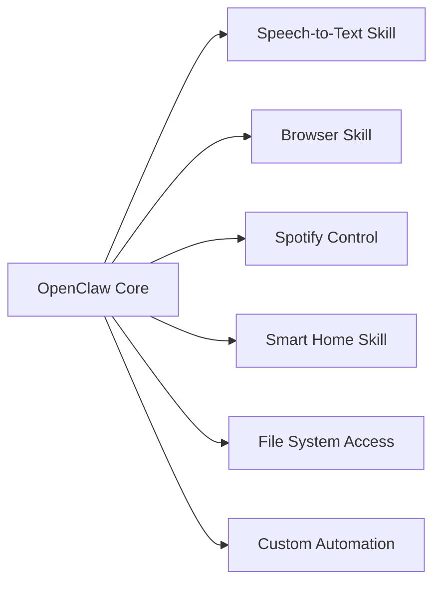
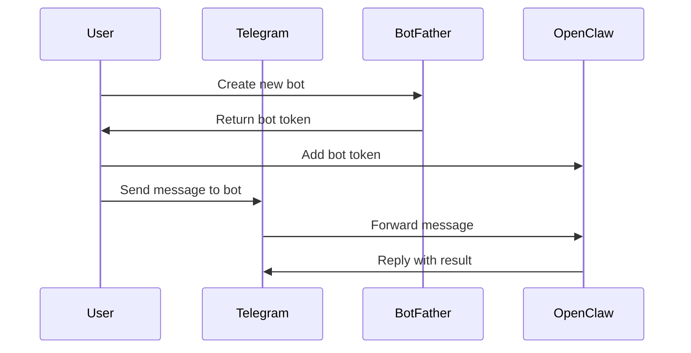
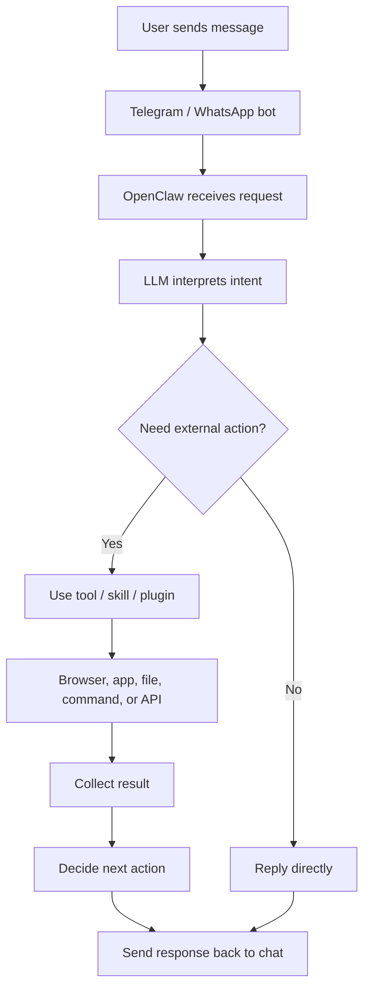
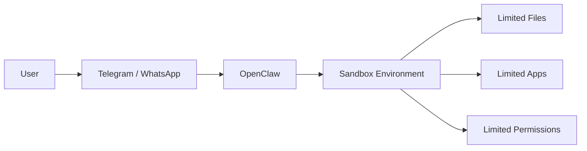
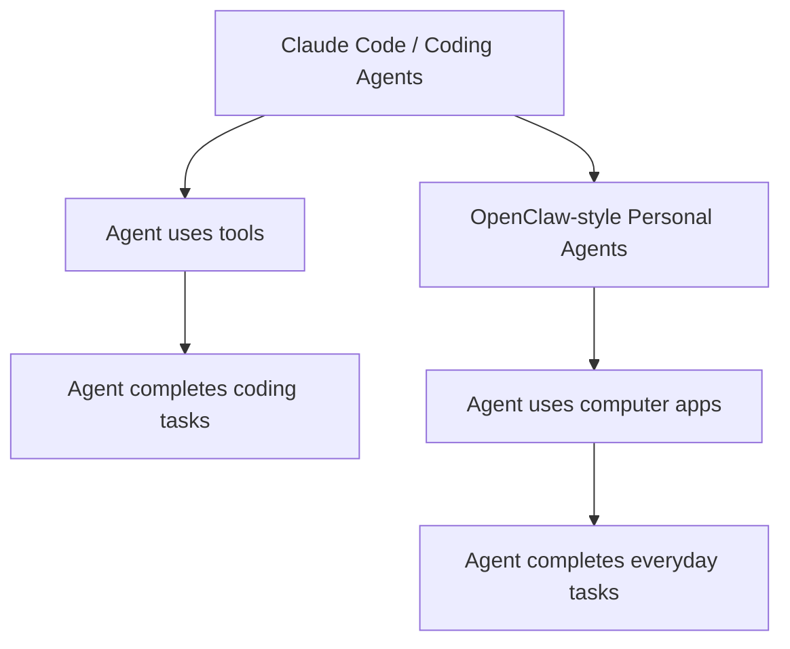
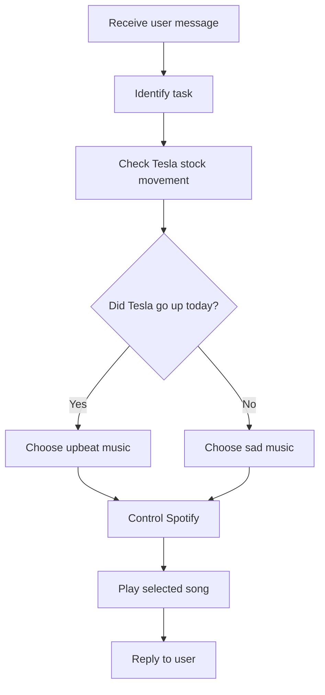

# 082 - Day 3 - OpenClaw: Your Personal AI Sidekick via Telegram & WhatsApp

## Lesson Information

| Item       | Details                                                                   |
| ---------- | ------------------------------------------------------------------------- |
| Lesson     | 082                                                                       |
| Duration   | 11 min                                                                    |
| Week       | Week 3 - Agentic Engineering Frontier                                     |
| Module     | Week 3 Day 3 - Large Codebases, SDK, Cowork, OpenClaw                     |
| Main Topic | OpenClaw as a personal AI sidekick connected through Telegram or WhatsApp |

---

## 1. Lesson Overview

This lesson introduces **OpenClaw**, a personal AI sidekick that can be controlled through chat apps such as **Telegram** or **WhatsApp**.

Unlike coding agents that mainly operate inside codebases or development environments, OpenClaw explores a broader idea:

> What happens when agentic AI becomes part of everyday life?

OpenClaw can run on your computer, connect to tools and plugins, remember context, control applications, browse the web, and respond through messaging apps. It brings the agentic workflow from engineering tools into a more personal, daily-use environment.

---

## 2. Why OpenClaw Matters

OpenClaw is not the main focus of a coding-agent course, but it is important because it shows where agentic AI may be heading.

Instead of only helping developers write code, agents can become:

* Personal assistants
* Automation hubs
* Messaging-based sidekicks
* Tool controllers
* Workflow coordinators
* Local computer operators

The bigger lesson is not just “how to use OpenClaw,” but how agentic systems can move beyond software engineering and into everyday productivity.

---

## 3. Core Idea

OpenClaw is designed as a **chat-first personal AI agent**.

You interact with it through a familiar messaging interface, while the agent runs on your computer and can use local tools, plugins, browser automation, and external services.



---

## 4. Learning Objectives

After this lesson, students should be able to:

* Explain what OpenClaw is and why it is different from coding-focused agents.
* Understand how a messaging app can become the interface for an AI agent.
* Recognize the power and risk of giving an agent access to local computer tools.
* Describe how OpenClaw connects to plugins, skills, memory, and apps.
* Connect OpenClaw to the broader trend of agentic AI moving into daily productivity.

---

## 5. Key Concepts

### 5.1 Personal AI Sidekick

OpenClaw is presented as a **personal AI sidekick**.

Instead of being limited to coding tasks, it can assist with everyday actions such as:

* Looking up information
* Controlling applications
* Playing music
* Using plugins
* Remembering preferences
* Responding through chat
* Automating small personal workflows

The important shift is from:

> “AI as a coding assistant”

to:

> “AI as a general-purpose personal operator.”

---

### 5.2 Chat-First Interaction

OpenClaw uses messaging apps as the primary interface.

This is powerful because users already understand how to interact through chat. Instead of opening a developer tool or terminal every time, the user can simply send a message to the agent.

Example:

```text
Please look up Tesla stock price.
If it went up today, play me something upbeat.
Otherwise, play something depressing.
```

The agent must then:

1. Understand the user’s intent.
2. Search or check stock movement.
3. Decide whether the stock went up or down.
4. Choose a suitable song.
5. Control Spotify on the computer.
6. Report back through Telegram.

---

### 5.3 Local Computer Access

OpenClaw becomes powerful because it can run locally and access the user’s machine.

This means it may be able to:

* Read files
* Run commands
* Control apps
* Use the browser
* Trigger automations
* Interact with installed software
* Use connected services

However, this is also why it can be risky.

The more access an agent has, the more damage a bad prompt, unsafe plugin, or malicious instruction can cause.

---

### 5.4 Plugins and Skills

OpenClaw supports skills and plugins that expand what it can do.

In the demo, the instructor installs a simple skill:

```text
OpenAI Whisper
```

This gives the sidekick speech-to-text capability.

Other skills may allow OpenClaw to interact with smart home devices, apps, browser tools, local files, or external APIs.



---

## 6. Demo Breakdown

### Step 1: Install OpenClaw

The instructor installs OpenClaw through a one-line command in the terminal.

The installation process shows that OpenClaw is still a technical tool. The lesson emphasizes that users should understand terminals, permissions, and risks before using it.

---

### Step 2: Security Warning

After installation, OpenClaw displays a security warning.

The warning explains that:

* It is still a hobby project.
* It is in beta.
* It may have sharp edges.
* It can read files.
* It can run actions.
* A bad prompt could trick it into unsafe behavior.
* Users should read the security documentation.
* Users should run security audits regularly.

This is one of the most important parts of the lesson.

OpenClaw is powerful because it can act on your behalf, but that also means it must be used carefully.

---

### Step 3: Choose Model Provider

During setup, the instructor selects an AI model provider.

The demo shows OpenAI authentication through a browser-based login flow. After authentication, the instructor chooses a model for the agent to use.

This shows that OpenClaw is not just a fixed assistant. It can be configured with different model providers and capabilities.

---

### Step 4: Connect Telegram

The instructor chooses Telegram as the communication channel.

The setup process requires creating a Telegram bot through BotFather, generating a bot token, and connecting that token to OpenClaw.

The token is kept hidden because it is a secret credential.



---

### Step 5: Configure Skills

The instructor configures skills and chooses a simple one: OpenAI Whisper.

This gives the sidekick additional capabilities beyond plain text chat.

Skills are important because they turn OpenClaw from a chatbot into an action-oriented agent.

---

### Step 6: Name the Sidekick

During onboarding, the instructor names the agent “Sidekick.”

This personalization is part of the product idea. The agent is not just a tool; it is designed to feel like a companion that can interact with the user through everyday channels.

---

### Step 7: Run the Agent Through Telegram

The instructor sends a Telegram message asking the agent to check Tesla stock and play music depending on the result.

The agent:

1. Receives the message through Telegram.
2. Understands the conditional request.
3. Looks up Tesla stock movement.
4. Determines that Tesla went up.
5. Chooses an upbeat song.
6. Opens or controls Spotify.
7. Plays “Upside Down” by Diana Ross.

This demonstrates real autonomy: the user did not specify the exact song or detailed steps. The agent interpreted the goal and executed the workflow.

---

## 7. OpenClaw Workflow



---

## 8. Security Risks

OpenClaw raises serious security concerns because it may have broad access to the user’s computer.

### Main Risks

| Risk               | Explanation                                                                    |
| ------------------ | ------------------------------------------------------------------------------ |
| Prompt injection   | A malicious website, file, or message may trick the agent into unsafe actions. |
| File exposure      | The agent may read sensitive files if permissions are too broad.               |
| Unsafe commands    | The agent may run commands that modify or delete data.                         |
| Plugin risk        | Third-party skills may introduce vulnerabilities.                              |
| Credential leakage | Tokens, API keys, or private data may be exposed if handled carelessly.        |
| Over-permission    | Giving the agent access to everything increases the blast radius of mistakes.  |

---

## 9. Safer Usage Pattern

A safer way to use OpenClaw is to run it inside a controlled environment.



### Recommended Safety Practices

* Run OpenClaw in a sandbox when possible.
* Do not expose sensitive files unnecessarily.
* Avoid giving access to everything by default.
* Review installed plugins carefully.
* Keep secrets such as bot tokens and API keys private.
* Run security audits regularly.
* Use least-privilege permissions.
* Start with simple, low-risk skills before enabling powerful actions.

---

## 10. Relationship to Claude Code and Coding Agents

OpenClaw is not mainly a coding agent, but it is connected to the same broader movement.

Claude Code, Codex, and similar tools showed that agents can:

* Understand complex instructions
* Use tools
* Work across files
* Run commands
* Make decisions
* Execute multi-step workflows

OpenClaw applies similar ideas to the personal computer environment.



The important conceptual bridge is:

> Agentic AI is moving from the developer terminal into everyday life.

---

## 11. Practical Example from the Demo

### User Request

```text
Please look up Tesla stock price.
If it went up today, play me something upbeat.
Otherwise, play something depressing.
```

### Agent Reasoning Flow



### What This Demonstrates

This demo shows several agentic capabilities at once:

* Natural language understanding
* Conditional reasoning
* Web lookup
* Autonomous decision-making
* App control
* Tool execution
* Chat-based interaction

---

## 12. Key Takeaways

* OpenClaw is a personal AI sidekick controlled through messaging apps.
* It can connect to Telegram or WhatsApp and act from your computer.
* It can use plugins, memory, browser control, apps, and local tools.
* Its power comes from broad computer access.
* That same power creates serious security risk.
* Running it in a sandbox can reduce potential damage.
* OpenClaw shows how agentic AI may expand beyond coding into everyday life.
* The broader trend is toward AI agents that can operate across tools, apps, workflows, and environments.

---

## 13. Connection to the Course

This lesson completes the lighter “sizzle” section of Day 3.

Earlier lessons focused on:

* Working with large codebases
* Driving Claude Code programmatically through the Claude Agent SDK
* Exploring Claude Cowork for professional workflows

OpenClaw extends the same agentic idea into the personal world.

It shows that the future of agents may not be limited to IDEs, terminals, or code repositories. Agents may also live inside messaging apps and control real-world workflows.

---

## 14. Reflection Questions

1. What makes OpenClaw different from a normal chatbot?
2. Why is local computer access both powerful and dangerous?
3. How does Telegram or WhatsApp change the way users interact with agents?
4. What kinds of tasks would be safe to automate with OpenClaw?
5. What kinds of tasks should require human approval?
6. How could sandboxing make OpenClaw safer?
7. How does OpenClaw connect to the broader idea of agentic engineering?

---

## 15. Final Summary

OpenClaw demonstrates the next step in agentic AI: moving from coding environments into everyday personal workflows.

By connecting an AI sidekick to Telegram or WhatsApp, users can interact with an agent through a familiar chat interface. The agent can then use local computer tools, plugins, apps, and web access to complete multi-step tasks.

The demo shows OpenClaw checking Tesla stock movement and then controlling Spotify to play a song based on the result. This simple example reveals the bigger idea: AI agents can understand goals, make decisions, and take action across real tools.

However, OpenClaw also introduces serious security concerns. Because it may access files, apps, commands, and credentials, users must treat it carefully. Sandboxing, limited permissions, security audits, and cautious plugin use are essential.

The main lesson is that agentic AI is expanding beyond coding. Tools like OpenClaw show a future where everyone may have a personal AI sidekick capable of helping across daily life, work, and automation.

---

# Bài luyện tập

## Mục tiêu


## Đề bài


## Yêu cầu hoàn thành

- [ ] 
- [ ] 
- [ ] 

## Kết quả / lời giải


## Ghi chú
