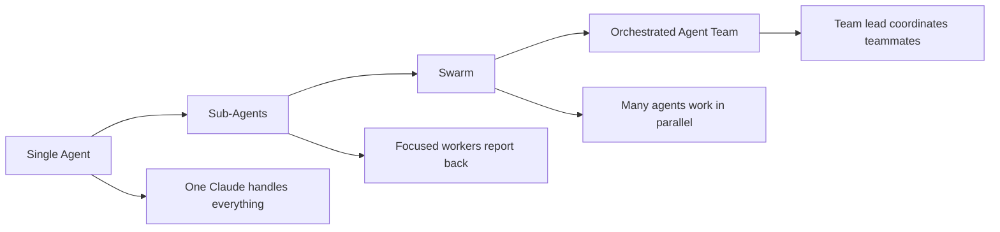
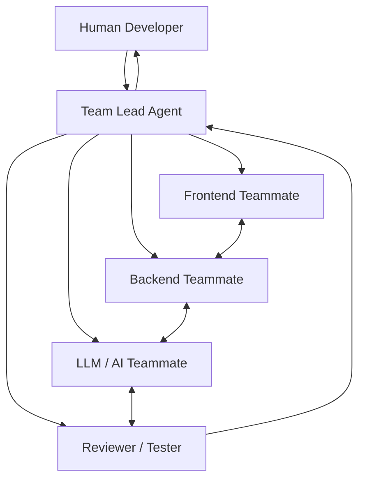
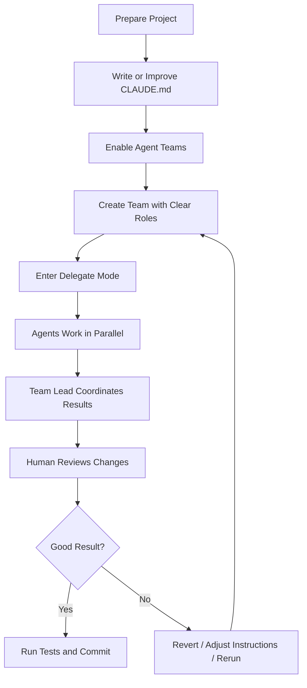

# 083 - Day 4 - Claude Code Agent Teams: Swarms and Orchestration

## Lesson Information

| Item     | Details                                            |
| -------- | -------------------------------------------------- |
| Lesson   | 083                                                |
| Duration | 12 min                                             |
| Week     | Week 3 - Agentic Engineering Frontier              |
| Module   | Week 3 Day 4 - Agent Teams, GSD, Multi-Agent Build |
| Topic    | Claude Code Agent Teams, Swarms, and Orchestration |

---

## Main Idea

This lesson introduces **Claude Code Agent Teams**, a more advanced way to run multiple Claude Code instances together.

Instead of using only one coding agent or simple sub-agents, agent teams allow multiple Claude Code teammates to work in parallel, communicate with each other, and coordinate through a shared task structure.

The lesson marks the transition from simple agent workflows into **swarm-style execution** and **orchestrated multi-agent systems**.

---

## Learning Objectives

By the end of this lesson, learners should be able to:

* Understand the difference between **sub-agents**, **swarms**, and **agent teams**
* Explain why orchestration is needed when many agents work at the same time
* Identify good use cases for Claude Code Agent Teams
* Understand the basic setup flow for enabling agent teams
* Recognize the risks of multi-agent workflows, including cost, chaos, and merge conflicts
* Apply agent-team thinking to larger coding projects

---

## Key Concepts

### 1. Swarms

A **swarm** is a group of many agents running in parallel.

Each agent may work on a different task, module, file, or research direction. This can dramatically increase speed, but it can also create chaos if the work is not coordinated.

A swarm is powerful when:

* Tasks can be split clearly
* Agents do not edit the same files too often
* Each agent has a focused responsibility
* The human developer can review and control the final result

---

### 2. Orchestration

**Orchestration** means coordinating multiple agents so that they work together instead of acting randomly.

In an orchestrated system, one agent may act as the **team lead**. It assigns tasks, tracks progress, and helps teammates collaborate.

The purpose of orchestration is to turn raw agent chaos into a more structured workflow.

---

### 3. Claude Code Agent Teams

Claude Code Agent Teams allow multiple Claude Code instances to work together as a team.

One agent acts as the **team lead**, while other agents act as **teammates**. Each teammate has its own independent context and can work on tasks separately.

Unlike sub-agents, teammates are more persistent and collaborative. They can communicate with each other and coordinate on a shared task list.

---

## Swarms vs Orchestration



---

## Claude Agent Teams Structure



The human can interact with the team lead, but can also directly inspect or communicate with individual teammates.

---

## Sub-Agents vs Agent Teams

| Area              | Sub-Agents                           | Agent Teams                                   |
| ----------------- | ------------------------------------ | --------------------------------------------- |
| Context           | Separate short-lived context         | Full independent context window               |
| Communication     | Report back mainly to the main agent | Can message other teammates                   |
| Lifecycle         | Exists only for a specific task      | Runs as a separate Claude Code teammate       |
| Coordination      | Main agent manages everything        | Shared task list and team coordination        |
| Best For          | Focused, narrow, quick tasks         | Complex work requiring collaboration          |
| Cost              | Usually more token-efficient         | Can become expensive                          |
| Human Interaction | Usually indirect                     | Human can interact with teammates             |
| Use Case          | “Research this and summarize it”     | “Build these modules together and coordinate” |

---

## When to Use Agent Teams

Agent teams are useful when the project can be divided into independent but related responsibilities.

Good examples include:

### Research-heavy tasks

Different agents can research different sources, tools, libraries, or technical approaches, then bring their findings together.

Example:

* One teammate researches documentation
* One teammate checks Stack Overflow or GitHub issues
* One teammate compares implementation options
* One teammate summarizes risks and recommendations

---

### Independent system modules

Agent teams work well when different parts of a system can be built separately.

Example:

* Authentication module
* Dashboard module
* API integration module
* Database schema module
* Testing module

Each teammate can work on one area while still communicating with the others.

---

### Layer-based engineering roles

You can also divide agents by engineering layer.

Example:

| Role            | Responsibility                            |
| --------------- | ----------------------------------------- |
| Frontend Agent  | UI, components, user flows                |
| Backend Agent   | API, database, business logic             |
| LLM Agent       | prompts, AI workflows, tool calls         |
| QA Agent        | tests, review, bugs, edge cases           |
| Team Lead Agent | coordination, planning, final integration |

This mirrors how human software teams are often organized.

---

## When Not to Use Agent Teams

Agent teams may not be worth it when:

* The task is small
* The files are tightly coupled
* Multiple agents would edit the same files
* You do not want to spend many tokens
* The project has no clear architecture
* You cannot review the final changes carefully

For small tasks, a single Claude Code session or sub-agent workflow is usually safer and cheaper.

---

## Basic Setup Flow

The lesson describes five general steps for using Claude Code Agent Teams.

### Step 1: Enable Agent Teams

Update the project’s `settings.json` to enable the experimental Claude Code Agent Teams feature.

At the time of the lesson, this was still experimental, so the exact configuration may change in future versions.

Conceptually, the configuration enables:

* Experimental agent teams
* A teammate display mode

---

### Step 2: Choose Teammate Mode

There are two teammate modes mentioned in the lesson.

| Mode                       | Description                                      | Platform Notes                        |
| -------------------------- | ------------------------------------------------ | ------------------------------------- |
| In-process                 | All agents appear in the same Claude Code screen | Works across platforms                |
| tmux / terminal split mode | Agents appear in separate terminal panes         | Better for Mac/Linux with extra setup |

The lesson uses **in-process mode** because it works more broadly.

---

### Step 3: Ask Claude to Create an Agent Team

You can prompt Claude Code with an instruction such as:

```text
Create an agent team to build this feature.
Assign responsibilities clearly and coordinate the work between teammates.
```

You may either let Claude decide the team structure or provide specific roles yourself.

Example:

```text
Create an agent team with:
- one frontend teammate
- one backend teammate
- one testing teammate
- one team lead

The goal is to implement the user profile feature.
```

---

### Step 4: Use Delegate Mode

The lesson recommends using **delegate mode** so that the main agent does not try to do all the work by itself.

The goal is to make the team lead actually delegate tasks to teammates instead of acting like a normal single Claude Code session.

A useful instruction is:

```text
Wait for your teammates to complete their tasks before proceeding.
```

---

### Step 5: Manage and Clean Up the Team

You can switch between teammates, inspect their progress, and shut them down when needed.

Important actions mentioned in the lesson include:

| Action                      | Purpose                    |
| --------------------------- | -------------------------- |
| Switch between teammates    | Inspect each agent’s work  |
| Ask a teammate to shut down | Stop one specific teammate |
| Clean up the team           | Stop the entire agent team |

---

## Recommended Workflow



---

## Best Practices

### 1. Invest in `CLAUDE.md`

The lesson emphasizes that `CLAUDE.md` is very important because it is loaded into the context for the agents.

A good `CLAUDE.md` should include:

* Project overview
* Architecture rules
* Coding conventions
* Testing commands
* Branching rules
* Files or folders to avoid
* Preferred implementation style
* How agents should communicate

This helps every teammate start with the same shared understanding.

---

### 2. Split Work Carefully

Agent teams work best when responsibilities are separated cleanly.

Good split:

```text
Frontend agent works only in /frontend
Backend agent works only in /api
Test agent writes tests after implementation
Reviewer agent checks final changes
```

Bad split:

```text
All agents edit the same files at the same time.
```

Poor task separation can cause merge conflicts, duplicate work, and inconsistent design.

---

### 3. Control the Chaos

Multi-agent workflows can become unpredictable.

You should actively control:

* Which files each agent edits
* Which agent owns which responsibility
* When agents should communicate
* When the team lead should wait
* When to stop and rerun
* When to review manually

Agent teams are powerful, but they are not fully automatic replacements for engineering judgment.

---

### 4. Watch Token Cost

Agent teams can be expensive because each teammate has its own context and performs its own reasoning.

Use them only when the task justifies the cost.

For learning, it may be enough to watch a demo or run a small controlled experiment.

---

### 5. Be Ready to Rerun

Because agent teams are experimental and chaotic, the first run may not be successful.

You may need to:

* Stop the team
* Revert changes with Git
* Improve the prompt
* Clarify responsibilities
* Run the team again

This is normal for advanced multi-agent workflows.

---

## Common Risks

| Risk               | Explanation                         | Mitigation                    |
| ------------------ | ----------------------------------- | ----------------------------- |
| Merge conflicts    | Multiple agents edit the same files | Assign file ownership         |
| Token cost         | Many agents spend many tokens       | Use only for meaningful tasks |
| Poor coordination  | Agents work in different directions | Use a strong team lead prompt |
| Overcommunication  | Agents talk too much and slow down  | Define communication rules    |
| Low-quality output | Agents produce inconsistent code    | Add reviewer/tester agent     |
| Runaway workflow   | Team continues without control      | Stop, clean up, and rerun     |

---

## Practical Example

Imagine you are building a trading dashboard app.

A good agent team could look like this:

| Agent          | Responsibility                            |
| -------------- | ----------------------------------------- |
| Team Lead      | Break down work, assign tasks, coordinate |
| Frontend Agent | Build dashboard UI and charts             |
| Backend Agent  | Implement API endpoints                   |
| Data Agent     | Handle market data ingestion              |
| AI Agent       | Build assistant logic and prompts         |
| QA Agent       | Write tests and review integration        |

Each teammate works independently, but the team lead coordinates the shared goal.

---

## Key Takeaways

* Claude Code Agent Teams move beyond simple single-agent workflows.
* A swarm means many agents working in parallel.
* Orchestration means controlling and coordinating that parallel work.
* Agent teams are different from sub-agents because teammates have independent context and can communicate.
* Agent teams are best for complex projects with separable responsibilities.
* They can be powerful, but also expensive and unpredictable.
* Good project instructions, clear ownership, and careful human review are essential.

---

## Why This Lesson Matters

This lesson is a major step in the course because it introduces the idea of working with AI agents as a coordinated software team.

Instead of treating Claude Code as one assistant, the learner begins to think like an **AI team architect**:

* Who should do what?
* Which tasks can run in parallel?
* Which files should each agent own?
* How should agents communicate?
* When should the human step in?
* How do we control quality?

These are core skills for advanced agentic engineering.

---

## Summary

Lesson **083 - Day 4 - Claude Code Agent Teams: Swarms and Orchestration** introduces the transition from individual coding agents to coordinated multi-agent workflows.

The lesson explains how Claude Code Agent Teams can divide work across multiple teammates, allowing agents to collaborate, message each other, and coordinate through a team lead. This is different from sub-agents, which are better suited for short, focused tasks that report back to a main agent.

Agent teams are powerful for research-heavy work, independent modules, and larger engineering projects. However, they also introduce risks such as high token cost, merge conflicts, unpredictable behavior, and quality-control challenges.

The main lesson is that swarms create speed, but orchestration creates control. To use agent teams effectively, developers need clear project instructions, strong task boundaries, good Git hygiene, and careful human review.

---

## Review Questions

1. What is the difference between a swarm and orchestration?
2. How are Claude Code Agent Teams different from sub-agents?
3. When should you use agent teams instead of a single Claude Code session?
4. Why is `CLAUDE.md` important in a multi-agent workflow?
5. What are the main risks of running many agents at once?
6. How can you reduce merge conflicts in an agent team?
7. Why should the team lead wait for teammates before proceeding?

---

## Practice Task

Choose one project you are currently working on and design an agent team for it.

Define:

| Item                         | Your Answer |
| ---------------------------- | ----------- |
| Project goal                 |             |
| Team lead responsibility     |             |
| Teammate 1                   |             |
| Teammate 2                   |             |
| Teammate 3                   |             |
| Files each teammate can edit |             |
| Files teammates should avoid |             |
| Testing command              |             |
| Review strategy              |             |

Then write a prompt that you could give to Claude Code to create that team.

---

# Bài luyện tập

## Mục tiêu


## Đề bài


## Yêu cầu hoàn thành

- [ ] 
- [ ] 
- [ ] 

## Kết quả / lời giải


## Ghi chú
