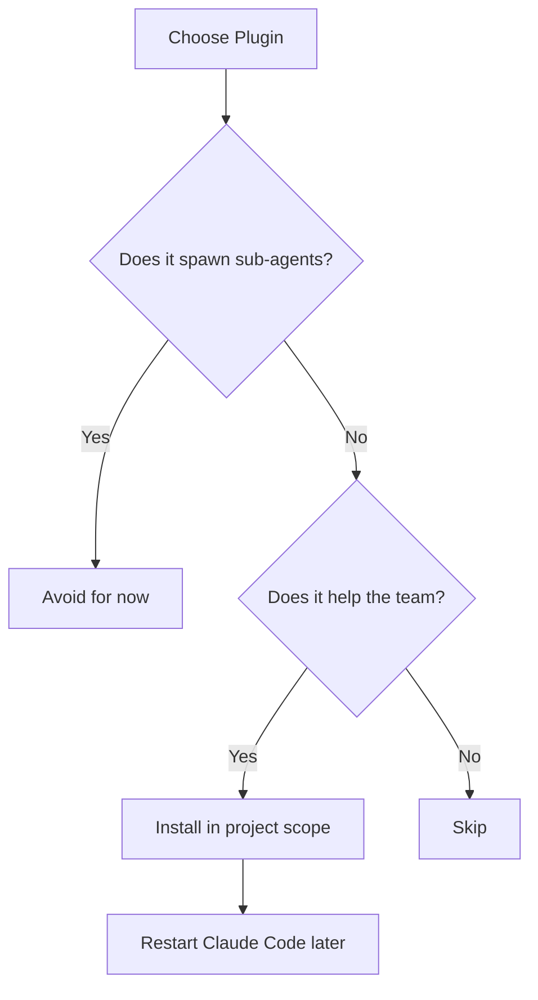
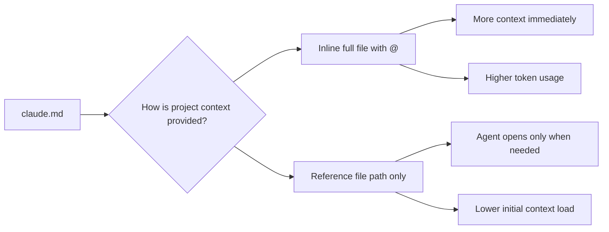
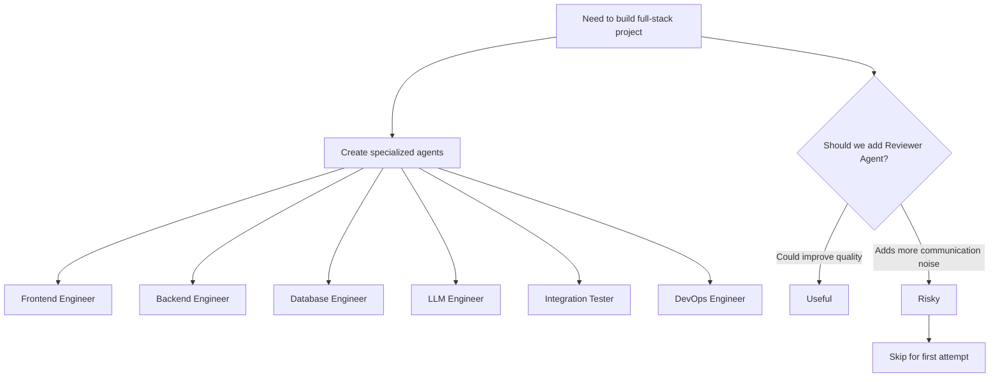
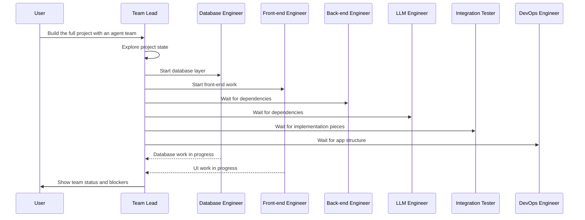
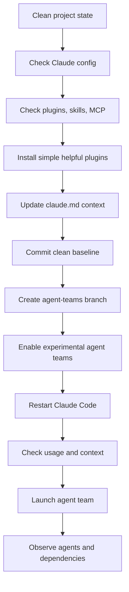

# 084 - Day 4 - Setting Up Claude Code Agent Teams for Full-Stack Development

## Lesson Information

| Item     | Details                                                       |
| -------- | ------------------------------------------------------------- |
| Lesson   | 084                                                           |
| Duration | 10 min                                                        |
| Week     | Week 3 - Agentic Engineering Frontier                         |
| Module   | Week 3 Day 4 - Agent Teams, GSD, Multi-Agent Build            |
| Topic    | Setting up Claude Code Agent Teams for full-stack development |

---

## Main Idea

This lesson demonstrates how to set up **Claude Code Agent Teams** for a full-stack development project.

Instead of asking one coding agent to build everything, the project is divided across specialized agents:

* Front-end engineer
* Back-end engineer
* Database engineer
* LLM engineer
* Integration tester
* DevOps engineer

The goal is to let multiple agents work in parallel while keeping the project organized, controlled, and recoverable through Git.

---

## Learning Objectives

After this lesson, learners should be able to:

* Understand how Claude Code Agent Teams can support full-stack development.
* Prepare a clean project baseline before launching multiple agents.
* Configure Claude Code to enable experimental agent team mode.
* Define clear team roles for a multi-agent build.
* Understand why too many agents can create unnecessary communication noise.
* Use Git branches to safely experiment with agent teams.
* Observe and navigate between active agents during execution.

---

## Why This Lesson Matters

Agent teams are useful when a project has multiple independent areas of work.

A full-stack application often includes:

* UI and front-end logic
* API and business logic
* Database schema and persistence
* LLM integration
* Tests
* Docker and deployment setup
* Documentation

A single agent can become overloaded with too much context. Agent teams allow the work to be divided into smaller, more focused responsibilities.

However, agent teams also increase complexity. More agents mean more coordination, more potential conflicts, and more communication overhead. This lesson shows how to start carefully with a clean setup and controlled team roles.

---

## Project Preparation

Before starting the agent team, the project is cleaned up and reviewed.

The instructor checks the Claude Code configuration directory.

Typical project structure:

```txt
.claude/
├── agents/
├── commands/
├── skills/
│   └── cerebras-inference/
├── settings.json
└── settings.local.json
```

The goal is to keep the project as vanilla and simple as possible before enabling agent teams.

---

## Initial Project State

| Area           | Status                                |
| -------------- | ------------------------------------- |
| Agents         | Empty                                 |
| Commands       | Empty                                 |
| Skills         | One existing Cerebras inference skill |
| Settings       | Mostly empty                          |
| Local settings | Contains allowed actions              |
| Sandbox        | Off                                   |
| GitHub Actions | Present but not used in this lesson   |
| MCP servers    | None installed                        |
| Plugins        | None installed initially              |

This gives the project a clean starting point.

---

## Why Start From a Clean Baseline?

Before launching multiple agents, it is important to reduce unnecessary complexity.

A clean baseline helps avoid:

* Confusing tool behavior
* Hidden plugin side effects
* Unexpected MCP server actions
* Unclear project state
* Difficult debugging
* Merge conflicts caused by uncontrolled changes

The instructor wants the agent team behavior to be easy to observe and reason about.

---

## Plugin Selection Strategy

The instructor installs only simple plugins that help agents perform better without spawning their own sub-agents.

Plugins that create additional agents are avoided because they can make the system harder to control.

### Installed Plugins

| Plugin                  | Purpose                                                                                         |
| ----------------------- | ----------------------------------------------------------------------------------------------- |
| Front-end design plugin | Helps agents build more production-grade front-end UI instead of generic LLM-looking interfaces |
| Context7 plugin         | Provides up-to-date information about current APIs and libraries                                |
| Playwright plugin       | Allows agents to run browser-based tests with Playwright                                        |

### Avoided Plugins

The instructor avoids more sophisticated plugins such as feature-development or code-simplifier plugins if they might spawn sub-agents.

Reason:

> The goal is to keep the agent team understandable. Adding plugins that create their own agents could introduce too much noise.

---

## Plugin Decision Diagram



---

## Updating Project Context with `claude.md`

The project already has a `claude.md` file that provides context to Claude Code.

The instructor updates it to clarify the project state.

Example updated context:

```md
The key document is `plan.md`, included and filled below.

The market data components are already completed. They are summarized in this file, with more details in the related folder. Consult these docs only when required.

The remainder of the platform is still to be developed.
```

---

## Important Context Strategy

The lesson highlights the difference between two ways of providing context:

### 1. Inline Context

Using an `@` reference can insert the full content of a file into the context immediately.

Example:

```txt
@plan.md
```

This gives the agent the entire file right away.

### 2. Path-Based Context

Providing a file path lets the agent open it only when needed.

Example:

```md
See `docs/market-data-summary.md` for more details.
```

This supports progressive context loading.

---

## Context Loading Strategy



---

## Git Housekeeping

Before enabling agent teams, the instructor commits the current work.

Typical commands:

```bash
git status
git add .
git commit -m "ready for teams"
git push
```

This creates a safe restore point.

Then a new branch is created for the agent team experiment:

```bash
git checkout -b agent-teams
```

This allows the team-based build to happen separately from the stable baseline.

---

## Why Use a Separate Branch?

A separate branch is important because agent teams can make many changes quickly.

Benefits:

* Easy rollback
* Safe experimentation
* Cleaner review process
* Ability to compare before and after
* Reduced risk to the main development branch

---

## Enabling Claude Code Agent Teams

The instructor updates `settings.json` to enable experimental agent teams.

Example configuration:

```json
{
  "env": {
    "CLAUDE_CODE_EXPERIMENTAL_AGENT_TEAMS": "1"
  },
  "teamMode": "in-process"
}
```

### Key Settings

| Setting                                | Meaning                                              |
| -------------------------------------- | ---------------------------------------------------- |
| `CLAUDE_CODE_EXPERIMENTAL_AGENT_TEAMS` | Enables experimental agent team functionality        |
| `teamMode`                             | Controls how the team runs                           |
| `in-process`                           | Runs the team inside the current Claude Code process |

After this change, Claude Code should be restarted so the settings and plugins take effect.

---

## Pre-Launch Checks

Before launching the team, the instructor checks usage and context.

### Usage Check

Command:

```txt
/usage
```

This checks quota usage before starting a potentially expensive multi-agent task.

### Context Check

Command:

```txt
/context
```

This shows how much context is being used and which tools are loaded.

The instructor notices that the Playwright plugin adds many tools, but decides to continue because it may be useful for integration testing.

---

## Agent Team Prompt

The instructor asks Claude Code to create an agent team to build the entire project.

The requested team members are:

| Agent              | Responsibility                                           |
| ------------------ | -------------------------------------------------------- |
| Front-end engineer | Build the user interface and front-end application       |
| Back-end engineer  | Build APIs and server-side logic                         |
| Database engineer  | Build database schema, persistence, and database code    |
| LLM engineer       | Implement LLM calls, preferably using the Cerebras skill |
| Integration tester | Test the system across components                        |
| DevOps engineer    | Build Docker and containerization setup                  |

---

## Why No Code Reviewer Agent?

The instructor considered adding a code reviewer agent but decided not to.

Reason:

A reviewer agent would need to communicate with every other agent. This could create too much back-and-forth discussion and slow the team down.

This is an important design decision.

More agents are not always better.

---

## Agent Team Design Principle



---

## Launching the Team

Before submitting the command, the instructor switches modes using `Shift + Tab`.

The target mode is:

```txt
Accept edits on
```

This allows Claude Code to apply file changes automatically.

Once launched, Claude Code begins by:

1. Exploring the current project state.
2. Understanding the existing plan.
3. Creating the team.
4. Assigning tasks.
5. Spawning team members.
6. Running agents based on dependencies.

---

## Team Execution Flow



---

## Observing the Team

Once the team starts, Claude Code shows active agents.

The instructor sees:

* Team lead
* Database engineer
* Front-end engineer

Other agents are waiting because their tasks depend on earlier work.

This means the team is not just running randomly. It is creating a dependency-aware project plan.

---

## Dependency-Aware Agent Work

Some agents can start immediately.

Others should wait.

Example:

| Agent              | Can Start Immediately? | Reason                                           |
| ------------------ | ---------------------: | ------------------------------------------------ |
| Database engineer  |                    Yes | Database schema and persistence can begin early  |
| Front-end engineer |                    Yes | UI structure can begin early                     |
| Back-end engineer  |              Partially | May depend on database shape                     |
| LLM engineer       |              Partially | May depend on app architecture                   |
| Integration tester |                  Later | Needs components to exist first                  |
| DevOps engineer    |                  Later | Needs project structure and runtime requirements |

---

## Navigating Between Agents

The instructor uses keyboard shortcuts to move between agents.

Example:

```txt
Shift + Up
Shift + Down
```

This allows the user to switch between:

* Team lead
* Database engineer
* Front-end engineer
* Hidden view

This is useful because multiple agents may be working at the same time.

---

## Practical Workflow Summary



---

## Key Concepts

### 1. Agent Teams

Agent teams allow a complex software project to be split across multiple specialized agents.

Instead of one agent handling everything, each agent focuses on a specific area.

Example:

```txt
Frontend Agent → UI
Backend Agent → APIs
Database Agent → Persistence
LLM Agent → AI calls
Tester Agent → Validation
DevOps Agent → Containers
```

---

### 2. Project Baseline

Before launching agents, create a stable baseline with Git.

This helps recover from mistakes.

Recommended baseline workflow:

```bash
git status
git add .
git commit -m "ready for teams"
git push
git checkout -b agent-teams
```

---

### 3. Controlled Tooling

Plugins should be selected carefully.

Good plugins:

* Add useful knowledge
* Improve UI quality
* Enable testing
* Do not create uncontrolled sub-agents

Risky plugins:

* Spawn their own agents
* Add too much hidden behavior
* Increase communication complexity
* Make debugging harder

---

### 4. Progressive Context Loading

Agents do not need every document immediately.

It is often better to reference files by path and let agents open them when needed.

This reduces context overload.

---

### 5. Communication Noise

More agents can create more coordination overhead.

Adding a code reviewer agent may sound useful, but it can also cause too much conversation between agents.

A good agent team should be large enough to divide work, but small enough to remain controllable.

---

## Recommended Agent Team for Full-Stack Development

| Role               | Main Tasks                                       | Output                 |
| ------------------ | ------------------------------------------------ | ---------------------- |
| Team Lead          | Plan work, coordinate dependencies, assign tasks | Execution plan         |
| Front-end Engineer | Build UI, components, pages, styling             | Front-end code         |
| Back-end Engineer  | Build APIs, services, business logic             | Server code            |
| Database Engineer  | Design schema, migrations, persistence           | Database layer         |
| LLM Engineer       | Add LLM calls and AI features                    | AI integration         |
| Integration Tester | Run end-to-end and integration tests             | Test reports and fixes |
| DevOps Engineer    | Dockerize app and configure runtime              | Docker setup           |

---

## Best Practices

### Do

* Start from a clean project state.
* Check existing plugins, skills, and MCP servers.
* Keep only useful and predictable tools.
* Commit before starting.
* Use a separate branch.
* Give agents clear roles.
* Let the team lead manage dependencies.
* Monitor what agents are doing.
* Avoid adding too many agents at once.

### Avoid

* Starting agent teams on a messy branch.
* Installing too many plugins.
* Using plugins that spawn hidden sub-agents.
* Giving all agents the same vague task.
* Adding reviewer agents too early.
* Skipping Git checkpoints.
* Letting agents modify everything without review.

---

## Example Team Launch Prompt

```txt
Create an agent team to build the entire project.

Team members:
- Front-end engineer: work on the front-end.
- Back-end engineer: work on the API and server logic.
- Database engineer: handle all database code.
- LLM engineer: implement LLM calls, preferably using the Cerebras skill.
- Integration tester: verify the system works across components.
- DevOps engineer: create the Docker container and runtime setup.

All engineers should write unit tests for their own work.
Coordinate dependencies carefully and keep the implementation simple.
```

---

## Common Risks

| Risk                 | Description                                  | Mitigation                                 |
| -------------------- | -------------------------------------------- | ------------------------------------------ |
| Too many agents      | More communication and coordination overhead | Start with a small team                    |
| Merge conflicts      | Multiple agents edit overlapping files       | Use clear file ownership                   |
| Context overload     | Agents consume too much context early        | Use progressive context loading            |
| Plugin complexity    | Plugins may add too many tools or behaviors  | Install only simple plugins                |
| Poor task boundaries | Agents duplicate or conflict with each other | Define roles clearly                       |
| Weak testing         | Agents may build without verifying           | Add tester role and unit test expectations |

---

## Lesson Takeaways

* Claude Code Agent Teams can divide a full-stack project into specialized workstreams.
* A clean project baseline is essential before starting multi-agent work.
* Git commits and branches are safety tools for agentic development.
* Plugins should be chosen carefully to avoid losing control.
* More agents do not always mean better results.
* A good team setup balances specialization, coordination, and simplicity.
* Dependency-aware execution helps agents work in the right order.
* Monitoring agents during execution is part of the workflow.

---

## Practice Exercise

Set up a small full-stack project and prepare it for agent team development.

### Step 1: Clean the Project

Check:

```bash
git status
```

Review:

```txt
.claude/
├── agents/
├── commands/
├── skills/
├── settings.json
└── settings.local.json
```

### Step 2: Commit a Baseline

```bash
git add .
git commit -m "ready for agent teams"
git push
```

### Step 3: Create a Branch

```bash
git checkout -b agent-teams
```

### Step 4: Enable Agent Teams

Update `settings.json`:

```json
{
  "env": {
    "CLAUDE_CODE_EXPERIMENTAL_AGENT_TEAMS": "1"
  },
  "teamMode": "in-process"
}
```

### Step 5: Launch a Small Team

Start with only three agents:

```txt
Create an agent team with:
- Front-end engineer
- Back-end engineer
- Integration tester

Build a small working feature and keep the implementation simple.
```

### Step 6: Review the Result

Check:

```bash
git status
git diff
npm test
```

Then decide whether to continue, revise, or reset.

---

## Final Summary

In this lesson, the instructor prepares a full-stack project for Claude Code Agent Teams.

The workflow begins with cleanup, plugin review, context updates, Git housekeeping, and a safe experiment branch. Then experimental agent team mode is enabled through `settings.json`.

The agent team is designed with clear roles: front-end, back-end, database, LLM, testing, and DevOps. The instructor intentionally avoids adding a reviewer agent at first because it may create too much communication noise.

The key lesson is that multi-agent development is powerful, but it must be controlled. A good setup requires clean context, clear responsibilities, safe Git practices, and careful monitoring.

---

# Bài luyện tập

## Mục tiêu


## Đề bài


## Yêu cầu hoàn thành

- [ ] 
- [ ] 
- [ ] 

## Kết quả / lời giải


## Ghi chú
