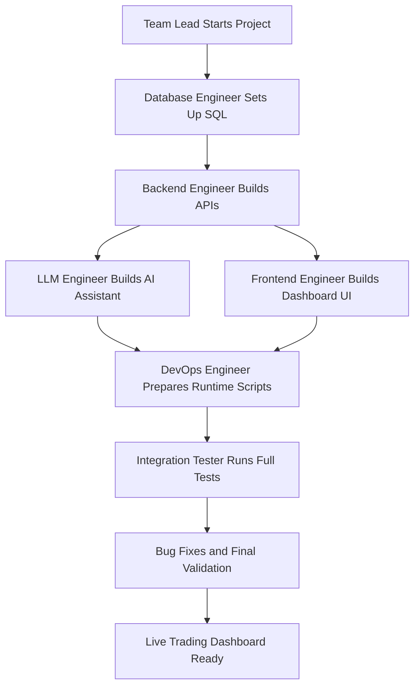
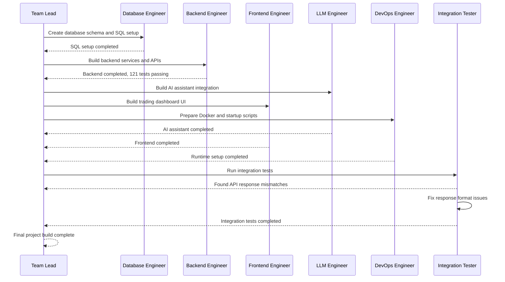
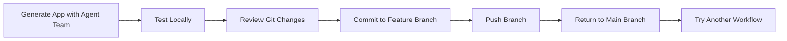
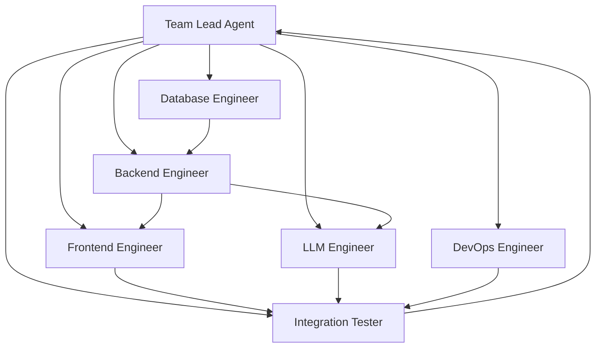

# 085 - Day 4 - Multi-Agent Team Build: Live Trading Dashboard with Claude Opus

## Lesson Information

| Item       | Details                                                                     |
| ---------- | --------------------------------------------------------------------------- |
| Lesson     | 085                                                                         |
| Duration   | 14 minutes                                                                  |
| Week       | Week 3 - Agentic Engineering Frontier                                       |
| Module     | Week 3 Day 4 - Agent Teams, GSD, Multi-Agent Build                          |
| Main Topic | Building a live trading dashboard with a multi-agent team using Claude Opus |

---

## Lesson Overview

This lesson demonstrates how a **multi-agent engineering team** can build a functional live trading dashboard from scratch.

Instead of using one coding agent for the entire project, the workflow is divided across several specialized agents:

* A **Team Lead** coordinates the workflow.
* A **Database Engineer** sets up the data layer.
* A **Backend Engineer** builds APIs and business logic.
* A **Frontend Engineer** creates the dashboard UI.
* An **LLM Engineer** connects AI assistant behavior.
* A **DevOps Engineer** handles scripts, Docker, and runtime setup.
* An **Integration Tester** verifies that all parts work together.

The final result is a working trading dashboard with fake live market data, a portfolio view, watchlist, heatmap, and an AI assistant capable of performing basic trading actions.

---

## Learning Objectives

By the end of this lesson, learners should be able to:

* Understand how a multi-agent team can divide a complex software project into specialized tasks.
* Observe how agent orchestration can be more serial or parallel depending on the prompt and coordination strategy.
* Recognize the importance of permission approval when agents run commands.
* Understand how integration testing catches mismatches between backend and frontend.
* Evaluate the strengths and limitations of zero-shot multi-agent software builds.
* Apply multi-agent patterns to their own coding workflows.

---

## Key Concepts

### 1. Multi-Agent Team Orchestration

A multi-agent team allows different agents to take responsibility for different parts of a project.

In this demo, each agent acts like a role in a real software engineering team:

| Agent Role         | Responsibility                                     |
| ------------------ | -------------------------------------------------- |
| Team Lead          | Coordinates the team and tracks task completion    |
| Database Engineer  | Creates SQL setup and database structure           |
| Backend Engineer   | Builds APIs and backend services                   |
| Frontend Engineer  | Builds the dashboard interface                     |
| LLM Engineer       | Implements the AI assistant logic                  |
| DevOps Engineer    | Handles scripts, Docker, and startup workflow      |
| Integration Tester | Runs end-to-end tests and fixes integration issues |

The key idea is that a complex project can be broken into smaller, role-based tasks, allowing agents to work with clearer context and responsibility.

---

### 2. Serial vs Parallel Agent Execution

The instructor expected more agents to run in parallel at the beginning, but the workflow turned out to be more serial than expected.

For example:

1. The Database Engineer completed the SQL setup.
2. The Backend Engineer started after the database work was complete.
3. The LLM Engineer started after backend progress unblocked it.
4. Frontend, LLM, and DevOps agents later ran at the same time.
5. The Integration Tester ran near the end.

This serial behavior was actually useful because it reduced chaos and created a more managed workflow.



---

### 3. Permission Approval and Safety

The instructor did not use full YOLO mode because the project was running in a local environment, not inside a sandbox.

This matters because agents may request permission to run commands such as:

```bash
chmod
docker build
scripts/start_mac.sh
scripts/stop_mac.sh
git add .
git commit
git push
```

Some commands are safe to approve repeatedly, while others should be approved only once.

For example:

| Command Type                             | Recommended Approval Behavior                    |
| ---------------------------------------- | ------------------------------------------------ |
| Running tests                            | Can often be approved more broadly               |
| Changing script permissions with `chmod` | Better to approve case by case                   |
| Docker build commands                    | Usually acceptable, but should still be reviewed |
| Git commands                             | Should be reviewed carefully                     |
| File deletion or destructive commands    | Require extra caution                            |

The key lesson is that human oversight remains important, especially when several agents are running tools at the same time.

---

## Multi-Agent Build Workflow

The project followed a workflow similar to a real engineering team.



---

## What the Agents Built

The final app was a live trading dashboard with several major features.

### Dashboard Features

| Feature           | Description                                                  |
| ----------------- | ------------------------------------------------------------ |
| Market Watchlist  | Displays live-updating fake market data                      |
| Portfolio         | Shows current holdings and available cash                    |
| Trade Actions     | Allows buying and selling stocks                             |
| Portfolio Heatmap | Visualizes position weight and performance                   |
| AI Assistant      | Accepts natural language trading-related commands            |
| Persistence       | The app can be reopened and continue from the previous state |
| Runtime Scripts   | Includes start and stop scripts for local execution          |

---

## Demo Result

The instructor started the app using:

```bash
scripts/start_mac.sh
```

The app opened at a local server, likely around:

```bash
localhost:8000
```

The dashboard included:

* A market data watchlist on the left.
* Flashing real-time price movement.
* A portfolio panel with initial cash.
* A heatmap showing holdings.
* A portfolio P&L chart.
* An AI assistant panel.

The instructor tested actions such as:

```text
Buy JPMorgan stock
Buy Google stock
Add SPY to the watchlist
Buy one share of V
Give me some trading advice
Please do this for me
```

The AI assistant successfully executed some actions, such as:

* Adding SPY to the watchlist.
* Buying one share of Visa.
* Selling shares as part of a rebalancing action.

---

## Integration Testing Findings

The Integration Tester found several issues before the final app was considered complete.

### Main Issue

The tester found **five API response mismatches** that caused a frontend crash.

This is a realistic full-stack bug: the backend response format did not fully match what the frontend expected.

### Fix Pattern

Instead of delegating the bug back to the original frontend or backend agent, the Integration Tester fixed the response format mismatches directly.

This raised an interesting orchestration question:

> Should the integration tester fix bugs directly, or should the team lead delegate bugs back to the original responsible agent?

Both approaches can work, but they have different trade-offs.

| Approach                            | Benefit                      | Risk                          |
| ----------------------------------- | ---------------------------- | ----------------------------- |
| Integration Tester fixes directly   | Faster final resolution      | Tester may lack full context  |
| Original agent fixes the issue      | Better ownership and context | Slower coordination           |
| Team Lead assigns based on bug type | More structured              | Requires better orchestration |

---

## Final App Evaluation

The app worked impressively well for a zero-shot multi-agent build.

### What Worked Well

* The multi-agent workflow completed the project.
* The backend had a strong test result: 121 passing tests.
* The dashboard was visually dynamic.
* The fake market data updated live.
* The AI assistant could trigger actions.
* Portfolio state persisted after reopening the app.
* Git ignored unnecessary files correctly.
* No obvious sensitive `.env` file was committed.

### What Needed Improvement

* Some chart areas did not fully populate.
* The portfolio P&L chart appeared unclear at first.
* The AI assistant’s trading advice was not always logically ideal.
* The rebalancing action may not have matched the user’s real intention.
* Some UI sections had minor layout issues.
* The system was impressive, but still needed human review.

---

## Git Workflow Used

After testing the app, the instructor committed the generated project to a new branch.

```bash
git status
git add .
git status
git commit -m "agent teams v1"
git push origin agent-teams
```

Then the instructor returned to the main branch:

```bash
git checkout main
```

This demonstrated an important workflow pattern:



Using Git makes it easy to preserve one agent-generated version while returning to a clean baseline for another experiment.

---

## Practical Lessons

### 1. Multi-agent teams can build surprisingly complete apps

The demo shows that a team of specialized coding agents can produce a working full-stack app with backend, frontend, AI features, tests, Docker setup, and scripts.

---

### 2. Strong orchestration matters

The team lead agent played a crucial role by deciding:

* Which agent should run next.
* Which tasks depended on previous tasks.
* When to spawn additional agents.
* When to run integration testing.
* When the project was complete.

Without orchestration, multi-agent development can become chaotic.

---

### 3. More parallelism is not always better

Running everything in parallel may sound faster, but it can create problems:

* Agents may make conflicting assumptions.
* Backend and frontend contracts may diverge.
* Merge conflicts become more likely.
* Integration testing becomes harder.

A more serial workflow can produce better results when the project has strong dependencies.

---

### 4. Human approval is still essential

Even with advanced agents, the human developer should still review commands, especially when agents request permissions.

This is especially important for:

* Permission changes.
* Docker operations.
* Git operations.
* File system changes.
* Any command that could affect the local machine.

---

### 5. Integration testing is non-negotiable

The app had multiple working parts, but a frontend crash still happened because of API response mismatches.

This proves that unit tests alone are not enough. Full-stack integration tests are necessary when agents build separate modules.

---

## Suggested Multi-Agent Team Prompt Pattern

A good prompt for this type of workflow should define:

```text
You are the Team Lead for a multi-agent software build.

Build a live trading dashboard with:
- Fake real-time market data
- Portfolio tracking
- Buy/sell simulation
- Watchlist
- Heatmap visualization
- AI assistant for portfolio actions
- Backend API
- Frontend dashboard
- Database schema
- Tests
- Docker/local run scripts

Assign work to specialized agents:
- Database Engineer
- Backend Engineer
- Frontend Engineer
- LLM Engineer
- DevOps Engineer
- Integration Tester

Prefer structured execution over chaotic parallelism.
Run tests after each major component.
Use integration testing before final completion.
Ask for human approval before risky commands.
```

---

## Recommended Agent Team Structure



---

## Key Takeaways

* Multi-agent coding teams can build full-stack applications with impressive speed.
* Specialized agents help preserve context and reduce cognitive overload.
* Serial execution can be safer and more reliable than maximum parallelism.
* Permission approval is an important part of safe agentic engineering.
* Integration testing is critical because separately built modules often disagree.
* Human review is still required before trusting or deploying agent-generated code.
* Git branches make it easy to experiment with zero-shot builds without damaging the main codebase.

---

## Summary

In this lesson, a multi-agent team built a live trading dashboard using Claude Opus. The project included fake real-time market data, a dashboard UI, backend APIs, an AI assistant, DevOps scripts, tests, and integration validation.

The workflow showed both the promise and the complexity of agent teams. The agents successfully completed a working app, but human supervision, command approval, integration testing, and Git-based version control remained essential.

The most important lesson is that multi-agent development is not just about launching many agents at once. It is about coordinating them carefully, defining clear responsibilities, managing dependencies, testing the result, and keeping the human developer in control.
