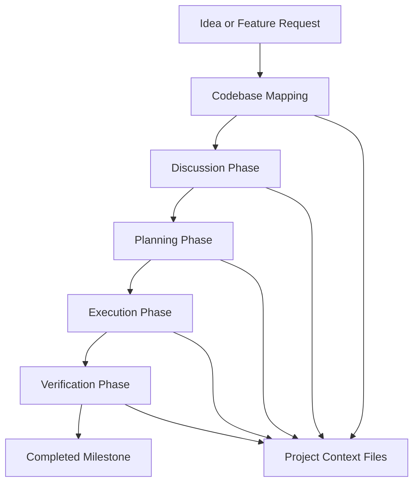
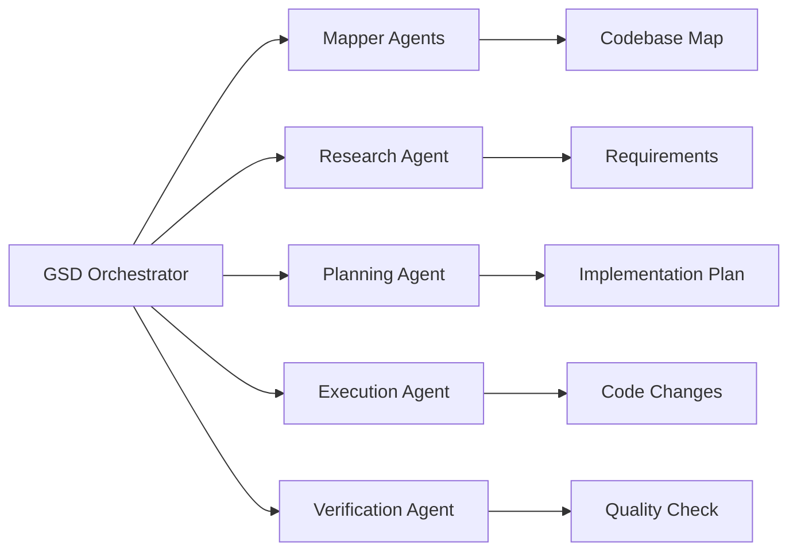
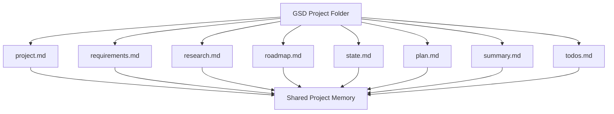
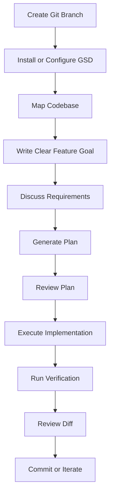

# 086 - Day 4 - GSD: Spec-Driven Design Meets Multi-Agent Orchestration

## Lesson Information

| Item       | Details                                            |
| ---------- | -------------------------------------------------- |
| Lesson     | 086                                                |
| Duration   | 13 min                                             |
| Week       | Week 3 - Agentic Engineering Frontier              |
| Module     | Week 3 Day 4 - Agent Teams, GSD, Multi-Agent Build |
| Main Topic | GSD, Spec-Driven Design, Multi-Agent Orchestration |

---

## Lesson Overview

This lesson introduces **GSD**, a workflow that combines **spec-driven design** with **multi-agent orchestration**.

Instead of asking an AI coding agent to directly build a feature from a vague prompt, GSD encourages a more structured process:

1. Understand the project.
2. Map the existing codebase.
3. Discuss the desired feature.
4. Create a plan.
5. Execute the implementation.
6. Verify the result.

The key idea is simple: **clear specs reduce chaos**.

When multiple agents are working together, each part of the system needs a clear contract. GSD provides an opinionated structure that helps AI agents maintain context, avoid confusion, and produce more reliable results.

---

## Learning Objectives

By the end of this lesson, students should be able to:

* Understand what GSD is and how it relates to spec-driven design.
* Explain why clear specs are important when using coding agents.
* Understand how GSD helps reduce context rot.
* Describe the main GSD workflow: map, discuss, plan, execute, verify.
* Compare GSD with less structured “vibe coding” approaches.
* Apply a spec-first mindset to multi-agent software development.

---

## Core Idea

GSD is a structured approach for building software with AI coding agents.

It combines:

* **Spec-driven design**
* **Context engineering**
* **Pre-built prompts**
* **Agent orchestration**
* **Project state tracking through markdown files**

Instead of relying on one long prompt and hoping the AI understands everything, GSD breaks the process into controlled stages.



---

## Why GSD Matters

Traditional AI coding often becomes unreliable when the task grows larger.

Common problems include:

* The agent forgets earlier instructions.
* The context window becomes overloaded.
* The implementation drifts away from the original goal.
* Different parts of the codebase become inconsistent.
* The agent starts making assumptions without checking the architecture.
* The final result may work partially but fail at scale.

GSD tries to solve this by introducing a more disciplined process.

The lesson emphasizes that **multi-agent development needs structure**. Without clear specifications and contracts, multiple agents can easily create conflicting or incomplete work.

---

## Key Concepts

### 1. Spec-Driven Design

Spec-driven design means creating a clear specification before implementation.

A good spec describes:

* What should be built
* Why it should be built
* How users should interact with it
* What constraints must be respected
* What the acceptance criteria are
* What files or modules may be affected

In AI coding workflows, the spec becomes the shared source of truth for all agents.

---

### 2. Context Engineering

Context engineering is the practice of managing what information the AI sees and uses.

GSD focuses heavily on preventing **context rot**, which happens when the AI’s working context becomes too large, stale, noisy, or inconsistent.

Instead of letting the conversation history become the only memory, GSD stores project state in structured markdown files.

---

### 3. Multi-Agent Orchestration

Multi-agent orchestration means coordinating multiple agents to work on different parts of a project.

In this lesson, GSD is described as similar to agent teams, but more opinionated.

It provides predefined commands, prompts, agents, and file structures to guide the process.



---

## GSD Compared to Simple Vibe Coding

| Approach           | Description                                                  | Risk                                        |
| ------------------ | ------------------------------------------------------------ | ------------------------------------------- |
| Vibe Coding        | Describe what you want and let the AI generate code directly | High risk of inconsistent or fragile output |
| Spec-Driven Design | Define the desired behavior before coding                    | More reliable, but can feel slow            |
| GSD                | Combines specs, context engineering, and agent orchestration | More structured and scalable                |

GSD is useful when the project is too complex for a single prompt but not large enough to require a full enterprise-style engineering process.

---

## GSD Workflow

GSD uses a staged workflow.

### 1. Start a New Project

The first step is to initialize the GSD process.

Example command:

```bash
/gsd:new-project
```

This starts the project setup and may ask whether the codebase should be mapped first.

---

### 2. Map the Codebase

GSD can spawn multiple mapper agents in parallel.

Their job is to understand:

* Project structure
* Existing architecture
* Important files
* Conventions
* Documentation
* Current implementation state

This gives later agents better context before they start building.

---

### 3. Discuss the Phase

The discussion phase is where the user clarifies what they want to build.

Example command:

```bash
/gsd:discuss
```

This phase shapes the feature before implementation.

The goal is to reduce ambiguity before the agent writes code.

---

### 4. Plan the Phase

The planning phase turns the discussion into a concrete implementation plan.

Example command:

```bash
/gsd:plan
```

A good plan may include:

* Files to modify
* Components to create
* Data flow
* API contracts
* UI behavior
* Testing strategy
* Verification checklist

---

### 5. Execute the Plan

The execution phase asks the agent system to implement the planned work.

Example command:

```bash
/gsd:execute
```

At this point, the agents should not be improvising from scratch. They should be following the agreed plan.

---

### 6. Verify the Result

The verification phase checks whether the implementation matches the plan.

Example command:

```bash
/gsd:verify
```

Verification may include:

* Running tests
* Checking code quality
* Reviewing feature behavior
* Comparing the result against the spec
* Identifying missing requirements
* Preparing the next milestone

---

## Main GSD Commands Mentioned

| Command                   | Purpose                                     |
| ------------------------- | ------------------------------------------- |
| `/gsd:help`               | Shows available GSD commands                |
| `/gsd:new-project`        | Initializes a new GSD project workflow      |
| `/gsd:settings`           | Configures model quality and agent behavior |
| `/gsd:discuss`            | Shapes the feature or implementation phase  |
| `/gsd:plan`               | Creates a concrete implementation plan      |
| `/gsd:execute`            | Executes the planned work                   |
| `/gsd:verify`             | Verifies the result                         |
| `/gsd:quick`              | Runs a faster version of the workflow       |
| `/gsd:map-codebase`       | Maps the existing codebase                  |
| `/gsd:audit-milestone`    | Audits progress on a milestone              |
| `/gsd:complete-milestone` | Marks a milestone as complete               |
| `/gsd:new-milestone`      | Starts another milestone                    |

---

## Project State Files

GSD maintains project state using markdown files.

These files help the system remember what has been discussed, planned, and completed.

Typical files include:

| File              | Purpose                               |
| ----------------- | ------------------------------------- |
| `project.md`      | Overall project description           |
| `research.md`     | Research and investigation notes      |
| `requirements.md` | Functional and technical requirements |
| `roadmap.md`      | Milestones and long-term direction    |
| `state.md`        | Current project state                 |
| `plan.md`         | Implementation plan                   |
| `summary.md`      | Summary of progress                   |
| `todos.md`        | Remaining tasks                       |



---

## Demo Flow in the Lesson

The instructor demonstrates a fresh GSD setup.

### Step 1: Reset the Frontend Folder

The existing frontend folder is deleted and recreated to ensure the project starts cleanly.

This avoids accidentally giving the agent hints from old generated files.

---

### Step 2: Check Claude Settings

The instructor checks the `.cloud/settings.json` file to confirm the previous experimental settings are not active.

---

### Step 3: Create a New Git Branch

A new branch is created for the GSD experiment.

```bash
git checkout -b finally-gsd
```

This isolates the GSD workflow from previous experiments.

---

### Step 4: Install GSD

The GSD installer is run.

During installation, the user chooses:

* Runtime: Claude Code
* Installation scope: local project

The installer creates files and folders such as:

* Agents
* Commands
* Hooks
* GSD project structure

---

### Step 5: Open Claude Code

After installation, Claude Code is launched.

The instructor checks the available GSD context and confirms that GSD commands are now available.

---

### Step 6: Commit the Initial GSD Setup

Before running the full workflow, the instructor commits the current setup.

```bash
git add .
git commit -m "Start of GSD process"
```

This provides a checkpoint in case the experiment needs to be reset.

---

### Step 7: Start the GSD Project

The instructor runs:

```bash
/gsd:new-project
```

GSD asks whether the codebase should be mapped first.

The instructor chooses yes.

GSD then spawns multiple mapper agents in parallel to analyze the project.

---

### Step 8: Configure GSD Settings

The instructor runs:

```bash
/gsd:settings
```

The model quality is set to the highest quality option.

The instructor enables:

* Plan researcher
* Plan checker
* Execution verifier

This ensures the workflow uses stronger reasoning and review support.

---

## Important Safety Note

GSD recommends using a skip-permissions mode for speed, but the instructor avoids doing this locally.

The lesson reinforces an important safety principle:

> Dangerous or automatic permission modes should be used only in a safe sandbox environment.

For local development, manual approvals are safer.

---

## Practical Takeaways

* GSD is useful when building features that need more structure than a single prompt.
* Spec-driven design helps agents follow a clear target.
* Multi-agent orchestration works better when every agent has a defined role.
* Markdown state files help prevent context loss.
* Codebase mapping gives agents better awareness before implementation.
* Verification is essential when AI agents write code.
* For risky autonomous workflows, use a sandbox.

---

## Recommended Workflow for Students

When using GSD or a similar system, follow this pattern:



---

## Example Feature Spec Template

Students can use this simple template before running a coding agent:

```markdown
# Feature Spec

## Feature Name

Describe the feature in one sentence.

## Goal

Explain why this feature is needed.

## User Flow

1. User does this.
2. System responds with that.
3. User sees the final result.

## Requirements

- Requirement 1
- Requirement 2
- Requirement 3

## Technical Constraints

- Follow existing architecture.
- Do not rewrite unrelated modules.
- Use existing UI components where possible.
- Keep changes small and reviewable.

## Acceptance Criteria

- The feature works as described.
- Existing tests still pass.
- No unrelated files are modified.
- The implementation is easy to review.
```

---

## Reflection Questions

1. Why does multi-agent development become chaotic without clear specs?
2. What is context rot, and how does GSD try to reduce it?
3. How is GSD different from simply asking an AI agent to build a feature?
4. Why is codebase mapping useful before implementation?
5. When should skip-permissions mode be avoided?
6. How can markdown project state files improve agent reliability?

---

## Summary

In this lesson, students learn how **GSD** combines **spec-driven design**, **context engineering**, and **multi-agent orchestration** into a structured workflow for AI-assisted development.

The lesson shows that as AI coding workflows become more powerful, they also need stronger process control. A clear spec, a mapped codebase, a planned implementation, and a verification phase all help reduce chaos.

GSD is presented as an opinionated alternative to less structured agent teams. It gives AI agents a clearer operating system for building real software projects.

The main lesson is:

> Better specs create better agent behavior.
> Better orchestration creates more reliable software.
