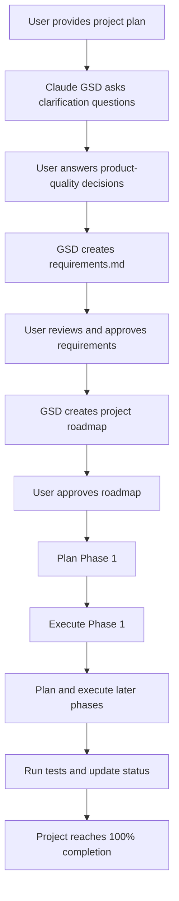
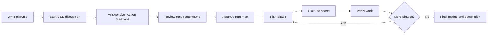

# 087 - Day 4 - Building a Trading Platform with Claude GSD: A 5-Hour Deep Dive

## Lesson Information

| Item     | Details                                            |
| -------- | -------------------------------------------------- |
| Lesson   | 087                                                |
| Duration | 10 min                                             |
| Week     | Week 3 - Agentic Engineering Frontier              |
| Module   | Week 3 Day 4 - Agent Teams, GSD, Multi-Agent Build |

---

## Main Topic

This lesson is a deep dive into building a full trading platform using **Claude GSD**.

The workflow moves from a written specification to full implementation, including:

* Breaking down a complex trading platform into manageable phases
* Letting Claude GSD generate requirements and a roadmap
* Managing multiple agent-driven implementation tasks
* Reviewing intermediate documents before execution
* Running tests and integration checks
* Comparing GSD with previous multi-agent team workflows

The key lesson is that **GSD is much more controlled, structured, and disciplined than a loose multi-agent team**, but it can also be much slower and more token-intensive.

---

## Learning Objectives

By the end of this lesson, students should be able to:

* Understand how Claude GSD turns a project specification into an implementation plan
* Use GSD to break a large software project into phases
* Review generated requirements and roadmap documents before approving execution
* Understand the trade-off between structured planning and execution speed
* Compare GSD with multi-agent team workflows
* Apply a spec-driven workflow to larger coding-agent projects

---

## Why This Lesson Matters

This lesson is an important part of **Week 3 Day 4 - Agent Teams, GSD, Multi-Agent Build**.

Previous lessons introduced agent teams, orchestration, and spec-driven design. This lesson shows what happens when those ideas are applied to a much larger and more serious project: a complete trading workstation.

Instead of asking agents to loosely build separate parts, Claude GSD guides the project through a more formal process:

1. Clarify the goal
2. Generate requirements
3. Build a roadmap
4. Plan each phase
5. Execute each phase
6. Check and verify the work
7. Complete the full project

This makes the process more reliable, but also significantly slower.

---

## High-Level Workflow



---

## Project Goal

The command given to Claude GSD was essentially:

```text
Please build the entire project, everything as described in planning/plan.md.
```

The target project was a full trading workstation / trading platform.

The remaining work included:

* Market data
* REST APIs
* LLM chat
* Full frontend
* Docker setup
* End-to-end tests
* Integration checks

---

## Clarification Questions from Claude GSD

One of the strengths of GSD is that it does not immediately start coding blindly. It asks structured clarification questions first.

### Example Questions

| Question                                  | Decision                                    |
| ----------------------------------------- | ------------------------------------------- |
| How polished should the frontend be?      | Production quality, not just a demo         |
| Should LLM chat work without an API key?  | No, it should require a real key            |
| Should Docker be included?                | Yes, include Docker setup                   |
| Should the system focus only on app code? | No, include Docker and full project support |

This interactive clarification step helps reduce ambiguity before implementation begins.

---

## Generated Requirements

Claude GSD created a new folder called:

```text
.planning/
```

Inside it, it generated:

```text
requirements.md
```

This file contained the full v1 requirements for the platform.

The requirements covered:

* Database foundation
* API endpoints
* Frontend behavior
* LLM chat integration
* Docker setup
* End-to-end tests
* Out-of-scope v2 features
* Future improvements

### Deferred to Future Versions

Some features were intentionally deferred to a later release:

* Enhanced visualizations
* Social and discovery features
* Terraform infrastructure
* More advanced deployment automation

This is important because a good spec-driven workflow also defines what **not** to build yet.

---

## Roadmap Structure

After the requirements were approved, Claude GSD generated a roadmap.

The roadmap was divided into 10 phases:

| Phase | Focus                                  |
| ----- | -------------------------------------- |
| 1     | Database foundation                    |
| 2     | Portfolio system                       |
| 3     | Trade execution                        |
| 4     | Watchlist system                       |
| 5     | App assembly                           |
| 6     | LLM chat integration                   |
| 7     | Frontend foundation                    |
| 8     | Watchlist frontend                     |
| 9     | Portfolio and trading frontend         |
| 10    | Chat interface, packaging, and testing |

The structure was sensible because it started with the backend foundation before moving into the frontend.

This was different from the previous Claude Agent Teams example, where the UI work started earlier. In this case, GSD followed a more traditional engineering sequence:

```text
Data model → APIs → business logic → frontend → integration → testing
```

---

## GSD Phase-Based Execution

After approving the roadmap, the user could choose how to proceed.

Instead of manually running every command from the beginning, GSD guided the process step by step.

Example command:

```text
gsd plan phase one
```

Then, after planning phase one:

```text
gsd execute phase one
```

Later, it was also possible to ask GSD to plan multiple phases in parallel:

```text
gsd plan phase two and three
```

This showed that GSD can support some parallel planning, but the overall workflow still felt more serial and controlled than a free-running agent team.

---

## Context Usage Observation

The lesson also highlighted how much context Claude GSD used.

At one point, after only reaching the planning stage for Phase 1, usage had already increased significantly.

The instructor observed that:

* GSD used much more context than the previous agent-team workflow
* It was slower
* It generated more documents
* It checked and rechecked more work
* It created a more formal process around each phase

This is the trade-off:

```text
More discipline and structure = more time and token usage
```

---

## Final Result

After around five hours, the project reached:

```text
100% complete
```

However, the process was much longer than expected.

The instructor noted that GSD:

* Ground through the project step by step
* Generated a large amount of documentation
* Wrote a lot of code
* Ran many tests
* Rechecked status repeatedly
* Spent a long time resolving test execution issues
* Used hundreds of tool calls
* Consumed far more tokens than the previous workflow

The project eventually completed, but it took roughly:

```text
10x more time
10x more token usage
```

compared with the previous Claude Agent Teams build.

---

## GSD vs Claude Agent Teams

| Criteria      | Claude Agent Teams                  | Claude GSD                       |
| ------------- | ----------------------------------- | -------------------------------- |
| Speed         | Faster                              | Much slower                      |
| Structure     | Looser                              | Highly structured                |
| Planning      | Less formal                         | Very formal                      |
| Documentation | Moderate                            | Extensive                        |
| Parallelism   | More agent-like parallel work       | More controlled and serial       |
| Token usage   | Lower                               | Much higher                      |
| Reliability   | Depends on agents                   | More disciplined                 |
| Best for      | Fast prototypes, demos, experiments | Large projects needing structure |

---

## Key Insight

Claude GSD is not simply a faster way to code.

It is closer to a structured project-management workflow for AI coding agents.

It forces the project through:

* Requirements
* Roadmap
* Phase planning
* Execution
* Verification
* Status updates
* Final completion checks

This makes it powerful for serious projects, but potentially excessive for small builds.

---

## Practical Takeaways

### 1. GSD is best for large projects

For a small demo, Claude GSD may feel too heavy.

For a complex product with many moving parts, GSD provides useful discipline.

---

### 2. Review generated documents before approving

The instructor reviewed:

```text
.planning/requirements.md
```

before approving the next step.

This is important because the requirements document becomes the foundation for the rest of the build.

---

### 3. Do not over-split the roadmap

The project was divided into 10 phases.

In hindsight, this may have made the process slower than necessary.

A smaller number of larger phases may have reduced overhead.

---

### 4. GSD is thorough but expensive

GSD repeatedly checked, updated, tested, and documented the project.

This can improve quality, but it also increases:

* Time
* Token usage
* Tool calls
* Waiting time
* Process overhead

---

### 5. Production quality requires explicit instruction

When asked how polished the frontend should be, the instructor chose:

```text
Production quality
```

This helped set the expected quality level clearly.

Without that clarification, the agent might have built a simpler demo-style UI.

---

## Suggested GSD Workflow for Real Projects



---

## Recommended Project Structure

A GSD-driven project may generate or rely on folders like:

```text
project-root/
├── planning/
│   └── plan.md
├── .planning/
│   ├── requirements.md
│   ├── roadmap.md
│   ├── phase-1-plan.md
│   ├── phase-2-plan.md
│   └── status.md
├── backend/
├── frontend/
├── database/
├── tests/
├── docker-compose.yml
└── README.md
```

---

## Example Prompt for Using GSD

```text
Please build the entire project as described in planning/plan.md.

Use a production-quality implementation.
Include backend APIs, frontend, database, Docker setup, LLM integration, and end-to-end tests.
Before implementation, create requirements and a roadmap for review.
```

---

## Summary

Lesson **087 - Day 4 - Building a Trading Platform with Claude GSD: A 5-Hour Deep Dive** demonstrates how Claude GSD can be used to build a full trading platform from a project specification.

The process starts with a plan file, moves through clarification questions, generates requirements, creates a roadmap, and then executes the project phase by phase.

Compared with Claude Agent Teams, GSD is much more structured and disciplined, but also much slower and more token-heavy.

The major lesson is that GSD is powerful for complex, production-quality builds, but it should be used carefully. For smaller projects, a lighter agent-team workflow may be faster. For large systems with many moving parts, GSD provides a valuable framework for reducing chaos and keeping the build aligned with the original specification.
