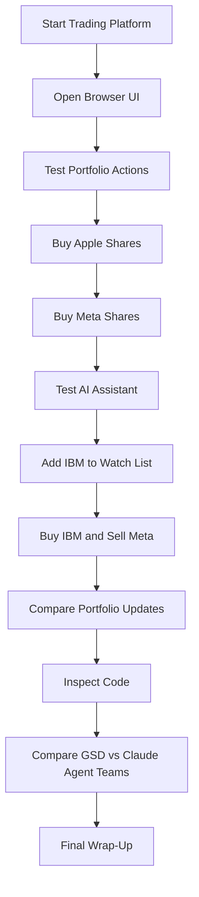
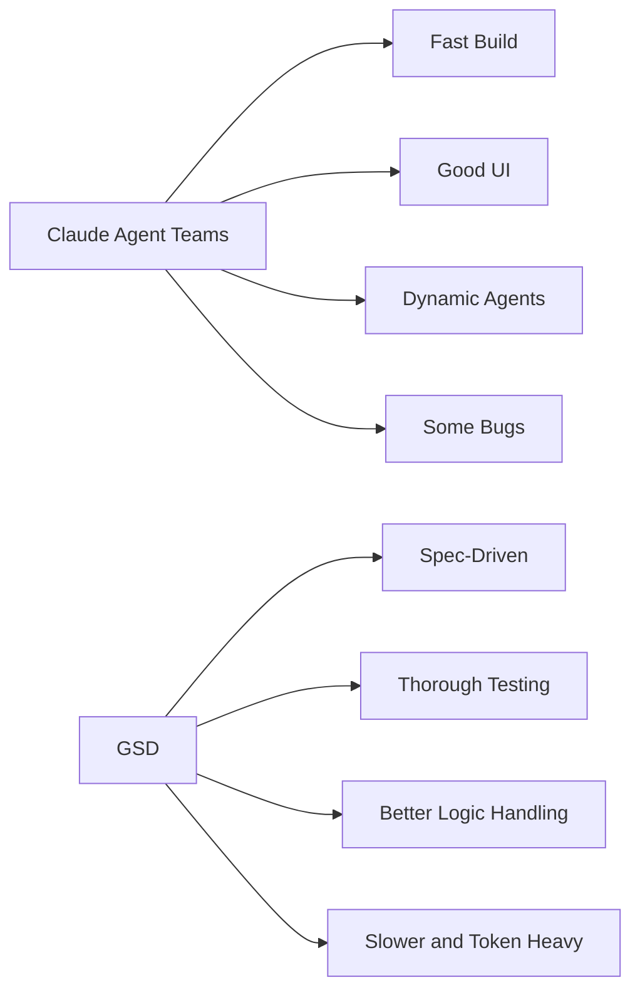
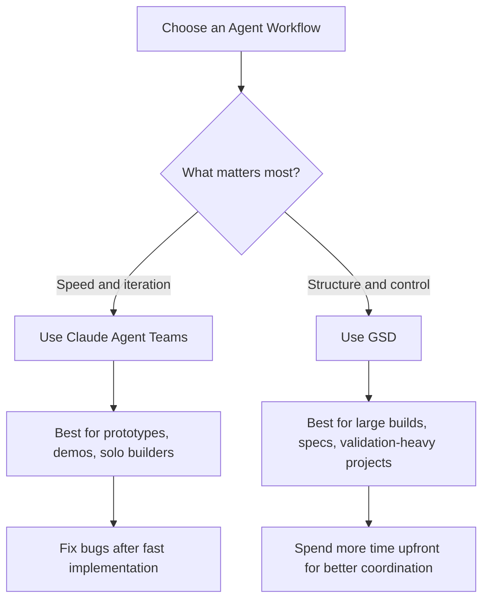

# 088 - Day 4 - GSD vs Claude Agent Teams: Side-by-Side UI Comparison & Wrap-Up

## Lesson Information

| Item     | Details                                            |
| -------- | -------------------------------------------------- |
| Lesson   | 088                                                |
| Duration | 8 min                                              |
| Week     | Week 3 - Agentic Engineering Frontier              |
| Module   | Week 3 Day 4 - Agent Teams, GSD, Multi-Agent Build |

---

## Main Topic

This lesson compares **GSD** and **Claude Agent Teams** side by side through the trading platform UI built earlier in the module.

The comparison focuses on:

* Ease of use
* Level of control
* Build speed
* Coordination quality
* Suitability for solo builders versus teams
* Final product quality
* Trade-offs between fast agent teamwork and strict orchestration

---

## Learning Objectives

By the end of this lesson, learners should be able to:

* Understand the practical differences between GSD and Claude Agent Teams.
* Compare two AI-generated applications using real product criteria.
* Evaluate when speed matters more than structure.
* Evaluate when strict orchestration and thorough testing are worth the extra time.
* Decide which workflow is better for their own coding-agent projects.

---

## Key Concepts

### 1. Side-by-Side Evaluation

The lesson compares two trading platform implementations:

| Version   | Built With         |  Time Taken | Main Strength                                                  |
| --------- | ------------------ | ----------: | -------------------------------------------------------------- |
| First UI  | Claude Agent Teams | ~30 minutes | Fast, dynamic, visually polished                               |
| Second UI | GSD                |    ~5 hours | More thorough, structured, better handling of some logic cases |

The instructor opens both UIs side by side to compare their design, behavior, and reliability.

---

### 2. Claude Agent Teams

Claude Agent Teams produced a professional-looking trading dashboard very quickly.

Its strengths included:

* Fast implementation
* Good-looking UI
* Strong visual design
* Effective multi-agent collaboration
* Impressive result for a short build time

However, it also had some defects:

* Some janky UI behavior
* Difficulty retrieving prices for tickers not already on the watch list
* A few issues that would likely need follow-up fixes

Despite these bugs, the instructor gives Claude Agent Teams the slight edge because the result was built in only about half an hour.

---

### 3. GSD

GSD produced a second trading platform that looked similar to the first one but was built through a more structured, spec-driven process.

Its strengths included:

* More disciplined orchestration
* More thorough test checking
* Better handling of some portfolio actions
* Ability to add new tickers and retrieve their prices correctly
* Strong persistence and diligence during implementation

However, GSD also had trade-offs:

* Took much longer
* Used more tokens
* Required more patience
* Some UI elements were weaker, such as the heat map not being properly colored
* The final result was impressive, but not clearly better enough to justify the extra time in this case

---

## Demo Flow



---

## UI Testing Summary

During the test, the instructor performs several user actions:

1. Starts the local trading platform.
2. Opens the browser UI.
3. Buys three Apple shares.
4. Buys ten Meta shares.
5. Uses the AI assistant to add IBM to the watch list.
6. Uses the AI assistant to buy one IBM share and sell five Meta shares.
7. Checks whether the portfolio and watch list update correctly.
8. Compares the first UI and second UI side by side.

The GSD version successfully handled the IBM flow:

```text
User: Add IBM to the watch list.
Assistant: IBM has been added to the watch list.

User: Buy one share of IBM and sell five shares of Meta.
Assistant: Executes both actions.
Result: IBM appears in the portfolio, and Meta decreases from 10 shares to 5 shares.
```

---

## GSD vs Claude Agent Teams Comparison

| Criteria                | Claude Agent Teams                           | GSD                                                     |
| ----------------------- | -------------------------------------------- | ------------------------------------------------------- |
| Build Speed             | Very fast, around 30 minutes                 | Much slower, around 5 hours                             |
| Workflow Style          | Dynamic and flexible                         | Structured and regimented                               |
| Coordination            | Multi-agent teamwork                         | Spec-driven orchestration                               |
| UI Quality              | Slightly more polished                       | Similar, but weaker heat map                            |
| Logic Quality           | Had some ticker/price bugs                   | Better handling of new tickers                          |
| Testing Discipline      | Good but less visibly strict                 | Very thorough and repetitive                            |
| Token Usage             | Lower                                        | Higher                                                  |
| Best For                | Fast prototyping, solo builders, quick demos | Larger projects, stricter specs, long autonomous builds |
| Instructor’s Preference | Slight edge                                  | Impressive, but slower                                  |

---

## Visual Comparison



---

## Key Takeaways

### Claude Agent Teams is better when speed matters

Claude Agent Teams is ideal when you want to move quickly, explore ideas, and produce a working prototype in a short amount of time.

It is especially useful for:

* Solo builders
* Rapid prototyping
* UI-heavy demos
* Short development sessions
* Projects where bugs can be fixed iteratively

---

### GSD is better when structure matters

GSD is useful when the task is larger, more complex, and benefits from stricter orchestration.

It is especially useful for:

* Big projects
* Complex specs
* Long-running autonomous builds
* Workflows that require repeated validation
* Teams that need clearer contracts between agents

---

### More time does not always mean a better product

The GSD version took much longer and was more thorough, but the final product was not obviously superior in every way.

This is one of the most important lessons:

> A slower, more structured agent workflow can produce better reliability, but it may not always beat a faster, more flexible workflow in overall value.

---

## Practical Decision Guide



---

## Instructor’s Final Judgment

The instructor gives a slight edge to **Claude Agent Teams**.

The reason is not that it was perfect. It had defects. But it produced a strong, professional-looking result in only around 30 minutes.

The GSD version was also impressive, especially in how thorough and diligent it was. However, it required much more time and token usage.

Final judgment:

> Claude Agent Teams wins slightly for this specific demo because of its speed and strong UI result, while GSD remains powerful for larger and more structured builds.

---

## Why This Lesson Matters

This lesson is the wrap-up for **Week 3 Day 4 - Agent Teams, GSD, Multi-Agent Build**.

It helps learners understand that there is no single best agent workflow. Different tools are better for different situations.

The key is knowing when to choose:

* Fast multi-agent collaboration
* Strict spec-driven orchestration
* Human review and iteration
* Autonomous execution
* Lightweight prototyping
* Heavy-duty project coordination

This comparison prepares learners to make better decisions when using AI coding agents in real projects.

---

## Summary

In this lesson, the instructor compares two trading platform UIs built with different agent workflows.

The first version, built with **Claude Agent Teams**, was fast, visually polished, and impressive despite a few bugs. The second version, built with **GSD**, was more structured, more thorough, and better at handling some logic cases, but it took far longer and used more resources.

The lesson concludes that both approaches are valuable. Claude Agent Teams is excellent for speed and dynamic building, while GSD is powerful for structured, large-scale, validation-heavy development.

The broader takeaway is that agentic engineering is not only about using powerful tools. It is about choosing the right workflow for the right kind of project.
