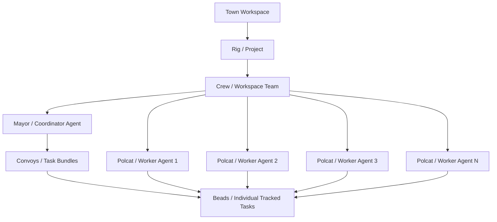
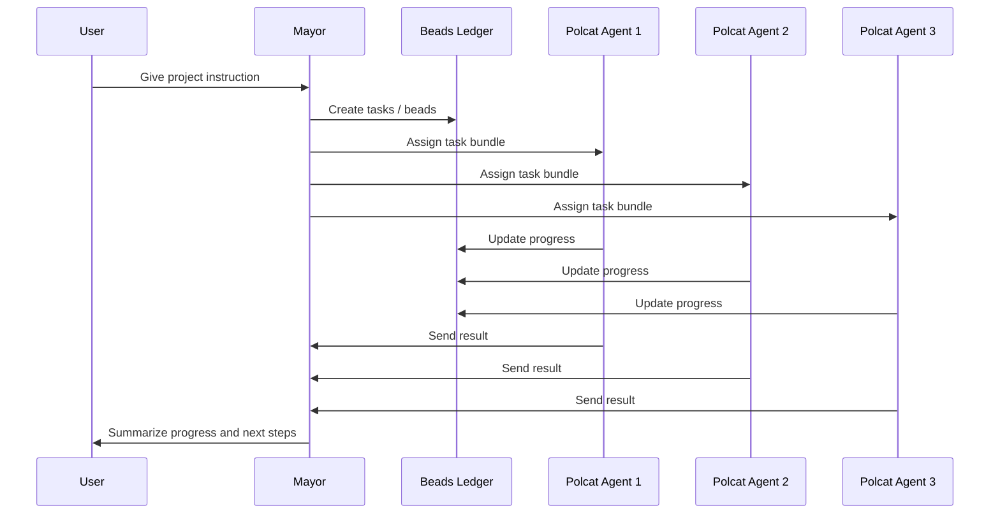

# 089 - Day 5 - Gastown: Orchestrating Swarms of Claude Code Agents

## Lesson Information

| Item     | Details                                   |
| -------- | ----------------------------------------- |
| Lesson   | 089                                       |
| Duration | 13 min                                    |
| Week     | Week 3 - Agentic Engineering Frontier     |
| Module   | Week 3 Day 5 - Gas Town, Swarms, Capstone |

---

## Main Topic

This lesson introduces **Gastown**, a workspace and orchestration system for running swarms of Claude Code agents.

Gastown allows many coding agents to work together by dividing tasks, assigning work to different agents, and coordinating progress through a structured workspace. Compared with more disciplined systems like GSD, Gastown is much more experimental, chaotic, and radical.

The lesson focuses on how Gastown organizes agent swarms, how its terminology works, and why this approach represents an extreme version of multi-agent orchestration.

---

## Learning Objectives

By the end of this lesson, learners should be able to:

* Understand what Gastown is and why it exists.
* Explain how Gastown differs from Claude Agent Teams and GSD.
* Identify the core Gastown concepts: Town, Rig, Crew, Mayor, Polcat, Convoy, and Beads.
* Understand how multiple Claude Code agents can be coordinated in parallel.
* Recognize the benefits and risks of swarm-based agent workflows.
* Follow the basic setup flow for creating a Gastown workspace, rig, and crew.

---

## Context: From Agent Teams to Gastown

Before introducing Gastown, the lesson reviews two previous approaches:

### Claude Agent Teams

Claude Agent Teams allow multiple agents to work in parallel on a coding project.

They are:

* Fast
* Exciting
* Highly parallel
* Capable of producing impressive zero-shot results
* Less predictable
* More prone to defects and coordination issues

### GSD

GSD represents a more structured and spec-driven orchestration model.

It is:

* More disciplined
* More serial in workflow
* Heavily planned
* More verification-focused
* Slower
* More robust

### Gastown

Gastown pushes the idea of agent orchestration much further.

It is:

* More radical than Claude Agent Teams
* More chaotic than GSD
* Designed for large-scale swarm coordination
* Built around many agents working together
* A way to explore the extreme edge of agentic engineering

---

## Comparison: GSD vs Agent Teams vs Gastown

| Approach           | Style                        |               Speed |    Structure |  Risk Level | Best For                           |
| ------------------ | ---------------------------- | ------------------: | -----------: | ----------: | ---------------------------------- |
| GSD                | Spec-driven orchestration    |                Slow |    Very high |       Lower | Robust implementation              |
| Claude Agent Teams | Parallel agent collaboration |                Fast |       Medium | Medium-high | Fast multi-agent builds            |
| Gastown            | Swarm orchestration          | Very fast / chaotic | Experimental |        High | Exploring large-scale agent swarms |

---

## Key Idea

Gastown is not just another coding tool. It is closer to a **workspace manager for coding-agent swarms**.

It tries to solve the problem of coordinating many agents by giving them:

* A shared workspace
* A hierarchy
* Assigned responsibilities
* Internal communication
* Task tracking
* Agent-to-agent coordination

Instead of manually managing every agent, Gastown creates a system where many Claude Code agents can operate together under a structured but chaotic environment.

---

## Gastown Mental Model



---

## Gastown Vocabulary

Gastown has its own terminology. Understanding the vocabulary is important because the system uses different words from normal software development workflows.

| Term         | Meaning                                           |
| ------------ | ------------------------------------------------- |
| Town         | The overall Gastown workspace                     |
| Rig          | A project inside Gastown                          |
| Crew         | A working group or workspace inside a rig         |
| Mayor        | The main Claude Code agent that the user talks to |
| Polcat       | A worker agent that receives and executes tasks   |
| Convoy       | A bundle of tasks assigned to agents              |
| Beads        | Individual tracked task items                     |
| Beads Ledger | The task-tracking system used by Gastown          |

---

## Core Concepts

### 1. Town Workspace

The **Town Workspace** is the top-level Gastown environment.

It usually lives in a directory called:

```bash
~/GT
```

This is where Gastown stores its structure, projects, crews, and coordination data.

---

### 2. Rig

A **Rig** is a project.

In the lesson, the instructor creates a rig called:

```bash
Fin
```

This rig represents the project being worked on.

Example:

```bash
gt rig add Fin <github-repo-url>
```

A rig is similar to a project folder, but in Gastown terminology, it becomes part of the larger orchestration system.

---

### 3. Crew

A **Crew** is a workspace or team inside a rig.

In the lesson, the crew is called:

```bash
Ed
```

The crew belongs to the rig:

```bash
Fin
```

Example command:

```bash
gt crew add Ed --rig Fin
```

This creates a working crew named `Ed` inside the `Fin` project.

---

### 4. Mayor

The **Mayor** is the main coordinating agent.

From the user’s point of view, the Mayor feels like a Claude Code session. The user gives instructions to the Mayor, and the Mayor coordinates work with the rest of the system.

The Mayor can:

* Receive natural-language instructions
* Understand the current workspace
* Create tasks
* Assign work
* Coordinate with worker agents
* Read mail and task updates
* Manage the swarm

Command:

```bash
gt mayor attach
```

This launches Claude Code as the Mayor.

---

### 5. Polcat

A **Polcat** is a worker agent.

Polcats are the agents that actually receive tasks and work on them. Each Polcat may be assigned a different part of the project.

For example:

* One Polcat may build frontend components.
* Another Polcat may implement backend logic.
* Another Polcat may write tests.
* Another Polcat may review code.
* Another Polcat may update documentation.

---

### 6. Convoy

A **Convoy** is a bundle of tasks.

Instead of assigning one isolated task at a time, Gastown can group work into convoys. These convoys can then be distributed across agents.

A convoy may contain multiple Beads.

---

### 7. Beads

**Beads** are individual task items.

They act somewhat like GitHub issues or tracked work units. Each task has an ID and can be followed inside the Beads ledger.

Gastown uses Beads to track:

* What needs to be done
* Who is working on it
* What progress has been made
* Which tasks are connected

---

## Gastown Workflow



---

## Basic Setup Flow

The instructor demonstrates a simple setup flow.

### Step 1: Create the Gastown Workspace

```bash
gt start
```

This initializes Gastown in the user’s home directory, typically inside:

```bash
~/GT
```

---

### Step 2: Move Into the GT Directory

```bash
cd ~/GT
```

---

### Step 3: Create a Rig

```bash
gt rig add Fin <github-repo-url>
```

In the lesson:

* Rig name: `Fin`
* Purpose: project workspace for the demo

---

### Step 4: Create a Crew

```bash
gt crew add Ed --rig Fin
```

In the lesson:

* Crew name: `Ed`
* Rig name: `Fin`

---

### Step 5: Move Into the Crew Directory

```bash
cd Fin/crew/Ed
```

This is where the cloned repository and crew workspace live.

---

### Step 6: Attach the Mayor

```bash
gt mayor attach
```

This launches Claude Code as the Mayor agent.

The Mayor then checks:

* Current instructions
* Hooked work
* Mail
* Inbox
* Workspace state

If there is no work yet, it waits for user instructions.

---

## Full Setup Diagram

```mermaid
flowchart LR
    A[Install Gastown] --> B[Create GT Workspace]
    B --> C[Add Rig: Fin]
    C --> D[Add Crew: Ed]
    D --> E[Enter Crew Directory]
    E --> F[Attach Mayor]
    F --> G[Give Instructions]
    G --> H[Mayor Creates Tasks]
    H --> I[Polcats Execute Work]
    I --> J[Results Returned]
```



---

## Why Gastown Is Powerful

Gastown is powerful because it can coordinate many agents at once.

This means a large project can be split into many parallel streams of work.

Potential benefits include:

* Faster development
* More autonomous coding
* Parallel exploration of ideas
* Reduced manual agent management
* Better use of multiple Claude Code instances
* Possibility of large-scale software generation

---

## Why Gastown Is Risky

Gastown is also risky because more agents create more coordination problems.

Potential risks include:

* Merge conflicts
* Duplicated work
* Inconsistent architecture
* Conflicting design decisions
* Unclear ownership
* Harder debugging
* Unpredictable outputs
* More chaos than traditional workflows

The more agents you run, the more important coordination becomes.

---

## Controlled Chaos

The lesson describes Gastown as a kind of **controlled chaos**.

It is not as strict as GSD. It is not as simple as one Claude Code session. It is a swarm environment where many agents can work together, communicate, and track tasks.

This makes Gastown exciting, but also difficult to fully control.

---

## Practical Advice

The instructor repeatedly emphasizes that this segment is optional.

Learners do not need to install or run Gastown immediately. It is acceptable to simply watch the demo and understand the concept.

Gastown is useful as a way to see what is possible at the frontier of agentic engineering.

Recommended mindset:

* Watch first
* Understand the model
* Do not worry if it feels chaotic
* Treat it as an advanced experiment
* Focus on the orchestration pattern
* Do not depend on it for production work too early

---

## Key Takeaways

* Gastown is a radical orchestration layer for coding-agent swarms.
* It is built around a workspace model with Towns, Rigs, Crews, Mayors, Polcats, Convoys, and Beads.
* The Mayor is the main coordinating agent that the user talks to.
* Polcats are worker agents that execute assigned tasks.
* Beads track individual units of work.
* Convoys bundle multiple tasks together.
* Gastown can run many agents in parallel, but this increases coordination risk.
* Compared with GSD, Gastown is much more chaotic and experimental.
* Compared with Claude Agent Teams, Gastown goes even further into swarm orchestration.
* The main lesson is not just how to use Gastown, but how to think about large-scale multi-agent coordination.

---

## Summary

In this lesson, learners are introduced to **Gastown**, a highly experimental system for orchestrating swarms of Claude Code agents.

The lesson places Gastown in context after Claude Agent Teams and GSD. Claude Agent Teams showed how multiple agents can quickly build impressive software. GSD showed how structured, spec-driven orchestration can produce more reliable results. Gastown takes the idea even further by creating a full workspace model for managing many agents, tasks, and communication flows.

Learners explore Gastown’s terminology, including Town, Rig, Crew, Mayor, Polcat, Convoy, and Beads. The instructor demonstrates how to initialize a Gastown workspace, create a rig, add a crew, and attach the Mayor agent.

The biggest takeaway is that Gastown represents the frontier of agentic engineering: powerful, exciting, and chaotic. It shows what may become possible when many AI coding agents work together, but it also highlights the importance of coordination, task tracking, architecture consistency, and human oversight.

---

## Reflection Questions

1. How is Gastown different from Claude Agent Teams?
2. Why is GSD more structured than Gastown?
3. What role does the Mayor play in the Gastown system?
4. Why are Polcats useful in a swarm workflow?
5. What problems can happen when too many agents work in parallel?
6. When would a structured approach like GSD be better than Gastown?
7. When might a chaotic swarm approach be useful?
8. How can developers reduce conflict and duplicated work in multi-agent systems?

---

## Practice Task

Try designing a small Gastown-style workflow on paper.

Choose a simple project, such as:

* A personal finance dashboard
* A study planner app
* A blog platform
* A trading dashboard
* A task management app

Then define:

| Component | Your Example            |
| --------- | ----------------------- |
| Rig       | Project name            |
| Crew      | Team/workspace name     |
| Mayor     | Main coordinator role   |
| Polcat 1  | Frontend task           |
| Polcat 2  | Backend task            |
| Polcat 3  | Testing task            |
| Polcat 4  | Documentation task      |
| Convoy    | Bundle of related tasks |
| Beads     | Individual task items   |

This exercise helps you understand how Gastown-style orchestration maps to real software projects.

---

# Bài luyện tập

## Mục tiêu


## Đề bài


## Yêu cầu hoàn thành

- [ ] 
- [ ] 
- [ ] 

## Kết quả / lời giải


## Ghi chú
