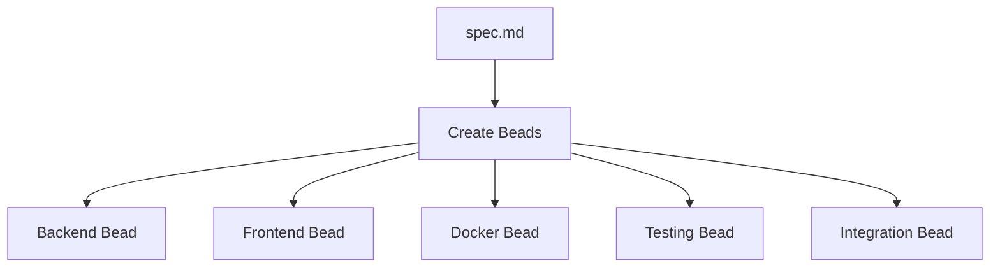
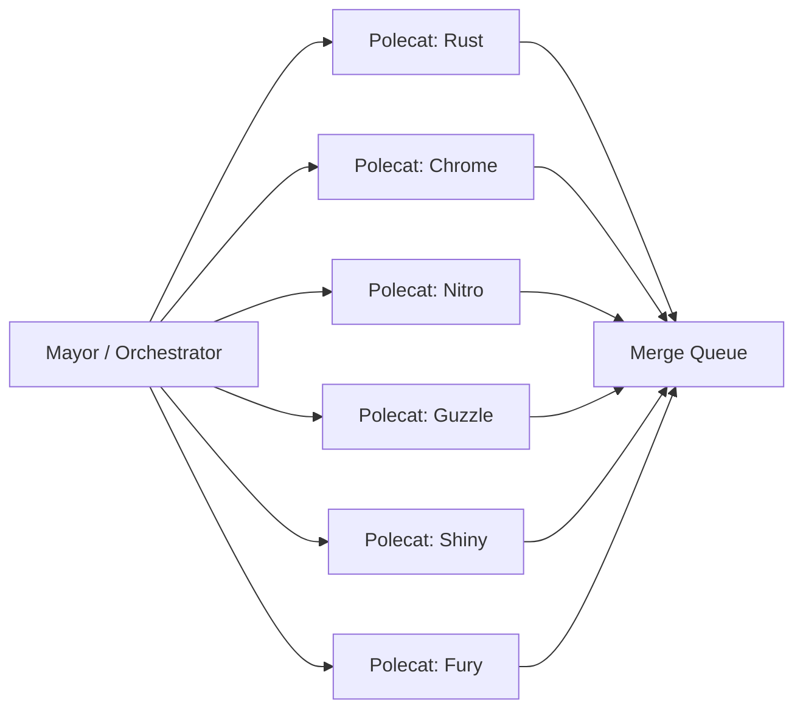
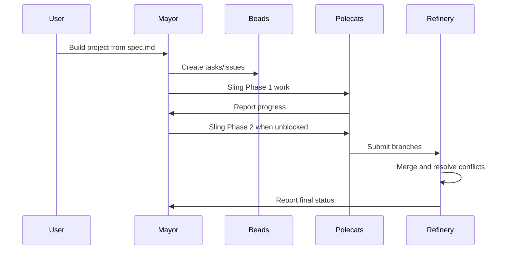
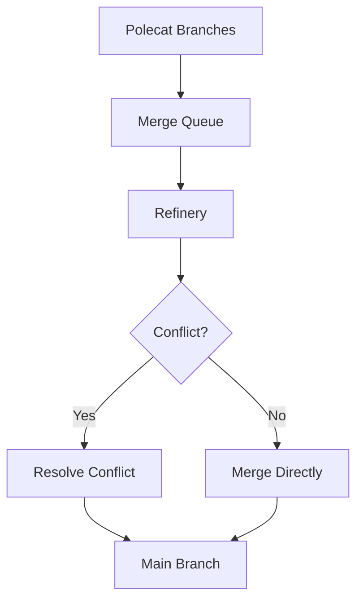
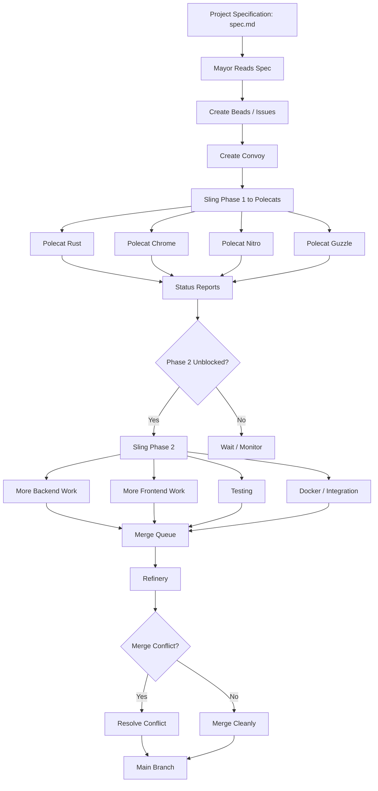

# 090 - Day 5 - Gastown's Parallel Polecats: Claude Code Agents Build in Chaos

## Lesson Information

| Item     | Details                                                                        |
| -------- | ------------------------------------------------------------------------------ |
| Lesson   | 090                                                                            |
| Duration | 11 minutes                                                                     |
| Week     | Week 3 - Agentic Engineering Frontier                                          |
| Module   | Week 3 Day 5 - Gas Town, Swarms, Capstone                                      |
| Topic    | Parallel Claude Code agents working in a chaotic multi-agent build environment |

---

## Main Idea

This lesson demonstrates how **Gastown** can coordinate many Claude Code agents working in parallel on the same project.

Instead of carefully building one feature at a time, Gastown creates multiple tasks, assigns them to different agents called **Polecats**, and lets them work simultaneously. This creates speed, but also chaos: merge conflicts, unclear status, duplicated work, and many moving parts.

The key lesson is that parallel agent swarms can be powerful, but they require a strong **orchestrator**, clear task boundaries, and a reliable review and merge process.

---

## Learning Objectives

After this lesson, learners should be able to:

* Understand how Gastown coordinates multiple Claude Code agents.
* Explain the role of **Polecats**, **Beads**, **Convoys**, **Mayor**, **Witness**, and **Refinery**.
* Recognize the benefits and risks of parallel agent workflows.
* Compare Gastown’s chaotic parallel style with more careful systems like GSD.
* Identify when a swarm-based workflow is appropriate for real development tasks.

---

## Key Concepts

### 1. Parallel Agent Execution

Gastown allows multiple Claude Code agents to work on different parts of the project at the same time.

Instead of one agent completing the entire build, the work is divided into many smaller issues and assigned to different workers.

Example tasks in the demo included:

* Backend foundation
* Market data implementation
* SSE backend
* Portfolio backend
* LLM chat backend
* Frontend watches
* Frontend charts
* Docker setup
* Testing and integration

This makes the system much faster, but also harder to monitor.

---

### 2. Beads as Work Items

In Gastown terminology, **Beads** are similar to GitHub issues, Jira tickets, or task cards.

Each bead represents a specific piece of work that an agent can complete independently.



A good bead should be:

* Small enough for one agent to complete.
* Clear enough to avoid duplicated work.
* Independent enough to reduce merge conflicts.
* Connected to the overall project specification.

---

### 3. Polecats as Worker Agents

**Polecats** are the Claude Code agents that receive tasks and build parts of the project.

In the demo, multiple Polecats were running at once, including names such as:

* Rust
* Chrome
* Nitro
* Guzzle
* Shiny
* Fury

Each Polecat worked on a different task or branch.



The benefit is high parallelism. The danger is that many agents may touch overlapping code.

---

### 4. Convoys and Slinging Work

A **Convoy** is a group of tasks launched together.

To **sling** work means to assign beads to Polecats so they can start building.

In the lesson, the user gives a natural-language command such as:

> Build the entire project as described by `spec.md`. Create issues, create a convoy, and sling the work to Polecats.

Gastown then translates this into its internal workflow:



---

### 5. The Mayor as Orchestrator

The **Mayor** is the central coordinator.

Its job is to:

* Track what each Polecat is doing.
* Check bead status.
* Watch the merge queue.
* Decide when to launch the next phase.
* Respond to errors or stuck workers.
* Give status updates to the user.

The user may not always understand what is happening behind the scenes, but the Mayor provides a high-level view of the system.

---

### 6. The Refinery as Merge Manager

The **Refinery** handles branch merging and integration.

This is extremely important because parallel workers often create merge conflicts.

In the demo, the system had multiple items in the merge queue, and the Refinery had to process branches, resolve conflicts, and merge completed work into `main`.



Without a strong merge process, a swarm can quickly become unmanageable.

---

### 7. Witness and Monitoring

The **Witness** is part of the monitoring system.

It helps track what agents are doing and whether the workflow is still healthy.

The lesson also shows the use of `tmux`, where multiple Claude Code instances are running in different panes or sessions.

The user can inspect these sessions using keyboard shortcuts like:

```text
Ctrl + B, then W
```

This reveals many active agent sessions working in parallel.

---

## Demo Flow

### Step 1: Start from a Specification

The project begins with a mostly empty repository and a `spec.md` file.

The specification describes what needs to be built.

Unlike earlier demos, the agents are given less pre-built structure. They must create much more from scratch.

---

### Step 2: Create Beads

Gastown creates multiple beads from the specification.

These beads represent the concrete tasks required to build the project.

The system creates around ten issues for the first phase.

---

### Step 3: Create a Convoy

The Mayor creates a convoy and prepares to assign work.

This means Gastown is organizing a batch of tasks that will be executed in parallel.

---

### Step 4: Sling Phase One

The first set of tasks is assigned to Polecats.

At first, it may look quiet, but many Claude Code agents are actually running in the background.

---

### Step 5: Check Polecat Status

The user asks the Mayor to check on the Polecats.

The Mayor reports which tasks are done, which branches are pushed, which work is in the merge queue, and which agents are waiting or wrapping up.

---

### Step 6: Sling Phase Two

Once Phase One tasks unblock later tasks, the user tells the Mayor to sling Phase Two.

More tasks are assigned to more Polecats.

At this point, six or more agents may be coding at the same time.

---

### Step 7: Monitor Chaos

The workflow becomes chaotic but productive.

Many agents are working in parallel on backend, frontend, Docker, tests, and integration.

The user sees many sessions and dashboard activity, but does not fully know what every worker is doing.

This is part of the Gastown experience: trust the orchestration while monitoring health and status.

---

### Step 8: Process Merge Queue

After coding is complete, the Refinery processes the merge queue.

This includes:

* Merging completed branches.
* Handling conflicts.
* Nudging merge requests.
* Running or waiting for tests.
* Getting all work into the main branch.

---

### Step 9: Final Build

The project eventually reaches a state where all branches are merged into `main`.

The repository started almost empty, with only a specification, and was built by multiple Claude Code agents running in parallel.

---

## Gastown Workflow Diagram



---

## Gastown vs GSD

| Area         | Gastown                                     | GSD                              |
| ------------ | ------------------------------------------- | -------------------------------- |
| Style        | Fast, chaotic, parallel                     | Careful, structured, slower      |
| Execution    | Many agents at once                         | More serial and controlled       |
| Best for     | Clearly separable tasks                     | Complex tasks needing precision  |
| Risk         | Merge conflicts, confusion, duplicated work | Slower progress                  |
| Strength     | High speed and parallelism                  | Strong planning and verification |
| User feeling | “Go with the flow”                          | “Step-by-step control”           |

Gastown is like launching many workers into the project at once.

GSD is like carefully planning, checking, and sequencing each step.

---

## Why This Lesson Matters

This lesson shows the practical reality of multi-agent software development.

Parallel agents can dramatically increase speed, but they also introduce classic engineering problems:

* Merge conflicts
* Integration issues
* Unclear ownership
* Duplicate work
* Hard-to-follow status
* Inconsistent implementation details

The more agents you run, the more important orchestration becomes.

A swarm is not automatically better. It works best when the project can be divided into clean, independent tasks.

---

## Practical Lessons for Coding Agent Workflows

### Use Swarms When

* The project can be split into independent modules.
* Tasks have clear boundaries.
* The specification is detailed.
* You have a strong review and merge process.
* Speed matters more than perfect control.

### Avoid Swarms When

* The architecture is still unclear.
* Many agents must edit the same files.
* The project requires careful design decisions.
* There is no reliable test suite.
* You cannot review the final output properly.

---

## Recommended Swarm Pattern

```mermaid
flowchart LR
    A[Write Clear Spec] --> B[Split Into Small Tasks]
    B --> C[Assign Tasks to Agents]
    C --> D[Agents Work in Parallel]
    D --> E[Collect Status]
    E --> F[Merge Queue]
    F --> G[Resolve Conflicts]
    G --> H[Run Tests]
    H --> I[Human Review]
    I --> J[Final Merge]
```



The human developer should still remain responsible for final quality.

---

## Key Takeaways

* Gastown enables many Claude Code agents to build in parallel.
* Polecats are worker agents assigned to specific beads.
* Beads are task units similar to issues or tickets.
* The Mayor coordinates the workflow and tracks status.
* The Refinery handles merging and conflict resolution.
* Parallel agent work is fast but chaotic.
* Swarms are powerful only when tasks are clearly separable.
* Merge conflicts are expected when many agents touch the same codebase.
* Strong orchestration is more important as the number of agents increases.
* Human review remains essential before trusting the final build.

---

## Practice Exercise

Choose a small full-stack project and write a `spec.md` file for it.

Then split the project into beads such as:

* Backend API setup
* Database schema
* Authentication
* Frontend layout
* Dashboard page
* Testing
* Docker setup
* Documentation

For each bead, answer:

1. Can this task be done independently?
2. Which files will it likely touch?
3. Could it conflict with another task?
4. What should be checked before merging?
5. What tests should verify the result?

---

## Review Questions

1. What is a Polecat in Gastown?
2. What is a Bead?
3. What does it mean to sling work?
4. Why does parallel agent execution create merge conflicts?
5. What role does the Mayor play?
6. What role does the Refinery play?
7. How is Gastown different from GSD?
8. When should you avoid using a swarm workflow?
9. Why is human review still necessary?
10. What makes a task suitable for parallel agent execution?

---

## Summary

In **Lesson 090 - Gastown's Parallel Polecats: Claude Code Agents Build in Chaos**, learners observe a highly parallel Claude Code workflow where many agents build different parts of a project at the same time.

Gastown creates beads, organizes them into convoys, and slings work to Polecats. The Mayor coordinates progress, while the Refinery handles merging and conflict resolution.

The demo highlights both the power and danger of agent swarms. Parallelism can dramatically speed up development, but it also creates confusion, merge conflicts, and integration risk.

The main lesson is that swarm-based development works best when tasks are clearly defined, well-separated, and supported by strong orchestration, testing, and review.

---

# Bài luyện tập

## Mục tiêu


## Đề bài


## Yêu cầu hoàn thành

- [ ] 
- [ ] 
- [ ] 

## Kết quả / lời giải


## Ghi chú
