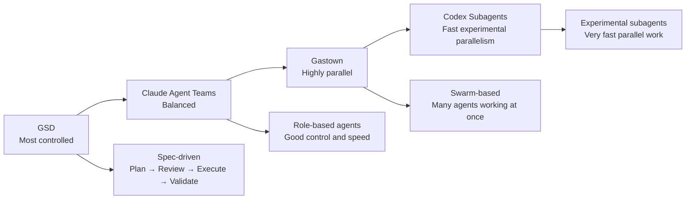
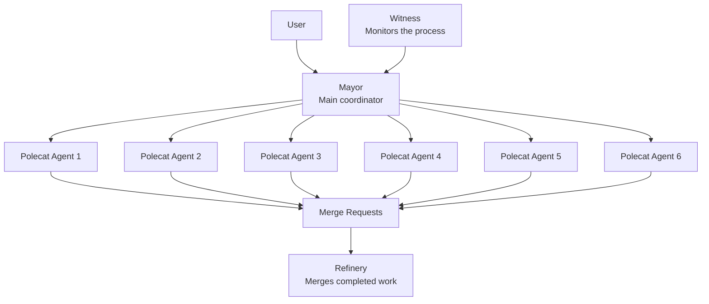
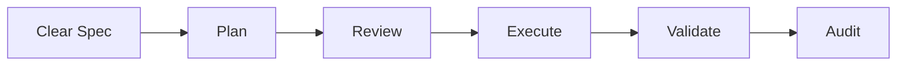
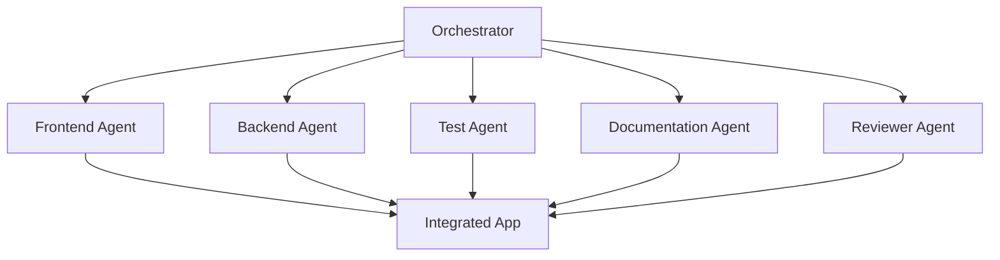
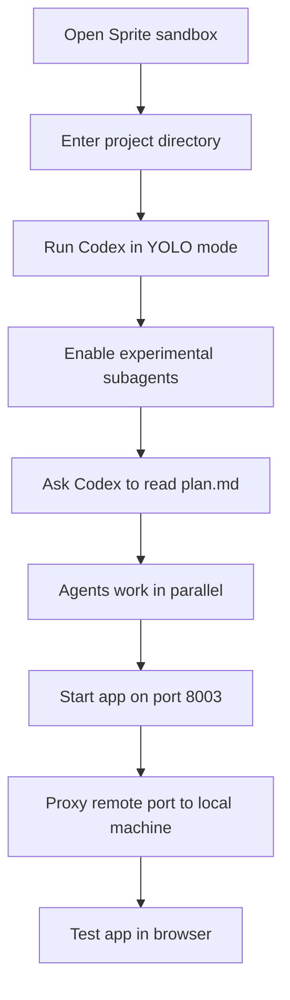
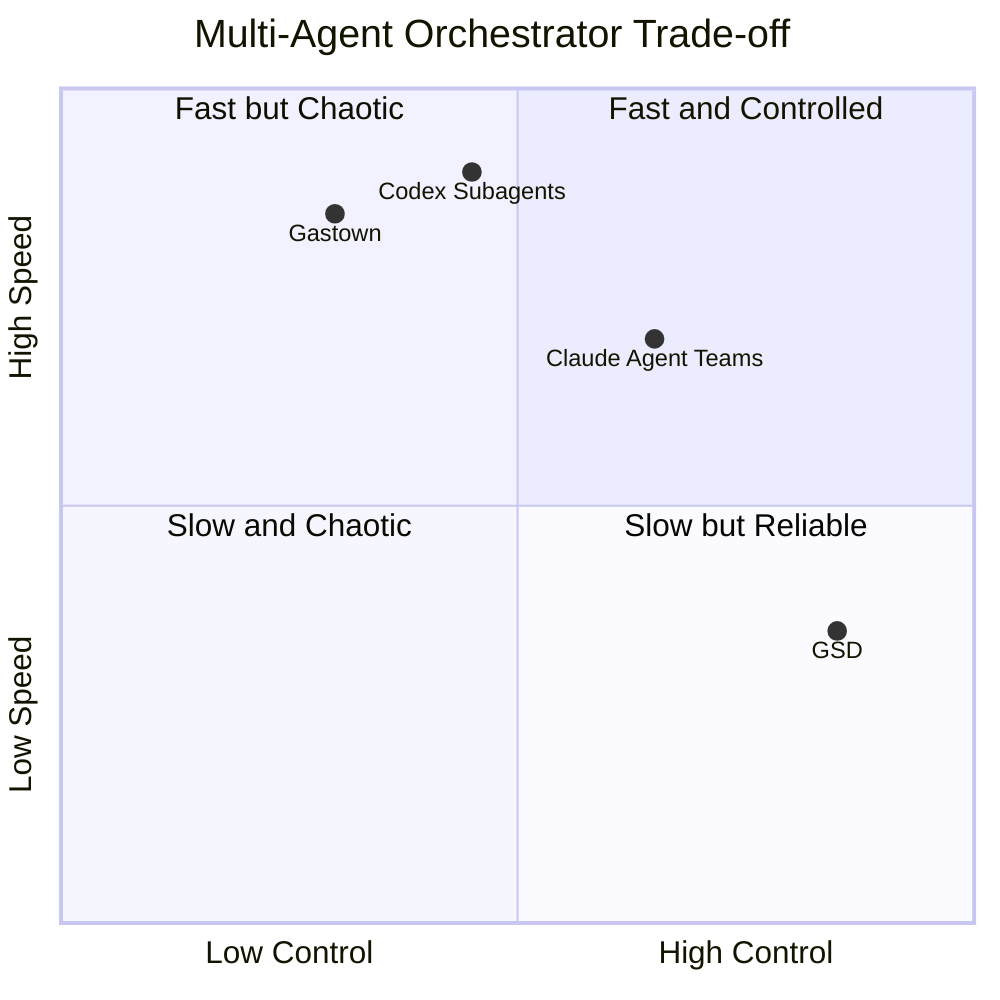
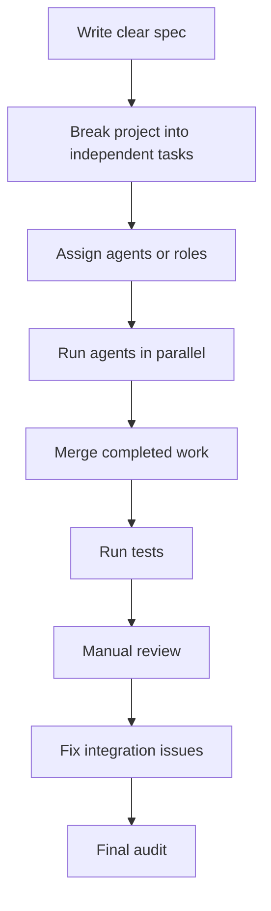

# 091 - Day 5 - Gastown vs Claude Agent Teams vs GSD: Multi-Agent Orchestrators

## Lesson Information

| Item     | Details                                   |
| -------- | ----------------------------------------- |
| Lesson   | 091                                       |
| Duration | 11 min                                    |
| Week     | Week 3 - Agentic Engineering Frontier     |
| Module   | Week 3 Day 5 - Gas Town, Swarms, Capstone |
| Topic    | Comparing multi-agent orchestrators       |

---

## Core Summary

This lesson compares several multi-agent orchestration approaches used for AI-assisted software development:

* **GSD** is the most controlled and disciplined approach.
* **Claude Agent Teams** offers a balance between speed and control.
* **Gastown** is highly parallel and powerful, but more chaotic.
* **Codex Subagents** provide another experimental way to parallelize coding work.

The key idea is that different orchestrators offer different trade-offs between **speed**, **control**, **predictability**, and **chaos**.

---

## Learning Objectives

By the end of this lesson, learners should be able to:

* Compare GSD, Claude Agent Teams, Gastown, and Codex Subagents.
* Understand the trade-offs between disciplined workflows and highly parallel swarms.
* Identify when to use each orchestration style.
* Recognize why clear specs and review processes matter in multi-agent systems.
* Apply orchestration patterns to real coding-agent workflows.

---

## Main Concept

Multi-agent orchestrators allow several AI coding agents to work together on one project.

Instead of a single agent doing everything step by step, multiple agents can work in parallel on different parts of the system.

However, more parallelism also creates more risk:

* duplicated work
* merge conflicts
* inconsistent design
* missing integration
* unclear ownership
* harder debugging

The better the orchestration system, the better it can coordinate these agents.

---

## Orchestrator Spectrum



---

## Comparison Matrix

| Orchestrator           | Strength                                                   | Weakness                                                | Best For                                                        |
| ---------------------- | ---------------------------------------------------------- | ------------------------------------------------------- | --------------------------------------------------------------- |
| **GSD**                | Strong control, predictable outcomes, spec-driven workflow | Slower than other approaches                            | Bigger projects, human-in-the-loop workflows, reliable delivery |
| **Claude Agent Teams** | Good balance of speed and control                          | Still experimental depending on version                 | Full-stack builds, role-based agent collaboration               |
| **Gastown**            | Very fast, highly parallel, can build a lot from scratch   | Chaotic, harder to follow, can fail without clear specs | Tasks that can be split into many independent parts             |
| **Codex Subagents**    | Fast experimental parallelization inside Codex             | Requires setup and clear agent instructions             | Independent review/build tasks, sandboxed experiments           |

---

## Gastown Recap

The instructor initially expected Gastown to work immediately, but the first attempt failed.

When the website was opened, the page could not be displayed. Instead of debugging manually, the instructor went back to the **Mayor** agent and asked it to fix the problem.

Gastown then restarted the work and launched multiple agents again.

The important point is that Gastown was building from almost nothing:

* no existing market data foundation
* no prior market data interface
* only a `plan.md` spec
* full build from scratch
* many agents working in parallel

Even though it required a second iteration, Gastown eventually produced a working application.

---

## Gastown Internal Roles

Gastown uses several internal agent roles.



### Mayor

The **Mayor** is the main coordinator. It receives the user instruction and manages the swarm.

### Polecats

The **Polecats** are worker agents. They each take on parts of the project and work in parallel.

### Refinery

The **Refinery** is responsible for handling merge requests. It merges the completed work from the worker agents.

If the Refinery is idle, it usually means no merge requests are ready yet.

### Witness

The **Witness** watches the process and notifies the Mayor if something goes wrong.

---

## Gastown Result

After the second attempt, Gastown successfully produced a working trading application.

The app included:

* ticker selection
* chart display
* buy order UI
* portfolio heat map
* portfolio positions
* market data simulator
* AI chat integration
* LLM-based trading action

The instructor tested the app by buying shares manually and through the AI chat.

Example interaction:

```text
User: Please buy three shares of JPM.
AI: Sure, I will place an order.
```

After the AI response, JPM appeared in the portfolio.

This showed that the AI chat was connected to the trading system and could trigger real application behavior.

---

## Why the Result Was Impressive

Gastown was impressive because it built the whole project from scratch.

It did not start from an existing implementation. It only had a planning document.

The final result included:

* frontend
* backend behavior
* simulated market data
* portfolio state
* trading UI
* AI chat
* integration between chat and portfolio actions

Even though it failed once, the system recovered after a simple instruction: “go fix it.”

---

## GSD: The Most Disciplined Approach

GSD stands for **Get Stuff Done**.

Despite the aggressive name, GSD is the most disciplined orchestrator discussed in this lesson.

It belongs to the family of **spec-driven design** workflows.

A typical GSD workflow looks like this:



### Strengths of GSD

GSD is strong when the project needs:

* clear planning
* measurable outcomes
* human review
* predictable delivery
* careful validation
* controlled execution

### Weakness of GSD

GSD is slower than the more chaotic orchestration styles.

In the instructor’s experiment:

* GSD took around **5 hours**
* Claude Agent Teams took around **30 minutes**
* Gastown took around **30 minutes**
* Codex Subagents took around **15 minutes**

The exact time can vary, but the trade-off is clear:

```text
More control usually means less speed.
More parallelism usually means more chaos.
```

---

## Claude Agent Teams: The Balanced Middle

Claude Agent Teams sits between GSD and Gastown.

It is faster than GSD but more controlled than Gastown.

It works well because agents can be assigned clear roles, such as:

* frontend agent
* backend agent
* testing agent
* documentation agent
* reviewer agent

This gives the workflow a good balance:



The instructor favored Claude Agent Teams because it provided a lot of power without feeling completely out of control.

---

## Gastown: The Most Chaotic and Parallel

Gastown is designed for heavy concurrency.

It can launch many agents at once and let them work in parallel.

This makes it extremely fast when the task can be divided clearly.

However, Gastown can feel chaotic because many things happen at the same time.

### Strengths

* very fast
* highly parallel
* can build large parts of a system quickly
* impressive when the spec is good
* useful for broad, divisible projects

### Weaknesses

* harder to follow
* more chaotic
* can fail on first attempt
* needs strong review and merge coordination
* can produce confusing intermediate states

Gastown is powerful, but it requires trust in the orchestrator and a good final review process.

---

## Codex Subagents

The lesson also gives a quick preview of **Codex Subagents**.

Codex has an experimental subagent feature that allows work to be parallelized.

The instructor used Codex inside a remote sandbox environment called **Sprites.dev**.

The rough workflow was:



Important setup detail:

```text
Claude Code expects: CLAUDE.md
Codex expects: AGENTS.md
```

The instructor renamed `CLAUDE.md` to `AGENTS.md` so Codex could use the instructions properly.

---

## Codex Command Notes

Example workflow shown in the lesson:

```bash
sprite list
sprite -S finally-worker console
cd finally
git status
codex --yolo
```

Inside Codex:

```text
/experimental
```

Then enable:

```text
Subagents
```

The instructor then asked Codex to read `plan.md` and execute the project.

To expose the remote app locally:

```bash
sprite -S finally-worker proxy 8003
```

This maps the remote sandbox port to the local machine, allowing the app to be opened in a browser.

---

## Speed Comparison

| Tool               | Approximate Build Time | Notes                                                 |
| ------------------ | ---------------------: | ----------------------------------------------------- |
| GSD                |               ~5 hours | Slowest, but most disciplined                         |
| Claude Agent Teams |            ~30 minutes | Strong balance of speed and control                   |
| Gastown            |            ~30 minutes | Built more from scratch in the same time, but chaotic |
| Codex Subagents    |            ~15 minutes | Fastest in this experiment, experimental              |

Important note: these times are from one experiment and should not be treated as universal benchmarks.

The main lesson is about trade-offs, not exact timing.

---

## Control vs Speed Trade-off



---

## Practical Decision Guide

Use **GSD** when:

* the project is large
* correctness matters
* you need an audit trail
* you want human review
* you need predictable delivery

Use **Claude Agent Teams** when:

* you want speed and structure
* the work can be split by role
* you still want understandable coordination
* you are building a full-stack feature

Use **Gastown** when:

* the task can be divided into many parallel parts
* speed matters
* you have a strong spec
* you are comfortable reviewing and fixing chaos afterward

Use **Codex Subagents** when:

* you are experimenting with Codex
* the work is independent enough to parallelize
* you are using a sandbox
* you want fast build or review cycles

---

## Key Takeaways

1. Multi-agent orchestration is powerful, but coordination is the hard part.

2. More agents do not automatically mean better results.

3. Clear specs reduce chaos.

4. GSD is slower but more reliable.

5. Claude Agent Teams offers a strong middle ground.

6. Gastown is fast and impressive, but more chaotic.

7. Codex Subagents show that parallel agent workflows are becoming common across coding tools.

8. Final integration and review are still essential.

---

## Common Risks in Multi-Agent Orchestration

| Risk                | Description                                    | Mitigation                                        |
| ------------------- | ---------------------------------------------- | ------------------------------------------------- |
| Merge conflicts     | Multiple agents edit the same files            | Assign ownership clearly                          |
| Duplicate work      | Agents solve the same task twice               | Use task decomposition                            |
| Inconsistent design | Different agents make different UI/API choices | Provide a strong spec                             |
| Broken integration  | Parts work separately but fail together        | Run end-to-end tests                              |
| Hidden failures     | App appears done but has runtime errors        | Validate with real usage                          |
| Agent confusion     | Agents lack context or instructions            | Use `plan.md`, `AGENTS.md`, or role-specific docs |

---

## Recommended Multi-Agent Workflow



---

## Reflection Questions

1. Which orchestrator gives the best balance between speed and control?

2. Why does Gastown become chaotic when many agents work in parallel?

3. Why is GSD better suited for predictable outcomes?

4. What role does a clear `plan.md` play in multi-agent workflows?

5. When would you choose Claude Agent Teams instead of Gastown?

6. Why is final review still necessary even if agents complete the build?

---

## Final Summary

This lesson compares four approaches to multi-agent orchestration: **GSD**, **Claude Agent Teams**, **Gastown**, and **Codex Subagents**.

GSD is the most disciplined and predictable. Claude Agent Teams offers a strong balance between power and control. Gastown is the most parallel and chaotic, capable of building a lot very quickly when given a good spec. Codex Subagents show that similar parallel-agent features are emerging in other coding tools as well.

The most important lesson is that multi-agent systems are not only about speed. They require clear specs, good task decomposition, strong coordination, and careful final review.

For practical development, the safest default is usually the middle path: use structured agent teams with clear roles, then increase parallelism only when the project is well specified and easy to divide.

---

# Bài luyện tập

## Mục tiêu


## Đề bài


## Yêu cầu hoàn thành

- [ ] 
- [ ] 
- [ ] 

## Kết quả / lời giải


## Ghi chú
