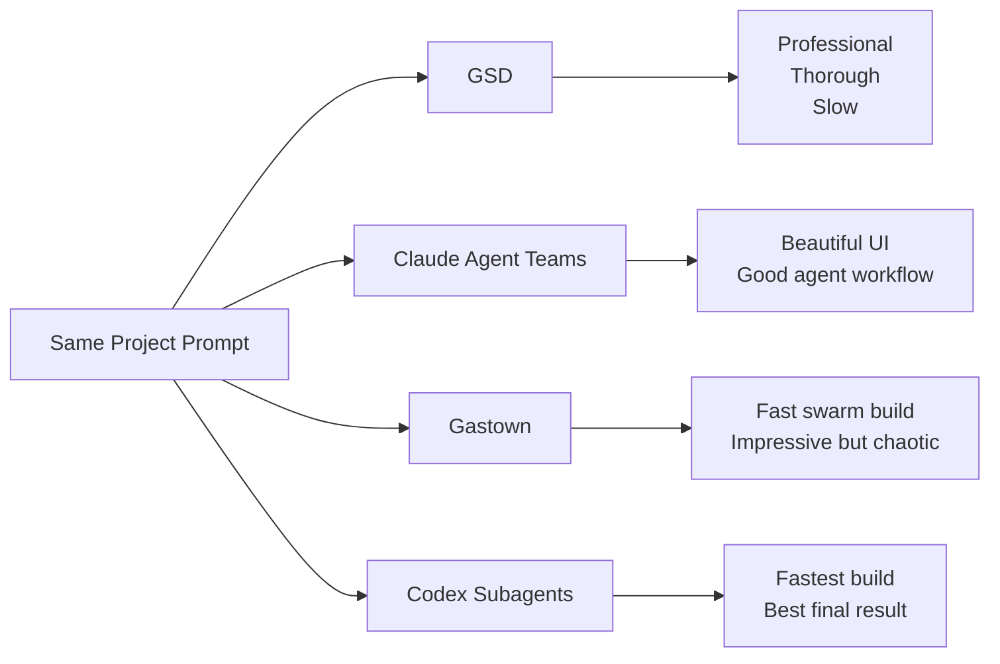
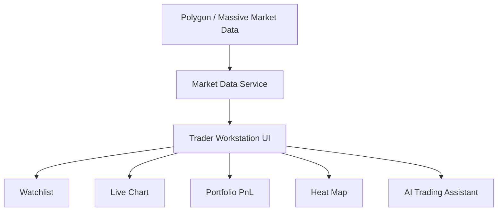
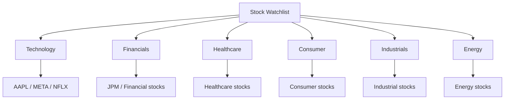
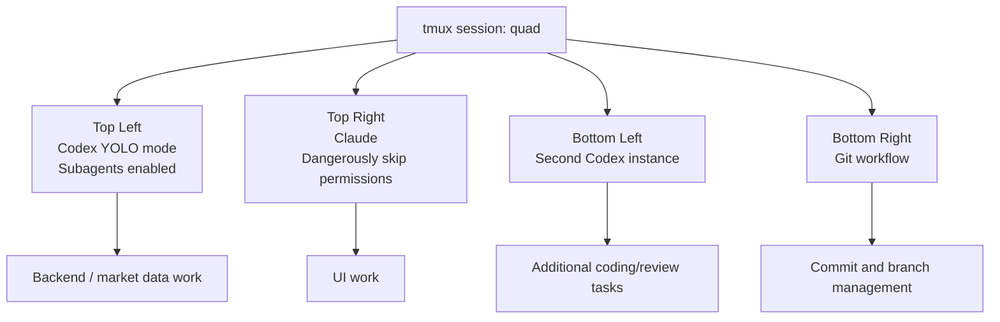
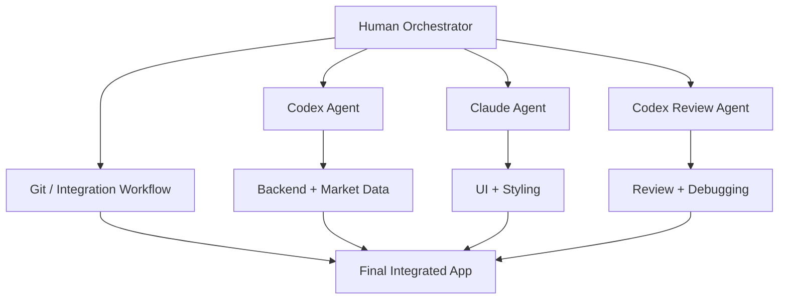
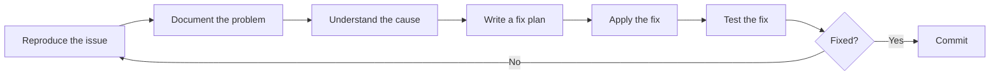
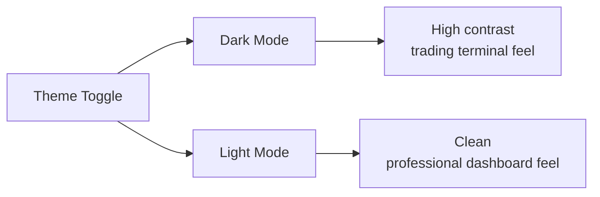
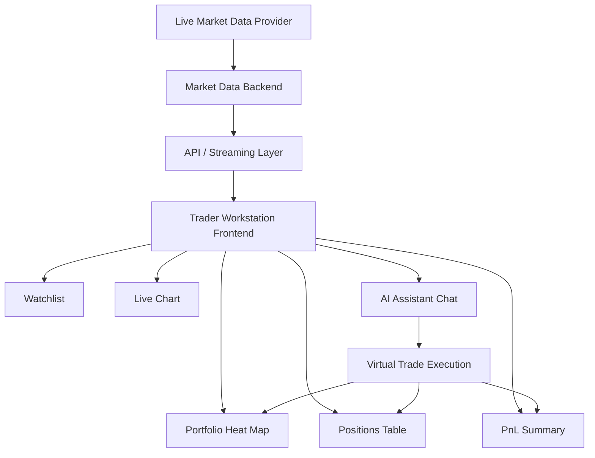

# 092 - Day 5 - Codex Wins: Final Trader Workstation with Live Market Data

## Lesson Information

| Item     | Details                                        |
| -------- | ---------------------------------------------- |
| Lesson   | 092                                            |
| Duration | 14 min                                         |
| Week     | Week 3 - Agentic Engineering Frontier          |
| Module   | Week 3 Day 5 - Gas Town, Swarms, Capstone      |
| Topic    | Final Trader Workstation with live market data |

---

## Core Summary

This lesson concludes the capstone by comparing the final trading workstation implementations built by different AI coding orchestrators.

The instructor reviews the outputs from:

* **GSD**
* **Claude Agent Teams**
* **Gastown**
* **Codex with Subagents**

The surprising result is that **Codex produced the instructor’s favorite final implementation**. It was fast, visually polished, and handled real live market data well.

The final product is a modern trading workstation with:

* live market data
* a stock watchlist
* interactive charts
* portfolio positions
* PnL tracking
* portfolio heat map
* AI assistant
* virtual trading actions
* light mode and dark mode

---

## Learning Objectives

By the end of this lesson, learners should be able to:

* Compare final outputs from multiple coding-agent orchestrators.
* Understand why Codex performed strongly in the capstone.
* Recognize the value of live market data integration.
* Understand how multiple agents can work together across backend, frontend, and review tasks.
* Apply the capstone workflow to their own ambitious AI-assisted software projects.

---

## Capstone Context

This lesson is the final comparison point of the multi-agent build experiment.

The same general project prompt was given to different orchestration systems. Each system attempted to build a trading workstation.

The goal was not only to test whether the app worked, but also to compare:

* speed of development
* UI quality
* integration quality
* market data handling
* AI assistant behavior
* reliability
* developer experience

---

## Final Comparison Overview



---

## Review of Previous Builds

### GSD Version

The GSD version was the most thorough and disciplined.

It took around **five hours** to build.

The result looked professional, though slightly less flashy than some of the others.

The app supported:

* manual trades
* portfolio updates
* chart interaction
* AI assistant trading commands

Example:

```text id="o84l79"
User: Buy three shares of GOOG.
Assistant: Executed.
```

GSD produced a reliable and polished result, but it required the most time.

---

### Claude Agent Teams Version

The Claude Agent Teams version was one of the instructor’s favorite experiences to work with.

It had:

* a strong user interface
* flashing live-style market updates
* smooth interaction
* AI-assisted trading actions
* a visually attractive dashboard

The instructor liked this version because it provided a good balance of speed, control, and quality.

However, during the final comparison, the instructor noticed that some portfolio updates did not remain as dynamic as expected.

---

### Gastown Version

The Gastown version was also impressive.

It was built very quickly and from scratch using a highly parallel swarm workflow.

It looked similar to the other Claude-built versions because the same model and similar specifications were used.

Gastown showed the power of swarm-style orchestration, but it was also the most chaotic to follow.

---

## Codex Version: The Surprise Winner

Codex produced a noticeably different and highly polished result.

The instructor described the Codex UI as:

* sleek
* professional
* polished
* visually impressive
* cleaner than expected
* possibly the best final implementation

The charting was especially strong. Ticker selection updated clearly, and the portfolio interface felt fast and responsive.

Example trade:

```text id="b56auc"
User: Buy one share of META.
Assistant: Order placed to buy one share of META.
```

After the command, META appeared in the portfolio immediately.

---

## Why Codex Won

Codex stood out for several reasons:

| Area                    | Codex Result                         |
| ----------------------- | ------------------------------------ |
| Build speed             | Around 15 minutes                    |
| UI quality              | Very polished and professional       |
| Chart behavior          | Clear and responsive                 |
| Portfolio updates       | Fast and dynamic                     |
| Market data integration | Handled live data well               |
| Debugging               | Found and fixed configuration issues |
| Overall impression      | Strongest final result               |

The instructor was surprised because Claude Code was still his favorite tooling environment overall, but in this specific capstone, Codex produced the best outcome.

---

## Live Market Data Integration

The final Codex implementation was connected to real market data.

Instead of using only a fake simulator, the app was updated to use live market data through Polygon/Massive.

The instructor noted that the market looked relatively static because the demo happened after trading hours.

This explained why prices were not flashing constantly.

During normal market hours, the app would show more active price movement.



---

## Debugging the Live Data Issue

The live data integration did not work perfectly at first.

There was a problem with a hard-coded key in the code.

The instructor asked Codex to investigate.

Codex:

1. found the problem
2. fixed the incorrect key/configuration issue
3. explained why the app looked static
4. correctly identified that the market was after hours

This was an important demonstration of agentic debugging.

The agent did not only change code. It also reasoned about the runtime behavior and explained the market context.

---

## Final Trader Workstation Features

The final app became a modern simulated trading environment.

It included:

* watchlist with many stock tickers
* live price updates
* main stock chart
* portfolio heat map
* position tracking
* portfolio PnL
* AI chat assistant
* virtual buy/sell behavior
* dark mode
* light mode
* Docker-based local environment

---

## Watchlist Structure

The final workstation included around **60 stock tickers** grouped by sector.

Example sectors:

* Technology
* Financials
* Healthcare
* Consumer
* Industrials
* Energy



---

## Multi-Agent Terminal Setup

The instructor also demonstrated a more advanced workflow using multiple terminal panes with `tmux`.

He used a remote sandbox called **Sprites.dev** and attached to a cloud environment.

Inside that environment, he had four terminal panes running.



---

## Terminal Commands Shown

Connect to the running Sprite:

```bash id="d3h5rl"
sprite list
sprite -S finally-worker console
```

Attach to the tmux session:

```bash id="op1bsf"
tmux attach -t quad
```

Navigate between panes:

```text id="nvlh36"
Ctrl + B, then Arrow Key
```

Example pane movement:

```text id="lf2ptv"
Ctrl + B, Right
Ctrl + B, Down
Ctrl + B, Left
Ctrl + B, Up
```

---

## Multi-Agent Workflow Used

The instructor managed several agents at once.

He mainly used:

* Codex for market data and backend work
* Claude for UI work
* another Codex instance for additional tasks
* a fourth terminal for Git workflow

The key point is that the human remained the boss.

The instructor did not manually dig deeply into the code. Instead, he directed agents, asked them to inspect issues, asked them to fix problems, and sometimes asked them to review each other’s work.

---

## Human as the Orchestrator

Even with many agents running, the human developer still plays the most important coordination role.

The human decides:

* what to build
* which agent handles which task
* when to ask for review
* when to stop and test
* when to create a markdown issue note
* when to commit changes
* when a result is good enough



---

## Important Mindset: Progress Comes in Bursts

One of the most important lessons is that agentic coding does not always feel smooth.

At first, the work can feel like a **10x productivity boost**.

Agents can generate large amounts of working code very quickly.

But then the workflow may hit a roadblock:

* a subtle bug
* a broken integration
* a repeated agent mistake
* a configuration issue
* a hard-to-reproduce failure
* an unclear requirement

At that point, progress can slow down dramatically.

This does not mean the workflow failed.

It means debugging and validation are still part of software engineering.

---

## Recommended Debugging Process

When agents get stuck, do not immediately ask them to randomly try fixes.

Use a disciplined debugging loop.



The instructor recommends making agents slow down and explain the issue before fixing it.

A strong prompt could be:

```text id="uz414u"
Reproduce the issue first.
Write a markdown file explaining the problem.
Identify the root cause.
Then propose a fix.
After that, implement the fix and prove it with tests.
```

---

## Final Product: Fin-Ally Trader Workstation

The final product is the **Fin-Ally Trader Workstation**.

It resembles a modern Bloomberg-style terminal.

It includes:

* live market data
* 60-stock watchlist
* sector grouping
* live ticker display
* main chart
* portfolio PnL
* heat map
* AI chat
* virtual trading
* dark/light theme toggle

The instructor described the final result as sensational and far beyond what would have been practical to build manually in such a short time.

---

## Light Mode and Dark Mode

One of the polished UI features added by Claude was a light/dark mode toggle.

The app could switch instantly between:

* gamer-style dark mode
* clean professional light mode



---

## Why This Capstone Matters

This project shows how far coding agents have advanced.

A few years ago, building this type of trading dashboard might have taken one developer weeks or months.

With modern coding agents, the instructor created a sophisticated demo app in a few hours by managing several agents in parallel.

However, the lesson is not that agents replace software engineering.

The lesson is that agents amplify a developer who can:

* write clear specs
* assign tasks well
* review outputs
* debug carefully
* manage integration
* keep the project moving

---

## Practical Lessons for Learners

### 1. Build something with a “wow factor”

The instructor encourages learners to build their own version of this kind of project.

It does not need to be another trading app.

The important part is to build something ambitious, visual, and impressive.

### 2. Use the project as a portfolio piece

A polished capstone project can become a strong portfolio artifact.

It should show:

* real functionality
* strong UI
* data integration
* AI interaction
* deployment readiness

### 3. Keep the human in control

Do not let agents run without direction.

The developer should remain the orchestrator.

### 4. Expect bugs

Agents will move fast, but they will still make mistakes.

Debugging is part of the workflow.

### 5. Use markdown to coordinate work

Markdown files are useful for:

* specs
* task plans
* bug reports
* review notes
* integration checklists
* final audit logs

---

## Capstone Architecture



---

## Final Comparison Table

| Orchestrator       | Result                                       | Strength             | Weakness                             |
| ------------------ | -------------------------------------------- | -------------------- | ------------------------------------ |
| GSD                | Professional and reliable                    | Most disciplined     | Slowest                              |
| Claude Agent Teams | Beautiful and enjoyable to work with         | Great balance        | Some update behavior was less strong |
| Gastown            | Fast and impressive                          | Highly parallel      | Chaotic                              |
| Codex Subagents    | Best final implementation in this experiment | Fastest and polished | Experimental workflow                |

---

## Key Takeaways

1. Codex unexpectedly produced the strongest final capstone result.

2. Claude Code remained the instructor’s favorite tooling experience, but Codex won this specific implementation comparison.

3. Live market data made the trading workstation feel much more realistic.

4. Multi-agent workflows can produce dramatic productivity gains.

5. The human developer still needs to coordinate, test, review, and debug.

6. Progress often comes in bursts: fast generation first, slower debugging later.

7. Markdown specs and issue notes are essential for keeping agents aligned.

8. A polished capstone project can become a powerful portfolio piece.

---

## Reflection Questions

1. Why did Codex win this particular capstone comparison?

2. What made the final trading workstation feel more realistic?

3. Why is live market data harder than simulated market data?

4. What role did the human developer play while multiple agents were running?

5. Why should bugs be documented before agents attempt to fix them?

6. How could you adapt this capstone idea into your own portfolio project?

---

## Final Summary

This lesson closes the capstone by showing the final Trader Workstation built with live market data.

Although GSD, Claude Agent Teams, and Gastown all produced impressive results, Codex became the surprise winner in this experiment. It built the fastest, delivered a polished user interface, handled portfolio updates well, and successfully integrated real market data.

The final result was a Bloomberg-style simulated trading terminal with live stock prices, sector watchlists, charts, portfolio tracking, a heat map, virtual trading, AI chat, and theme switching.

The broader lesson is that modern coding agents can dramatically accelerate software development, especially when used together. But the developer still needs to act as the orchestrator: writing specs, assigning work, reviewing results, debugging issues, and guiding the final product toward quality.

This capstone demonstrates the new workflow of agentic engineering: not replacing the developer, but giving the developer a powerful team of AI builders.
